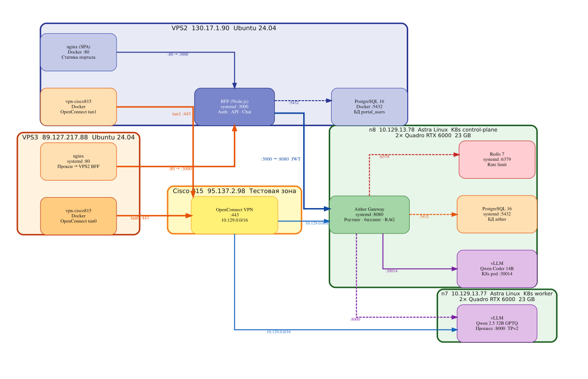

# Aither Project

**Token‑as‑a‑Service** — платформа для продажи токенов к LLM через OpenAI‑совместимый API.

## Физическая схема



## Статус — 🟢 Работает (демо)

Чат с моделями, биллинг, админка и VPN-доступ к GPU-нодам восстановлены 16.07.2026.
RAG (векторный поиск) — офлайн. Prometheus/Grafana — не запущены.

## Компоненты

| Компонент | Где | Статус |
|---|---|---|
| **vLLM 14B** (Qwen2.5-14B-Instruct, TP=2) | n8, 2× RTX 6000 | ✅ |
| **vLLM 32B** (Qwen2.5-32B-Instruct, TP=2) | n7, 2× RTX 6000 | ✅ |
| **vLLM Coder-14B** (Qwen2.5-Coder-14B) | n8, K8s pod :30014 | ✅ |
| **API Gateway** (Python, 13 модулей) | n8, systemd :8080 | ✅ rate limit + billing + security + RAG |
| **Portal BFF** (Node.js/Fastify) | VPS2 :3000 (systemd) | ✅ JWT + OAuth + LDAP + admin |
| **Portal UI** (SPA) | VPS3 nginx :80 → VPS2 | ✅ Чат + RAG toggle + 11 вкладок админки |
| **PostgreSQL** (биллинг, systemd) | n8 :5432 | ✅ организации, тарифы, транзакции |
| **PostgreSQL** (портал) | VPS2 :5432 (Docker) | ✅ пользователи, чаты, настройки |
| **Redis 7** (rate limiting) | n8, systemd :6379 | ✅ sliding window per-org per-tier (починен 16.07) |
| **ChromaDB 0.5.23** (векторный RAG) | K8s n7 | ❌ офлайн |
| **chroma-proxy** (text→embed→search) | K8s n7 :9000 | ❌ офлайн |
| **Wiki Graph** (LLM-Wiki) | /app/wiki | ✅ 6 страниц, BFS-граф |
| **Prometheus + Grafana** | K8s | ❌ не запущены |
| **nginx** (HTTPS :10443) | VPS1 | ✅ → VPS2 + Grafana |
| **nginx** (портал :80) | VPS3 (systemd) | ✅ прокси → VPS2 BFF :3000 |
| **WireGuard** (VPS1 ↔ VPS2, VPS3) | 10.99.0.0/24 | ✅ |
| **vpn-cisco815** (OpenConnect) | VPS2 (Docker, tun1) | ✅ → Cisco 815 |
| **vpn-cisco815** (OpenConnect) | VPS3 (Docker, tun0) | ✅ → Cisco 815 (поднят 16.07) |
| **CI/CD** (GitHub Actions) | `.github/workflows/deploy.yml` | ✅ Docker build → ghcr.io → kubectl deploy |
| **HPA** (автомасштабирование) | K8s | ✅ Gateway + vLLM (max=1 per node) |
| **ЮKassa** | VPS2 | ⬜ тестовый режим (боевой — #13) |
| **offline-deploy kit** | `offline-deploy/` | ✅ v1.2.0 |
| **Учебное пособие** | `docs/training-manual/` | ✅ 24 главы, ~780 стр. |

## Инфраструктура

| Узел | Адрес | Роль | GPU |
|---|---|---|---|
| **VPS1** | 170.168.91.95 | Hermes, nginx :10443, K8s follower, синхронизация | — |
| **VPS2** | 130.17.1.90 | Портал (BFF + PG Docker), VPN Cisco (tun1) | — |
| **VPS3** | 89.127.217.88 | Фронт (nginx :80→BFF), VPN Cisco (tun0), Hermes-резерв | — |
| **Cisco 815** | 95.137.2.98 | VPN-терминатор, 10.129.0.0/16 (тестовая зона) | — |
| **n8-gpu** | 10.129.13.78 | K8s control-plane, Gateway, PG, Redis, vLLM Coder 14B | 2× RTX 6000 |
| **n7-gpu** | 10.129.13.77 | K8s worker, vLLM 32B GPTQ (процесс :8000) | 2× RTX 6000 |

## Сеть

```
VPS1 ←→ VPS2: WireGuard 10.99.0.0/24
VPS1 ←→ VPS3: WireGuard 10.99.0.0/24
VPS2 → Cisco 815: OpenConnect VPN (Docker, tun1)
VPS3 → Cisco 815: OpenConnect VPN (Docker, tun0, поднят 16.07)
Cisco 815 → n7, n8: 10.129.0.0/16
  ├─ n8 (10.129.13.78): control-plane, Gateway :8080, PG, Redis, vLLM 14B
  └─ n7 (10.129.13.77): worker, vLLM 32B :8000
n7 ↔ n8: Flannel VXLAN (10.244.0.0/16)
VPS3 nginx :80 → VPS2 BFF :3000 (прокси портала)
```

## Быстрый старт

```bash
# Портал: https://fb1.spb.ru:10443 (VPS1 nginx → VPS3/VPS2)
# Админка: https://fb1.spb.ru:10443/admin.html (JWT + cookie)
# API: https://fb1.spb.ru:10443/v1/chat/completions
# RAG: https://fb1.spb.ru:10443/api/v1/rag/status (JWT)
# Grafana: https://fb1.spb.ru:10443/grafana/
# Аутентификация: Google, Yandex, GitHub, LDAP
#
# Внутренний доступ (без OAuth, для отладки с VPS3/VPN):
#   VPS3:    http://89.127.217.88 (nginx :80 → BFF :3000)
#   Gateway: http://10.129.13.78:8080/health
#   vLLM 14B: http://10.129.13.78:30014/v1/models
#   vLLM 32B: http://10.129.13.77:8000/v1/models
#   Админка: admin@aither.local / Admin123!@#
```

## Исправлено (16 июля 2026)

| Проблема | Исправление |
|---|---|
| Redis :6379 заблокирован iptables DROP | Удалено правило DROP |
| Gateway (HTTPServer) вис на первом запросе | Переведён на ThreadingHTTPServer |
| Пароль admin@aither.local не подходил | Сброшен (scrypt) в БД, роль super_admin |
| VPN-туннель VPS3→Cisco отсутствовал | Поднят Docker-контейнер vpn-cisco815 (tun0) |
| Нет прямого доступа VPS3→n7/n8 | Маршрут 10.129.13.0/24 добавлен через tun0 |
| Физическая схема не отражала реальность | Обновлена v4 (rankdir=LR, 5 кластеров) |
| ChromaDB, Prometheus/Grafana не запущены | Требуют запуска K8s подов |

## Структура репозитория

```
aither-project/
│
│  📄 README.md                    ← этот файл
│  📄 ROADMAP.md                   ← дорожная карта (51 задача)
│  📄 roadmap.md                   ← краткая дорожная карта
│  📄 lab-journal.md               ← лабораторный журнал (хронология)
│  📄 brief.md                     ← исходное ТЗ
│  📄 status.md                    ← сводка статуса задач
│  📄 FEATURES.md                  ← список возможностей платформы
│
├── 📁 portal/                     ★ Портал: SPA + BFF + админка
│   ├── server.ts                  — BFF (Fastify, :3000): auth, чаты, RAG, биллинг, админка
│   ├── ldap.ts                    — LDAP/ALD Pro аутентификация
│   ├── policies.ts                — политики доступа (org-level)
│   ├── security.ts                — Security hardening (CSP, CORS, helmet)
│   ├── api-gateway.ts             — прокси админ-API + RAG → Gateway
│   ├── package.json               — NPM-зависимости
│   ├── secrets.env                — секреты (НЕ коммитить!)
│   ├── Dockerfile                 — Docker-образ BFF
│   ├── docker-compose.yml         — Docker Compose (BFF + PG + nginx)
│   ├── nginx.conf                 — nginx reverse proxy :80 → :3000
│   ├── dist/server.js             — скомпилированный BFF
│   ├── static/                    — статика (фронтенд SPA)
│   │   ├── index.html             — чат-интерфейс + RAG toggle
│   │   └── admin.html             — админ-панель (11 вкладок)
│   ├── db/                        — миграции БД портала
│   └── bff/                       — конфигурация BFF
│
├── 📁 gateway/                    ★ API Gateway (Python, 15 модулей)
│   ├── gateway.py                 — точка входа: JWT, rate limit, billing, vLLM proxy
│   ├── mtls_server.py             — mTLS (:8443) + HTTP (:8080)
│   ├── hybrid_rag.py              — гибридный RAG: wiki + chroma-proxy
│   ├── wiki_graph.py              — LLM-Wiki: граф знаний (Karpathy-style)
│   ├── security.py                — DLP ingress (SQL-инъекции, prompt injection)
│   ├── security_egress.py         — Egress DLP (ДСП, ПДн, classified)
│   ├── vault.py                   — Vault PKI интеграция
│   ├── catalog.py + catalog.yaml  — каталог моделей + health-check
│   ├── routing.py                 — маршрутизация к vLLM-бэкендам
│   ├── admin.py                   — админ-API: очереди, модели, пользователи
│   ├── metrics.py                 — Prometheus-метрики (TTFT, latency)
│   ├── reaper.py                  — очистка просроченных резерваций
│   ├── Dockerfile                 — Docker-образ (python:3.12-slim, 52 MB)
│   └── requirements.txt           — redis, pyjwt, psycopg2-binary, pyyaml
│
├── 📁 k8s/                        ★ Kubernetes-манифесты
│   ├── gateway/
│   │   ├── deployment.yaml        — Gateway Deployment (ghcr.io образ)
│   │   └── service.yaml           — Gateway Service (NodePort :30900)
│   ├── vllm-14b/
│   │   ├── deployment.yaml        — vLLM 14B (TP=2, n8, Recreate)
│   │   └── service.yaml
│   ├── vllm-32b/
│   │   ├── deployment.yaml        — vLLM 32B (TP=2, n7, Recreate)
│   │   └── service.yaml
│   ├── chroma-proxy.yaml          — chroma-proxy + ChromaDB (n7)
│   ├── embeddings.yaml            — embedding-сервис (all-MiniLM-L6-v2)
│   ├── hpa/                       — Horizontal Pod Autoscaler
│   │   ├── gateway-hpa.yaml       — Gateway HPA (min=1, max=3)
│   │   ├── hpa.yaml               — vLLM HPA
│   │   └── prometheus-adapter.yaml
│   └── monitoring/                — Prometheus + Grafana
│       ├── grafana-dashboard-gpu.yaml
│       ├── grafana-dashboard-inference.yaml
│       └── grafana-dashboard-billing.yaml
│
├── 📁 configs/                    ★ Эталонные конфигурации
│   ├── vps1/
│   │   ├── nginx-aither-failover.conf  — nginx :10443 → VPS2
│   │   ├── aither-failover             — nginx site config
│   │   └── gateway-proxy               — nginx :30900 → Gateway
│   ├── vps2/
│   │   ├── aither-bff.service          — systemd unit BFF
│   │   └── remote-configs.txt          — docker-compose, nginx
│   ├── vps3/
│   │   ├── aither-bff.service          — резервный BFF
│   │   ├── nginx-aither.conf           — резервный nginx
│   │   └── bff-wrapper.sh              — скрипт запуска BFF
│   ├── k8s/
│   │   ├── gateway-code.yaml           — эталонный ConfigMap Gateway
│   │   └── gateway-catalog.yaml        — эталонный каталог моделей
│   └── bff/
│       └── .env.template               — шаблон переменных BFF
│
├── 📁 offline-deploy/             ★ Офлайн-пакет для закрытого контура (v1.2.0)
│   ├── README.md, VERSION, Makefile, CHANGELOG.md
│   ├── docs/                      — 8 документов (архитектура → upgrade)
│   ├── playbooks/                 — 10 Ansible playbooks
│   ├── k8s/                       — эталонные манифесты
│   ├── offline/                   — docker images, pip wheels, npm package, models
│   ├── scripts/                   — 7 скриптов эксплуатации
│   ├── configs/                   — эталонные конфигурации
│   └── tests/                     — 4 приёмо-сдаточных теста
│
├── 📁 docs/                       ★ Техническая документация
│   ├── roadmap-manual.md          — подробное описание каждого этапа (v2.2)
│   ├── training-manual/           — учебное пособие (24 главы, ~780 стр.)
│   │   ├── 00-master-toc.md       — мастер-оглавление
│   │   ├── 01-part1-theory.md     — Часть I: Теория (гл. 1–7)
│   │   ├── 02-part2-deployment.md — Часть II: Развёртывание (гл. 8–13)
│   │   ├── 03-part3-development.md— Часть III: Разработка (гл. 14–18)
│   │   ├── 05-part4-production.md — Часть IV: Production (гл. 19–24)
│   │   └── 04-appendices-labs.md  — Приложения + Лабораторный практикум
│   ├── diagrams/                  — исходные DOT + рендеры SVG/PNG/JPG
│   ├── 01-architecture.md         — полная архитектура платформы
│   ├── 03-admin-guide.md          — руководство администратора
│   ├── user-guide.md              — руководство пользователя
│   ├── api-reference.md           — OpenAPI-спецификация
│   ├── production-runbook.md      — production-инструкции
│   └── ...                        — ещё 15+ документов
│
├── 📁 docs-for-read/              ★ Документация для экранного чтения (JPG-схемы)
│   ├── roadmap-manual.md          — дорожная карта (SVG → JPG)
│   ├── training-manual/           — учебное пособие (SVG → JPG)
│   ├── diagrams/                  — 132 JPG-схемы (срендерены из DOT)
│   └── ...                        — полная копия docs/ с JPG-диаграммами
│
├── 📁 scripts/                    Скрипты деплоя и эксплуатации
│   ├── chroma_proxy.py            — прокси ChromaDB (text→embed→search, :9000)
│   ├── ingest_textbook.py         — чанковка и загрузка учебника в ChromaDB
│   ├── deploy.sh                  — деплой портала на VPS2
│   ├── health-check.sh            — проверка всех компонентов
│   └── portal-security-check.sh   — аудит безопасности портала
│
├── 📁 db/migrations/              Миграции БД
│   ├── 006_org_id_text.sql
│   ├── 007_subscription_tiers.sql
│   └── 008_auth_tables_k8s.sql
│
├── 📁 .github/workflows/          CI/CD
│   ├── ci.yml                     — Continuous Integration (lint)
│   └── deploy.yml                 — Docker build → ghcr.io → kubectl deploy
│
├── 📁 wiki/                       База знаний Aither (LLM-Wiki, 8 страниц)
│   ├── entities/                  — AI Gateway, vLLM, ChromaDB, Vault, Security
│   ├── concepts/                  — Multi-tenant, RAG, LLM-Wiki
│   └── queries/                   — сохранённые результаты
│
├── 📁 fine-tuning/                LoRA-скрипты (QLoRA 4-bit)
├── 📁 delegation/                 Ключи делегирования (JWT RS256)
├── 📁 grafana/dashboards/         Grafana-дашборды (JSON)
├── 📁 Usage-Collector/            Usage Collector (точный учёт токенов)
├── 📁 certs/                      Сертификаты (mTLS)
└── 📁 archive/                    Архив (старые файлы)
```

## Дорожная карта

- **Трекер задач:** [ROADMAP.md](ROADMAP.md) — 51 задача, 46 выполнено (90%)
- **Техническое руководство:** [roadmap-manual.md](docs/roadmap-manual.md) — 10 этапов, полный формат (v2.2)
- **Для чтения с экрана:** [docs-for-read/](docs-for-read/) — JPG-схемы

**Актуальные задачи (5 из 51):**
| # | Задача | Статус |
|---|---|---|
| 13 | ЮKassa боевой режим | ⬜ |
| 15 | Parsec на n7 (`max_ilev=63 execstack=1`) | ⬜ |
| 21 | Multi-tenant изоляция | ⬜ |
| 24 | HA K8s control plane | ⬜ |
| 25/26 | NVLink-мосты + 70B модели | 🔒 (нет оборудования) |

## Учебное пособие

**24 главы, ~780 стр., 115 DOT-схем, 109 таблиц** — написано на основе реального кода.

| Часть | Глав | Стр. |
|---|---|---|
| I. Теория | 1–7 | ~170 |
| II. Развёртывание | 8–13 | ~150 |
| III. Разработка | 14–18 | ~95 |
| IV. Production | 19–24 | ~190 |
| Приложения | — | ~135 |

Состояние: **✅ Утверждено** — все 24 главы написаны.
