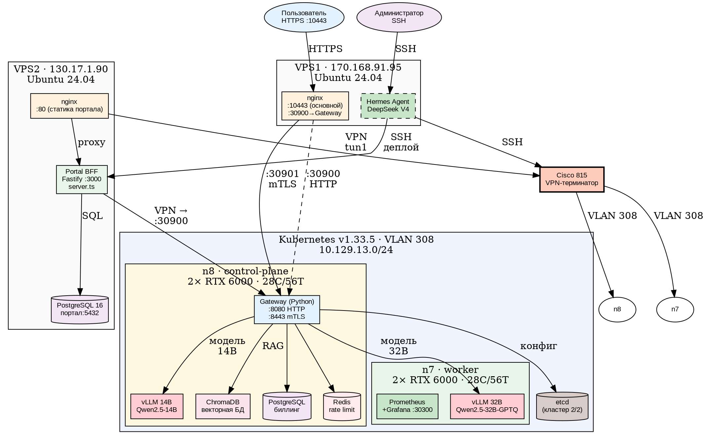

# Aither Project

**Token‑as‑a‑Service** — платформа для продажи токенов к LLM через OpenAI‑совместимый API.

## Физическая схема



## Статус — ✅ 100% (51/51 задач, учебник завершён)

| Этап | Задач | Выполнено |
|---|---|---|
| 1. MVP | 7 | ✅ 7 |
| 2. Биллинг + каталог | 4 | ✅ 4 |
| 3. Observability + продакшен | 5 | ✅ 5 |
| 4. RAG + кастомизация | 4 | ✅ 4 |
| 5. Продакшен-класс | 7 | ✅ 7 |
| 5a. Требования руководства | 9 | ✅ 9 |
| 6. Эксплуатация | 6 | ✅ 6 |
| 7. Закрытый контур | 7 | ✅ 7 |
| Прочее (LoRA, HPA, CI/CD) | 2 | ✅ 2 |

## Компоненты

| Компонент | Где | Статус |
|---|---|---|
| **vLLM 14B** (Qwen2.5-14B, TP=1) | n8, 1× RTX 6000 | ✅ |
| **vLLM 32B** (Qwen2.5-32B-GPTQ, TP=2) | n7, 2× RTX 6000 | ✅ |
| **API Gateway** (Python, dual-port) | K8s (n8) | ✅ :8080 HTTP + :8443 mTLS |
| **Portal BFF** (Node.js/Fastify) | VPS2:3000 | ✅ JWT + OAuth |
| **Portal UI** (SPA) | VPS2:80 (nginx) | ✅ Чат + RAG toggle |
| **PostgreSQL** (биллинг) | K8s (n8) | ✅ |
| **PostgreSQL** (портал) | VPS2:5432 | ✅ |
| **Redis 7** (rate limiting) | K8s (n8) | ✅ |
| **ChromaDB** (векторный RAG) | K8s (n8) | ✅ |
| **Wiki Graph** (LLM-Wiki, 8 стр.) | K8s ConfigMap | ✅ Karpathy-style |
| **Prometheus + Grafana** | K8s (n7) | ✅ :30300 |
| **nginx** (HTTPS :10443) | VPS1 | ✅ |
| **nginx** (портал :80) | VPS2 | ✅ |
| **mTLS** (BFF ↔ Gateway) | VPS2 → n8 | ✅ |
| **ЮKassa** | VPS2 | ⬜ тестовый режим |
| **Учебник** (24 главы, ~780 стр.) | `/docs/training-manual/` | ✅ Утверждён |

## Инфраструктура

| Узел | Адрес | Роль | GPU |
|---|---|---|---|
| **VPS1** | 170.168.91.95 | Hermes, nginx, входная точка | — |
| **VPS2** | 130.17.1.90 | Портал, BFF, PostgreSQL, VPN | — |
| **Cisco 815** | 10.129.11.0/24 | VPN-терминатор | — |
| **n8** | 10.129.13.78 | K8s control-plane, Gateway, vLLM 14B | 2× RTX 6000 |
| **n7** | 10.129.13.77 | K8s worker, vLLM 32B, Prometheus | 2× RTX 6000 |

## Сеть

```
VPS1 ←→ VPS2: публичная сеть (HTTPS :10443, SSH)
VPS2 → Cisco 815: VPN tun1
Cisco 815 → n7, n8: VLAN 308 (10.129.13.0/24)
n7 ↔ n8: Flannel VXLAN (10.244.0.0/16)
```

## Быстрый старт

```bash
# Портал: https://fb1.spb.ru:10443
# Grafana: http://grafana.130.17.1.90.nip.io:30300
# API: https://fb1.spb.ru:10443/v1/chat/completions
# RAG: https://fb1.spb.ru:10443/api/rag/status (JWT)
```

## Структура репозитория

```
aither-project/
│
│  📄 README.md                ← этот файл
│  📄 ROADMAP.md               ← дорожная карта проекта
│  📄 lab-journal.md           ← лабораторный журнал (хронология всех изменений)
│  📄 brief.md                 ← исходное ТЗ на платформу
│  📄 status.md                ← сводка статуса задач
│
├── 📁 portal/                 ★ Портал: SPA + BFF
│   ├── 📄 server.ts           — BFF (Fastify, :3000): auth, чаты, RAG, биллинг, админка
│   ├── 📄 ldap.ts             — LDAP/ALD Pro аутентификация
│   ├── 📄 policies.ts         — политики доступа (org-level)
│   ├── 📄 api-gateway.ts      — прокси админ-API → Gateway
│   ├── 📄 package.json        — NPM-зависимости
│   ├── 📄 .env                — переменные окружения (секреты)
│   ├── 📁 dist/               — скомпилированный BFF (server.js)
│   └── 📁 static/             — статика (фронтенд SPA)
│       ├── 📄 index.html      — чат-интерфейс + RAG toggle
│       └── 📄 admin.html      — админ-панель
│
├── 📁 gateway/                ★ API Gateway (Python, Docker-образ)
│   ├── 📄 gateway.py          — точка входа: JWT, rate limit, биллинг, прокси vLLM
│   ├── 📄 mtls_server.py      — mTLS-обёртка (:8443) + HTTP (:8080)
│   ├── 📄 security.py         — DLP ingress-фильтр (SQL-инъекции)
│   ├── 📄 security_egress.py  — egress-фильтр (ДСП, ПДн)
│   ├── 📄 vault.py            — интеграция с Vault PKI
│   ├── 📄 catalog.py          — каталог моделей + health-check
│   ├── 📄 catalog.yaml        — декларативный список моделей
│   ├── 📄 routing.py          — маршрутизация к vLLM-бэкендам
│   ├── 📄 wiki_graph.py       — LLM-Wiki: граф знаний (340 строк)
│   ├── 📄 hybrid_rag.py       — гибридный RAG: keyword + graph (157 строк)
│   ├── 📄 admin.py            — админ-API: очереди, модели, пользователи
│   ├── 📄 metrics.py          — Prometheus-метрики
│   └── 📄 reaper.py           — очистка просроченных резерваций
│
├── 📁 k8s/                    ★ Kubernetes-манифесты
│   ├── 📁 gateway/
│   │   ├── 📄 deployment.yaml — Gateway Deployment + mTLS + wiki ConfigMap
│   │   └── 📄 service.yaml    — Gateway Service (NodePort :30900 + :30901)
│   ├── 📁 vllm-14b/
│   │   ├── 📄 deployment.yaml — vLLM 14B (Qwen2.5-14B, n8)
│   │   └── 📄 service.yaml
│   ├── 📁 vllm-32b/
│   │   ├── 📄 deployment.yaml — vLLM 32B (Qwen2.5-32B-GPTQ, n7)
│   │   └── 📄 service.yaml
│   └── 📁 hpa/
│       ├── 📄 gateway-hpa.yaml
│       ├── 📄 hpa.yaml
│       └── 📄 prometheus-adapter.yaml
│
├── 📁 configs/                ★ Эталонные конфигурации
│   ├── 📁 vps1/
│   │   ├── 📄 aither-failover       — nginx :10443
│   │   └── 📄 gateway-proxy         — nginx :30900 → Gateway
│   ├── 📁 vps2/
│   │   └── 📄 remote-configs.txt    — docker-compose, nginx, systemd BFF
│   ├── 📁 k8s/
│   │   ├── 📄 gateway-code.yaml     — эталонный ConfigMap кода Gateway
│   │   ├── 📄 gateway-catalog.yaml  — эталонный каталог моделей
│   │   └── 📄 gateway-wiki.yaml     — эталонный wiki ConfigMap
│   └── 📁 bff/
│       └── 📄 .env.template         — шаблон переменных BFF
│
├── 📁 offline-deploy/         ★ Офлайн-пакет для закрытого контура (v1.1.0)
│   ├── 📄 README.md
│   ├── 📁 k8s/                — эталонные манифесты
│   ├── 📁 scripts/            — скрипты эксплуатации
│   ├── 📁 configs/            — эталонные конфигурации
│   └── 📁 tests/              — приёмо-сдаточные тесты
│
├── 📁 scripts/                Скрипты деплоя и эксплуатации
│   ├── 📄 deploy.sh           — деплой портала на VPS2
│   ├── 📄 health-check.sh     — проверка всех компонентов
│   └── 📄 portal-security-check.sh — аудит безопасности портала
│
├── 📁 db/migrations/          Миграции БД
│   ├── 📄 006_org_id_text.sql
│   ├── 📄 007_subscription_tiers.sql
│   └── 📄 008_auth_tables_k8s.sql
│
├── 📁 delegation/             Ключи делегирования (JWT RS256)
│   ├── 📄 private.pem
│   └── 📄 public.pem
│
├── 📁 docs/                   ★ Документация
│   ├── 📁 training-manual/    — учебное пособие (24 главы, ~780 стр.)
│   │   ├── 📄 00-master-toc.md         — мастер-оглавление
│   │   ├── 📄 01-part1-theory.md       — Часть I: Теория (гл. 1–7)
│   │   ├── 📄 02-part2-deployment.md   — Часть II: Развёртывание (гл. 8–13)
│   │   ├── 📄 03-part3-development.md  — Часть III: Разработка (гл. 14–18)
│   │   ├── 📄 05-part4-production.md   — Часть IV: Production (гл. 19–24) ✅
│   │   └── 📄 04-appendices-labs.md    — Приложения + Практикум
│   └── 📁 diagrams/
│       └── 📄 physical-architecture.svg
│
├── 📁 wiki/                   База знаний Aither (LLM-Wiki, 8 страниц)
│   ├── 📁 entities/           — AI Gateway, vLLM, ChromaDB, Vault, Security
│   ├── 📁 concepts/           — Multi-tenant, RAG, LLM-Wiki
│   └── 📁 queries/            — сохранённые результаты
│
└── 📁 fine-tuning/            ★ LoRA-скрипты и джобы (QLoRA 4-bit)
```

## Учебное пособие

**24 главы, ~780 стр., 115 DOT-схем, 109 таблиц** — написано на основе реального кода.

| Часть | Глав | Стр. |
|---|---|---|
| I. Теория | 1–7 | ~170 |
| II. Развёртывание | 8–13 | ~150 |
| III. Разработка | 14–18 | ~95 |
| **IV. Production** | **19–24** | **~190** |
| Приложения | — | ~135 |

Состояние: **✅ Утверждено** — все 24 главы написаны.

## Дорожная карта

Подробно: [ROADMAP.md](ROADMAP.md)

Актуальные задачи: #13 YooKassa live mode → etcd 3-й узел → PenTest → Production launch
