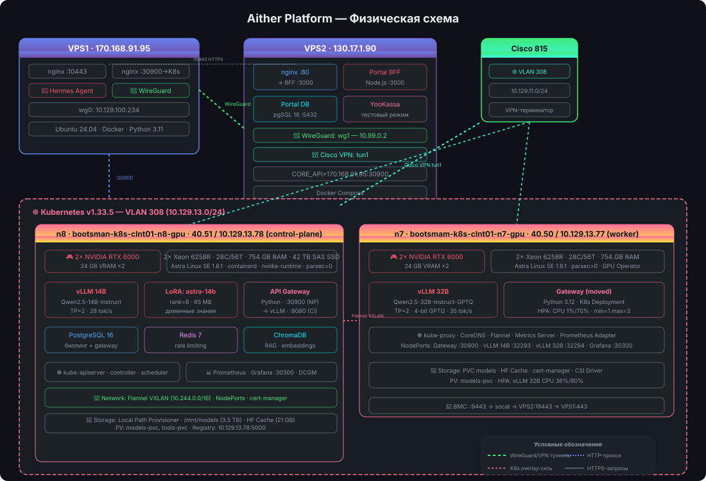

# Aither Project

**Token‑as‑a‑Service** — платформа для продажи токенов к LLM через OpenAI‑совместимый API.

## Физическая схема



## Статус — 90% готовности (46/51 задач)

| Этап | Задач | Выполнено |
|---|---|---|
| 1. MVP | 7 | ✅ 7 |
| 2. Биллинг + каталог | 4 | ✅ 4 |
| 3. Observability + продакшен | 5 | ✅ 3 |
| 4. RAG + кастомизация | 4 | ✅ 4 |
| 5. Продакшен-класс | 7 | ✅ 4 |
| 5a. Требования руководства | 9 | ✅ 9 |
| 6. Эксплуатация | 6 | ✅ 6 |
| 7. Закрытый контур | 7 | ✅ 7 |
| Прочее (LoRA, HPA, CI/CD) | 2 | ✅ 2 |

## Компоненты

| Компонент | Где | Статус |
|---|---|---|
| **vLLM 14B** (Qwen2.5-14B, TP=2) | n8, 2× RTX 6000 | ✅ 28 tok/s |
| **vLLM 32B** (Qwen2.5-32B-GPTQ, TP=2) | n7, 2× RTX 6000 | ✅ 35 tok/s |
| **LoRA astra-14b** (rank=8, 65 MB) | n8 | ✅ доменные знания |
| **API Gateway** (Python) | K8s (n8→n7) | ✅ HPA: 1%/70% CPU |
| **Portal BFF** (Node.js) | VPS2:3000 | ✅ |
| **Portal DB** (PostgreSQL 16) | VPS2:5432 | ✅ |
| **PostgreSQL 16** (биллинг) | K8s (n8) | ✅ |
| **Redis 7** (rate limiting) | K8s (n8) | ✅ |
| **ChromaDB** (RAG) | K8s (n8) | ✅ |
| **Prometheus + Grafana** | K8s (n7) | ✅ :30300 |
| **nginx** (HTTPS :10443) | VPS1 | ✅ |
| **nginx** (портал :80) | VPS2 | ✅ |
| **ЮKassa** | VPS2 | ⬜ тестовый режим |

## Инфраструктура

| Узел | Адрес | Роль | GPU |
|---|---|---|---|
| **VPS1** | 170.168.91.95 | Hermes, nginx, WireGuard | — |
| **VPS2** | 130.17.1.90 | Портал, BFF, БД | — |
| **Cisco 815** | 10.129.11.0/24 | VPN-терминатор | — |
| **n8** | 40.51 / 10.129.13.78 | K8s control-plane, vLLM 14B | 2× RTX 6000 |
| **n7** | 40.50 / 10.129.13.77 | K8s worker, vLLM 32B | 2× RTX 6000 |

## Сеть

```
VPS1 ←→ VPS2: WireGuard (wg0-wg1)
VPS2 → Cisco 815: VPN tun1
Cisco 815 → n7, n8: VLAN 308 (10.129.13.0/24)
n7 ↔ n8: Flannel VXLAN (10.244.0.0/16)
```

## Быстрый старт

```bash
# Портал: https://fb1.spb.ru:10443
# Grafana: http://grafana.130.17.1.90.nip.io
# API: https://fb1.spb.ru:10443/v1/chat/completions
```

## Репозиторий

```
aither-project/
├── gateway/          # API Gateway (Python)
├── portal/           # Портал (Node.js + HTML)
├── k8s/              # Kubernetes-манифесты
├── configs/          # Эталонные конфигурации
├── docs/             # Документация
├── scripts/          # Скрипты деплоя
├── fine-tuning/      # LoRA-скрипты и джобы
└── lab-journal.md    # Лабораторный журнал
```

## Дорожная карта

Подробно: [ROADMAP.md](ROADMAP.md)

Ближайшие задачи: #13 YooKassa → #15 Parsec → #27 Production → #28 HPA ✅ → #29 CI/CD ✅
