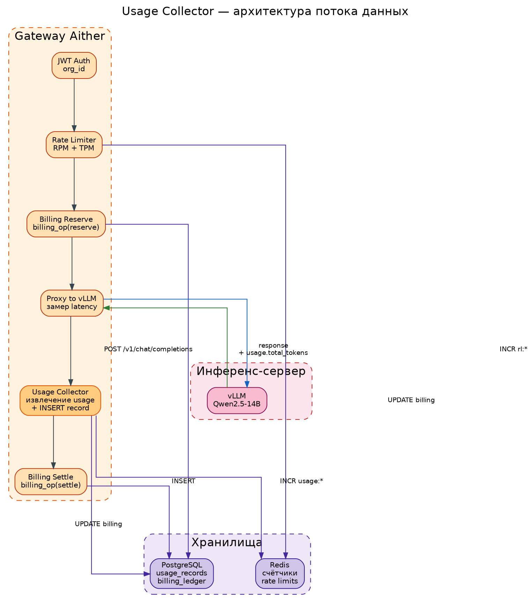
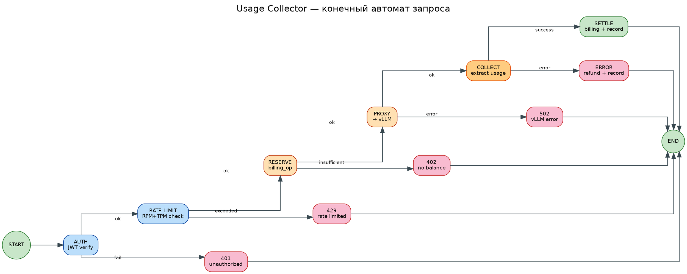

# Usage Collector — подсистема учёта потребления токенов

## 1. Назначение и место в архитектуре

### Контекст

Usage Collector является компонентом **Gateway Aither** и обеспечивает точный учёт токенов, потреблённых каждым запросом к языковой модели. Подсистема находится на критическом пути обработки запроса:

```
Клиент → Портал → Gateway → [Usage Collector] → vLLM → Gateway → [Usage Collector] → Клиент
```

### Решаемая проблема

Базовая версия Gateway использовала **предварительную оценку** токенов (`reserve_amount`) для биллинга. Это приводило к:
- Переоценке: клиент списывал больше токенов, чем реально потребил (до 30-40%)
- Неточной статистике: невозможно определить реальную нагрузку на инфраструктуру
- Отсутствию аналитики: нет данных для пост-оптимизации и отчётности

Usage Collector заменяет оценочный механизм на **точный подсчёт** на основе метаданных от инференс-сервера (vLLM).

### Требования

**Функциональные:**
- F1. Точный подсчёт потреблённых токенов (prompt + completion)
- F2. Сохранение детальной записи о каждом запросе в PostgreSQL
- F3. Предоставление агрегированной статистики через API
- F4. Корректная обработка ошибочных и прерванных запросов

**Нефункциональные:**
- NF1. Задержка не более 5 мс на операцию учёта (не влияет на latency запроса)
- NF2. Атомарность: биллинг и учёт либо оба фиксируются, либо оба откатываются
- NF3. Горизонт хранения: сырые записи — 90 дней, агрегаты — постоянно

---

## 2. Алгоритм работы

### 2.1 Основной цикл обработки запроса

```
Шаг 1. Аутентификация JWT → извлечение org_id
Шаг 2. Rate Limiter (RPM + TPM)
Шаг 3. Предварительная оценка токенов
Шаг 4. Резервирование средств (billing_op reserve)
Шаг 5. Отправка запроса в vLLM
Шаг 6. Получение ответа от vLLM
Шаг 7. Извлечение usage.total_tokens из ответа
        ├─ Успех: billing_op settle (фактические токены)
        │         → INSERT в usage_records (статус: success)
        └─ Ошибка: billing_op refund (полная сумма)
                   → INSERT в usage_records (статус: error)
Шаг 8. Возврат ответа клиенту
```

### 2.2 Извлечение метрик из ответа vLLM

vLLM возвращает метрики в формате OpenAI:

```json
{
  "id": "cmpl-abc123",
  "object": "chat.completion",
  "model": "/models/Qwen2.5-14B-Instruct",
  "usage": {
    "prompt_tokens": 128,
    "completion_tokens": 256,
    "total_tokens": 384
  },
  "choices": [...]
}
```

Gateway извлекает поля:

| Поле ответа vLLM | Поле в usage_records | Назначение |
|---|---|---|
| `usage.prompt_tokens` | `input_tokens` | Токены входящего сообщения |
| `usage.completion_tokens` | `output_tokens` | Токены ответа модели |
| `usage.total_tokens` | `total_tokens` | Сумма (основание для биллинга) |
| Время выполнения | `latency_ms` | Для мониторинга производительности |

### 2.3 Обработка краевых случаев

| Ситуация | Действие |
|---|---|
| vLLM вернул ответ без `usage` | Использовать `reserve_amount` как оценку (fallback) |
| vLLM вернул ошибку (status ≠ 200) | Refund резерва, запись со статусом `error` |
| PostgreSQL недоступен | Записать в лог, продолжить обслуживание (fail open) |
| Прерванное соединение клиента | vLLM всё равно завершает инференс → settle по факту |

---

## 3. Структуры данных

### 3.1 Таблица usage_records (PostgreSQL)

```sql
CREATE TABLE IF NOT EXISTS usage_records (
    id            SERIAL PRIMARY KEY,
    org_id        UUID NOT NULL,
    request_id    VARCHAR(8),          -- ссылка на billing_ledger.reference
    model         VARCHAR(64),         -- имя модели (qwen2.5-14b и др.)
    input_tokens  INTEGER NOT NULL,    -- prompt_tokens
    output_tokens INTEGER NOT NULL,    -- completion_tokens
    total_tokens  INTEGER NOT NULL,    -- сумма для биллинга
    status        VARCHAR(16) NOT NULL DEFAULT 'success',  -- success | error
    latency_ms    INTEGER,             -- время выполнения запроса в мс
    created_at    TIMESTAMPTZ NOT NULL DEFAULT now()
);

CREATE INDEX idx_usage_org_time ON usage_records (org_id, created_at DESC);
CREATE INDEX idx_usage_model     ON usage_records (model);
```

### 3.2 Ключи Redis (оперативный учёт)

| Ключ | Тип | TTL | Назначение |
|---|---|---|---|
| `usage:{org_id}:{date}` | counter | 48h | Счётчик запросов за день |
| `usage:tk:{org_id}:{date}` | counter | 48h | Сумма токенов за день |
| `rl:{org_id}:rpm:{window}` | counter | 120s | Rate limit: запросы в минуту |
| `rl:{org_id}:tpm:{window}` | counter | 120s | Rate limit: токены в минуту |

---

## 4. Схемы

### 4.1 Архитектура потока данных



### 4.2 Конечный автомат обработки запроса



---

## 5. Интеграция

### 5.1 API-эндпоинты

| Метод | Путь | Назначение |
|---|---|---|
| GET | `/v1/usage/` | Сводка: всего запросов, всего токенов, сегодня |
| GET | `/v1/usage/history?limit=N` | Детальная история транзакций (billing_ledger) |
| GET | `/v1/usage/stats?days=N` | NEW: агрегация usage_records по дням |

### 5.2 Зависимости

| Компонент | Тип зависимости | При отказе |
|---|---|---|
| PostgreSQL | Обязательная | Запись в лог, fail open |
| Redis | Оперативная | Счётчики today пропускаются |
| vLLM | Источник данных | usage = reserve_amount |

### 5.3 Конфигурация (env vars)

| Переменная | По умолчанию | Описание |
|---|---|---|
| `USAGE_RETENTION_DAYS` | 90 | Горизонт хранения usage_records |
| `PG_URL` | (из secret) | Строка подключения к PostgreSQL |

---

## 6. Безопасность

### Модель угроз

| Угроза | Вероятность | Влияние | Мера |
|---|---|---|---|
| Подделка usage в ответе vLLM | Низкая | Высокое | vLLM во внутренней сети |
| SQL-инъекция через model name | Низкая | Высокое | Параметризованные запросы |
| Переполнение usage_records | Средняя | Среднее | Автоочистка через 90 дней |
| Утечка org_id в логах | Средняя | Среднее | Маскирование в production |

---

## 7. Тестирование

### Методика

1. Отправить запрос с известным промптом через Gateway
2. Проверить, что в `usage_records` появилась запись
3. Сравнить `total_tokens` с ответом vLLM
4. Проверить агрегацию через `/v1/usage/stats`
5. Имитировать ошибку vLLM → проверить refund и status=error
