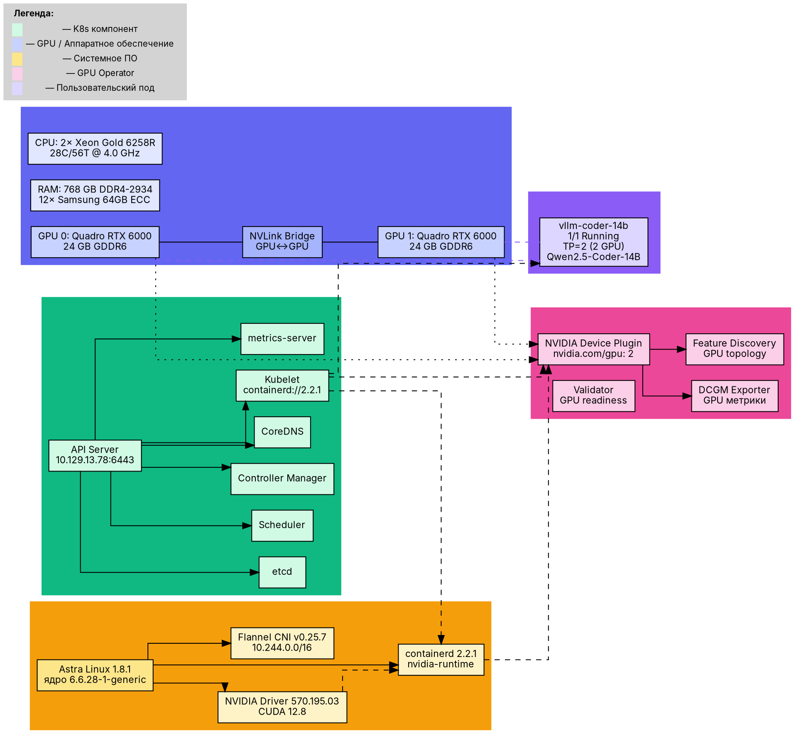

# Этап 1: K8s + GPU Operator на n8

## Конфигурация

### Аппаратное обеспечение

| Компонент | Характеристика |
|-----------|---------------|
| **Сервер** | YADRO VEGMAN S320 (n8, 40.51) |
| **CPU** | 2× Intel Xeon Gold 6258R (28C/56T на сокет, 4.0 GHz Turbo) |
| **RAM** | 768 GB DDR4-2934 ECC (12× Samsung 64GB) |
| **GPU** | 2× NVIDIA Quadro RTX 6000 (24 GB GDDR6 каждая, NVLink bridge) |
| **Диски** | 12× SSD MegaRAID, 2× M.2 NVMe 480GB |
| **ОС** | Astra Linux 1.8.1 (ядро 6.6.28-1-generic) |
| **IP** | 10.129.13.78 (VLAN 308, шлюз 10.129.13.1) |

### K8s кластер

| Параметр | Значение |
|----------|---------|
| **Тип** | kubeadm, single-node (control-plane + worker) |
| **Версия** | v1.33.5 |
| **CNI** | Flannel v0.25.7 (pod CIDR: 10.244.0.0/16) |
| **Runtime** | containerd://2.2.1 |
| **Узлы** | 1 (n8: bootsman-k8s-clnt01-n8-gpu) |
| **Taint** | control-plane: `node-role.kubernetes.io/control-plane-` (удалён) |

### GPU Operator

| Компонент | Статус |
|-----------|--------|
| **Установка** | Helm: `nvidia/gpu-operator` в namespace `gpu-operator` |
| **Режим** | `driver=pre-installed` (драйвер NVIDIA 570.195.03 установлен на хосте) |
| **Device-Plugin** | ✅ Включён — `nvidia.com/gpu: 2` в Capacity узла |
| **DCGM Exporter** | ✅ Включён — метрики GPU |

### Containerd

Серия проблем, решённых в процессе:

1. **Docker Hub заблокирован из РФ** — настроено зеркало `dockerhub.timeweb.cloud`
2. **NVIDIA runtime** — добавлен `nvidia` runtime в `/etc/containerd/config.toml`
3. **GPU Operator auto-import** — перезаписывает секцию `runtimes` через `conf.d/99-nvidia.toml`. Решение: монолитный конфиг без `imports`
4. **CDI vs csv mode** — GPU Operator генерирует CDI-спеки, но containerd не всегда их резолвит. Решение: `mode=csv` в `nvidia-container-runtime`

---

## Последовательность развёртывания

### Шаг 1: Подготовка ОС

```bash
# Установка NVIDIA драйвера
apt-get install -y nvidia-driver-570
# Требуется ребут для выгрузки модуля nouveau
reboot

# После ребута — проверка
nvidia-smi
# → NVIDIA-SMI 570.195.03, CUDA 12.8
# → 2× Quadro RTX 6000, 24 GB

# Восстановление VLAN 308 (не поднимается после ребута)
ip link add link ens1f0 name ens1f0.308 type vlan id 308
```

### Шаг 2: Установка containerd + K8s

```bash
# containerd (идет с Astra Linux, обновить если надо)
apt-get install -y containerd

# kubeadm, kubelet, kubectl
# (бинарники из репозитория Astra или вручную)
kubeadm init \
  --pod-network-cidr=10.244.0.0/16 \
  --apiserver-advertise-address=10.129.13.78

# Разрешить поды на control-plane
kubectl taint nodes --all node-role.kubernetes.io/control-plane-

# CNI Flannel (v0.25.7 — совместим с K8s 1.33)
kubectl apply -f https://github.com/flannel-io/flannel/releases/download/v0.25.7/kube-flannel.yml
```

### Шаг 3: Настройка containerd для NVIDIA

```toml
# /etc/containerd/config.toml (фрагмент)
[plugins."io.containerd.grpc.v1.cri".registry.mirrors."docker.io"]
  endpoint = ["https://dockerhub.timeweb.cloud", "https://mirror.gcr.io"]

[plugins."io.containerd.grpc.v1.cri".containerd.runtimes.nvidia]
  runtime_type = "io.containerd.runc.v2"
  [plugins."io.containerd.grpc.v1.cri".containerd.runtimes.nvidia.options]
    BinaryName = "/usr/local/nvidia/toolkit/nvidia-container-runtime"
    SystemdCgroup = true
```

### Шаг 4: GPU Operator

```bash
helm repo add nvidia https://helm.ngc.nvidia.com/nvidia
helm install gpu-operator nvidia/gpu-operator \
  -n gpu-operator --create-namespace
```

### Шаг 5: Проверка

```bash
kubectl describe node bootsman-k8s-clnt01-n8-gpu | grep -A4 Capacity
# Capacity:
#   cpu:                112
#   nvidia.com/gpu:     2
#   nvidia.com/gpu.memory:  23040
#   nvidia.com/gpu.count:   2
```

---

## Текущее состояние (18.07.2026)

| Компонент | Статус | Детали |
|-----------|--------|--------|
| **K8s API Server** | ✅ Running | v1.33.5, etcd 2/2 |
| **K8s Nodes** | ✅ Ready | 1 узел (n8) |
| **containerd** | ✅ Running | версия: 2.2.1 |
| **GPU Operator** | ⚠️ Частично | GPU в Capacity есть, но namespace `gpu-operator` пуст (поды не найдены) |
| **NVIDIA driver** | ✅ | 570.195.03, CUDA 12.8 |
| **GPU доступность** | ✅ | Обе RTX 6000 видны, каждая ~20.3/23 GB занято под vLLM |
| **Flannel** | ✅ | v0.25.7, pod network работает |
| **CoreDNS** | ✅ | 2 пода Running (много рестартов из-за стабильности containerd) |

### Проблемы

1. **GPU Operator pods не найдены** — возможно, удалены или namespace пересоздан. GPU при этом работают через containerd-nvidia напрямую
2. **CoreDNS/Flannel имеют рестарты** (455 на kube-controller-manager) — не критично, но указывает на нестабильность
3. **Много рестартов системных подов** — при перезагрузке containerd/K8s без graceful shutdown
4. **Parsec Смоленск(2) блокирует** — решено через `parsec=0` в GRUB
5. **imports в containerd** — GPU Operator создаёт `conf.d/99-nvidia.toml`, который конфликтует с основным конфигом

---

## Схема архитектуры (DOT)


