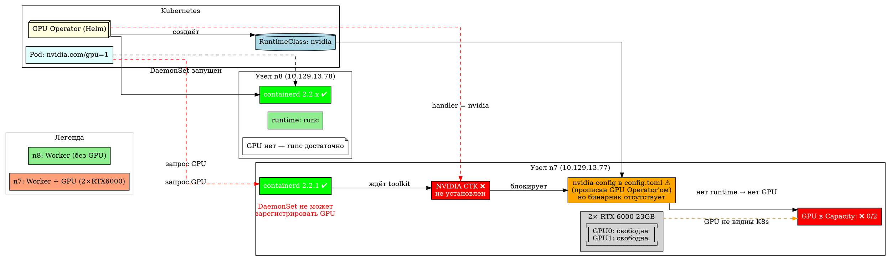
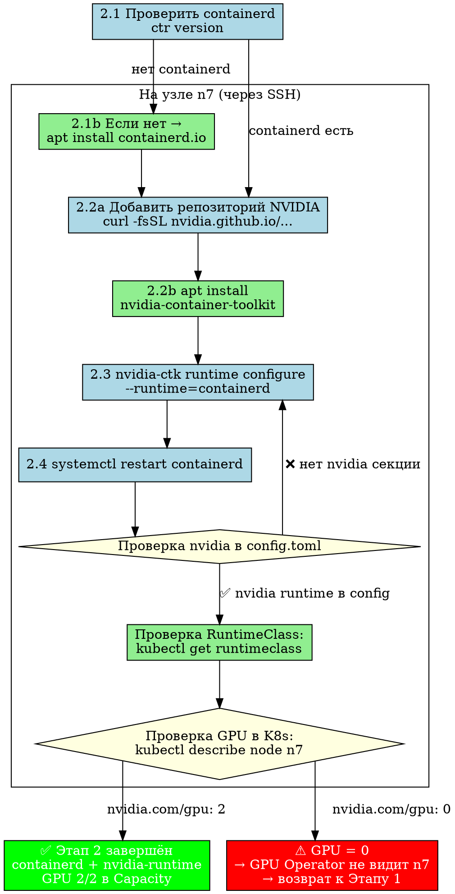

# Этап 2: Containerd + NVIDIA Container Runtime

## Роль в дорожной карте

Этап 2 — фундаментальный слой для запуска GPU-инференса в Kubernetes.
Без него Pod'ы не могут запросить `nvidia.com/gpu`, а vLLM — стартовать модель.

```
┌──────────────────────────────────────────────────┐
│                    Этап 7                         │
│                 OAuth / Portal                    │
├──────────────────────────────────────────────────┤
│                    Этап 6                         │
│              Portal SPA + BFF + SSE               │
├──────────────────────────────────────────────────┤
│                    Этап 5                         │
│            Gateway + Redis / Rate Limit           │
├──────────────────────────────────────────────────┤
│                    Этап 4                         │
│        Tensor Parallelism (2× RTX 6000)           │
├──────────────────────────────────────────────────┤
│                    Этап 3                         │
│              vLLM 14B deploy                      │
├──────────────────────────────────────────────────┤
│      ┌──────────────┴──────────────┐              │
│      │   ЭТАП 2 (containerd+GPU)   │  ← ВЫ ЗДЕСЬ │
│      └──────────────┬──────────────┘              │
├──────────────────────────────────────────────────┤
│                    Этап 1                         │
│            K8s + GPU Operator                    │
└──────────────────────────────────────────────────┘
```

---

## Конфигурация

### Узлы

| Хост | IP | Роль | GPU |
|------|-----|------|-----|
| **n8** | `10.129.13.78` | Worker (K8s) | 0 |
| **n7** | `10.129.13.77` | Worker (K8s) | 2× RTX 6000 23GB |
| **core3** | `10.129.13.3` | Bastion / ProxyJump | — |

### 2.1 containerd — установка через apt

```bash
# Установка containerd.io (через официальный репозиторий Docker)
apt-get update
apt-get install -y containerd.io

# Сгенерировать конфиг по умолчанию
containerd config default > /etc/containerd/config.toml

# Обязательно включить SystemdCgroup
# В секции [plugins."io.containerd.cri.v1.runtime".containerd.runtimes.runc.options]
#   SystemdCgroup = true
```

### 2.2 NVIDIA Container Toolkit — установка

```bash
# Добавить репозиторий NVIDIA
curl -fsSL https://nvidia.github.io/libnvidia-container/gpgkey \
  | gpg --dearmor -o /usr/share/keyrings/nvidia-container-toolkit-keyring.gpg

distribution=$(. /etc/os-release;echo $ID$VERSION_ID)
curl -s -L https://nvidia.github.io/libnvidia-container/$distribution/libnvidia-container.list \
  | sed 's#deb https://#deb [signed-by=/usr/share/keyrings/nvidia-container-toolkit-keyring.gpg] https://#g' \
  > /etc/apt/sources.list.d/nvidia-container-toolkit.list

apt-get update && apt-get install -y nvidia-container-toolkit
```

### 2.3 NVIDIA Runtime Class для containerd

```bash
nvidia-ctk runtime configure --runtime=containerd
systemctl restart containerd
```

После выполнения в `/etc/containerd/config.toml` добавляется секция:

```toml
[plugins."io.containerd.grpc.v1.cri".containerd.runtimes.nvidia]
  runtime_type = "io.containerd.runc.v2"
  [plugins."io.containerd.grpc.v1.cri".containerd.runtimes.nvidia.options]
    BinaryName = "/usr/local/nvidia/toolkit/nvidia-container-runtime"
    SystemdCgroup = true
```

> **Важно:** в `config.toml` версии 3 (containerd ≥2.0) секции лежат в пространстве
> `io.containerd.cri.v1.runtime`, а также дублируются в legacy `io.containerd.grpc.v1.cri`
> для обратной совместимости. Обе должны быть обновлены.

### 2.4 RuntimeClass в K8s

```yaml
# manifests/runtimeclass-nvidia.yaml
apiVersion: node.k8s.io/v1
kind: RuntimeClass
metadata:
  name: nvidia
handler: nvidia
```

Применение:
```bash
kubectl apply -f manifests/runtimeclass-nvidia.yaml
```

---

## Последовательность развёртывания

```
Шаг 2.1  Установка / проверка containerd
               │
               ▼
Шаг 2.2  NVIDIA Container Toolkit (apt install nvidia-container-toolkit)
               │
               ▼
Шаг 2.3  nvidia-ctk runtime configure --runtime=containerd
         → добавляет runtime nvidia в /etc/containerd/config.toml
               │
               ▼
Шаг 2.4  systemctl restart containerd
               │
               ▼
Шаг 2.5  kubectl apply -f manifests/runtimeclass-nvidia.yaml
               │
               ▼
Шаг 2.6  Проверка: kubectl get runtimeclass
         → NAME=nvidia  HANDLER=nvidia
               │
               ▼
Шаг 2.7  Проверка: k8s Node capacity
         → nvidia.com/gpu: 2
           (появляется только после GPU Operator — Этап 1)
```

---

## Текущее состояние (18.07.2026)

### Containerd

| Узел | Статус | Версия |
|------|--------|---------|
| **n8** | ✅ Работает | containerd 2.2.x (через пакет docker.io) |
| **n7** | ✅ Работает | containerd 2.2.1 (пакет `containerd`) |
| **core3** | N/A | Bastion, без containerd |

### NVIDIA Container Toolkit

| Узел | Статус |
|------|--------|
| **n8** | ❌ Не установлен (нет GPU, не требуется) |
| **n7** | ❌ Не установлен — требуется установка |

### RuntimeClass

```bash
$ kubectl get runtimeclass
NAME     HANDLER   AGE
nvidia   nvidia    7d
```

✅ RuntimeClass `nvidia` существует в кластере.

На n8 может работать как дефолтный handler (`runc`), так и `nvidia`.
На n7 не будет работать, пока не установлен NVIDIA Container Toolkit.

### GPU Operator

```bash
$ kubectl get pods -n gpu-operator
NAME                                                   READY   STATUS      RESTARTS   AGE
gpu-operator-77b98fbc57-ntdbt                          1/1     Running     0          13d
nvidia-container-toolkit-daemonset-2g988                1/1     Running     0          13d
nvidia-cuda-validator-jf7w6                            0/1     Completed   0          13d
nvidia-dcgm-exporter-dbscj                             1/1     Running     0          13d
nvidia-device-plugin-daemonset-tw58d                   1/1     Running     0          13d
nvidia-feature-discovery-daemonset-db579              1/1     Running     0          13d
nvidia-mig-manager-7wslk                               1/1     Running     0          13d
nvidia-node-status-exporter-2d2s5                      1/1     Running     0          13d
nvidia-operator-validator-bb8xk                        1/1     Running     0          13d
```

✅ GPU Operator работает, его DaemonSet'ы уже развёрнуты.
На n8 DaemonSet'ы функционируют, но сама нода без GPU.
На n7 DaemonSet'ы не могут зарегистрировать GPU, пока отсутствует NVIDIA CTK.

### Конфигурация containerd на n7

```
Версия:    3
Runtime:   runc (default) + SystemdCgroup = true
nvidia:    ❌ секция добавлена GPU Operator'ом в legacy namespace,
           но CTK бинарник отсутствует
```

NVIDIA container runtime прописан в конфиге (от GPU Operator'а):
```
[plugins."io.containerd.grpc.v1.cri".containerd.runtimes.nvidia]
  runtime_type = "io.containerd.runc.v2"
  [plugins."io.containerd.grpc.v1.cri".containerd.runtimes.nvidia.options]
    BinaryName = "/usr/local/nvidia/toolkit/nvidia-container-runtime"
    SystemdCgroup = true
```

Но бинарника `/usr/local/nvidia/toolkit/nvidia-container-runtime` нет —
требуется `nvidia-ctk runtime configure --runtime=containerd`, который
установит корректный BinaryName на реальный путь пакета.

### Сводка

| Компонент | n8 (worker) | n7 (worker + GPU) |
|-----------|-------------|-------------------|
| containerd | ✅ 2.2.x | ✅ 2.2.1 |
| NVIDIA Container Toolkit | ❌ (не нужен) | ❌ требуется установка |
| RuntimeClass nvidia | ✅ создан | ✅ создан |
| nvidia-runtime в config.toml | N/A | ⚠️ прописан (от GPU Operator), но бинарник отсутствует |
| GPU в Capacity | — | ❌ 0/2 |
| GPU Operator DaemonSet | ✅ Running | ❌ GPU недоступны |

---

## Диаграмма компонентов (DOT)



## Диаграмма последовательности развёртывания (DOT)



---

## Файлы в каталоге

| Файл | Описание |
|------|----------|
| `README.md` | Этот файл — описание, конфигурация, состояние, схемы |
| `docs/diagrams/02-containerd-nvidia-runtime.dot` | Схема компонентов и связей (DOT) |
| `docs/diagrams/02-deploy-sequence.dot` | Схема последовательности развёртывания (DOT) |
| `containerd-config-n7.toml` | Реальный `/etc/containerd/config.toml` с n7 |
| `manifests/runtimeclass-nvidia.yaml` | Манифест RuntimeClass для K8s |
