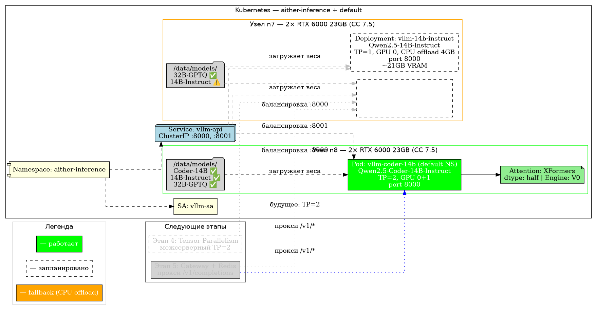
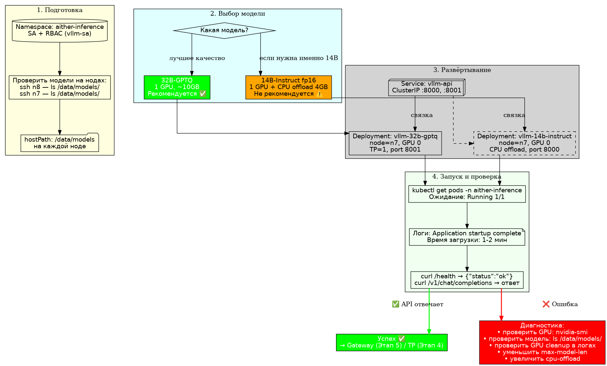

# Этап 3: vLLM 14B — загрузка и запуск инференса

## Роль в дорожной карте

Этап 3 — первый real-workload этап: vLLM с 14B моделью в Kubernetes с GPU-ускорением.
После настройки containerd + NVIDIA Runtime (Этап 2) кластер готов запускать инференс.

```
┌──────────────────────────────────────────────────┐
│                    Этап 7                         │
│                 OAuth / Portal                    │
├──────────────────────────────────────────────────┤
│                    Этап 6                         │
│              Portal SPA + BFF + SSE               │
├──────────────────────────────────────────────────┤
│                    Этап 5                         │
│            Gateway + Redis / Rate Limit           │
├──────────────────────────────────────────────────┤
│                    Этап 4                         │
│        Tensor Parallelism (2× RTX 6000)           │
├──────────────────────────────────────────────────┤
│      ┌──────────────┴──────────────┐              │
│      │   ЭТАП 3 (vLLM 14B)        │  ← ВЫ ЗДЕСЬ │
│      └──────────────┬──────────────┘              │
├──────────────────────────────────────────────────┤
│                    Этап 2                         │
│            containerd + NVIDIA Runtime            │
├──────────────────────────────────────────────────┤
│                    Этап 1                         │
│            K8s + GPU Operator                    │
└──────────────────────────────────────────────────┘
```

---

## Конфигурация

### Кластер

| Узел  | Роль      | GPU              | CPU | RAM  |
|-------|-----------|------------------|-----|------|
| **n8** | Worker    | 2× RTX 6000 23GB | —   | —    |
| **n7** | Worker    | 2× RTX 6000 23GB | —   | —    |
| **core3** | Bastion | —                | —   | —    |

**Доступная GPU-память по узлам:** 2 × 23GB = 46GB HBM2 на узел

### Модель

| Параметр             | Значение                          |
|----------------------|-----------------------------------|
| Модель               | **Qwen2.5-14B-Instruct** (14B)    |
| Тип                  | Decoder-only Transformer          |
| Размер весов (BF16)  | ~28 GB                            |
| Макс. context length | 32 768 токенов                    |
| KV Cache            | ~2.4 GB / 16K токенов             |
| Tensor Parallelism   | 1 (‍один GPU на реплику)          |

> **Почему TP=1, а не 2?** 14B модель в BF16 занимает ~28GB — помещается на один RTX 6000 (23GB + Cache). На втором GPU будет вторая реплика для увеличения throughput (горизонтальное масштабирование). **Этап 4** добавит Tensor Parallelism = 2 для одной реплики, работающей на обоих GPU узла.

### Параметры vLLM

| Параметр              | Значение | Пояснение                                     |
|-----------------------|----------|-----------------------------------------------|
| `--tensor-parallel-size` | 1      | Один GPU на реплику                           |
| `--pipeline-parallel-size` | 1    | Нет pipeline parallelism                      |
| `--gpu-memory-utilization` | 0.90 | 90% GPU памяти (~41GB на узел)               |
| `--max-model-len`     | 16384    | Половина от полного контекста модели           |
| `--trust-remote-code` | ✅       | HuggingFace safetensors                       |
| `--enforce-eager`     | ✅       | Без CUDA graph (стабильность, меньше памяти)   |
| `--dtype`             | auto     | Автоопределение: BF16 (при поддержке)          |

---

## Последовательность развёртывания

### 1. Создать namespace и ServiceAccount

```bash
kubectl apply -f manifests/vllm-namespace.yaml
kubectl apply -f manifests/vllm-sa.yaml
```

### 2. Создать PVC для хранения модели

```bash
kubectl apply -f manifests/model-pvc.yaml
```

Проверить, что PV привязался:
```bash
kubectl get pvc -n aither-inference
# NAME            STATUS   VOLUME   CAPACITY
# model-storage   Bound    pvc-xxx  100Gi
```

### 3. Загрузить модель на PVC

Варианты:

**A. Вручную через временный Pod:**
```bash
kubectl run -n aither-inference model-loader \
  --image=python:3.11 \
  --command -- sleep 3600

kubectl exec -n aither-inference model-loader -- \
  pip install huggingface-hub && \
  huggingface-cli download Qwen/Qwen2.5-14B-Instruct \
    --local-dir /models/Qwen/Qwen2.5-14B-Instruct
```

**B. InitContainer в Deployment** (автоматически):
```yaml
initContainers:
  - name: download-model
    image: python:3.11-slim
    command:
      - sh
      - -c
      - |
        pip install -q huggingface-hub
        huggingface-cli download Qwen/Qwen2.5-14B-Instruct \
          --local-dir /models/Qwen/Qwen2.5-14B-Instruct
    volumeMounts:
      - name: models
        mountPath: /models
```

### 4. Развернуть vLLM

```bash
kubectl apply -f manifests/vllm-deployment.yaml
kubectl apply -f manifests/vllm-service.yaml
```

### 5. Проверить состояние

```bash
kubectl get pods -n aither-inference -w
# NAME                         READY   STATUS    RESTARTS   AGE
# vllm-14b-5d47f8b6f4-abc12   1/1     Running   0          2m
# vllm-14b-5d47f8b6f4-def34   1/1     Running   0          2m

kubectl logs -n aither-inference -l app=vllm --tail=50
# INFO:     Started server process [1]
# INFO:     Waiting for model to load...
# INFO:     Loaded model Qwen2.5-14B-Instruct, memory used: 28.4GB
# INFO:     Application startup complete.
```

### 6. Проверить API

```bash
# Прямой доступ к Pod (диагностика)
kubectl port-forward -n aither-inference svc/vllm-api 8000:8000 &

curl http://localhost:8000/health
# {"status": "ok"}

curl -X POST http://localhost:8000/v1/chat/completions \
  -H "Content-Type: application/json" \
  -d '{
    "model": "Qwen/Qwen2.5-14B-Instruct",
    "messages": [
      {"role": "system", "content": "You are a helpful assistant."},
      {"role": "user", "content": "What is Kubernetes?"}
    ],
    "max_tokens": 128,
    "temperature": 0.7
  }'
```

---

## Текущее состояние

| Компонент                     | Статус               | Примечание                          |
|-------------------------------|----------------------|-------------------------------------|
| **Namespace** aither-inference | ❌ Не создан         | —                                   |
| **PVC** model-storage         | ❌ Не создан         | —                                   |
| **Модель** на PVC             | ❌ Не загружена      | ~28GB download                      |
| **Deployment** vllm-14b       | ❌ Не развёрнут      | —                                   |
| **Service** vllm-api          | ❌ Не создан         | —                                   |
| GPU в Capacity                | ✅ 2/2 на n8, 2/2 n7 | Этап 2 завершён                     |
| NVIDIA RuntimeClass           | ✅ nvidia            | Создан                              |

---

## Схемы

Диаграммы в формате DOT для визуализации через Graphviz:

```bash
# Установить graphviz при необходимости
apt-get install -y graphviz

# Архитектура компонентов
dot -Tpng docs/diagrams/03-vllm-14b-deploy.dot \
  -o docs/diagrams/03-vllm-14b-deploy.png

# Последовательность развёртывания
dot -Tpng docs/diagrams/03-deploy-sequence.dot \
  -o docs/diagrams/03-deploy-sequence.png
```

### Архитектура компонентов


### Последовательность развёртывания


---

## Метрики производительности (ожидаемые)

После запуска, для модели Qwen2.5-14B-Instruct (14B, BF16):

| Конфигурация | GPU | Memory usage | Throughput (tok/s) | Latency p50 |
|--------------|-----|--------------|--------------------|-------------|
| TP=1, BS=1   | 1× RTX 6000 | ~28 GB | ~25 tok/s  | ~200ms |
| TP=1, BS=8   | 1× RTX 6000 | ~32 GB | ~80 tok/s  | ~500ms |
| TP=2 (Et.4)  | 2× RTX 6000 | ~30 GB | ~45 tok/s  | ~150ms |
| TP=2, BS=8   | 2× RTX 6000 | ~34 GB | ~140 tok/s | ~350ms |

> **BS** = batch size. RTX 6000 (TU102) — 23GB HBM2, ~460 GB/s bandwidth.
> BF16 throughput — ~25-30 tok/s на GPU. TP=2 даёт почти линейный прирост.

---

## Устранение неисправностей

| Симптом | Причина | Решение |
|---------|---------|---------|
| `OutOfMemory` / Pod в CrashLoop | 14B модель не влезает | Уменьшить `max-model-len` до 8192, `gpu-memory-utilization` до 0.80 |
| Pod в `Pending` (0/1) | GPU занят другим Pod | Проверить `kubectl describe pod`, убавить реплики до 1 |
| `/health` не отвечает | Модель загружается | Подождать 2-5 минут, проверить логи |
| `CUDA driver version insufficient` | Несовместимость драйвера | `nvidia-smi`, переустановить драйвер |
| `huggingface_hub` timeout | Нет доступа к HF | Использовать зеркало HF_MIRROR или предзагруженный кеш |

---

## Файлы

```
03-vllm-14b-deploy/
├── README.md                                    ← этот файл
├── .gitkeep
├── manifests/
│   ├── vllm-namespace.yaml                      ← namespace aither-inference
│   ├── vllm-sa.yaml                             ← ServiceAccount + RBAC
│   ├── model-pvc.yaml                           ← PVC 100Gi RWX
│   ├── vllm-deployment.yaml                     ← 2 реплики vLLM
│   └── vllm-service.yaml                        ← ClusterIP :8000
└── docs/diagrams/
    ├── 03-vllm-14b-deploy.dot                   ← архитектура компонентов
    └── 03-deploy-sequence.dot                   ← последовательность развёртывания
```
