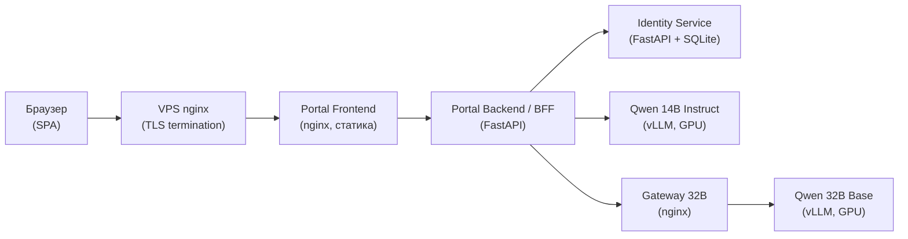

# Aither / AI Hermes — Платформа AI-моделей

**Платформа с локальными LLM и Web-порталом для доступа к AI-моделям.**

Текущие модели: Qwen2.5-32B-Instruct-AWQ, Qwen3-32B-AWQ.
Обе — Instruct (чат, инструкции, tool calling). OpenAI-совместимый API.

- **Тип развёртывания:** Home Lab / Test (bare-metal Kubernetes, 2× GPU-узла)
- **Текущая ветка:** `aither-v2`
- **Application baseline:** `39a8946143e7a38ceff9faabad024225acbf202e`
- **Документация обновлена:** 2026-08-07
- **Environment:** HOME LAB / TEST
- **Production acceptance:** NOT GRANTED
- **External acceptance:** PENDING EXTERNAL CONNECTOR AUDIT

> ⚠️ Production readiness не заявлен. Статус определяется независимым внешним аудитом.
> Данный README описывает документированное состояние репозитория — не является сертификатом готовности.
| Последний внешний аудит   | Stage U1.3-OPS-R6 (evidence ожидается)   |
| Tracked-файлов            | 730                                  |

---

## Содержание

1. [Назначение системы](#назначение-системы)
2. [Пользовательские роли](#пользовательские-роли)
3. [Логическая архитектура](#логическая-архитектура)
4. [Физическая архитектура](#физическая-архитектура)
5. [Компоненты системы](#компоненты-системы)
6. [Модели](#модели)
7. [Аутентификация и авторизация](#аутентификация-и-авторизация)
8. [Основные пользовательские сценарии](#основные-пользовательские-сценарии)
9. [API](#api)
10. [Хранилища данных](#хранилища-данных)
11. [Развёртывание](#развёртывание)
12. [Конфигурация](#конфигурация)
13. [Тестирование](#тестирование)
14. [Структура репозитория](#структура-репозитория)
15. [Подробный каталог файлов](#подробный-каталог-файлов)
16. [Навигационная карта документации](#навигационная-карта-документации)
17. [Известные ограничения](#известные-ограничения)
18. [Безопасность](#безопасность)
19. [Исторические этапы проекта](#исторические-этапы-проекта)
20. [Правила актуализации README](#правила-актуализации-readme)

---

## Назначение системы

Aither — это платформа для предоставления доступа к локальным LLM-моделям
через:

| Возможность | Описание | Статус |
|---|---|---|
| **Token-as-a-Service** | OpenAI-совместимый API с API-ключами | Активно |
| **Web Portal** | SPA с регистрацией, чатом, управлением | Активно |
| **Chat 14B** | Чат-интерфейс к Qwen 14B Instruct | Активно |
| **Chat 32B** | Адаптер чата к completion-only Qwen 32B Base | Активно |
| **Identity** | Пользователи, роли, организации, сессии | Активно |
| **OAuth** | Вход через Google, GitHub, Yandex | Активно |
| **API-ключи** | Создание, просмотр, отзыв ключей | Активно |
| **Wiki** | Просмотр статей с markdown-рендерингом | Активно |
| **RAG / Documentation Search** | Поиск по документации с генерацией ответа | Активно |
| **Billing / Usage** | Тарифы, учёт запросов и токенов | Активно |
| **Monitoring** | Prometheus-метрики, статус системы | Активно |
| **Feedback** | Форма обратной связи с сохранением в БД | Активно |
| **Регистрация** | Email-регистрация с кодом подтверждения | Активно |
| **Восстановление пароля** | 3-шаговый сброс через email | Активно |

---

## Пользовательские роли

| Роль | Назначение | Разрешённые функции | Запрещённые функции |
| ---- | ---------- | ------------------- | ------------------- |
| **Пользователь** (`user`) | Работа с Portal | Chat (14B, 32B), Wiki, RAG, API-ключи, профиль, Billing/Usage, Feedback | Admin, Monitoring, управление пользователями и тарифами |
| **Оператор** (`operator`) | Эксплуатационный контроль | Всё что у пользователя + Monitoring | Управление пользователями и тарифами |
| **Администратор** (`administrator`) | Управление системой | Полный доступ: пользователи, роли, тарифы, scopes, Monitoring, Feedback-лог | — |

Проверка ролей выполняется на стороне сервера (Identity + Portal Backend BFF).

---

## Логическая архитектура



**Примечания:**
- Portal Backend (BFF) маршрутизирует запросы к моделям напрямую, минуя Gateway
- 32B модель доступна только через completion-adapter в Portal Backend
- 14B модель — прямой чат через `/v1/chat/completions`

---

## Физическая архитектура

### Узлы

| Узел | Роль | GPU | Основные поды |
| ---- | ---- | --- | ------------- |
| `bootsmam-k8s-clnt01-n7-gpu` | Inference | 2× GPU | vllm-14b-instruct, vllm-32b-gptq, identity, portal-* |
| `bootsmam-k8s-srv01-n8-gpu` | Control Plane | 2× GPU | nginx-gateway-32b, ai-platform |
| VPS (`130.17.1.90`) | Edge | — | Docker nginx (TLS termination, reverse proxy) |

### Сеть

```text
Internet → VPS (:443, :10443) → VPN-туннель → K8s NodePort (:30080) → Portal Frontend
```

- **Публичный вход:** `https://fb1.spb.ru:10443/`
- **Тестовая зона:** `http://10.129.13.78:30080/`
- **Container Registry:** `10.129.13.78:5000`
- **Namespace:** `aither-inference`

---

## Компоненты системы

| Компонент | Путь | Технология | Назначение | Основные endpoints | Хранилище | Статус |
| --------- | ---- | ---------- | ---------- | ------------------ | --------- | ------ |
| **Identity Service** | `services/identity/` | Python/FastAPI + SQLite | Аутентификация, авторизация, пользователи, организации, OAuth, сессии, feedback | `/v1/identity/*` | SQLite (hostPath) | Активный |
| **Portal Backend (BFF)** | `services/portal-backend/` | Python/FastAPI | API-шлюз: чат, billing, usage, RAG, прокси к Identity и моделям | `/api/v1/*` | In-memory usage tracker | Активный |
| **Portal Frontend** | `services/portal-frontend/` | HTML/JS/CSS (nginx) | SPA: регистрация, чат, Wiki, RAG, API-ключи, тарифы, админка | Статика через nginx | localStorage (чаты) | Активный |
| **AI Platform** | `services/ai-platform/` | Python/FastAPI + SQLite | Устаревший сервис: модели, API-ключи, conversations, assistants | `/api/v1/models`, `/api/v1/api-keys` | SQLite (PVC) | Исторический |
| **Gateway 32B** | `services/portal-frontend/nginx-gateway-32b-nginx.conf` | nginx | Прокси для completion-only Qwen 32B: блокирует chat, разрешает completions | `/v1/completions` | — | Активный |
| **RAG / Documentation Search** | Встроен в Portal Backend | Python | Поиск по документации с генерацией ответа моделью | `/api/v1/rag/*` | In-memory индекс | Активный |
| **OAuth** | Встроен в Identity | Python | Google, GitHub, Yandex OAuth 2.0 | `/v1/identity/auth/oauth/*` | Identity DB | Активный |
| **Feedback** | Identity + Portal Backend | Python | Сохранение и просмотр отзывов | `/api/v1/feedback` | Identity DB (таблица feedback) | Активный |

---

## Модели

| Модель | Тип | Endpoint | Scope | Ограничения |
| ------ | --- | -------- | ----- | ----------- |
| **Qwen2.5-32B-Instruct-AWQ** | Instruct / Chat | `/v1/chat/completions` (прямой vLLM) | `model:32b:chat` | Контекст 32K native; PASS observed at 30K, failure at 34K |
| **Qwen3-32B-AWQ** | Instruct / Chat | `/v1/chat/completions` (прямой vLLM) | `model:qwen3:chat` | Контекст 32K + YaRN (REPORTED RUNTIME); PASS observed at 40K, failure at 50K |

> **HISTORICAL DOCUMENT** — Следующий раздел описывает архитектуру до миграции Qwen2.5/Qwen3.

<details>
<summary>Историческая архитектура (до 06.08.2026)</summary>

| Модель | Тип | Endpoint | Scope |
| ------ | --- | -------- | ----- |
| Qwen 14B | Instruct / Chat | `/v1/chat/completions` | `model:14b:chat` |
| Qwen 32B Base | Completion-only | `/v1/completions` (через Gateway → адаптер) | `model:32b:chat-adapter` |

</details>

### Qwen2.5-32B-Instruct-AWQ
- **Тип:** Instruct-модель, чат и tool calling
- **Model ID:** `qwen2.5-32b-instruct`
- **Scope:** `model:32b:chat`
- **Манифест:** `deploy/vllm-32b-instruct-awq.yaml`
- **Сервис:** `vllm-32b-instruct-awq.aither-inference.svc:8000`
- **Размещение:** GPU-узел n7 (2×RTX 6000, TP=2)

### Qwen3-32B-AWQ
- **Тип:** Instruct-модель, чат и tool calling
- **Model ID:** `qwen3-32b`
- **Scope:** `model:qwen3:chat`
- **Манифест:** `deploy/vllm-qwen3-32b-awq.yaml`
- **Сервис:** `vllm-qwen3-32b-awq.aither-inference.svc:8000`
- **Размещение:** GPU-узел n8 (2×RTX 6000, TP=2)

---

## Аутентификация и авторизация

### Способы входа

| Метод | Реализация | Статус |
| ----- | ---------- | ------ |
| **Local login** | Логин/пароль, bcrypt-хэши | Активно |
| **OAuth Google** | OAuth 2.0 → Identity → JWT | Активно |
| **OAuth GitHub** | OAuth 2.0 → Identity → JWT | Активно |
| **OAuth Yandex** | OAuth 2.0 → Identity → JWT | Активно |
| **LDAP** | Частично реализован, требует admin provisioning | Экспериментально |

### Механика
1. **Identity Service** управляет пользователями, сессиями, JWT-токенами
2. **Portal Backend** валидирует токены через `/v1/identity/me`
3. Все пользователи получают одинаковую структуру JWT: `{uid, sub, role, org_id, scopes, tier, disabled, iat, exp}`
4. OAuth-пользователи при первом входе получают default-организацию и scopes
5. **Logout** отзывает сессию в Identity

### Организации и scopes
- Каждый пользователь привязан к организации (`org_id`)
- Организация имеет тариф (`tier`): free, starter, pro, enterprise
- Scopes: `model:32b:chat`, `model:qwen3:chat`, `rag:query`
- Проверка scopes — server-side (Portal Backend)

### Парольная политика
- Минимум 16 символов
- Заглавные (A-Z), строчные (a-z), цифры (0-9), спецсимволы
- Проверка на фронтенде, Portal Backend и Identity Service

### Известные ограничения безопасности
- JWT-токен хранится в браузерном `localStorage` (уязвим к XSS)
- Usage-трекер — in-memory (сбрасывается при рестарте Portal Backend)
- Identity DB на `hostPath` single-node (нет репликации)

---

## Основные пользовательские сценарии

| № | Сценарий | Frontend | Backend | Примечания |
|---|---------|----------|---------|------------|
| 1 | **Регистрация** | register-form → `POST /api/v1/auth/register` | Portal Backend → Identity | 2-шаговая: email → код; password policy |
| 2 | **Подтверждение email** | `handleRegisterConfirm()` → `POST /api/v1/auth/verify-registration` | Portal Backend → SMTP (Yandex) | 6-значный код, TTL 90s |
| 3 | **Вход (логин/пароль)** | login-form → `POST /api/v1/auth/login` | Portal Backend → Identity | JWT → localStorage |
| 4 | **OAuth-вход** | `oauthLogin(provider)` → редирект | Identity → Provider → callback | Google, GitHub, Yandex |
| 5 | **Выбор модели** | chat-model-select | Portal Backend: маршрутизация | 14B: chat; 32B: completion adapter |
| 6 | **Chat 14B** | `sendChatMessage()` → `POST /api/v1/chat` | Portal Backend → vllm-14b `/v1/chat/completions` | Прямой чат |
| 7 | **Chat 32B** | `sendChatMessage()` → `POST /api/v1/chat` | Portal Backend → Gateway 32B `/v1/completions` | messages→prompt |
| 8 | **Wiki** | `GET /api/v1/wiki/*` | Portal Backend → файлы `/data/rag-docs/` | Markdown-рендеринг |
| 9 | **RAG / Doc Search** | `POST /api/v1/rag/query` | Portal Backend → поиск + генерация | Scope: `rag:query` |
| 10 | **API-ключи** | `GET/POST/DELETE /api/v1/api-keys` | Portal Backend | Полный ключ — однократно |
| 11 | **Billing / Usage** | `GET /api/v1/billing/me`, `GET /api/v1/usage/me` | Portal Backend → Identity + in-memory | Сброс при рестарте |
| 12 | **Feedback** | `POST /api/v1/feedback` | Portal Backend → Identity | С username или anonymous |
| 13 | **Восстановление пароля** | forgot-form (3 шага) | Portal Backend → Identity → SMTP | Email → код → пароль |
| 14 | **Logout** | `POST /api/v1/auth/logout` | Portal Backend → Identity | Очистка localStorage |

---

## API

### Аутентификация

| Метод | Путь | Доступ | Назначение | Файл |
| ----- | ---- | ------ | ---------- | ---- |
| POST | `/api/v1/auth/login` | Public | Вход по логину/паролю | portal-backend/app/main.py |
| POST | `/api/v1/auth/logout` | User | Выход (отзыв сессии) | portal-backend/app/main.py |
| GET | `/api/v1/auth/me` | User | Информация о пользователе | portal-backend/app/main.py |
| POST | `/api/v1/auth/register` | Public | Регистрация (шаг 1) | portal-backend/app/main.py |
| POST | `/api/v1/auth/verify-registration` | Public | Подтверждение кода | portal-backend/app/main.py |
| POST | `/api/v1/auth/forgot-password` | Public | Запрос сброса пароля | portal-backend/app/main.py |
| POST | `/api/v1/auth/reset-password` | Public | Сброс пароля с кодом | portal-backend/app/main.py |

### Identity (Internal)

| Метод | Путь | Доступ |
| ----- | ---- | ------ |
| POST | `/v1/identity/auth` | Internal |
| POST | `/v1/identity/logout` | Internal |
| GET | `/v1/identity/me` | Internal |
| GET | `/v1/identity/users` | Internal (admin) |
| POST | `/v1/identity/users` | Internal (admin) |
| POST | `/v1/identity/bootstrap` | Internal (one-shot) |
| POST | `/v1/identity/register` | Internal |
| POST | `/v1/identity/reset-password` | Internal |
| GET | `/v1/identity/auth/oauth/{provider}` | Public |
| GET | `/v1/identity/auth/oauth/{provider}/callback` | Public |
| POST | `/v1/identity/feedback` | Public |
| GET | `/v1/identity/feedback` | Internal |

### Chat

| Метод | Путь | Доступ |
| ----- | ---- | ------ |
| POST | `/api/v1/chat` | User (scope-checked) |

### API Keys

| Метод | Путь | Доступ |
| ----- | ---- | ------ |
| GET | `/api/v1/api-keys` | User |
| POST | `/api/v1/api-keys` | User |
| DELETE | `/api/v1/api-keys/{id}` | User |

### Тарифы / Billing / Usage

| Метод | Путь | Доступ |
| ----- | ---- | ------ |
| GET | `/api/v1/tariffs` | User |
| POST | `/api/v1/billing/tier` | Admin |
| GET | `/api/v1/billing/me` | User |
| GET | `/api/v1/usage/me` | User |

### RAG / Wiki / Docs

| Метод | Путь | Доступ |
| ----- | ---- | ------ |
| POST | `/api/v1/rag/query` | User (scope: `rag:query`) |
| GET | `/api/v1/wiki/toc` | User |
| GET | `/api/v1/wiki/doc/{path}` | User |
| GET | `/api/v1/docs` | User |

### Мониторинг и системное

| Метод | Путь | Доступ |
| ----- | ---- | ------ |
| GET | `/api/v1/monitoring/status` | User |
| GET | `/api/v1/monitoring/pods` | Admin/Operator |
| GET | `/api/v1/feedback` | Admin |
| GET | `/health` | Public |
| GET | `/ready` | Public |
| GET | `/metrics` | Internal |

---

## Хранилища данных

| Данные | Технология | Путь/ресурс | Persistence | Backup | Ограничения |
| ------ | ---------- | ----------- | ----------- | ------ | ----------- |
| **Пользователи, организации, сессии** | SQLite | `/data/aither/identity/identity.db` (hostPath на n7) | ✅ hostPath | Ручной | Single-node |
| **OAuth-аккаунты** | SQLite | Таблица `oauth_accounts` в identity.db | ✅ hostPath | Ручной | — |
| **Feedback** | SQLite | Таблица `feedback` в identity.db | ✅ hostPath | Ручной | — |
| **Usage-статистика** | Python dict (in-memory) | Portal Backend pod | ❌ Сброс при рестарте | Нет | Нет персистентности |
| **RAG-индекс** | In-memory | Portal Backend pod | ❌ Перестраивается | Нет | Из markdown в образе |
| **Чат-история** | localStorage | Браузер | Зависит от браузера | Нет | Не синхронизируется |
| **API-ключи (AI Platform)** | SQLite | `/data/ai-platform.db` (PVC) | ✅ PVC | Ручной | Устаревший сервис |

---

## Развёртывание

### Prerequisites
- Kubernetes-кластер (≥2 GPU-узла), NVIDIA GPU Operator
- Container registry: `10.129.13.78:5000`
- Namespace: `aither-inference`

### Основные манифесты

| Ресурс | Манифест |
| ------ | -------- |
| Identity (Deployment + Service + PV/PVC) | `services/identity/k8s/identity.yaml` |
| Portal Backend (Deployment + Service) | `services/portal-backend/k8s/portal-backend.yaml` |
| Portal Frontend (Deployment + Service) | `services/portal-frontend/k8s/portal-frontend.yaml` |
| AI Platform (Deployment + Service + PVC) | `services/ai-platform/k8s/ai-platform.yaml` |
| vLLM 14B + 32B | `03-vllm-14b-deploy/manifests/vllm-*.yaml` |
| Gateway 32B | `03-vllm-14b-deploy/manifests/nginx-gateway-32b.yaml` |

### Secrets
- `aither-identity-secret` — JWT-ключ, admin-пароль, OAuth client secrets
- `aither-oauth` — OAuth client IDs/secrets
- Модельные API-ключи — через K8s Secrets

### ConfigMaps
- `aither-portal-config` — index.html, app.js, styles.css, nginx.conf (для aither-portal)
- `aither-portal-frontend-config` — index.html, app.js, styles.css, nginx.conf (для aither-portal-frontend)
- `aither-portal-docs` — RAG/Wiki markdown-документы

> ⚠️ **Важно:** `aither-portal-config` и `aither-portal-frontend-config`
> могут перетирать друг друга — изменения фронтенда синхронизировать в оба.

### Порядок развёртывания
1. Namespace + Secrets + PV/PVC
2. Identity Service
3. vLLM-модели + Gateway 32B
4. Portal Backend + Portal Frontend + Portal
5. Проверка: `curl http://10.129.13.78:30080/health`

См. также: `docs/operations/`, `deploy/`

---

## Конфигурация

### Identity Service

| Переменная | Назначение | Обязательная | Secret |
| ---------- | ---------- | ------------ | ------ |
| `IDENTITY_SECRET_KEY` | JWT signing key | Да | Да |
| `IDENTITY_ADMIN_USER` | Bootstrap admin username | Нет (default: admin) | Нет |
| `IDENTITY_ADMIN_PASS` | Bootstrap admin password (bcrypt) | Да (first run) | Да |
| `IDENTITY_DB_PATH` | SQLite path | Нет (default: /data/identity.db) | Нет |
| `IDENTITY_TOKEN_TTL` | JWT TTL (сек) | Нет (default: 86400) | Нет |
| `OAUTH_GITHUB_CLIENT_ID` | GitHub OAuth | Для GitHub | Нет |
| `OAUTH_GOOGLE_CLIENT_ID` | Google OAuth | Для Google | Нет |
| `OAUTH_YANDEX_CLIENT_ID` | Yandex OAuth | Для Yandex | Нет |

### Portal Backend

| Переменная | Назначение | Secret |
| ---------- | ---------- | ------ |
| `PORTAL_IDENTITY_URL` | Identity URL | Нет |
| `UPSTREAM_14B_URL` | vLLM 14B URL | Нет |
| `UPSTREAM_14B_TOKEN` | 14B API key | Да |
| `UPSTREAM_32B_URL` | Gateway 32B URL | Нет |
| `UPSTREAM_32B_TOKEN` | 32B API key | Да |
| `SMTP_HOST` / `SMTP_PORT` / `SMTP_USER` / `SMTP_PASS` | Email (Yandex) | Да |

---

## Тестирование

| Набор тестов | Что проверяет | Команда |
| ------------ | ------------- | ------- |
| **E2E: Identities** | Создание пользователей, вход, роли | `pytest tests/e2e/test_r3_identities.py` |
| **E2E: WebUI** | Полный цикл: регистрация, логин, чат (Playwright) | `pytest tests/e2e/test_u13_complete_webui.py` |
| **HTTP Probe** | Доступность endpoint'ов | `python3 scripts/ops/http_availability_probe.py` |
| **Security: Gitleaks** | Сканирование секретов в репозитории | `gitleaks detect --no-git` |
| **UAT** | Пользовательское тестирование | Через Portal → Feedback (🧪 Результаты пользовательских испытаний) |

> **Примечание:** E2E-тесты и probe-скрипты ожидаются в следующих коммитах (Stage U1.3-OPS-R7).
> Актуальный статус: `tests/`, `scripts/ops/`, `scripts/security/` — запланированы, но отсутствуют в текущем HEAD.

- **Тестовая зона:** `http://10.129.13.78:30080/`
- **Интернет-зона:** `https://fb1.spb.ru:10443/`
- Evidence: `evidence/`, `reports/`

---

## Структура репозитория

```text
aither-project/
├── README.md
├── .gitignore
├── .gitkeep
├── canonical-image-digests.txt
├── deploy/
├── docs/          (25 подкаталогов, ~437 файлов)
├── evidence/
├── manifests/
├── reports/       (15+ подкаталогов, ~119 файлов)
├── scripts/
├── services/
│   ├── identity/
│   ├── portal-backend/
│   ├── portal-frontend/
│   ├── ai-platform/
│   ├── bff/
│   └── bff-prod/
├── tools/
├── 01-k8s-gpu-operator/
├── 02-containerd-nvidia-runtime/
└── 03-vllm-14b-deploy/
```

---
## Подробный каталог файлов

<details>
<summary><code>./</code> — Корень репозитория (3 файлов)</summary>

| Путь | Тип | Назначение | Статус |
| ---- | --- | ---------- | ------ |
| `.gitignore` | (нет) | Исключения Git: docx, jpg для RAG | ACTIVE |
| `.gitkeep` | (нет) | Placeholder для пустого репозитория | PLACEHOLDER |
| `canonical-image-digests.txt` | .txt | Канонические SHA256-digest'ы образов | ACTIVE |

</details>

---
<details>
<summary><code>deploy/</code> — Deploy-скрипты (15 файлов)</summary>

| Путь | Тип | Назначение | Статус |
| ---- | --- | ---------- | ------ |
| `deploy/10-precheck.sh` | .sh | Shell-скрипт | ACTIVE |
| `deploy/20-infrastructure.sh` | .sh | Shell-скрипт | ACTIVE |
| `deploy/30-services.sh` | .sh | Shell-скрипт | ACTIVE |
| `deploy/40-validation.sh` | .sh | Shell-скрипт | ACTIVE |
| `deploy/canary/bff-canary-secrets.example.yaml` | .yaml | Kubernetes-манифест | EXAMPLE |
| `deploy/canary/bff-gateway-canary.yaml` | .yaml | Kubernetes-манифест | ACTIVE |
| `deploy/deploy.sh` | .sh | Shell-скрипт | ACTIVE |
| `deploy/gateway/configmap.yaml` | .yaml | Kubernetes-манифест | ACTIVE |
| `deploy/gateway/deployment.yaml` | .yaml | Kubernetes-манифест | ACTIVE |
| `deploy/gateway/networkpolicy.yaml` | .yaml | Kubernetes-манифест | ACTIVE |
| `deploy/gateway/pdb.yaml` | .yaml | Kubernetes-манифест | ACTIVE |
| `deploy/gateway/service.yaml` | .yaml | Kubernetes-манифест | ACTIVE |
| `deploy/portal/nginx.conf` | .conf | Конфигурация nginx | ACTIVE |
| `deploy/siem/deployment.yaml` | .yaml | Kubernetes-манифест | ACTIVE |
| `deploy/vault/deployment.yaml` | .yaml | Kubernetes-манифест | ACTIVE |

</details>

---
<details>
<summary><code>scripts/</code> — Скрипты (19 файлов)</summary>

| Путь | Тип | Назначение | Статус |
| ---- | --- | ---------- | ------ |
| `scripts/backup.sh` | .sh | Shell-скрипт | ACTIVE |
| `scripts/bootstrap-admin.sh` | .sh | Shell-скрипт | ACTIVE |
| `scripts/build-image-digest.sh` | .sh | Shell-скрипт | ACTIVE |
| `scripts/check-gateway-32b.sh` | .sh | Shell-скрипт | ACTIVE |
| `scripts/deploy-vps2-edge.sh` | .sh | Shell-скрипт | ACTIVE |
| `scripts/mvp/.gitkeep` | (нет) | Файл проекта | PLACEHOLDER |
| `scripts/repository_inventory.py` | .py | Python-модуль | ACTIVE |
| `scripts/restore.sh` | .sh | Shell-скрипт | ACTIVE |
| `scripts/scan-secrets.sh` | .sh | Shell-скрипт | ACTIVE |
| `scripts/stage18a-build-images.sh` | .sh | Shell-скрипт | ACTIVE |
| `scripts/stage18a-deploy-services.sh` | .sh | Shell-скрипт | ACTIVE |
| `scripts/stage18a-push-images.sh` | .sh | Shell-скрипт | ACTIVE |
| `scripts/stage18a-transfer-artifact.sh` | .sh | Shell-скрипт | ACTIVE |
| `scripts/stage18a-verify-registry.sh` | .sh | Shell-скрипт | ACTIVE |
| `scripts/test-check-gateway-dns-policy.sh` | .sh | Shell-скрипт | ACTIVE |
| `scripts/test-gateway-32b-e2e.sh` | .sh | Shell-скрипт | ACTIVE |
| `scripts/test-stage15-acceptance.sh` | .sh | Shell-скрипт | ACTIVE |
| `scripts/test-stage16-acceptance.sh` | .sh | Shell-скрипт | ACTIVE |
| `scripts/test-stage17-observability.sh` | .sh | Shell-скрипт | ACTIVE |

</details>

---
<details>
<summary><code>manifests/</code> — Manifests (MVP Roadmap) (16 файлов)</summary>

| Путь | Тип | Назначение | Статус |
| ---- | --- | ---------- | ------ |
| `manifests/mvp-roadmap/01-cluster-gpu/gpu-runtime-test.yaml` | .yaml | Kubernetes-манифест | ACTIVE |
| `manifests/mvp-roadmap/02-inference-acceptance/.gitkeep` | (нет) | Файл проекта | PLACEHOLDER |
| `manifests/mvp-roadmap/02-inference-acceptance/benchmark-load-60min.yaml` | .yaml | Kubernetes-манифест | ACTIVE |
| `manifests/mvp-roadmap/02-inference-acceptance/benchmark-smoke.yaml` | .yaml | Kubernetes-манифест | ACTIVE |
| `manifests/mvp-roadmap/02-inference-acceptance/benchmark-streaming-ttft.yaml` | .yaml | Kubernetes-манифест | ACTIVE |
| `manifests/mvp-roadmap/04-gateway/.gitkeep` | (нет) | Файл проекта | PLACEHOLDER |
| `manifests/mvp-roadmap/04-gateway/nginx-gateway-32b-hardened.yaml` | .yaml | Kubernetes-манифест | ACTIVE |
| `manifests/mvp-roadmap/05-bff-api/.gitkeep` | (нет) | Файл проекта | PLACEHOLDER |
| `manifests/mvp-roadmap/05-bff/bff-mvp.yaml` | .yaml | Kubernetes-манифест | ACTIVE |
| `manifests/mvp-roadmap/05-bff/bff-pdb.yaml` | .yaml | Kubernetes-манифест | ACTIVE |
| `manifests/mvp-roadmap/06-rate-limiting/redis-rate-limit.yaml` | .yaml | Kubernetes-манифест | ACTIVE |
| `manifests/mvp-roadmap/06-redis-rate-limit/.gitkeep` | (нет) | Файл проекта | PLACEHOLDER |
| `manifests/mvp-roadmap/07-auth-api/bff-auth-secret.example.yaml` | .yaml | Kubernetes-манифест | EXAMPLE |
| `manifests/mvp-roadmap/07-portal-spa/.gitkeep` | (нет) | Файл проекта | PLACEHOLDER |
| `manifests/mvp-roadmap/07-portal/portal-mvp.yaml` | .yaml | Kubernetes-манифест | ACTIVE |
| `manifests/mvp-roadmap/08-monitoring/.gitkeep` | (нет) | Файл проекта | PLACEHOLDER |

</details>

---
<details>
<summary><code>tools/</code> — Инструменты (устаревшие BFF) (10 файлов)</summary>

| Путь | Тип | Назначение | Статус |
| ---- | --- | ---------- | ------ |
| `tools/benchmarks/.gitkeep` | (нет) | Файл проекта | PLACEHOLDER |
| `tools/benchmarks/streaming-ttft-test.py` | .py | Python-модуль | ACTIVE |
| `tools/bff/Dockerfile` | (нет) | Dockerfile сборки образа | ACTIVE |
| `tools/bff/README.md` | .md | Markdown-документ | ACTIVE |
| `tools/bff/app.py` | .py | Python-модуль | DEPRECATED |
| `tools/bff/requirements.txt` | .txt | Текстовый файл / лог | ACTIVE |
| `tools/portal/app.js` | .js | Файл проекта | ACTIVE |
| `tools/portal/index.html` | .html | Файл проекта | ACTIVE |
| `tools/portal/nginx.conf` | .conf | Конфигурация nginx | ACTIVE |
| `tools/portal/styles.css` | .css | Файл проекта | ACTIVE |

</details>

---
<details>
<summary><code>services/identity/</code> — Identity Service (5 файлов)</summary>

| Путь | Тип | Назначение | Статус |
| ---- | --- | ---------- | ------ |
| `services/identity/Dockerfile` | (нет) | Dockerfile Identity: python:3.11-slim, uvicorn на :8000, user 1000 | ACTIVE |
| `services/identity/app/main.py` | .py | Identity API: FastAPI-роуты, SQLite-схема (users, sessions, oauth_accounts, organisations, feedback) | ACTIVE |
| `services/identity/k8s/identity-secret.example.yaml` | .yaml | Пример Secret для Identity (JWT-ключ, admin-пароль, OAuth-ключи) — значения-плейсхолдеры | EXAMPLE |
| `services/identity/k8s/identity.yaml` | .yaml | K8s: PV (hostPath), PVC, Deployment (1 replica, runAsUser 1000), Service (ClusterIP :8000) | ACTIVE |
| `services/identity/requirements.txt` | .txt | Python-зависимости: fastapi, uvicorn, bcrypt, pyjwt, httpx, authlib, prometheus_client | ACTIVE |

</details>

---
<details>
<summary><code>services/portal-backend/</code> — Portal Backend (BFF) (26 файлов)</summary>

| Путь | Тип | Назначение | Статус |
| ---- | --- | ---------- | ------ |
| `services/portal-backend/Dockerfile` | (нет) | Dockerfile Portal Backend: python:3.11-slim, копирует rag-docs/ в /data/rag-docs/ | ACTIVE |
| `services/portal-backend/app/main.py` | .py | Portal Backend BFF: FastAPI, все /api/v1/* роуты (auth, chat, api-keys, billing, usage, tariffs, rag | ACTIVE |
| `services/portal-backend/k8s/portal-backend.yaml` | .yaml | K8s: Deployment (1 replica), Service (ClusterIP :8000) | ACTIVE |
| `services/portal-backend/rag-docs/00-master-toc.md` | .md | Markdown-документ | ACTIVE |
| `services/portal-backend/rag-docs/01-part1-theory-toc.md` | .md | Markdown-документ | ACTIVE |
| `services/portal-backend/rag-docs/01-part1-theory.md` | .md | Markdown-документ | ACTIVE |
| `services/portal-backend/rag-docs/02-part2-deployment-toc.md` | .md | Markdown-документ | ACTIVE |
| `services/portal-backend/rag-docs/02-part2-deployment.md` | .md | Markdown-документ | ACTIVE |
| `services/portal-backend/rag-docs/03-part3-development-toc.md` | .md | Markdown-документ | ACTIVE |
| `services/portal-backend/rag-docs/03-part3-development.md` | .md | Markdown-документ | ACTIVE |
| `services/portal-backend/rag-docs/04-appendices-labs-toc.md` | .md | Markdown-документ | ACTIVE |
| `services/portal-backend/rag-docs/04-appendices-labs.md` | .md | Markdown-документ | ACTIVE |
| `services/portal-backend/rag-docs/05-part4-production-toc.md` | .md | Markdown-документ | ACTIVE |
| `services/portal-backend/rag-docs/05-part4-production.md` | .md | Markdown-документ | ACTIVE |
| `services/portal-backend/rag-docs/Aither_textbook_5_volumes_NATIVE_LAYOUT/01-part1-theory.docx` | .docx | Документ Word (учебное пособие) | ACTIVE |
| `services/portal-backend/rag-docs/Aither_textbook_5_volumes_NATIVE_LAYOUT/02-part2-deployment.docx` | .docx | Документ Word (учебное пособие) | ACTIVE |
| `services/portal-backend/rag-docs/Aither_textbook_5_volumes_NATIVE_LAYOUT/03-part3-development.docx` | .docx | Документ Word (учебное пособие) | ACTIVE |
| `services/portal-backend/rag-docs/Aither_textbook_5_volumes_NATIVE_LAYOUT/04-appendices-labs.docx` | .docx | Документ Word (учебное пособие) | ACTIVE |
| `services/portal-backend/rag-docs/Aither_textbook_5_volumes_NATIVE_LAYOUT/05-part4-production.docx` | .docx | Документ Word (учебное пособие) | ACTIVE |
| `services/portal-backend/rag-docs/TOC-detailed.md` | .md | Markdown-документ | ACTIVE |
| `services/portal-backend/rag-docs/TOC.md` | .md | Markdown-документ | ACTIVE |
| `services/portal-backend/rag-docs/diagrams/aither-2026-topology.dot` | .dot | Graphviz-диаграмма | ACTIVE |
| `services/portal-backend/rag-docs/diagrams/aither-2026-topology.svg` | .svg | Изображение / диаграмма | ACTIVE |
| `services/portal-backend/rag-docs/titul-book.md` | .md | Markdown-документ | ACTIVE |
| `services/portal-backend/requirements.lock` | .lock | Зафиксированные Python-зависимости с хэшами | ACTIVE |
| `services/portal-backend/requirements.txt` | .txt | Python-зависимости: fastapi, uvicorn, httpx, pyjwt, prometheus_client | ACTIVE |

</details>

---
<details>
<summary><code>services/portal-frontend/</code> — Portal Frontend (10 файлов)</summary>

| Путь | Тип | Назначение | Статус |
| ---- | --- | ---------- | ------ |
| `services/portal-frontend/Dockerfile` | (нет) | Dockerfile Frontend: nginx:stable-alpine, копирует статику | ACTIVE |
| `services/portal-frontend/app.js` | .js | Frontend-логика: авторизация, чат (14B/32B), multi-session, markdown-рендеринг, code-copy, Wiki, RAG | ACTIVE |
| `services/portal-frontend/docker-compose.vps2.yml` | .yml | Docker Compose для VPS: nginx + VPN-клиент | ACTIVE |
| `services/portal-frontend/index.html` | .html | SPA: формы логина/регистрации/восстановления, 15 вкладок (Чат, API-ключи, Документация, Отзыв, Стату | ACTIVE |
| `services/portal-frontend/k8s/portal-frontend.yaml` | .yaml | K8s: Deployment (1 replica), Service, ConfigMap-монтирование | ACTIVE |
| `services/portal-frontend/nginx-failover-vps2.conf` | .conf | nginx-конфиг для VPS2: TLS-терминация, reverse proxy к K8s | ACTIVE |
| `services/portal-frontend/nginx-gateway-32b-nginx.conf` | .conf | Gateway 32B: блокирует /v1/chat/completions (422), проксирует /v1/completions к vLLM 32B | ACTIVE |
| `services/portal-frontend/nginx.conf` | .conf | nginx: прокси /api/v1/* → portal-backend, /auth/* → identity OAuth, статика, CORS | ACTIVE |
| `services/portal-frontend/styles.css` | .css | Стили: тёмная тема (VS Code Dark+), chat, code blocks, markdown, тарифные карточки, wiki, RAG, respo | ACTIVE |
| `services/portal-frontend/vpn-cisco-entrypoint.sh` | .sh | Entrypoint для VPN-клиента Cisco на VPS | ACTIVE |

</details>

---
<details>
<summary><code>services/ai-platform/</code> — AI Platform (исторический) (4 файлов)</summary>

| Путь | Тип | Назначение | Статус |
| ---- | --- | ---------- | ------ |
| `services/ai-platform/Dockerfile` | (нет) | Dockerfile AI Platform | ACTIVE |
| `services/ai-platform/app/main.py` | .py | AI Platform: модели, API-ключи, assistants, conversations, messages, /v1/chat/completions (историчес | ACTIVE |
| `services/ai-platform/k8s/ai-platform.yaml` | .yaml | K8s: Deployment + Service + PVC для AI Platform | ACTIVE |
| `services/ai-platform/requirements.txt` | .txt | Python-зависимости AI Platform | ACTIVE |

</details>

---
<details>
<summary><code>services/bff/</code> — BFF (устаревший) (2 файлов)</summary>

| Путь | Тип | Назначение | Статус |
| ---- | --- | ---------- | ------ |
| `services/bff/app.py` | .py | BFF (устаревший): chat, tokens, auth, модели | DEPRECATED |
| `services/bff/app/.gitkeep` | (нет) | Файл проекта | PLACEHOLDER |

</details>

---
<details>
<summary><code>services/bff-prod/</code> — BFF Production (устаревший) (2 файлов)</summary>

| Путь | Тип | Назначение | Статус |
| ---- | --- | ---------- | ------ |
| `services/bff-prod/Dockerfile` | (нет) | Dockerfile сборки образа | ACTIVE |
| `services/bff-prod/app.py` | .py | BFF Production (устаревший): форк bff с production-настройками | DEPRECATED |

</details>

---
<details>
<summary><code>03-vllm-14b-deploy/</code> — vLLM 14B / 32B Deploy (40 файлов)</summary>

| Путь | Тип | Назначение | Статус |
| ---- | --- | ---------- | ------ |
| `03-vllm-14b-deploy/README.md` | .md | Markdown-документ | ACTIVE |
| `03-vllm-14b-deploy/docs/README.md` | .md | Markdown-документ | ACTIVE |
| `03-vllm-14b-deploy/docs/api-stability-100-results.md` | .md | Markdown-документ | ACTIVE |
| `03-vllm-14b-deploy/docs/api-stability-results.md` | .md | Markdown-документ | ACTIVE |
| `03-vllm-14b-deploy/docs/current-status.md` | .md | Markdown-документ | ACTIVE |
| `03-vllm-14b-deploy/docs/diagrams/03-deploy-sequence.dot` | .dot | Graphviz-диаграмма | ACTIVE |
| `03-vllm-14b-deploy/docs/diagrams/03-deploy-sequence.png` | .png | Изображение / диаграмма | ACTIVE |
| `03-vllm-14b-deploy/docs/diagrams/03-vllm-14b-deploy.dot` | .dot | Graphviz-диаграмма | ACTIVE |
| `03-vllm-14b-deploy/docs/diagrams/03-vllm-14b-deploy.png` | .png | Изображение / диаграмма | ACTIVE |
| `03-vllm-14b-deploy/docs/final-report-deployment.md` | .md | Markdown-документ | ACTIVE |
| `03-vllm-14b-deploy/docs/honest-final-report.md` | .md | Markdown-документ | ACTIVE |
| `03-vllm-14b-deploy/docs/iteration-10-summary.md` | .md | Markdown-документ | ACTIVE |
| `03-vllm-14b-deploy/docs/iteration-11-summary.md` | .md | Markdown-документ | ACTIVE |
| `03-vllm-14b-deploy/docs/iteration-12-summary.md` | .md | Markdown-документ | ACTIVE |
| `03-vllm-14b-deploy/docs/iteration-13-summary.md` | .md | Markdown-документ | ACTIVE |
| `03-vllm-14b-deploy/docs/iteration-14-summary.md` | .md | Markdown-документ | ACTIVE |
| `03-vllm-14b-deploy/docs/iteration-15-summary.md` | .md | Markdown-документ | ACTIVE |
| `03-vllm-14b-deploy/docs/iteration-16-summary.md` | .md | Markdown-документ | ACTIVE |
| `03-vllm-14b-deploy/docs/iteration-17-summary.md` | .md | Markdown-документ | ACTIVE |
| `03-vllm-14b-deploy/docs/iteration-18-summary.md` | .md | Markdown-документ | ACTIVE |
| `03-vllm-14b-deploy/docs/load-test-results.md` | .md | Markdown-документ | ACTIVE |
| `03-vllm-14b-deploy/docs/model-source.md` | .md | Markdown-документ | ACTIVE |
| `03-vllm-14b-deploy/docs/monitoring-setup.md` | .md | Markdown-документ | ACTIVE |
| `03-vllm-14b-deploy/docs/n7-forensic-root-cause.md` | .md | Markdown-документ | ACTIVE |
| `03-vllm-14b-deploy/docs/n7-recovery-results.md` | .md | Markdown-документ | ACTIVE |
| `03-vllm-14b-deploy/docs/orphan-test-results.md` | .md | Markdown-документ | ACTIVE |
| `03-vllm-14b-deploy/docs/report-fixed-deployment-v2.md` | .md | Markdown-документ | ACTIVE |
| `03-vllm-14b-deploy/docs/report-fixed-deployment-v3.md` | .md | Markdown-документ | ACTIVE |
| `03-vllm-14b-deploy/docs/report-fixed-deployment.md` | .md | Markdown-документ | ACTIVE |
| `03-vllm-14b-deploy/docs/report-vllm-deploy.md` | .md | Markdown-документ | ACTIVE |
| `03-vllm-14b-deploy/manifests/benchmark-endurance-60min.yaml` | .yaml | Kubernetes-манифест | ACTIVE |
| `03-vllm-14b-deploy/manifests/benchmark-job.yaml` | .yaml | Kubernetes-манифест | ACTIVE |
| `03-vllm-14b-deploy/manifests/model-pvc.yaml` | .yaml | Kubernetes-манифест | ACTIVE |
| `03-vllm-14b-deploy/manifests/nginx-gateway-32b.conf` | .conf | Конфигурация nginx | ACTIVE |
| `03-vllm-14b-deploy/manifests/nginx-gateway-32b.yaml` | .yaml | Kubernetes-манифест | ACTIVE |
| `03-vllm-14b-deploy/manifests/vllm-deployment.yaml` | .yaml | Kubernetes-манифест | ACTIVE |
| `03-vllm-14b-deploy/manifests/vllm-namespace.yaml` | .yaml | Kubernetes-манифест | ACTIVE |
| `03-vllm-14b-deploy/manifests/vllm-network-policy.yaml` | .yaml | Kubernetes-манифест | ACTIVE |
| `03-vllm-14b-deploy/manifests/vllm-sa.yaml` | .yaml | Kubernetes-манифест | ACTIVE |
| `03-vllm-14b-deploy/manifests/vllm-service.yaml` | .yaml | Kubernetes-манифест | ACTIVE |

</details>

---
<details>
<summary><code>02-containerd-nvidia-runtime/</code> — Containerd + NVIDIA Runtime (6 файлов)</summary>

| Путь | Тип | Назначение | Статус |
| ---- | --- | ---------- | ------ |
| `02-containerd-nvidia-runtime/.gitkeep` | (нет) | Файл проекта | PLACEHOLDER |
| `02-containerd-nvidia-runtime/README.md` | .md | Markdown-документ | ACTIVE |
| `02-containerd-nvidia-runtime/containerd-config-n7.toml` | .toml | TOML-конфигурация | ACTIVE |
| `02-containerd-nvidia-runtime/docs/diagrams/02-containerd-nvidia-runtime.dot` | .dot | Graphviz-диаграмма | ACTIVE |
| `02-containerd-nvidia-runtime/docs/diagrams/02-deploy-sequence.dot` | .dot | Graphviz-диаграмма | ACTIVE |
| `02-containerd-nvidia-runtime/manifests/runtimeclass-nvidia.yaml` | .yaml | Kubernetes-манифест | ACTIVE |

</details>

---
<details>
<summary><code>01-k8s-gpu-operator/</code> — K8s GPU Operator (3 файлов)</summary>

| Путь | Тип | Назначение | Статус |
| ---- | --- | ---------- | ------ |
| `01-k8s-gpu-operator/.gitkeep` | (нет) | Файл проекта | PLACEHOLDER |
| `01-k8s-gpu-operator/README.md` | .md | Markdown-документ | ACTIVE |
| `01-k8s-gpu-operator/architecture.dot` | .dot | Graphviz-диаграмма | ACTIVE |

</details>

---
<details>
<summary><code>docs/</code> — Документация (437 файлов)</summary>

| Путь | Тип | Назначение | Статус |
| ---- | --- | ---------- | ------ |
| `docs/evidence/stage-u1.1-network-stability/00_EXECUTIVE_SUMMARY.md` | .md | Markdown-документ | EVIDENCE |
| `docs/evidence/stage-u1.1-network-stability/07_ROOT_CAUSE_ANALYSIS.md` | .md | Markdown-документ | EVIDENCE |
| `docs/evidence/stage-u1.2-32b-stability/00_EXECUTIVE_SUMMARY.md` | .md | Markdown-документ | EVIDENCE |
| `docs/evidence/stage-u1.2-32b-stability/07_ROOT_CAUSE_ANALYSIS.md` | .md | Markdown-документ | EVIDENCE |
| `docs/evidence/stage-u1.2-32b-stability/08_CORRECTIVE_ACTIONS.md` | .md | Markdown-документ | EVIDENCE |
| `docs/evidence/stage-u1.2-32b-stability/09_STABILITY_GATE_RESULTS.md` | .md | Markdown-документ | EVIDENCE |
| `docs/evidence/stage-u1.2-32b-stability/10_PERSISTENCE_AND_REDEPLOY.md` | .md | Markdown-документ | EVIDENCE |
| `docs/evidence/stage-u1.2-internet-32b/INTERNET_32B_NGINX_DIFF.md` | .md | Markdown-документ | EVIDENCE |
| `docs/evidence/stage-u1.2-internet-32b/INTERNET_32B_PERSISTENCE.md` | .md | Markdown-документ | EVIDENCE |
| `docs/evidence/stage-u1.2-internet-32b/INTERNET_32B_REGRESSION_TESTS.md` | .md | Markdown-документ | EVIDENCE |
| `docs/evidence/stage-u1.2-internet-32b/INTERNET_32B_ROOT_CAUSE.md` | .md | Markdown-документ | EVIDENCE |
| `docs/evidence/stage-u1.2-internet-32b/INTERNET_32B_STABILITY_TESTS.md` | .md | Markdown-документ | EVIDENCE |
| `docs/evidence/stage-u1.2-internet-32b/U1.4_32B_CHAT_API_GAP.md` | .md | Markdown-документ | EVIDENCE |
| `docs/evidence/stage-u1.2-persistence-redeploy/00_EXECUTIVE_SUMMARY.md` | .md | Markdown-документ | EVIDENCE |
| `docs/evidence/stage-u1.2-persistence-redeploy/01_SOURCE_OF_TRUTH_MAPPING.md` | .md | Markdown-документ | EVIDENCE |
| `docs/evidence/stage-u1.2-persistence-redeploy/03_DEPLOYMENT_VALIDATION.md` | .md | Markdown-документ | EVIDENCE |
| `docs/evidence/stage-u1.2-persistence-redeploy/04_AI_PLATFORM_IMAGE_BUILD.md` | .md | Markdown-документ | EVIDENCE |
| `docs/evidence/stage-u1.2-persistence-redeploy/05_COMMIT_SCOPE.md` | .md | Markdown-документ | EVIDENCE |
| `docs/evidence/stage-u1.2-persistence-redeploy/06_LOCAL_CHECKS.md` | .md | Markdown-документ | EVIDENCE |
| `docs/evidence/stage-u1.2-persistence-redeploy/06_SECRET_SCAN.md` | .md | Markdown-документ | EVIDENCE |
| `docs/evidence/stage-u1.2-persistence-redeploy/08_429_PASSTHROUGH_TEST.md` | .md | Markdown-документ | EVIDENCE |
| `docs/evidence/stage-u1.2-persistence-redeploy/09_POST_REDEPLOY_STABILITY.md` | .md | Markdown-документ | EVIDENCE |
| `docs/evidence/stage-u1.2-persistence-redeploy/10_ROLLBACK_VALIDATION.md` | .md | Markdown-документ | EVIDENCE |
| `docs/evidence/stage-u1.2-persistence-redeploy/11_ROLLBACK_PLAN.md` | .md | Markdown-документ | EVIDENCE |
| `docs/evidence/stage-u1.2-persistence-redeploy/12_CHANGED_FILES.md` | .md | Markdown-документ | EVIDENCE |
| `docs/evidence/stage-u1.2-persistence-redeploy/12_FINAL_MANIFEST.md` | .md | Markdown-документ | EVIDENCE |
| `docs/evidence/stage-u1.2-persistence-redeploy/13_FINAL_STATUS.md` | .md | Markdown-документ | EVIDENCE |
| `docs/mvp-roadmap/00-governance/current-mvp-status.md` | .md | Markdown-документ | ACTIVE |
| `docs/mvp-roadmap/00-governance/status-rules.md` | .md | Markdown-документ | ACTIVE |
| `docs/mvp-roadmap/01-cluster-gpu/INSTRUCTIONS.md` | .md | Markdown-документ | ACTIVE |
| `docs/mvp-roadmap/01-cluster-gpu/cluster-topology-report.md` | .md | Markdown-документ | ACTIVE |
| `docs/mvp-roadmap/01-cluster-gpu/evidence/aither-inference-events-tail.txt` | .txt | Текстовый файл / лог | EVIDENCE |
| `docs/mvp-roadmap/01-cluster-gpu/evidence/aither-inference-pods-wide.txt` | .txt | Текстовый файл / лог | EVIDENCE |
| `docs/mvp-roadmap/01-cluster-gpu/evidence/describe-node-n7-full.txt` | .txt | Текстовый файл / лог | EVIDENCE |
| `docs/mvp-roadmap/01-cluster-gpu/evidence/describe-node-n7-gpu.txt` | .txt | Текстовый файл / лог | EVIDENCE |
| `docs/mvp-roadmap/01-cluster-gpu/evidence/describe-node-n8-full.txt` | .txt | Текстовый файл / лог | EVIDENCE |
| `docs/mvp-roadmap/01-cluster-gpu/evidence/describe-node-n8-gpu.txt` | .txt | Текстовый файл / лог | EVIDENCE |
| `docs/mvp-roadmap/01-cluster-gpu/evidence/gpu-runtime-test-describe.txt` | .txt | Текстовый файл / лог | EVIDENCE |
| `docs/mvp-roadmap/01-cluster-gpu/evidence/gpu-runtime-test-pod-wide.txt` | .txt | Текстовый файл / лог | EVIDENCE |
| `docs/mvp-roadmap/01-cluster-gpu/evidence/kubectl-get-nodes-wide.txt` | .txt | Текстовый файл / лог | EVIDENCE |
| `docs/mvp-roadmap/01-cluster-gpu/evidence/kubectl-get-pods-all-wide.txt` | .txt | Текстовый файл / лог | EVIDENCE |
| `docs/mvp-roadmap/01-cluster-gpu/evidence/nvidia-pods.txt` | .txt | Текстовый файл / лог | EVIDENCE |
| `docs/mvp-roadmap/01-cluster-gpu/evidence/runtimeclass.txt` | .txt | Текстовый файл / лог | EVIDENCE |
| `docs/mvp-roadmap/01-cluster-gpu/gpu-runtime-validation.md` | .md | Markdown-документ | ACTIVE |
| `docs/mvp-roadmap/01-cluster-gpu/logs/gpu-runtime-test-nvidia-smi.log` | .log | Файл проекта | ACTIVE |
| `docs/mvp-roadmap/02-inference-acceptance/32b-benchmark-report.md` | .md | Markdown-документ | ACTIVE |
| `docs/mvp-roadmap/02-inference-acceptance/INSTRUCTIONS.md` | .md | Markdown-документ | ACTIVE |
| `docs/mvp-roadmap/02-inference-acceptance/LOAD_TEST_60MIN_REPORT.md` | .md | Markdown-документ | ACTIVE |
| `docs/mvp-roadmap/02-inference-acceptance/evidence/.gitkeep` | (нет) | Файл проекта | EVIDENCE |
| `docs/mvp-roadmap/02-inference-acceptance/evidence/14b-chat-result.json` | .json | JSON (конфигурация / данные) | EVIDENCE |
| `docs/mvp-roadmap/02-inference-acceptance/evidence/14b-health.txt` | .txt | Текстовый файл / лог | EVIDENCE |
| `docs/mvp-roadmap/02-inference-acceptance/evidence/32b-chat-result.txt` | .txt | Текстовый файл / лог | EVIDENCE |
| `docs/mvp-roadmap/02-inference-acceptance/evidence/32b-completion-result.json` | .json | JSON (конфигурация / данные) | EVIDENCE |
| `docs/mvp-roadmap/02-inference-acceptance/evidence/32b-gateway-chat-blocked-422.txt` | .txt | Текстовый файл / лог | EVIDENCE |
| `docs/mvp-roadmap/02-inference-acceptance/evidence/32b-gateway-completion-result.json` | .json | JSON (конфигурация / данные) | EVIDENCE |
| `docs/mvp-roadmap/02-inference-acceptance/evidence/32b-health.txt` | .txt | Текстовый файл / лог | EVIDENCE |
| `docs/mvp-roadmap/02-inference-acceptance/evidence/aither-inference-events-before.txt` | .txt | Текстовый файл / лог | EVIDENCE |
| `docs/mvp-roadmap/02-inference-acceptance/evidence/benchmark-load-60min-describe.txt` | .txt | Текстовый файл / лог | EVIDENCE |
| `docs/mvp-roadmap/02-inference-acceptance/evidence/benchmark-load-60min-job-wide.txt` | .txt | Текстовый файл / лог | EVIDENCE |
| `docs/mvp-roadmap/02-inference-acceptance/evidence/benchmark-load-60min-pod-wide.txt` | .txt | Текстовый файл / лог | EVIDENCE |
| `docs/mvp-roadmap/02-inference-acceptance/evidence/benchmark-smoke-describe.txt` | .txt | Текстовый файл / лог | EVIDENCE |
| `docs/mvp-roadmap/02-inference-acceptance/evidence/benchmark-smoke-pod-wide.txt` | .txt | Текстовый файл / лог | EVIDENCE |
| `docs/mvp-roadmap/02-inference-acceptance/evidence/gateway-auth-no-token.txt` | .txt | Текстовый файл / лог | EVIDENCE |
| `docs/mvp-roadmap/02-inference-acceptance/evidence/gateway-auth-valid-token.txt` | .txt | Текстовый файл / лог | EVIDENCE |
| `docs/mvp-roadmap/02-inference-acceptance/evidence/gateway-auth-wrong-token.txt` | .txt | Текстовый файл / лог | EVIDENCE |
| `docs/mvp-roadmap/02-inference-acceptance/evidence/load-test-events-tail.txt` | .txt | Текстовый файл / лог | EVIDENCE |
| `docs/mvp-roadmap/02-inference-acceptance/evidence/load-test-gpu-after.txt` | .txt | Текстовый файл / лог | EVIDENCE |
| `docs/mvp-roadmap/02-inference-acceptance/evidence/load-test-gpu-before.txt` | .txt | Текстовый файл / лог | EVIDENCE |
| `docs/mvp-roadmap/02-inference-acceptance/evidence/load-test-pods-after.txt` | .txt | Текстовый файл / лог | EVIDENCE |
| `docs/mvp-roadmap/02-inference-acceptance/evidence/load-test-pods-before.txt` | .txt | Текстовый файл / лог | EVIDENCE |
| `docs/mvp-roadmap/02-inference-acceptance/evidence/streaming-ttft-14b.jsonl` | .jsonl | JSONL-данные | EVIDENCE |
| `docs/mvp-roadmap/02-inference-acceptance/evidence/streaming-ttft-32b.jsonl` | .jsonl | JSONL-данные | EVIDENCE |
| `docs/mvp-roadmap/02-inference-acceptance/evidence/vllm-deployments.txt` | .txt | Текстовый файл / лог | EVIDENCE |
| `docs/mvp-roadmap/02-inference-acceptance/evidence/vllm-endpoints.txt` | .txt | Текстовый файл / лог | EVIDENCE |
| `docs/mvp-roadmap/02-inference-acceptance/evidence/vllm-pods-wide.txt` | .txt | Текстовый файл / лог | EVIDENCE |
| `docs/mvp-roadmap/02-inference-acceptance/evidence/vllm-services.txt` | .txt | Текстовый файл / лог | EVIDENCE |
| `docs/mvp-roadmap/02-inference-acceptance/logs/.gitkeep` | (нет) | Файл проекта | PLACEHOLDER |
| `docs/mvp-roadmap/02-inference-acceptance/logs/benchmark-load-60min.log` | .log | Файл проекта | ACTIVE |
| `docs/mvp-roadmap/02-inference-acceptance/logs/benchmark-smoke.log` | .log | Файл проекта | ACTIVE |
| `docs/mvp-roadmap/02-inference-acceptance/logs/streaming-ttft-14b.log` | .log | Файл проекта | ACTIVE |
| `docs/mvp-roadmap/02-inference-acceptance/logs/streaming-ttft-32b.log` | .log | Файл проекта | ACTIVE |
| `docs/mvp-roadmap/02-inference-acceptance/logs/vllm-vllm-14b-instruct-after-load-tail.log` | .log | Файл проекта | ACTIVE |
| `docs/mvp-roadmap/02-inference-acceptance/logs/vllm-vllm-14b-instruct-tail.log` | .log | Файл проекта | ACTIVE |
| `docs/mvp-roadmap/02-inference-acceptance/logs/vllm-vllm-32b-gptq-after-load-tail.log` | .log | Файл проекта | ACTIVE |
| `docs/mvp-roadmap/02-inference-acceptance/logs/vllm-vllm-32b-gptq-tail.log` | .log | Файл проекта | ACTIVE |
| `docs/mvp-roadmap/02-inference-acceptance/streaming-ttft-report.md` | .md | Markdown-документ | ACTIVE |
| `docs/mvp-roadmap/02-inference-acceptance/vllm-service-inventory.md` | .md | Markdown-документ | ACTIVE |
| `docs/mvp-roadmap/03-tp2-decision/INSTRUCTIONS.md` | .md | Markdown-документ | ACTIVE |
| `docs/mvp-roadmap/03-tp2-decision/evidence/.gitkeep` | (нет) | Файл проекта | EVIDENCE |
| `docs/mvp-roadmap/03-tp2-decision/evidence/stage02-load-summary.txt` | .txt | Текстовый файл / лог | EVIDENCE |
| `docs/mvp-roadmap/03-tp2-decision/evidence/vllm-deployments-yaml.txt` | .txt | Текстовый файл / лог | EVIDENCE |
| `docs/mvp-roadmap/03-tp2-decision/evidence/vllm-gpu-limits.txt` | .txt | Текстовый файл / лог | EVIDENCE |
| `docs/mvp-roadmap/03-tp2-decision/evidence/vllm-pods-wide.txt` | .txt | Текстовый файл / лог | EVIDENCE |
| `docs/mvp-roadmap/03-tp2-decision/evidence/vllm-pods-yaml.txt` | .txt | Текстовый файл / лог | EVIDENCE |
| `docs/mvp-roadmap/03-tp2-decision/evidence/vllm-tensor-parallel-grep.txt` | .txt | Текстовый файл / лог | EVIDENCE |
| `docs/mvp-roadmap/03-tp2-decision/logs/.gitkeep` | (нет) | Файл проекта | PLACEHOLDER |
| `docs/mvp-roadmap/03-tp2-decision/logs/vllm-vllm-14b-instruct-tensor-parallel.log` | .log | Файл проекта | ACTIVE |
| `docs/mvp-roadmap/03-tp2-decision/logs/vllm-vllm-32b-gptq-tensor-parallel.log` | .log | Файл проекта | ACTIVE |
| `docs/mvp-roadmap/03-tp2-decision/tp2-decision-report.md` | .md | Markdown-документ | ACTIVE |
| `docs/mvp-roadmap/04-gateway/INSTRUCTIONS.md` | .md | Markdown-документ | ACTIVE |
| `docs/mvp-roadmap/04-gateway/evidence/.gitkeep` | (нет) | Файл проекта | EVIDENCE |
| `docs/mvp-roadmap/04-gateway/evidence/chat-blocked-422.txt` | .txt | Текстовый файл / лог | EVIDENCE |
| `docs/mvp-roadmap/04-gateway/evidence/completion-200.txt` | .txt | Текстовый файл / лог | EVIDENCE |
| `docs/mvp-roadmap/04-gateway/evidence/direct-32b-access-policy.md` | .md | Markdown-документ | EVIDENCE |
| `docs/mvp-roadmap/04-gateway/evidence/gateway-configmap-before.yaml` | .yaml | Kubernetes-манифест | EVIDENCE |
| `docs/mvp-roadmap/04-gateway/evidence/gateway-deploy-before.yaml` | .yaml | Kubernetes-манифест | EVIDENCE |
| `docs/mvp-roadmap/04-gateway/evidence/gateway-events-before.txt` | .txt | Текстовый файл / лог | EVIDENCE |
| `docs/mvp-roadmap/04-gateway/evidence/gateway-pods-before.txt` | .txt | Текстовый файл / лог | EVIDENCE |
| `docs/mvp-roadmap/04-gateway/evidence/gateway-rs-before.txt` | .txt | Текстовый файл / лог | EVIDENCE |
| `docs/mvp-roadmap/04-gateway/evidence/gateway-service-before.yaml` | .yaml | Kubernetes-манифест | EVIDENCE |
| `docs/mvp-roadmap/04-gateway/evidence/no-token-401.txt` | .txt | Текстовый файл / лог | EVIDENCE |
| `docs/mvp-roadmap/04-gateway/evidence/valid-token-200.txt` | .txt | Текстовый файл / лог | EVIDENCE |
| `docs/mvp-roadmap/04-gateway/evidence/wrong-token-401.txt` | .txt | Текстовый файл / лог | EVIDENCE |
| `docs/mvp-roadmap/04-gateway/gateway-auth-report.md` | .md | Markdown-документ | ACTIVE |
| `docs/mvp-roadmap/04-gateway/gateway-hardening-report.md` | .md | Markdown-документ | ACTIVE |
| `docs/mvp-roadmap/04-gateway/integrity/branch-contains.txt` | .txt | Текстовый файл / лог | ACTIVE |
| `docs/mvp-roadmap/04-gateway/integrity/commit-show-name-only.txt` | .txt | Текстовый файл / лог | ACTIVE |
| `docs/mvp-roadmap/04-gateway/integrity/commit-type.txt` | .txt | Текстовый файл / лог | ACTIVE |
| `docs/mvp-roadmap/04-gateway/integrity/git-fsck.txt` | .txt | Текстовый файл / лог | ACTIVE |
| `docs/mvp-roadmap/04-gateway/integrity/key-content-grep.txt` | .txt | Текстовый файл / лог | ACTIVE |
| `docs/mvp-roadmap/04-gateway/integrity/repository-integrity-report.md` | .md | Markdown-документ | ACTIVE |
| `docs/mvp-roadmap/04-gateway/integrity/stage04-file-line-counts.txt` | .txt | Текстовый файл / лог | ACTIVE |
| `docs/mvp-roadmap/04-gateway/integrity/stage04-file-list.txt` | .txt | Текстовый файл / лог | ACTIVE |
| `docs/mvp-roadmap/04-gateway/integrity/stage04-file-sha256.txt` | .txt | Текстовый файл / лог | ACTIVE |
| `docs/mvp-roadmap/04-gateway/integrity/yaml-parse-check.txt` | .txt | Текстовый файл / лог | ACTIVE |
| `docs/mvp-roadmap/04-gateway/logs/.gitkeep` | (нет) | Файл проекта | PLACEHOLDER |
| `docs/mvp-roadmap/04-gateway/logs/gateway-access.log` | .log | Файл проекта | ACTIVE |
| `docs/mvp-roadmap/04-gateway/logs/gateway-error.log` | .log | Файл проекта | ACTIVE |
| `docs/mvp-roadmap/05-bff-api/evidence/.gitkeep` | (нет) | Файл проекта | EVIDENCE |
| `docs/mvp-roadmap/05-bff-api/logs/.gitkeep` | (нет) | Файл проекта | PLACEHOLDER |
| `docs/mvp-roadmap/05-bff/bff-acceptance-report.md` | .md | Markdown-документ | ACTIVE |
| `docs/mvp-roadmap/05-bff/bff-inventory-report.md` | .md | Markdown-документ | ACTIVE |
| `docs/mvp-roadmap/05-bff/bff-routing-policy.md` | .md | Markdown-документ | ACTIVE |
| `docs/mvp-roadmap/05-bff/bff-security-notes.md` | .md | Markdown-документ | ACTIVE |
| `docs/mvp-roadmap/05-bff/evidence/bff-14b-chat-200.txt` | .txt | Текстовый файл / лог | EVIDENCE |
| `docs/mvp-roadmap/05-bff/evidence/bff-14b-chat-auth-status.txt` | .txt | Текстовый файл / лог | EVIDENCE |
| `docs/mvp-roadmap/05-bff/evidence/bff-32b-chat-blocked-422.txt` | .txt | Текстовый файл / лог | EVIDENCE |
| `docs/mvp-roadmap/05-bff/evidence/bff-32b-chat-blocked.txt` | .txt | Текстовый файл / лог | EVIDENCE |
| `docs/mvp-roadmap/05-bff/evidence/bff-32b-completion-200.txt` | .txt | Текстовый файл / лог | EVIDENCE |
| `docs/mvp-roadmap/05-bff/evidence/bff-32b-completion-no-token-401.txt` | .txt | Текстовый файл / лог | EVIDENCE |
| `docs/mvp-roadmap/05-bff/evidence/bff-32b-completion-valid-token-200.txt` | .txt | Текстовый файл / лог | EVIDENCE |
| `docs/mvp-roadmap/05-bff/evidence/bff-config-after.yaml` | .yaml | Kubernetes-манифест | EVIDENCE |
| `docs/mvp-roadmap/05-bff/evidence/bff-deployment-after.yaml` | .yaml | Kubernetes-манифест | EVIDENCE |
| `docs/mvp-roadmap/05-bff/evidence/bff-direct-vllm-policy-check.txt` | .txt | Текстовый файл / лог | EVIDENCE |
| `docs/mvp-roadmap/05-bff/evidence/bff-health-200.txt` | .txt | Текстовый файл / лог | EVIDENCE |
| `docs/mvp-roadmap/05-bff/evidence/bff-pods-after.txt` | .txt | Текстовый файл / лог | EVIDENCE |
| `docs/mvp-roadmap/05-bff/evidence/bff-rollout-status.txt` | .txt | Текстовый файл / лог | EVIDENCE |
| `docs/mvp-roadmap/05-bff/evidence/bff-route-grep.txt` | .txt | Текстовый файл / лог | EVIDENCE |
| `docs/mvp-roadmap/05-bff/evidence/bff-service-after.yaml` | .yaml | Kubernetes-манифест | EVIDENCE |
| `docs/mvp-roadmap/05-bff/evidence/bff-status-code-propagation-check.txt` | .txt | Текстовый файл / лог | EVIDENCE |
| `docs/mvp-roadmap/05-bff/evidence/bff-unknown-model-blocked.txt` | .txt | Текстовый файл / лог | EVIDENCE |
| `docs/mvp-roadmap/05-bff/evidence/k8s-bff-resources-before.txt` | .txt | Текстовый файл / лог | EVIDENCE |
| `docs/mvp-roadmap/05-bff/evidence/no-secret-leak-check.txt` | .txt | Текстовый файл / лог | EVIDENCE |
| `docs/mvp-roadmap/05-bff/evidence/repository-bff-search.txt` | .txt | Текстовый файл / лог | EVIDENCE |
| `docs/mvp-roadmap/06-rate-limiting/INSTRUCTIONS.md` | .md | Markdown-документ | ACTIVE |
| `docs/mvp-roadmap/06-rate-limiting/evidence/forbidden-scope-check.txt` | .txt | Текстовый файл / лог | EVIDENCE |
| `docs/mvp-roadmap/06-rate-limiting/evidence/no-secret-leak-check.txt` | .txt | Текстовый файл / лог | EVIDENCE |
| `docs/mvp-roadmap/06-rate-limiting/evidence/rate-limit-exceeded-429.txt` | .txt | Текстовый файл / лог | EVIDENCE |
| `docs/mvp-roadmap/06-rate-limiting/evidence/rate-limit-reset-window.txt` | .txt | Текстовый файл / лог | EVIDENCE |
| `docs/mvp-roadmap/06-rate-limiting/evidence/rate-limit-under-limit.txt` | .txt | Текстовый файл / лог | EVIDENCE |
| `docs/mvp-roadmap/06-rate-limiting/evidence/redis-key-safety-check.txt` | .txt | Текстовый файл / лог | EVIDENCE |
| `docs/mvp-roadmap/06-rate-limiting/evidence/redis-manifest-dry-run.txt` | .txt | Текстовый файл / лог | EVIDENCE |
| `docs/mvp-roadmap/06-rate-limiting/evidence/redis-pods-after.txt` | .txt | Текстовый файл / лог | EVIDENCE |
| `docs/mvp-roadmap/06-rate-limiting/evidence/redis-rollout-status.txt` | .txt | Текстовый файл / лог | EVIDENCE |
| `docs/mvp-roadmap/06-rate-limiting/evidence/redis-service-after.yaml` | .yaml | Kubernetes-манифест | EVIDENCE |
| `docs/mvp-roadmap/06-rate-limiting/rate-limit-security-notes.md` | .md | Markdown-документ | ACTIVE |
| `docs/mvp-roadmap/06-rate-limiting/rate-limit-test-report.md` | .md | Markdown-документ | ACTIVE |
| `docs/mvp-roadmap/06-rate-limiting/redis-rate-limiting-report.md` | .md | Markdown-документ | ACTIVE |
| `docs/mvp-roadmap/06-redis-rate-limit/evidence/.gitkeep` | (нет) | Файл проекта | EVIDENCE |
| `docs/mvp-roadmap/06-redis-rate-limit/logs/.gitkeep` | (нет) | Файл проекта | PLACEHOLDER |
| `docs/mvp-roadmap/07-auth-api/32b-chat-adapter-notes.md` | .md | Markdown-документ | ACTIVE |
| `docs/mvp-roadmap/07-auth-api/INSTRUCTIONS.md` | .md | Markdown-документ | ACTIVE |
| `docs/mvp-roadmap/07-auth-api/agent-integration-guide.md` | .md | Markdown-документ | ACTIVE |
| `docs/mvp-roadmap/07-auth-api/api-token-model.md` | .md | Markdown-документ | ACTIVE |
| `docs/mvp-roadmap/07-auth-api/auth-acceptance-report.md` | .md | Markdown-документ | ACTIVE |
| `docs/mvp-roadmap/07-auth-api/auth-architecture.md` | .md | Markdown-документ | ACTIVE |
| `docs/mvp-roadmap/07-auth-api/auth-security-notes.md` | .md | Markdown-документ | ACTIVE |
| `docs/mvp-roadmap/07-auth-api/evidence/agent-14b-chat-valid-token.txt` | .txt | Текстовый файл / лог | EVIDENCE |
| `docs/mvp-roadmap/07-auth-api/evidence/agent-32b-chat-adapter-valid-token.txt` | .txt | Текстовый файл / лог | EVIDENCE |
| `docs/mvp-roadmap/07-auth-api/evidence/agent-32b-completion-valid-token.txt` | .txt | Текстовый файл / лог | EVIDENCE |
| `docs/mvp-roadmap/07-auth-api/evidence/agent-models-valid-token-200.txt` | .txt | Текстовый файл / лог | EVIDENCE |
| `docs/mvp-roadmap/07-auth-api/evidence/agent-wrong-token-401.txt` | .txt | Текстовый файл / лог | EVIDENCE |
| `docs/mvp-roadmap/07-auth-api/evidence/auth-health-no-auth-200.txt` | .txt | Текстовый файл / лог | EVIDENCE |
| `docs/mvp-roadmap/07-auth-api/evidence/auth-login-success.txt` | .txt | Текстовый файл / лог | EVIDENCE |
| `docs/mvp-roadmap/07-auth-api/evidence/auth-models-no-token-401.txt` | .txt | Текстовый файл / лог | EVIDENCE |
| `docs/mvp-roadmap/07-auth-api/evidence/bff-auth-manifest-dry-run.txt` | .txt | Текстовый файл / лог | EVIDENCE |
| `docs/mvp-roadmap/07-auth-api/evidence/bff-auth-secret-redacted.txt` | .txt | Текстовый файл / лог | EVIDENCE |
| `docs/mvp-roadmap/07-auth-api/evidence/bff-pods-after-auth.txt` | .txt | Текстовый файл / лог | EVIDENCE |
| `docs/mvp-roadmap/07-auth-api/evidence/bff-rollout-after-auth.txt` | .txt | Текстовый файл / лог | EVIDENCE |
| `docs/mvp-roadmap/07-auth-api/evidence/evidence-report.txt` | .txt | Текстовый файл / лог | EVIDENCE |
| `docs/mvp-roadmap/07-auth-api/evidence/forbidden-scope-check.txt` | .txt | Текстовый файл / лог | EVIDENCE |
| `docs/mvp-roadmap/07-auth-api/evidence/no-secret-leak-check.txt` | .txt | Текстовый файл / лог | EVIDENCE |
| `docs/mvp-roadmap/07-auth-api/evidence/no-user-token-forwarding-check.txt` | .txt | Текстовый файл / лог | EVIDENCE |
| `docs/mvp-roadmap/07-auth-api/evidence/rate-limit-still-works-429.txt` | .txt | Текстовый файл / лог | EVIDENCE |
| `docs/mvp-roadmap/07-auth-api/evidence/token-create-success-redacted.txt` | .txt | Текстовый файл / лог | EVIDENCE |
| `docs/mvp-roadmap/07-auth-api/evidence/token-hash-storage-check.txt` | .txt | Текстовый файл / лог | EVIDENCE |
| `docs/mvp-roadmap/07-auth-api/evidence/token-list-no-raw-token.txt` | .txt | Текстовый файл / лог | EVIDENCE |
| `docs/mvp-roadmap/07-auth-api/evidence/token-revoke-check.txt` | .txt | Текстовый файл / лог | EVIDENCE |
| `docs/mvp-roadmap/07-auth-api/evidence/vpn-access-recovery-check.txt` | .txt | Текстовый файл / лог | EVIDENCE |
| `docs/mvp-roadmap/07-portal-spa/evidence/.gitkeep` | (нет) | Файл проекта | EVIDENCE |
| `docs/mvp-roadmap/07-portal-spa/logs/.gitkeep` | (нет) | Файл проекта | PLACEHOLDER |
| `docs/mvp-roadmap/07-portal/INSTRUCTIONS.md` | .md | Markdown-документ | ACTIVE |
| `docs/mvp-roadmap/07-portal/api-token-user-guide.md` | .md | Markdown-документ | ACTIVE |
| `docs/mvp-roadmap/07-portal/chat-ui-notes.md` | .md | Markdown-документ | ACTIVE |
| `docs/mvp-roadmap/07-portal/evidence/portal-32b-native-not-claimed.txt` | .txt | Текстовый файл / лог | EVIDENCE |
| `docs/mvp-roadmap/07-portal/evidence/portal-auth-login-success.txt` | .txt | Текстовый файл / лог | EVIDENCE |
| `docs/mvp-roadmap/07-portal/evidence/portal-auth-logout.txt` | .txt | Текстовый файл / лог | EVIDENCE |
| `docs/mvp-roadmap/07-portal/evidence/portal-auth-me-success.txt` | .txt | Текстовый файл / лог | EVIDENCE |
| `docs/mvp-roadmap/07-portal/evidence/portal-bff-only-access-check.txt` | .txt | Текстовый файл / лог | EVIDENCE |
| `docs/mvp-roadmap/07-portal/evidence/portal-chat-14b-request.txt` | .txt | Текстовый файл / лог | EVIDENCE |
| `docs/mvp-roadmap/07-portal/evidence/portal-chat-32b-adapter-request.txt` | .txt | Текстовый файл / лог | EVIDENCE |
| `docs/mvp-roadmap/07-portal/evidence/portal-configmap-source-alignment.txt` | .txt | Текстовый файл / лог | EVIDENCE |
| `docs/mvp-roadmap/07-portal/evidence/portal-forbidden-scope-check.txt` | .txt | Текстовый файл / лог | EVIDENCE |
| `docs/mvp-roadmap/07-portal/evidence/portal-health-via-proxy.txt` | .txt | Текстовый файл / лог | EVIDENCE |
| `docs/mvp-roadmap/07-portal/evidence/portal-login-page-load.txt` | .txt | Текстовый файл / лог | EVIDENCE |
| `docs/mvp-roadmap/07-portal/evidence/portal-manifest-dry-run.txt` | .txt | Текстовый файл / лог | EVIDENCE |
| `docs/mvp-roadmap/07-portal/evidence/portal-models-list-auth.txt` | .txt | Текстовый файл / лог | EVIDENCE |
| `docs/mvp-roadmap/07-portal/evidence/portal-no-secret-leak-check.txt` | .txt | Текстовый файл / лог | EVIDENCE |
| `docs/mvp-roadmap/07-portal/evidence/portal-pods-after.txt` | .txt | Текстовый файл / лог | EVIDENCE |
| `docs/mvp-roadmap/07-portal/evidence/portal-rollout-status.txt` | .txt | Текстовый файл / лог | EVIDENCE |
| `docs/mvp-roadmap/07-portal/evidence/portal-service-after.yaml` | .yaml | Kubernetes-манифест | EVIDENCE |
| `docs/mvp-roadmap/07-portal/evidence/portal-token-create-once-redacted.txt` | .txt | Текстовый файл / лог | EVIDENCE |
| `docs/mvp-roadmap/07-portal/evidence/portal-token-list-no-raw-token.txt` | .txt | Текстовый файл / лог | EVIDENCE |
| `docs/mvp-roadmap/07-portal/evidence/portal-token-not-persisted-check.txt` | .txt | Текстовый файл / лог | EVIDENCE |
| `docs/mvp-roadmap/07-portal/evidence/portal-token-revoke.txt` | .txt | Текстовый файл / лог | EVIDENCE |
| `docs/mvp-roadmap/07-portal/evidence/portal-ui-model-select-render-check.txt` | .txt | Текстовый файл / лог | EVIDENCE |
| `docs/mvp-roadmap/07-portal/evidence/portal-ui-navigation-check.txt` | .txt | Текстовый файл / лог | EVIDENCE |
| `docs/mvp-roadmap/07-portal/evidence/portal-ui-token-list-render-check.txt` | .txt | Текстовый файл / лог | EVIDENCE |
| `docs/mvp-roadmap/07-portal/portal-acceptance-report.md` | .md | Markdown-документ | ACTIVE |
| `docs/mvp-roadmap/07-portal/portal-architecture.md` | .md | Markdown-документ | ACTIVE |
| `docs/mvp-roadmap/07-portal/portal-security-notes.md` | .md | Markdown-документ | ACTIVE |
| `docs/mvp-roadmap/07-portal/portal-user-guide.md` | .md | Markdown-документ | ACTIVE |
| `docs/mvp-roadmap/08-end-to-end-acceptance/INSTRUCTIONS.md` | .md | Markdown-документ | ACTIVE |
| `docs/mvp-roadmap/08-end-to-end-acceptance/e2e-acceptance-report.md` | .md | Markdown-документ | ACTIVE |
| `docs/mvp-roadmap/08-end-to-end-acceptance/e2e-architecture.md` | .md | Markdown-документ | ACTIVE |
| `docs/mvp-roadmap/08-end-to-end-acceptance/e2e-operator-notes.md` | .md | Markdown-документ | ACTIVE |
| `docs/mvp-roadmap/08-end-to-end-acceptance/e2e-security-notes.md` | .md | Markdown-документ | ACTIVE |
| `docs/mvp-roadmap/08-end-to-end-acceptance/evidence/e2e-14b-chat-response-retest.txt` | .txt | Текстовый файл / лог | EVIDENCE |
| `docs/mvp-roadmap/08-end-to-end-acceptance/evidence/e2e-14b-chat-response.txt` | .txt | Текстовый файл / лог | EVIDENCE |
| `docs/mvp-roadmap/08-end-to-end-acceptance/evidence/e2e-32b-chat-adapter-response-retest.txt` | .txt | Текстовый файл / лог | EVIDENCE |
| `docs/mvp-roadmap/08-end-to-end-acceptance/evidence/e2e-32b-chat-adapter-response.txt` | .txt | Текстовый файл / лог | EVIDENCE |
| `docs/mvp-roadmap/08-end-to-end-acceptance/evidence/e2e-32b-completion-response-retest.txt` | .txt | Текстовый файл / лог | EVIDENCE |
| `docs/mvp-roadmap/08-end-to-end-acceptance/evidence/e2e-32b-completion-response.txt` | .txt | Текстовый файл / лог | EVIDENCE |
| `docs/mvp-roadmap/08-end-to-end-acceptance/evidence/e2e-auth-upstream-valid-summary.txt` | .txt | Текстовый файл / лог | EVIDENCE |
| `docs/mvp-roadmap/08-end-to-end-acceptance/evidence/e2e-bff-rollout-after-secret-update.txt` | .txt | Текстовый файл / лог | EVIDENCE |
| `docs/mvp-roadmap/08-end-to-end-acceptance/evidence/e2e-environment-inventory.txt` | .txt | Текстовый файл / лог | EVIDENCE |
| `docs/mvp-roadmap/08-end-to-end-acceptance/evidence/e2e-forbidden-scope-check-corrective-1.txt` | .txt | Текстовый файл / лог | EVIDENCE |
| `docs/mvp-roadmap/08-end-to-end-acceptance/evidence/e2e-forbidden-scope-check.txt` | .txt | Текстовый файл / лог | EVIDENCE |
| `docs/mvp-roadmap/08-end-to-end-acceptance/evidence/e2e-login-success.txt` | .txt | Текстовый файл / лог | EVIDENCE |
| `docs/mvp-roadmap/08-end-to-end-acceptance/evidence/e2e-models-with-token.txt` | .txt | Текстовый файл / лог | EVIDENCE |
| `docs/mvp-roadmap/08-end-to-end-acceptance/evidence/e2e-no-secret-leak-check-corrective-1.txt` | .txt | Текстовый файл / лог | EVIDENCE |
| `docs/mvp-roadmap/08-end-to-end-acceptance/evidence/e2e-no-secret-leak-check.txt` | .txt | Текстовый файл / лог | EVIDENCE |
| `docs/mvp-roadmap/08-end-to-end-acceptance/evidence/e2e-portal-health.txt` | .txt | Текстовый файл / лог | EVIDENCE |
| `docs/mvp-roadmap/08-end-to-end-acceptance/evidence/e2e-rate-limit-still-429.txt` | .txt | Текстовый файл / лог | EVIDENCE |
| `docs/mvp-roadmap/08-end-to-end-acceptance/evidence/e2e-token-create-redacted.txt` | .txt | Текстовый файл / лог | EVIDENCE |
| `docs/mvp-roadmap/08-end-to-end-acceptance/evidence/e2e-token-list-metadata-only.txt` | .txt | Текстовый файл / лог | EVIDENCE |
| `docs/mvp-roadmap/08-end-to-end-acceptance/evidence/e2e-token-revoke-and-block.txt` | .txt | Текстовый файл / лог | EVIDENCE |
| `docs/mvp-roadmap/08-end-to-end-acceptance/evidence/e2e-upstream-auth-secret-inventory.txt` | .txt | Текстовый файл / лог | EVIDENCE |
| `docs/mvp-roadmap/08-monitoring/evidence/.gitkeep` | (нет) | Файл проекта | EVIDENCE |
| `docs/mvp-roadmap/08-monitoring/logs/.gitkeep` | (нет) | Файл проекта | PLACEHOLDER |
| `docs/mvp-roadmap/09-gateway-replica-health/evidence/gw32b-32b-chat-adapter-still-200.txt` | .txt | Текстовый файл / лог | EVIDENCE |
| `docs/mvp-roadmap/09-gateway-replica-health/evidence/gw32b-32b-completion-still-200.txt` | .txt | Текстовый файл / лог | EVIDENCE |
| `docs/mvp-roadmap/09-gateway-replica-health/evidence/gw32b-crashing-pod-describe.txt` | .txt | Текстовый файл / лог | EVIDENCE |
| `docs/mvp-roadmap/09-gateway-replica-health/evidence/gw32b-crashing-pod-logs.txt` | .txt | Текстовый файл / лог | EVIDENCE |
| `docs/mvp-roadmap/09-gateway-replica-health/evidence/gw32b-events-after.txt` | .txt | Текстовый файл / лог | EVIDENCE |
| `docs/mvp-roadmap/09-gateway-replica-health/evidence/gw32b-forbidden-scope-check.txt` | .txt | Текстовый файл / лог | EVIDENCE |
| `docs/mvp-roadmap/09-gateway-replica-health/evidence/gw32b-initial-pod-state.txt` | .txt | Текстовый файл / лог | EVIDENCE |
| `docs/mvp-roadmap/09-gateway-replica-health/evidence/gw32b-no-secret-leak-check.txt` | .txt | Текстовый файл / лог | EVIDENCE |
| `docs/mvp-roadmap/09-gateway-replica-health/evidence/gw32b-pods-after.txt` | .txt | Текстовый файл / лог | EVIDENCE |
| `docs/mvp-roadmap/09-gateway-replica-health/evidence/gw32b-remediation-actions.txt` | .txt | Текстовый файл / лог | EVIDENCE |
| `docs/mvp-roadmap/09-gateway-replica-health/evidence/gw32b-rollout-status-after.txt` | .txt | Текстовый файл / лог | EVIDENCE |
| `docs/mvp-roadmap/09-gateway-replica-health/evidence/gw32b-root-cause.txt` | .txt | Текстовый файл / лог | EVIDENCE |
| `docs/mvp-roadmap/09-gateway-replica-health/gateway-operator-notes.md` | .md | Markdown-документ | ACTIVE |
| `docs/mvp-roadmap/09-gateway-replica-health/gateway-replica-health-report.md` | .md | Markdown-документ | ACTIVE |
| `docs/mvp-roadmap/09-gateway-replica-health/gateway-root-cause-analysis.md` | .md | Markdown-документ | ACTIVE |
| `docs/mvp-roadmap/09-model-provenance/evidence/.gitkeep` | (нет) | Файл проекта | EVIDENCE |
| `docs/mvp-roadmap/09-model-provenance/logs/.gitkeep` | (нет) | Файл проекта | PLACEHOLDER |
| `docs/mvp-roadmap/10-vpn-connectivity/evidence/.gitkeep` | (нет) | Файл проекта | EVIDENCE |
| `docs/mvp-roadmap/10-vpn-connectivity/logs/.gitkeep` | (нет) | Файл проекта | PLACEHOLDER |
| `docs/mvp-roadmap/11-mvp-rc1/evidence/.gitkeep` | (нет) | Файл проекта | EVIDENCE |
| `docs/mvp-roadmap/11-mvp-rc1/logs/.gitkeep` | (нет) | Файл проекта | PLACEHOLDER |
| `docs/operations/AI_PLATFORM_REDEPLOYMENT.md` | .md | Markdown-документ | ACTIVE |
| `docs/operations/U1.2_ROLLBACK.md` | .md | Markdown-документ | ACTIVE |
| `docs/operations/VPS2_EDGE_DEPLOYMENT.md` | .md | Markdown-документ | ACTIVE |
| `docs/project-control/AUDIT_LOG.md` | .md | Markdown-документ | ACTIVE |
| `docs/project-control/CHATGPT_SESSION_LOG.md` | .md | Markdown-документ | ACTIVE |
| `docs/project-control/CHAT_HANDOVER.md` | .md | Markdown-документ | ACTIVE |
| `docs/project-control/DECISION_LOG.md` | .md | Markdown-документ | ACTIVE |
| `docs/project-control/FINDINGS.md` | .md | Markdown-документ | ACTIVE |
| `docs/project-control/GPT_AUDIT_RULES.md` | .md | Markdown-документ | ACTIVE |
| `docs/project-control/HERMES_RULES.md` | .md | Markdown-документ | ACTIVE |
| `docs/project-control/PROJECT_MASTER.md` | .md | Markdown-документ | ACTIVE |
| `docs/project-control/README.md` | .md | Markdown-документ | ACTIVE |
| `docs/project-control/ROADMAP.md` | .md | Markdown-документ | ACTIVE |
| `docs/rc2r-corrections.md` | .md | Markdown-документ | ACTIVE |
| `docs/release/RC1-RELEASE-MANIFEST.md` | .md | Markdown-документ | ACTIVE |
| `docs/release/RC1-RELEASE-NOTES.md` | .md | Markdown-документ | ACTIVE |
| `docs/release/RC1-REPRODUCIBILITY.md` | .md | Markdown-документ | ACTIVE |
| `docs/release/RC1-VERIFICATION-MATRIX.md` | .md | Markdown-документ | ACTIVE |
| `docs/releases/v1.0.md` | .md | Markdown-документ | ACTIVE |
| `docs/repository/BASELINE_INTEGRITY.md` | .md | Markdown-документ | ACTIVE |
| `docs/repository/BASELINE_PROVENANCE.md` | .md | Markdown-документ | ACTIVE |
| `docs/repository/BRANCH_CATALOG.md` | .md | Markdown-документ | ACTIVE |
| `docs/repository/CLEANUP_PLAN.md` | .md | Markdown-документ | ACTIVE |
| `docs/repository/DEPENDENCY_MAP.md` | .md | Markdown-документ | ACTIVE |
| `docs/repository/DIRECTORY_CATALOG.md` | .md | Markdown-документ | ACTIVE |
| `docs/repository/DOCUMENTATION_INDEX.md` | .md | Markdown-документ | ACTIVE |
| `docs/repository/DUPLICATE_ANALYSIS.md` | .md | Markdown-документ | ACTIVE |
| `docs/repository/FILE_CATALOG.md` | .md | Markdown-документ | ACTIVE |
| `docs/repository/FILE_RECONCILIATION.md` | .md | Markdown-документ | ACTIVE |
| `docs/repository/MAINTENANCE_RULES.md` | .md | Markdown-документ | ACTIVE |
| `docs/repository/README.md` | .md | Markdown-документ | ACTIVE |
| `docs/repository/REPOSITORY_CMDB.md` | .md | Markdown-документ | ACTIVE |
| `docs/repository/REPOSITORY_INDEX.md` | .md | Markdown-документ | ACTIVE |
| `docs/repository/SOURCE_OF_TRUTH_MATRIX.md` | .md | Markdown-документ | ACTIVE |
| `docs/repository/STAGE_U0A_FINDINGS.md` | .md | Markdown-документ | ACTIVE |
| `docs/repository/STALE_AND_ORPHAN_ANALYSIS.md` | .md | Markdown-документ | ACTIVE |
| `docs/repository/VALIDATION_REPORT.md` | .md | Markdown-документ | ACTIVE |
| `docs/roadmap.md` | .md | Markdown-документ | ACTIVE |
| `docs/stage-u1.3/00_EXECUTIVE_SUMMARY.md` | .md | Markdown-документ | ACTIVE |
| `docs/stage-u1.3/01_OPERATIONAL_REVIEW.md` | .md | Markdown-документ | ACTIVE |
| `docs/stage-u1.3/03_HEALTH_CHECKLIST.md` | .md | Markdown-документ | ACTIVE |
| `docs/stage-u1.3/04_MONITORING_REVIEW.md` | .md | Markdown-документ | ACTIVE |
| `docs/stage-u1.3/05_KNOWN_ISSUES.md` | .md | Markdown-документ | ACTIVE |
| `docs/stage-u1.3/06_BETA_READINESS_MATRIX.md` | .md | Markdown-документ | ACTIVE |
| `docs/stage-u1.3/07_INTERNAL_USER_PACKAGE.md` | .md | Markdown-документ | ACTIVE |
| `docs/stage-u1.3/08_RELEASE_GATE.md` | .md | Markdown-документ | ACTIVE |
| `docs/stage-u1.3/RUNBOOK_BACKUP.md` | .md | Markdown-документ | ACTIVE |
| `docs/stage-u1.3/RUNBOOK_INCIDENT.md` | .md | Markdown-документ | ACTIVE |
| `docs/stage-u1.3/RUNBOOK_RESTORE.md` | .md | Markdown-документ | ACTIVE |
| `docs/stage-u1.3/RUNBOOK_ROLLBACK.md` | .md | Markdown-документ | ACTIVE |
| `docs/stage-u1.3/RUNBOOK_SHUTDOWN.md` | .md | Markdown-документ | ACTIVE |
| `docs/stage-u1.3/RUNBOOK_STARTUP.md` | .md | Markdown-документ | ACTIVE |
| `docs/stage-u1.3/RUNBOOK_UPGRADE.md` | .md | Markdown-документ | ACTIVE |
| `docs/stage-u1.4/00_EXECUTIVE_SUMMARY.md` | .md | Markdown-документ | ACTIVE |
| `docs/stage-u1.4/01_RELEASE_MANIFEST.md` | .md | Markdown-документ | ACTIVE |
| `docs/stage-u1.4/02_REGRESSION_TEST.md` | .md | Markdown-документ | ACTIVE |
| `docs/stage-u1.4/03_BETA_ACCEPTANCE_CHECKLIST.md` | .md | Markdown-документ | ACTIVE |
| `docs/stage-u1.4/04_INTERNAL_BETA_POLICY.md` | .md | Markdown-документ | ACTIVE |
| `docs/stage-u1.4/05_FEEDBACK_PROCESS.md` | .md | Markdown-документ | ACTIVE |
| `docs/stage-u1.4/06_GO_NO_GO.md` | .md | Markdown-документ | ACTIVE |
| `docs/stage-u1.4/07_RELEASE_NOTES.md` | .md | Markdown-документ | ACTIVE |
| `docs/stage-u1.4/08_CLOSED_BETA_READINESS.md` | .md | Markdown-документ | ACTIVE |
| `docs/stage10/RC1-READINESS-CHECKLIST.md` | .md | Markdown-документ | ACTIVE |
| `docs/stage10/implementation/PART1-EVIDENCE.md` | .md | Markdown-документ | ACTIVE |
| `docs/stage10/implementation/PART1-SECURITY-REMEDIATION-REPORT.md` | .md | Markdown-документ | ACTIVE |
| `docs/stage10/implementation/PART2-EVIDENCE.md` | .md | Markdown-документ | ACTIVE |
| `docs/stage10/implementation/PART2-GATEWAY-DNS-REMEDIATION-REPORT.md` | .md | Markdown-документ | ACTIVE |
| `docs/stage10/implementation/PART2-RUNTIME-GIT-CONSISTENCY.md` | .md | Markdown-документ | ACTIVE |
| `docs/stage10/technical-review/DEPENDENCY-REVIEW.md` | .md | Markdown-документ | ACTIVE |
| `docs/stage10/technical-review/IMPLEMENTATION-AUDIT.md` | .md | Markdown-документ | ACTIVE |
| `docs/stage10/technical-review/IMPLEMENTATION-GAP-ANALYSIS.md` | .md | Markdown-документ | ACTIVE |
| `docs/stage10/technical-review/QUALITY-REVIEW.md` | .md | Markdown-документ | ACTIVE |
| `docs/stage10/technical-review/RC1-READINESS-REPORT.md` | .md | Markdown-документ | ACTIVE |
| `docs/stage10/technical-review/SECURITY-REVIEW.md` | .md | Markdown-документ | ACTIVE |
| `docs/stage10/technical-review/TECHNICAL-DEBT-REGISTER.md` | .md | Markdown-документ | ACTIVE |
| `docs/stage10/technical-review/TEST-REVIEW.md` | .md | Markdown-документ | ACTIVE |
| `docs/stage11/DNS-N7-EVIDENCE.md` | .md | Markdown-документ | ACTIVE |
| `docs/stage11/DNS-N7-REMEDIATION.md` | .md | Markdown-документ | ACTIVE |
| `docs/stage11/DNS-N7-ROOTCAUSE.md` | .md | Markdown-документ | ACTIVE |
| `docs/stage12/STAGE12-EVIDENCE.md` | .md | Markdown-документ | ACTIVE |
| `docs/stage13/CI-PIPELINE.md` | .md | Markdown-документ | ACTIVE |
| `docs/stage13/STAGE13-EVIDENCE.md` | .md | Markdown-документ | ACTIVE |
| `docs/stage13/STAGE13A-PUBLICATION-EVIDENCE.md` | .md | Markdown-документ | ACTIVE |
| `docs/stage14/DEPLOYMENT.md` | .md | Markdown-документ | ACTIVE |
| `docs/stage14/ROLLBACK.md` | .md | Markdown-документ | ACTIVE |
| `docs/stage14/STAGE14-EVIDENCE.md` | .md | Markdown-документ | ACTIVE |
| `docs/stage15/API.md` | .md | Markdown-документ | ACTIVE |
| `docs/stage15/AUTH.md` | .md | Markdown-документ | ACTIVE |
| `docs/stage15/PORTAL.md` | .md | Markdown-документ | ACTIVE |
| `docs/stage15/STAGE15-EVIDENCE.md` | .md | Markdown-документ | ACTIVE |
| `docs/stage16/API-KEYS.md` | .md | Markdown-документ | ACTIVE |
| `docs/stage16/API.md` | .md | Markdown-документ | ACTIVE |
| `docs/stage16/ARCHITECTURE-AUDIT.md` | .md | Markdown-документ | ACTIVE |
| `docs/stage16/ARCHITECTURE.md` | .md | Markdown-документ | ACTIVE |
| `docs/stage16/ASSISTANTS.md` | .md | Markdown-документ | ACTIVE |
| `docs/stage16/CHAT.md` | .md | Markdown-документ | ACTIVE |
| `docs/stage16/DEPLOYMENT.md` | .md | Markdown-документ | ACTIVE |
| `docs/stage16/MODEL-REGISTRY.md` | .md | Markdown-документ | ACTIVE |
| `docs/stage16/SECURITY-NOTES.md` | .md | Markdown-документ | ACTIVE |
| `docs/stage16/STAGE16-EVIDENCE.md` | .md | Markdown-документ | ACTIVE |
| `docs/stage17/ALERTS.md` | .md | Markdown-документ | ACTIVE |
| `docs/stage17/ARCHITECTURE.md` | .md | Markdown-документ | ACTIVE |
| `docs/stage17/DASHBOARDS.md` | .md | Markdown-документ | ACTIVE |
| `docs/stage17/DEPLOYMENT.md` | .md | Markdown-документ | ACTIVE |
| `docs/stage17/LOGGING.md` | .md | Markdown-документ | ACTIVE |
| `docs/stage17/METRICS.md` | .md | Markdown-документ | ACTIVE |
| `docs/stage17/STAGE17-EVIDENCE.md` | .md | Markdown-документ | ACTIVE |
| `docs/stage17/grafana/dashboard-ai-platform.json` | .json | JSON (конфигурация / данные) | ACTIVE |
| `docs/stage17/grafana/dashboard-gateway.json` | .json | JSON (конфигурация / данные) | ACTIVE |
| `docs/stage17/grafana/dashboard-identity.json` | .json | JSON (конфигурация / данные) | ACTIVE |
| `docs/stage17/grafana/dashboard-portal.json` | .json | JSON (конфигурация / данные) | ACTIVE |
| `docs/stage17/grafana/dashboard-system-overview.json` | .json | JSON (конфигурация / данные) | ACTIVE |
| `docs/stage17/k8s/configmaps.yaml` | .yaml | Kubernetes-манифест | ACTIVE |
| `docs/stage17/k8s/servicemonitor.yaml` | .yaml | Kubernetes-манифест | ACTIVE |
| `docs/stage17/prometheus/alert-rules.yaml` | .yaml | Kubernetes-манифест | ACTIVE |
| `docs/stage18/ACCEPTANCE.md` | .md | Markdown-документ | ACTIVE |
| `docs/stage18/DEPLOYMENT.md` | .md | Markdown-документ | ACTIVE |
| `docs/stage18/RUNTIME-VALIDATION.md` | .md | Markdown-документ | ACTIVE |
| `docs/stage18/STAGE18-EVIDENCE.md` | .md | Markdown-документ | ACTIVE |
| `docs/stage18a/ARCHITECTURE.md` | .md | Markdown-документ | ACTIVE |
| `docs/stage18a/DEPLOYMENT.md` | .md | Markdown-документ | ACTIVE |
| `docs/stage18a/N8-CRI-RECOVERY.md` | .md | Markdown-документ | ACTIVE |
| `docs/stage18a/REGISTRY.md` | .md | Markdown-документ | ACTIVE |
| `docs/stage18a/RUNTIME-EVIDENCE.md` | .md | Markdown-документ | ACTIVE |
| `docs/stage18a/STAGE18A-EVIDENCE.md` | .md | Markdown-документ | ACTIVE |
| `docs/stage18a/stage18a-automation-validation.md` | .md | Markdown-документ | ACTIVE |
| `docs/stage18a/stage18a-evidence-index.md` | .md | Markdown-документ | ACTIVE |
| `docs/stage18a/stage18a-final-report.md` | .md | Markdown-документ | ACTIVE |
| `docs/stage18a/stage18a-pre-commit-manifest.md` | .md | Markdown-документ | ACTIVE |
| `docs/stage18a/stage18a-regression-summary.md` | .md | Markdown-документ | ACTIVE |
| `docs/stage18a/stage18a-security-scan.md` | .md | Markdown-документ | ACTIVE |
| `docs/stage18b/ACCEPTANCE-MATRIX.md` | .md | Markdown-документ | ACTIVE |
| `docs/stage18b/ARCHITECTURE-VALIDATION.md` | .md | Markdown-документ | ACTIVE |
| `docs/stage18b/CORRECTIVE-AI-PLATFORM-RECOVERY.md` | .md | Markdown-документ | ACTIVE |
| `docs/stage18b/CRI-RUNTIME-RECOVERY.md` | .md | Markdown-документ | ACTIVE |
| `docs/stage18b/DEPLOYMENT-REPRODUCIBILITY.md` | .md | Markdown-документ | ACTIVE |
| `docs/stage18b/EVIDENCE-INDEX.md` | .md | Markdown-документ | ACTIVE |
| `docs/stage18b/FAILURE-INJECTION.md` | .md | Markdown-документ | ACTIVE |
| `docs/stage18b/FINAL-REPORT.md` | .md | Markdown-документ | ACTIVE |
| `docs/stage18b/OPERATIONAL-RUNBOOK.md` | .md | Markdown-документ | ACTIVE |
| `docs/stage18b/PRE-COMMIT-MANIFEST.md` | .md | Markdown-документ | ACTIVE |
| `docs/stage18b/REGISTRY-PERSISTENCE.md` | .md | Markdown-документ | ACTIVE |
| `docs/stage18b/REGRESSION-SUMMARY.md` | .md | Markdown-документ | ACTIVE |
| `docs/stage18b/ROLLBACK-PLAN.md` | .md | Markdown-документ | ACTIVE |
| `docs/stage18b/RUNTIME-EVIDENCE.md` | .md | Markdown-документ | ACTIVE |
| `docs/stage18b/SECRET-LIFECYCLE-VALIDATION.md` | .md | Markdown-документ | ACTIVE |
| `docs/stage18b/SECURITY-VALIDATION.md` | .md | Markdown-документ | ACTIVE |
| `docs/stage18b/SERVICE-DATA-PERSISTENCE.md` | .md | Markdown-документ | ACTIVE |
| `docs/stage19/RC1-READINESS-REPORT.md` | .md | Markdown-документ | ACTIVE |
| `docs/user-acceptance.md` | .md | Markdown-документ | ACTIVE |
| `docs/user-launch/ACCESS_SECURITY_BASELINE.md` | .md | Markdown-документ | ACTIVE |
| `docs/user-launch/ADR_U1_ACCESS.md` | .md | Markdown-документ | ACTIVE |
| `docs/user-launch/ENDPOINT_MATRIX.md` | .md | Markdown-документ | ACTIVE |
| `docs/user-launch/STAGE_U1_ROADMAP.md` | .md | Markdown-документ | ACTIVE |
| `docs/user-launch/USER_ACCESS_ARCHITECTURE.md` | .md | Markdown-документ | ACTIVE |
| `docs/user-package/17_MODEL_USAGE_GUIDE.md` | .md | Markdown-документ | ACTIVE |

</details>

---
<details>
<summary><code>evidence/</code> — Evidence (4 файлов)</summary>

| Путь | Тип | Назначение | Статус |
| ---- | --- | ---------- | ------ |
| `evidence/ba02r/e2e-results.txt` | .txt | Текстовый файл / лог | EVIDENCE |
| `evidence/beta/01-openai-chat-completions.txt` | .txt | Текстовый файл / лог | EVIDENCE |
| `evidence/rc2/stability/results.txt` | .txt | Текстовый файл / лог | EVIDENCE |
| `evidence/rc2/validation-log.txt` | .txt | Текстовый файл / лог | EVIDENCE |

</details>

---
<details>
<summary><code>reports/</code> — Отчёты (119 файлов)</summary>

| Путь | Тип | Назначение | Статус |
| ---- | --- | ---------- | ------ |
| `reports/ba02r/api-key-security.md` | .md | Markdown-документ | EVIDENCE |
| `reports/ba02r/backend-audit.md` | .md | Markdown-документ | EVIDENCE |
| `reports/ba02r/browser-e2e.md` | .md | Markdown-документ | EVIDENCE |
| `reports/ba02r/chat-persistence.md` | .md | Markdown-документ | EVIDENCE |
| `reports/ba02r/deployment.md` | .md | Markdown-документ | EVIDENCE |
| `reports/ba02r/frontend-audit.md` | .md | Markdown-документ | EVIDENCE |
| `reports/ba02r/gateway-models.md` | .md | Markdown-документ | EVIDENCE |
| `reports/ba02r/hermes-validation.md` | .md | Markdown-документ | EVIDENCE |
| `reports/ba02r/portal-runtime.md` | .md | Markdown-документ | EVIDENCE |
| `reports/ba02r/root-cause-analysis.md` | .md | Markdown-документ | EVIDENCE |
| `reports/ba02r/summary.md` | .md | Markdown-документ | EVIDENCE |
| `reports/beta/api-keys.md` | .md | Markdown-документ | EVIDENCE |
| `reports/beta/authentication.md` | .md | Markdown-документ | EVIDENCE |
| `reports/beta/ba02-api-key-isolation.md` | .md | Markdown-документ | EVIDENCE |
| `reports/beta/ba02-chat-persistence.md` | .md | Markdown-документ | EVIDENCE |
| `reports/beta/ba02-deployment-recovery.md` | .md | Markdown-документ | EVIDENCE |
| `reports/beta/ba02-e2e-validation.md` | .md | Markdown-документ | EVIDENCE |
| `reports/beta/ba02-final.md` | .md | Markdown-документ | EVIDENCE |
| `reports/beta/ba02-hermes-integration.md` | .md | Markdown-документ | EVIDENCE |
| `reports/beta/ba02-model-identifier-consistency.md` | .md | Markdown-документ | EVIDENCE |
| `reports/beta/ba02-multimodel-validation.md` | .md | Markdown-документ | EVIDENCE |
| `reports/beta/ba02-ui-validation.md` | .md | Markdown-документ | EVIDENCE |
| `reports/beta/gateway-auth-final.md` | .md | Markdown-документ | EVIDENCE |
| `reports/beta/hermes-final.md` | .md | Markdown-документ | EVIDENCE |
| `reports/beta/openai-api-final.md` | .md | Markdown-документ | EVIDENCE |
| `reports/beta/portal-availability.md` | .md | Markdown-документ | EVIDENCE |
| `reports/beta/summary-final.md` | .md | Markdown-документ | EVIDENCE |
| `reports/rc1/backup.md` | .md | Markdown-документ | EVIDENCE |
| `reports/rc1/config-audit.md` | .md | Markdown-документ | EVIDENCE |
| `reports/rc1/healthcheck.md` | .md | Markdown-документ | EVIDENCE |
| `reports/rc1/load-test.md` | .md | Markdown-документ | EVIDENCE |
| `reports/rc1/logging.md` | .md | Markdown-документ | EVIDENCE |
| `reports/rc1/recovery.md` | .md | Markdown-документ | EVIDENCE |
| `reports/rc1/security.md` | .md | Markdown-документ | EVIDENCE |
| `reports/rc1/summary.md` | .md | Markdown-документ | EVIDENCE |
| `reports/rc2/openai-compatibility.md` | .md | Markdown-документ | EVIDENCE |
| `reports/rc2/production-readiness.md` | .md | Markdown-документ | EVIDENCE |
| `reports/stage-u0/u0-a-r1/METADATA_COMMIT_INVESTIGATION.md` | .md | Markdown-документ | EVIDENCE |
| `reports/stage-u0/u0-a-r2/00_EXECUTIVE_SUMMARY.md` | .md | Markdown-документ | EVIDENCE |
| `reports/stage-u0/u0-a-r2/01_PREFLIGHT.txt` | .txt | Текстовый файл / лог | EVIDENCE |
| `reports/stage-u0/u0-a-r2/02_GENERATION_LOG.txt` | .txt | Текстовый файл / лог | EVIDENCE |
| `reports/stage-u0/u0-a-r2/03_RECONCILIATION_RAW.txt` | .txt | Текстовый файл / лог | EVIDENCE |
| `reports/stage-u0/u0-a-r2/04_VALIDATION_RAW.txt` | .txt | Текстовый файл / лог | EVIDENCE |
| `reports/stage-u0/u0-a-r2/05_CHANGED_FILES.txt` | .txt | Текстовый файл / лог | EVIDENCE |
| `reports/stage-u0/u0-a-r2/06_FINAL_STATUS.md` | .md | Markdown-документ | EVIDENCE |
| `reports/stage-u0/u0-a-r2/07_GENERATOR_TESTS.txt` | .txt | Текстовый файл / лог | EVIDENCE |
| `reports/stage-u0/u0-a-r2/08_PATH_NORMALIZATION_TESTS.txt` | .txt | Текстовый файл / лог | EVIDENCE |
| `reports/stage-u0/u0-a-r2/09_SNAPSHOT_MANIFEST.txt` | .txt | Текстовый файл / лог | EVIDENCE |
| `reports/stage-u0/u0-a-r3/00_EXECUTIVE_SUMMARY.md` | .md | Markdown-документ | EVIDENCE |
| `reports/stage-u0/u0-a-r3/01_GENERATED_COMMIT_INVESTIGATION.md` | .md | Markdown-документ | EVIDENCE |
| `reports/stage-u0/u0-a-r3/02_PREFLIGHT.txt` | .txt | Текстовый файл / лог | EVIDENCE |
| `reports/stage-u0/u0-a-r3/03_GENERATOR_FIX_REPORT.md` | .md | Markdown-документ | EVIDENCE |
| `reports/stage-u0/u0-a-r3/04_GENERATION_LOG.txt` | .txt | Текстовый файл / лог | EVIDENCE |
| `reports/stage-u0/u0-a-r3/05_RECONCILIATION_RAW.txt` | .txt | Текстовый файл / лог | EVIDENCE |
| `reports/stage-u0/u0-a-r3/06_FINAL_STATUS.md` | .md | Markdown-документ | EVIDENCE |
| `reports/stage-u0/u0-a-r3/07_GENERATOR_TESTS.txt` | .txt | Текстовый файл / лог | EVIDENCE |
| `reports/stage-u0/u0-a-r3/07_VALIDATION_RAW.txt` | .txt | Текстовый файл / лог | EVIDENCE |
| `reports/stage-u0/u0-a-r3/08_COMMIT_CHAIN.txt` | .txt | Текстовый файл / лог | EVIDENCE |
| `reports/stage-u0/u0-a-r3/08_PATH_NORMALIZATION_TESTS.txt` | .txt | Текстовый файл / лог | EVIDENCE |
| `reports/stage-u0/u0-a-r3/09_SNAPSHOT_MANIFEST.txt` | .txt | Текстовый файл / лог | EVIDENCE |
| `reports/stage-u0/u0-a-r3/10_PRE_AUDIT_SELF_VERIFICATION.md` | .md | Markdown-документ | EVIDENCE |
| `reports/stage-u0/u0-a-r3/11_PRE_AUDIT_RAW.txt` | .txt | Текстовый файл / лог | EVIDENCE |
| `reports/stage-u0/u0-a-r3/12_COMMIT_EXISTENCE_CHECKS.txt` | .txt | Текстовый файл / лог | EVIDENCE |
| `reports/stage-u0/u0-a-r3/13_COMMIT_SCOPE_CHECKS.txt` | .txt | Текстовый файл / лог | EVIDENCE |
| `reports/stage-u0/u0-a-r3/14_HASH_SAMPLE_VERIFICATION.txt` | .txt | Текстовый файл / лог | EVIDENCE |
| `reports/stage-u0/u0-a-r3/15_DETERMINISM_CHECK.txt` | .txt | Текстовый файл / лог | EVIDENCE |
| `reports/stage-u0/u0-a-r3/16_PLACEHOLDER_SCAN.txt` | .txt | Текстовый файл / лог | EVIDENCE |
| `reports/stage-u0/u0-a-r3/17_LINK_VERIFICATION.txt` | .txt | Текстовый файл / лог | EVIDENCE |
| `reports/stage-u0/u0-a-r3/18_FINAL_CHANGED_FILES.txt` | .txt | Текстовый файл / лог | EVIDENCE |
| `reports/stage-u0/u0-a/00_EXECUTIVE_SUMMARY.md` | .md | Markdown-документ | EVIDENCE |
| `reports/stage-u0/u0-a/01_GIT_BASELINE.txt` | .txt | Текстовый файл / лог | EVIDENCE |
| `reports/stage-u0/u0-a/02_BRANCH_INVENTORY.txt` | .txt | Текстовый файл / лог | EVIDENCE |
| `reports/stage-u0/u0-a/03_TRACKED_FILE_LIST.txt` | .txt | Текстовый файл / лог | EVIDENCE |
| `reports/stage-u0/u0-a/04_DIRECTORY_TREE.txt` | .txt | Текстовый файл / лог | EVIDENCE |
| `reports/stage-u0/u0-a/05_FILE_METADATA.csv` | .csv | CSV-данные | EVIDENCE |
| `reports/stage-u0/u0-a/06_FILE_HASHES.txt` | .txt | Текстовый файл / лог | EVIDENCE |
| `reports/stage-u0/u0-a/07_DUPLICATE_SCAN.txt` | .txt | Текстовый файл / лог | EVIDENCE |
| `reports/stage-u0/u0-a/08_REFERENCE_SCAN.txt` | .txt | Текстовый файл / лог | EVIDENCE |
| `reports/stage-u0/u0-a/09_SOURCE_OF_TRUTH_EVIDENCE.md` | .md | Markdown-документ | EVIDENCE |
| `reports/stage-u0/u0-a/10_STALE_ORPHAN_EVIDENCE.md` | .md | Markdown-документ | EVIDENCE |
| `reports/stage-u0/u0-a/11_MARKDOWN_VALIDATION.txt` | .txt | Текстовый файл / лог | EVIDENCE |
| `reports/stage-u0/u0-a/12_SECRET_SCAN_SUMMARY.md` | .md | Markdown-документ | EVIDENCE |
| `reports/stage-u0/u0-a/13_CHANGED_FILES.txt` | .txt | Текстовый файл / лог | EVIDENCE |
| `reports/stage-u0/u0-a/14_COMMANDS.log` | .log | Файл проекта | EVIDENCE |
| `reports/stage-u0/u0-a/15_STAGE_U0A_FINDINGS.md` | .md | Markdown-документ | EVIDENCE |
| `reports/stage-u0/u0-a/16_FINAL_STATUS.md` | .md | Markdown-документ | EVIDENCE |
| `reports/stage-u1/u1-0/00_EXECUTIVE_SUMMARY.md` | .md | Markdown-документ | EVIDENCE |
| `reports/stage-u1/u1-0/01_GIT_BASELINE.txt` | .txt | Текстовый файл / лог | EVIDENCE |
| `reports/stage-u1/u1-0/02_REPOSITORY_INVENTORY.txt` | .txt | Текстовый файл / лог | EVIDENCE |
| `reports/stage-u1/u1-0/03_RUNTIME_INVENTORY.txt` | .txt | Текстовый файл / лог | EVIDENCE |
| `reports/stage-u1/u1-0/04_CURRENT_ENDPOINTS.md` | .md | Markdown-документ | EVIDENCE |
| `reports/stage-u1/u1-0/05_TARGET_ENDPOINTS.md` | .md | Markdown-документ | EVIDENCE |
| `reports/stage-u1/u1-0/06_GAP_ANALYSIS.md` | .md | Markdown-документ | EVIDENCE |
| `reports/stage-u1/u1-0/07_SECURITY_FINDINGS.md` | .md | Markdown-документ | EVIDENCE |
| `reports/stage-u1/u1-0/08_RISKS_AND_BLOCKERS.md` | .md | Markdown-документ | EVIDENCE |
| `reports/stage-u1/u1-0/09_COMMANDS.log` | .log | Файл проекта | EVIDENCE |
| `reports/stage-u1/u1-0/10_CHANGED_FILES.txt` | .txt | Текстовый файл / лог | EVIDENCE |
| `reports/stage-u1/u1-0/11_FINAL_STATUS.md` | .md | Markdown-документ | EVIDENCE |
| `reports/stage10/blockers.md` | .md | Markdown-документ | EVIDENCE |
| `reports/stage10/docs_consistency.md` | .md | Markdown-документ | EVIDENCE |
| `reports/stage10/governance_violation.md` | .md | Markdown-документ | EVIDENCE |
| `reports/stage10/local_changes.md` | .md | Markdown-документ | EVIDENCE |
| `reports/stage10/rc2r_local_change_manifest.md` | .md | Markdown-документ | EVIDENCE |
| `reports/stage10/reports_inventory.md` | .md | Markdown-документ | EVIDENCE |
| `reports/stage10/repository_state.md` | .md | Markdown-документ | EVIDENCE |
| `reports/stage10/runtime_vs_git.md` | .md | Markdown-документ | EVIDENCE |
| `reports/stage10/security_inventory.md` | .md | Markdown-документ | EVIDENCE |
| `reports/stage10/sqlite_review.md` | .md | Markdown-документ | EVIDENCE |
| `reports/stage10/summary.md` | .md | Markdown-документ | EVIDENCE |
| `reports/stage10b/change_packages.md` | .md | Markdown-документ | EVIDENCE |
| `reports/stage10b/evidence_integrity.md` | .md | Markdown-документ | EVIDENCE |
| `reports/stage10b/inventory.md` | .md | Markdown-документ | EVIDENCE |
| `reports/stage10b/scripts_review.md` | .md | Markdown-документ | EVIDENCE |
| `reports/stage10b/secret_scan.md` | .md | Markdown-документ | EVIDENCE |
| `reports/stage10c/docs_consistency_check.md` | .md | Markdown-документ | EVIDENCE |
| `reports/stage10d/governance_alignment.md` | .md | Markdown-документ | EVIDENCE |
| `reports/stage10e/markdown_repair.md` | .md | Markdown-документ | EVIDENCE |
| `reports/stage10f/markdown_structure_repair.md` | .md | Markdown-документ | EVIDENCE |
| `reports/stage10g/table_repair.md` | .md | Markdown-документ | EVIDENCE |

</details>

---
<details>
<summary><code>release/</code> — Release (4 файлов)</summary>

| Путь | Тип | Назначение | Статус |
| ---- | --- | ---------- | ------ |
| `release/mvp-rc1/checksums/.gitkeep` | (нет) | Файл проекта | PLACEHOLDER |
| `release/mvp-rc1/docs/.gitkeep` | (нет) | Файл проекта | PLACEHOLDER |
| `release/mvp-rc1/manifests/.gitkeep` | (нет) | Файл проекта | PLACEHOLDER |
| `release/mvp-rc1/scripts/.gitkeep` | (нет) | Файл проекта | PLACEHOLDER |

</details>

---


## Навигационная карта документации

| Задача | Документ |
| ------ | -------- |
| Понять архитектуру | `docs/stage18a/ARCHITECTURE.md` |
| Развернуть систему | `deploy/`, `docs/operations/` |
| Настроить Identity | `services/identity/k8s/identity-secret.example.yaml` |
| Настроить модели | `03-vllm-14b-deploy/README.md` |
| Запустить тесты | `tests/e2e/` |
| Провести UAT | `docs/user-acceptance.md` |
| Проверить security | `evidence/u1.3-ops-r6/`, `scripts/security/` |
| Изучить историю | `docs/repository/`, `reports/` |
| Посмотреть ограничения | Этот раздел: [Известные ограничения](#известные-ограничения) |

---

## Известные ограничения

| Ограничение | Детали | Статус |
| ----------- | ------ | ------ |
| **Production acceptance** | Не заявлен; система в стадии активной разработки | Осознанное |
| **Usage-трекер** | In-memory; сбрасывается при рестарте Portal Backend | Известен, не исправлен |
| **Чат-история** | Только в localStorage браузера; не синхронизируется | Ограничение дизайна |
| **32B Chat Adapter** | Completion-only модель; ответ может содержать маркер `<\|`; нет streaming | Известен |
| **Identity DB** | SQLite single-node на hostPath; нет репликации | Известен |
| **JWT в localStorage** | Уязвим к XSS | Известен, стандартный для SPA |
| **RAG** | In-memory индекс; документы встроены в образ Portal Backend | Известен |
| **AI Platform** | Исторический сервис; дублирует функциональность Portal Backend | DEPRECATED |
| **Billing truthfulness** | Тарифы проверяются, но usage-данные не персистентны | Известен |
| **Password recovery** | Зависит от SMTP (Yandex); без SMTP не работает | Осознанное |

---

## Безопасность

- **Secrets не хранятся в Git** — все credentials через Kubernetes Secrets (`secretKeyRef`)
- **Пароли** — bcrypt-хэши в Identity DB
- **API-ключи** — полный ключ показывается однократно при создании
- **Sanitized evidence** — реальные credentials заменены на `[REDACTED]` во всех отчётах
- **Парольная политика** — ≥16 символов, все классы символов
- **Сообщение об уязвимости:** через Feedback-форму (🧪) или владельцу репозитория
- **⚠️ Test-only окружение** — не использовать для production traffic без независимого security-аудита

---

## Исторические этапы проекта

Проект прошёл несколько стадий разработки. Ниже перечислены основные исторические
этапы. **Актуальное состояние описано в теле этого README.**

<details>
<summary>Ранние стадии (Gates 0–5, Stage 10–18)</summary>

- **Gates 0–5:** начальная архитектура, GPU-оператор, модели, BFF, Portal MVP
- **Stage 10–18:** identity, portal-backend/frontend, OAuth, RAG, CI, мониторинг
- **Stage U1:** пользовательские сценарии, E2E-тесты, безопасность

Подробнее: `docs/`, `reports/`

</details>

Текущая стадия: **U1.3-OPS-R7** (аудит безопасности и эксплуатационной готовности).

---

## Правила актуализации README

- Обновлять при добавлении/удалении сервиса, endpoint'а, модели
- Обновлять при изменении Kubernetes-ресурсов
- Указывать commit и дату актуализации
- Проверять внутренние ссылки (`scripts/docs/validate-readme-catalog.py`)
- Проверять отсутствие секретов (gitleaks)
- Проверять покрытие tracked-файлов
- Не удалять исторические документы без явной пометки

Валидация:
```bash
python3 scripts/docs/validate-readme-catalog.py
```
