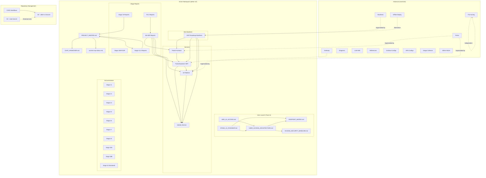

# Dependency Map

> Mermaid diagram showing component dependencies and relationships in the Aither Project.

---



## Dependency Legend

| Line Style | Meaning |
|-----------|---------|
| `-->` | Direct dependency |
| `-.->` | Superseded/Historical relationship |
| Text in box | Active component |
| "Superseded by" | Historical code replaced by aither-v2/ equivalent |

## Key Dependency Chain

```
Git (aither-v2) → PROJECT_MASTER.md → CHAT_HANDOVER.md → Stage Reports → Services → K8s Manifests
```

## Component Count

| Layer | Components | Files |
|-------|-----------|-------|
| Governance | 3 core docs | 10+ files |
| User Launch | 5 documents | 5 files |
| Services | 4 services | 21 files |
| Manifests | 15 manifests | 15 files |
| Stage Reports | 7 report sets | 70 files |
| Stage Docs | 10 stage sets | 364 files |
| Historical | 12+ components | 292 files |
| CI/CD | 3 workflows | 3 files |
