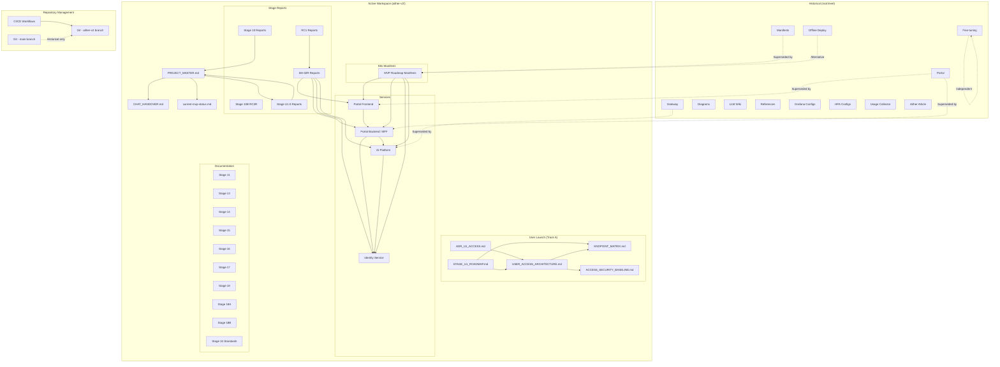

# Dependency Map

> Mermaid diagram showing component dependencies and relationships in the Aither Project.

---



## Dependency Legend

| Line Style | Meaning |
|-----------|---------|
| `-->` | Direct dependency |
| `-.->` | Superseded/Historical relationship |
| Text in box | Active component |
| "Superseded by" | Historical code replaced by aither-v2/ equivalent |

## Key Dependency Chain

```
Git (aither-v2) → PROJECT_MASTER.md → CHAT_HANDOVER.md → Stage Reports → Services → K8s Manifests
```

## Component Count

| Layer | Components | Files |
|-------|-----------|-------|
| Governance | 3 core docs | 10+ files |
| User Launch | 5 documents | 5 files |
| Services | 4 services | 21 files |
| Manifests | 15 manifests | 15 files |
| Stage Reports | 7 report sets | 70 files |
| Stage Docs | 10 stage sets | 364 files |
| Historical | 12+ components | 292 files |
| CI/CD | 3 workflows | 3 files |

## Service Dependency Table

| Source | Destination | Protocol | Port | Auth | Config File | Status |
|--------|-------------|----------|------|------|-------------|--------|
| User Browser | Ingress / Reverse Proxy | HTTPS | 443 | Browser session | Not yet created — owning stage U1.2 | TARGET |
| Ingress | Portal Frontend | HTTP | 80 | None (internal) | Ingress config (U1.2) | TARGET |
| Portal Frontend (nginx) | Portal Backend | HTTP | 8000 | Session cookie (forwarded) | `services/portal-frontend/nginx.conf` | CURRENT |
| Portal Frontend (nginx) | AI Platform | HTTP | 8000 | API Key (X-API-Key / Bearer) | `services/portal-frontend/nginx.conf` | CURRENT (dual path) |
| Portal Backend | Identity Service | HTTP | 8000 | Session token (Bearer) | `services/portal-backend/app/main.py` | CURRENT |
| Portal Backend | AI Platform | HTTP | 8000 | Session token (Bearer) | `services/portal-backend/app/main.py` | CURRENT |
| AI Platform | LLM Gateway | HTTP | 8000 | GATEWAY_API_KEY (env) | `services/ai-platform/app/main.py` | CURRENT |
| AI Platform | Identity Service | HTTP | 8000 | Bearer token | `services/ai-platform/app/main.py` | CURRENT |
| LLM Gateway (nginx) | vLLM 32B | HTTP | 8000 | Gateway auth token | `manifests/mvp-roadmap/04-gateway/nginx-gateway-32b-hardened.yaml` | CURRENT |
| AI Platform | Redis (rate-limit) | TCP | 6379 | None (internal) | `manifests/mvp-roadmap/06-rate-limiting/redis-rate-limit.yaml` | CURRENT |
| Portal Backend | Redis (rate-limit) | TCP | 6379 | None (internal) | `manifests/mvp-roadmap/06-rate-limiting/redis-rate-limit.yaml` | CURRENT |

## Storage Dependencies

| Component | Storage | Type | Path | Config File |
|-----------|---------|------|------|-------------|
| AI Platform | SQLite | File (PVC) | `/data/ai-platform.db` | `services/ai-platform/k8s/ai-platform.yaml` |
| Identity Service | SQLite | File (PVC) | `/data/identity.db` | `services/identity/k8s/identity.yaml` |
| Redis | Memory + AOF | RAM + File | `/data` | `manifests/mvp-roadmap/06-rate-limiting/redis-rate-limit.yaml` |

## Network Dependencies

| Service | ClusterIP | Pod IP | Node |
|---------|-----------|--------|------|
| aither-portal-frontend | 10.105.195.81 | 10.244.1.23 | n7 |
| aither-portal-backend | 10.100.101.65 | 10.244.0.5 | n8 |
| aither-ai-platform | 10.107.239.156 | 10.244.0.7 | n8 |
| aither-identity | 10.105.189.202 | 10.244.0.245 | n8 |
| nginx-gateway-32b | 10.106.31.143 | 10.244.0.9, 10.244.1.37 | n7, n8 |
| vllm-14b-instruct | 10.108.67.57 | 10.244.1.3 | n7 |
| vllm-32b-gptq | 10.99.3.103 | 10.244.1.4 | n7 |
| aither-redis-rate-limit | 10.105.190.101 | 10.244.1.20 | n7 |
