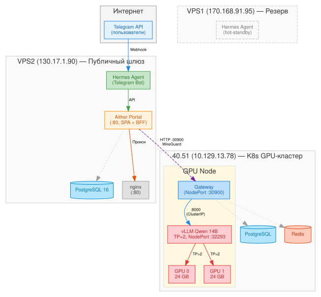
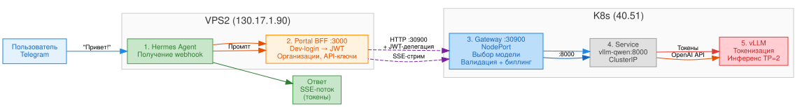
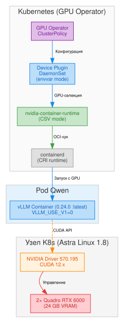
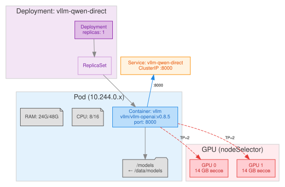
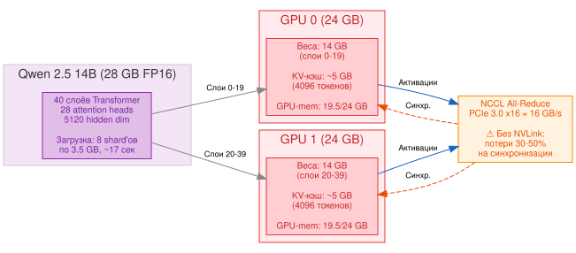

# Развёртывание LLM-платформы Aither на Kubernetes с GPU

> **Лабораторная работа №1**  
> **Тема:** Развёртывание и настройка платформы инференса языковых моделей  
> **Стенд:** YADRO VEGMAN S320, 2× Quadro RTX 6000, K8s  
> **Дата:** 05.07.2026  
> **Автор:** Сергей Кравчук, Группа разработки AI-систем, АО «Гринатом»

---

## Оглавление

1. [Введение и цели](#1-введение-и-цели)
2. [Архитектура платформы](#2-архитектура-платформы)
3. [Аппаратное обеспечение](#3-аппаратное-обеспечение)
4. [Шаг 1: Установка Kubernetes и GPU Operator](#4-шаг-1-установка-kubernetes-и-gpu-operator)
5. [Шаг 2: Настройка проброса GPU в поды](#5-шаг-2-настройка-проброса-gpu-в-поды)
6. [Шаг 3: Загрузка модели на узел](#6-шаг-3-загрузка-модели-на-узел)
7. [Шаг 4: Развёртывание vLLM](#7-шаг-4-развёртывание-vllm)
8. [Шаг 5: Tensor Parallelism — модель на двух GPU](#8-шаг-5-tensor-parallelism--модель-на-двух-gpu)
9. [Шаг 6: Gateway и Portal — точка входа](#9-шаг-6-gateway-и-portal--точка-входа)
10. [Шаг 7: Подключение к порталу и работа с моделью](#10-шаг-7-подключение-к-порталу-и-работа-с-моделью)
11. [Подсчёт токенов и оценка производительности](#11-подсчёт-токенов-и-оценка-производительности)
12. [Выявленные проблемы и решения](#12-выявленные-проблемы-и-решения)
13. [NVLink: зачем и почему](#13-nvlink-зачем-и-почему)
14. [План развития](#14-план-развития)

---

## 1. Введение и цели

### Что мы строим

Платформа **Aither** — это система инференса (вывода) больших языковых моделей (LLM), доступная через:

- **Telegram-бота** — для конечных пользователей (пилотная группа)
- **Веб-интерфейс** — для демонстрации и тестирования
- **REST API** — для программной интеграции

### Цели лабораторной работы

| № | Цель | Результат |
|---|---|---|
| 1 | Развернуть K8s-кластер с GPU-узлом | ✅ Single-node кластер на Astra Linux |
| 2 | Настроить проброс GPU в контейнеры | ✅ NVIDIA GPU Operator + Device Plugin |
| 3 | Загрузить модель Qwen 2.5 14B | ✅ 28 GB FP16, 8 shard'ов |
| 4 | Запустить vLLM с Tensor Parallelism | ✅ TP=2 на двух RTX 6000 |
| 5 | Настроить Gateway + Portal | ✅ Маршрутизация + веб-интерфейс |
| 6 | Подключить Telegram-бота | ✅ Hermes Agent |

---

## 2. Архитектура платформы

### 2.1. Общая схема



Система состоит из трёх физических узлов, соединённых через WireGuard VPN:

| Узел | IP | Роль | ОС |
|---|---|---|---|
| **VPS1** | 170.168.91.95 | Резервный Hermes (hot-standby) | Debian 12 |
| **VPS2** | 130.17.1.90 | Публичный шлюз: Hermes Agent, Portal (SPA + BFF), PostgreSQL, nginx | Debian 12 |
| **40.51** | 10.129.13.78 | K8s GPU-кластер: vLLM (NodePort 32293), Gateway (NodePort 30900) | Astra Linux 1.8 |

### 2.2. Путь запроса (end-to-end)



**По шагам:**

1. **Пользователь → Telegram** — текстовое сообщение
2. **Hermes Agent (VPS2)** — получает webhook, обрабатывает промпт
3. **Portal BFF (:3000)** — формирует делегированный запрос к Gateway
4. **Gateway (:30900, K8s NodePort)** — выбирает модель, формирует OpenAI-совместимый запрос
5. **VPN (WireGuard)** — запрос идёт напрямую к K8s-узлу 40.51
6. **K8s Service (vllm-qwen-nodeport:32293)** — направляет запрос в под с vLLM
7. **vLLM** — токенизирует промпт, выполняет инференс на GPU, возвращает токены
8. **Ответ** — SSE-потоком возвращается через Gateway → Portal BFF → пользователю

### 2.3. Программный стек

| Компонент | Технология | Версия |
|---|---|---|
| Оркестрация | Kubernetes | 1.32+ |
| Рантайм | containerd | 2.x |
| GPU-драйвер | NVIDIA | 570.195.03 |
| GPU в K8s | NVIDIA GPU Operator | 25.x |
| Инференс | vLLM | 0.24.0 (:latest) |
| API-шлюз | FastAPI (Python) | 0.115+ |
| База данных | PostgreSQL | 15+ |
| Кэш | Redis | 7+ |

---

## 3. Аппаратное обеспечение

### 3.1. GPU-узел (40.51)

| Параметр | Значение |
|---|---|
| **Сервер** | YADRO VEGMAN S320 |
| **CPU** | 2× Intel Xeon 6258R (28C/56T ×2 = 112 потоков) |
| **RAM** | 754 GB DDR4 |
| **GPU** | 2× NVIDIA Quadro RTX 6000 |
| **VRAM** | 24 GB GDDR6 на GPU (суммарно 48 GB) |
| **Архитектура GPU** | Turing (SM 7.5) |
| **NVLink** | ❌ Отсутствует |
| **Диск** | 42 TB SAS SSD |

### 3.2. Ограничения текущей конфигурации

| Ограничение | Влияние | Как обходим |
|---|---|---|
| Turing SM 7.5 | Flash Attention 2 не работает (требует ≥ SM 8.0) | `--enforce-eager` (PagedAttention без FA2) |
| 24 GB VRAM | FP16-модель >12B не влезает на 1 GPU | TP=2 — распределение на обе GPU |
| Нет NVLink | Обмен между GPU идёт через PCIe (медленно) | План: закупка NVLink-мостов |
| 1 GPU-узел | Нет отказоустойчивости | План: ремонт 2-го + 3-й узлы |

---

## 4. Шаг 1: Установка Kubernetes и GPU Operator

### 4.1. Исходное состояние

Узел 40.51 поставляется с Astra Linux 1.8 (ядро 6.6.28). Kubernetes и NVIDIA-драйвер не установлены.

### 4.2. Установка Kubernetes

```bash
# Установка kubeadm, kubelet, kubectl
apt-get update && apt-get install -y kubeadm kubelet kubectl
apt-mark hold kubeadm kubelet kubectl

# Инициализация кластера (single-node)
kubeadm init --pod-network-cidr=10.244.0.0/16

# Настройка kubectl
mkdir -p $HOME/.kube
cp /etc/kubernetes/admin.conf $HOME/.kube/config

# Установка CNI (Flannel)
kubectl apply -f https://github.com/flannel-io/flannel/releases/download/v0.25.7/kube-flannel.yml

# Снятие taint с control-plane (чтобы поды могли запускаться)
kubectl taint nodes --all node-role.kubernetes.io/control-plane-
```

### 4.3. Установка NVIDIA GPU Operator

```bash
# Добавление Helm-репозитория
helm repo add nvidia https://helm.ngc.nvidia.com/nvidia
helm repo update

# Установка GPU Operator
helm install gpu-operator nvidia/gpu-operator \
  --namespace gpu-operator --create-namespace \
  --set driver.enabled=true \
  --set toolkit.enabled=true \
  --set devicePlugin.enabled=true

# Проверка
kubectl get pods -n gpu-operator
```

**Результат:**
```
nvidia-device-plugin-daemonset-xxxxx   1/1   Running
nvidia-driver-daemonset-xxxxx          1/1   Running
nvidia-container-toolkit-daemonset-xxx 1/1   Running
gpu-operator-xxxxx                     1/1   Running
```

**Проверка GPU:**
```bash
kubectl describe node bootsman-k8s-clnt01-n8-gpu | grep nvidia
# nvidia.com/gpu: 2
```

---

## 5. Шаг 2: Настройка проброса GPU в поды

### 5.1. Архитектура GPU-стека в K8s



**Как это работает:**

1. **NVIDIA Driver** (570.195.03) — устанавливается демоном GPU Operator, управляет GPU на уровне ОС
2. **GPU Operator** — управляет жизненным циклом всех GPU-компонентов через ClusterPolicy
3. **Device Plugin** (DaemonSet) — регистрирует GPU как ресурс K8s (`nvidia.com/gpu: 2`)
4. **nvidia-container-runtime** — OCI-хук, который при запуске контейнера монтирует GPU-устройства и библиотеки
5. **containerd** — вызывает nvidia-container-runtime при наличии `runtimeClassName: nvidia`

### 5.2. Ключевые настройки Device Plugin

Конфигурация Device Plugin в DaemonSet:

```yaml
env:
  - name: DEVICE_LIST_STRATEGY
    value: "envvar"          # Передача GPU через переменные окружения
  - name: NVIDIA_VISIBLE_DEVICES
    value: "all"              # Все GPU видны всем контейнерам
  - name: NVIDIA_DRIVER_CAPABILITIES
    value: "all"              # Все возможности (compute, utility, video)
  - name: CDI_ENABLED
    value: "false"            # CDI отключён (баг с разрешением устройств)
```

### 5.3. Настройка nvidia-container-runtime

Файл `/etc/nvidia-container-runtime/config.toml`:

```toml
[nvidia-container-runtime]
mode = "csv"   # Использовать legacy-режим (не CDI!)
```

**Почему `mode = "csv"`?**  
В режиме `auto` containerd пытается использовать CDI (Container Device Interface) для инжекции GPU. В нашей конфигурации это приводит к ошибке: `unresolvable CDI devices`. Режим `csv` использует проверенный mount-based подход.

### 5.4. Проверка доступа к GPU из контейнера

```bash
# Тестовый под
kubectl run gpu-test --rm -it --restart=Never \
  --image=nvidia/cuda:12.0-base \
  --overrides='{"spec":{"runtimeClassName":"nvidia"}}' \
  -- nvidia-smi
```

**Ожидаемый вывод:**
```
+-----------------------------------------+
| NVIDIA-SMI 570.195     Driver: 570.195  |
| GPU  Name                 Bus-Id         |
|   0  Quadro RTX 6000      00000000:3B:00 |
|   1  Quadro RTX 6000      00000000:5E:00 |
+-----------------------------------------+
```

---

## 6. Шаг 3: Загрузка модели на узел

### 6.1. Выбор модели

Для пилотного запуска выбрана модель **Qwen 2.5 14B Instruct**:

| Параметр | Значение |
|---|---|
| Разработчик | Alibaba (Qwen Team) |
| Параметры | 14 миллиардов |
| Формат | FP16 (float16) |
| Размер на диске | 28 GB (8 shard'ов safetensors) |
| Контекстное окно | 4096 токенов |
| Лицензия | Apache 2.0 |

### 6.2. Загрузка с Hugging Face

```bash
# На машине с интернетом (VPS2)
pip install huggingface_hub
huggingface-cli download Qwen/Qwen2.5-14B-Instruct \
  --local-dir /data/models/Qwen2.5-14B-Instruct
```

### 6.3. Передача на изолированный узел (40.51)

40.51 не имеет прямого доступа в интернет. Передача через VPS2 по VPN:

```bash
# Сжатие модели для ускорения передачи
cd /data/models
tar czf qwen14b.tar.gz Qwen2.5-14B-Instruct/

# SCP через VPN (~200-400 KB/s, ~3-4 часа на 28 GB)
scp qwen14b.tar.gz root@10.129.13.78:/data/models/

# Распаковка на 40.51
ssh root@10.129.13.78
cd /data/models
tar xzf qwen14b.tar.gz
```

**Важно:** при медленном соединении SCP может прерываться. Рекомендуется:
- Использовать `rsync --partial` для докачки
- Проверять размер каждого shard'а после копирования
- При сбое — копировать только повреждённый файл

### 6.4. Проверка целостности

```bash
ls -lh /data/models/Qwen2.5-14B-Instruct/
# model-00001-of-00008.safetensors  3.5G
# model-00002-of-00008.safetensors  3.5G
# ... (8 файлов)
# config.json                         727
# tokenizer.json                     11M

# Проверка конфига
python3 -c "import json; c=json.load(open('/data/models/Qwen2.5-14B-Instruct/config.json')); print(c['architectures'])"
# ['Qwen2ForCausalLM']
```

---

## 7. Шаг 4: Развёртывание vLLM

### 7.1. Что такое vLLM

**vLLM** (Very Large Language Model) — высокопроизводительный сервер инференса с открытым исходным кодом. Ключевые особенности:

- **PagedAttention** — управление KV-кэшем как виртуальной памятью (до 24× эффективнее)
- **Continuous batching** — динамическая пакетная обработка запросов
- **Tensor Parallelism** — распределение модели на несколько GPU
- **OpenAI-совместимый API** — `/v1/chat/completions`, `/v1/completions`

### 7.2. Конфигурация деплоймента



**Полный манифест (`qwen-direct.yaml`):**

```yaml
apiVersion: apps/v1
kind: Deployment
metadata:
  name: vllm-qwen-direct
spec:
  replicas: 1
  selector:
    matchLabels:
      app: vllm-qwen-direct
  template:
    metadata:
      labels:
        app: vllm-qwen-direct
    spec:
      runtimeClassName: nvidia       # Включает GPU-рантайм
      containers:
      - name: vllm
        image: vllm/vllm-openai:latest
        command: ["python3", "-m", "vllm.entrypoints.openai.api_server"]
        args:
        - "--model"
        - "/models/Qwen2.5-14B-Instruct"
        - "--dtype"
        - "half"                      # FP16
        - "--max-model-len"
        - "4096"                      # Контекстное окно
        - "--gpu-memory-utilization"
        - "0.90"                      # 90% VRAM под KV-кэш
        - "--tensor-parallel-size"
        - "2"                         # Две GPU
        - "--enforce-eager"           # Без Flash Attention 2
        env:
        - name: HUGGING_FACE_HUB_TOKEN
          value: "hf_dummy"
        - name: HF_HUB_OFFLINE
          value: "1"                  # Офлайн-режим
        - name: VLLM_PORT
          value: "8000"               # Перебить автоинжект K8s
        - name: VLLM_USE_V1
          value: "0"                  # Отключить V1 engine (баг pynvml)
        - name: NVIDIA_VISIBLE_DEVICES
          value: "all"
        - name: NVIDIA_DRIVER_CAPABILITIES
          value: "compute,utility"
        ports:
        - containerPort: 8000
        resources:
          limits:
            cpu: "16"
            memory: "48Gi"
          requests:
            cpu: "8"
            memory: "24Gi"
        volumeMounts:
        - name: models
          mountPath: /models
      volumes:
      - name: models
        hostPath:
          path: /data/models
      nodeSelector:
        kubernetes.io/hostname: bootsman-k8s-clnt01-n8-gpu
```

### 7.3. Применение и проверка

```bash
kubectl apply -f qwen-direct.yaml

# Ждём загрузки модели (~20-30 секунд)
kubectl logs -l app=vllm-qwen-direct --tail=10 -f

# Ожидаемый вывод:
# Loading safetensors checkpoint shards: 100% Completed | 8/8 [00:17<00:00]
# Model loading took 13.9282 GiB and 17.27 seconds
# INFO: Uvicorn running on http://0.0.0.0:8000
```

**Проверка GPU:**
```bash
nvidia-smi
# GPU 0: 14543 MiB / 23040 MiB  (63%)
# GPU 1: 14543 MiB / 23040 MiB  (63%)
```

### 7.4. Пояснение ключевых параметров

| Параметр | Зачем | Что будет без него |
|---|---|---|
| `--enforce-eager` | Отключает Flash Attention 2 | Ошибка: `FA2 is only supported on devices with compute capability >= 8` |
| `--tensor-parallel-size 2` | Распределяет модель на 2 GPU | OOM: модель 28 GB не влезает в 24 GB одной GPU |
| `--gpu-memory-utilization 0.90` | Резервирует 90% VRAM | По умолчанию 0.90 — оптимально для максимизации KV-кэша |
| `--max-model-len 4096` | Ограничивает контекстное окно | По умолчанию 32768 — нужен больший KV-кэш, не влезет |
| `VLLM_PORT=8000` | Явно задаёт порт | K8s автоинжектит `VLLM_QWEN_PORT_8000_TCP=tcp://...` и vLLM падает |
| `VLLM_USE_V1=0` | Отключает V1 engine | V1 engine падает с `pynvml.nvmlDeviceGetHandleByIndex` на Turing GPU |

---

## 8. Шаг 5: Tensor Parallelism — модель на двух GPU

### 8.1. Как работает TP=2



**Принцип работы:**

1. **Модель разрезается пополам:**
   - GPU 0 получает слои 0–19 (14 GB весов)
   - GPU 1 получает слои 20–39 (14 GB весов)

2. **Прямой проход (forward pass):**
   - Входные токены → GPU 0 (слои 0–19)
   - Промежуточные активации передаются на GPU 1
   - GPU 1 (слои 20–39) → выходные логиты

3. **All-Reduce синхронизация:**
   - После каждого слоя GPU обмениваются активациями через NCCL
   - Без NVLink — через PCIe 3.0 x16 (~16 GB/s)
   - С NVLink было бы ~50 GB/s на мост

### 8.2. Распределение памяти GPU

```
GPU 0 (24 GB):
├── Веса модели (слои 0-19):    14.0 GB  (58%)
├── KV-кэш (4096 токенов):      ~5.0 GB  (21%)
├── CUDA-контекст:              ~0.5 GB  ( 2%)
└── Свободно:                   ~4.5 GB  (19%)

GPU 1 (24 GB):
├── Веса модели (слои 20-39):   14.0 GB  (58%)
├── KV-кэш (4096 токенов):      ~5.0 GB  (21%)
├── CUDA-контекст:              ~0.5 GB  ( 2%)
└── Свободно:                   ~4.5 GB  (19%)
```

### 8.3. Тест производительности

```bash
# Тестовый запрос
curl -X POST http://10.244.0.x:8000/v1/chat/completions \
  -H "Content-Type: application/json" \
  -d '{
    "model": "qwen",
    "messages": [{"role": "user", "content": "Расскажи о гравитации"}],
    "max_tokens": 100
  }'
```

**Ожидаемые метрики:**

| Метрика | Значение |
|---|---|
| Время до первого токена (TTFT) | ~1–2 сек |
| Скорость генерации | ~15–25 токенов/сек |
| Пропускная способность | ~2–3 запроса/сек (одиночные) |

---

## 9. Шаг 6: Gateway и Portal — точка входа

### 9.1. Gateway (FastAPI)

Gateway развёрнут как **K8s Deployment** на узле 40.51 и доступен через **NodePort 30900**. Он выполняет:

1. **Приём запросов** от Portal BFF (веб) и напрямую через API
2. **Маршрутизация** — выбор модели (пока одна: Qwen, готовится Saiga)
3. **Проксирование** — передача запроса в vLLM-под через ClusterIP-сервис
4. **Потоковый ответ** — токены возвращаются пользователю по мере генерации (SSE)

**Развёртывание NodePort:**

```bash
# Создание NodePort для Gateway (если отсутствует)
kubectl expose deployment gateway --type=NodePort \
  --port=8080 --target-port=8080 \
  --name=gateway-nodeport \
  --overrides='{"spec":{"ports":[{"port":8080,"targetPort":8080,"nodePort":30900}]}}'

# Проверка
kubectl get svc gateway-nodeport
curl http://10.129.13.78:30900/health
# → {"status": "ok", "billing": "enabled"}
```

**Проверка состояния Gateway:**

```bash
# Статус пода
kubectl get pods -l app=gateway

# Логи
kubectl logs deploy/gateway --tail=20

# Перезапуск при проблемах
kubectl rollout restart deploy/gateway
```

### 9.2. Portal (веб-интерфейс)

Доступен по адресу: **http://130.17.1.90**

**Архитектура портала:**

```
Браузер → :80 (nginx/статик + прокси API)
          ├── /api/* → BFF (:3000, Fastify)
          │   ├── /auth/dev/login    — вход (dev-режим)
          │   ├── /api/v1/me         — профиль пользователя
          │   ├── /api/v1/orgs       — организации
          │   ├── /api/v1/chats      — чаты (создание, история)
          │   └── /api/v1/chats/:id/messages → Gateway (:30900, SSE-стрим)
          └── /      → SPA (try_files index.html)
```

**Стек портала:**

| Компонент | Технология | Порт |
|---|---|---|
| Статика (SPA) | HTML/CSS/JS (ванильный) | :80 (nginx) |
| BFF (Backend-for-Frontend) | Fastify (Node.js + TypeScript) | :3000 |
| База данных | PostgreSQL 16 | :5432 |
| Прокси | nginx | :80 |

**Возможности портала:**

- **Dev-логин** — `POST /auth/dev/login` с именем, возвращает JWT-токен
- **Организации** — создание/управление orgs, API-ключи (формат `ak-...`)
- **Чат-интерфейс** — создание чатов, история сообщений, потоковый ответ (SSE)
- **Выбор модели** — `qwen2.5-14b` (основная), `saiga_llama3_8b` (план)
- **Шеринг чатов** — генерация share-токенов для публичного доступа

**Быстрый старт через API:**

```bash
# 1. Dev-логин
TOKEN=$(curl -s -X POST http://130.17.1.90/auth/dev/login \
  -H 'Content-Type: application/json' \
  -d '{"name":"test"}' | jq -r '.access_token')

# 2. Создать организацию
ORG=$(curl -s -X POST http://130.17.1.90/api/v1/orgs \
  -H "Authorization: Bearer $TOKEN" \
  -H 'Content-Type: application/json' \
  -d '{"name":"my-org"}' | jq -r '.org.org_id')

# 3. Создать чат
CHAT=$(curl -s -X POST http://130.17.1.90/api/v1/chats \
  -H "Authorization: Bearer $TOKEN" \
  -H 'Content-Type: application/json' \
  -d '{"title":"Тест","model":"qwen2.5-14b"}' | jq -r '.chat.chat_id')

# 4. Отправить сообщение (SSE-стрим)
curl -N -X POST "http://130.17.1.90/api/v1/chats/$CHAT/messages" \
  -H "Authorization: Bearer $TOKEN" \
  -H 'Content-Type: application/json' \
  -d "{\"content\":\"Привет!\",\"org_id\":\"$ORG\"}"
```

---

## 10. Шаг 7: Подключение к порталу и работа с моделью

### 10.1. Доступ к порталу

```
URL:       http://130.17.1.90
Логин:     dev-режим (введите любое имя)
```

### 10.2. Работа через веб-интерфейс

1. Откройте `http://130.17.1.90` в браузере
2. Введите имя пользователя (dev-логин)
3. Создайте организацию (кнопка «Новая организация»)
4. Перейдите в раздел «Чаты» → «Новый чат»
5. Выберите модель (Qwen 2.5 14B)
6. Введите запрос и нажмите **Enter**
7. Ответ генерируется потоково — токены появляются по мере вывода

### 10.3. Работа через Telegram-бота

1. Найдите бота **@HermesAgent** в Telegram (пилотная группа)
2. Отправьте сообщение — Hermes Agent обработает его
3. Ответ придёт в течение нескольких секунд

### 10.4. Работа через API (для разработчиков)

```bash
# Endpoint (через Gateway NodePort на 40.51)
curl -X POST http://10.129.13.78:30900/v1/chat/completions \
  -H "Content-Type: application/json" \
  -d '{
    "model": "qwen",
    "messages": [
      {"role": "system", "content": "Ты — полезный ассистент."},
      {"role": "user", "content": "Объясни квантовую запутанность простыми словами."}
    ],
    "temperature": 0.7,
    "max_tokens": 500
  }'
```

**Формат ответа (OpenAI-совместимый):**
```json
{
  "id": "chatcmpl-xxx",
  "object": "chat.completion",
  "created": 1711234567,
  "model": "qwen",
  "choices": [{
    "index": 0,
    "message": {
      "role": "assistant",
      "content": "Квантовая запутанность — это..."
    },
    "finish_reason": "stop"
  }],
  "usage": {
    "prompt_tokens": 45,
    "completion_tokens": 128,
    "total_tokens": 173
  }
}
```

---

## 11. Подсчёт токенов и оценка производительности

### 11.1. Что такое токен

Токен — минимальная единица текста для языковой модели. В русском языке:

- 1 слово ≈ 2–3 токена (зависит от токенизатора)
- 1 символ ≈ 0.3–0.5 токена
- 1000 токенов ≈ 750 слов ≈ 1.5 страницы текста

**Токенизатор Qwen 2.5** использует BPE (Byte-Pair Encoding) с размером словаря 152 064 токена.

### 11.2. Как считаются токены в API

Ответ API всегда содержит поле `usage`:

```json
"usage": {
  "prompt_tokens": 45,       // Токены вашего запроса (включая system prompt)
  "completion_tokens": 128,  // Токены ответа модели
  "total_tokens": 173        // Сумма
}
```

### 11.3. Оценка стоимости (справочно)

При использовании облачных GPU (A100, 80 GB, ~$1.50/час):

| Модель | Токенов/сек | Токенов/$ |
|---|---|---|
| Qwen 14B (FP16, TP=2) | ~20 | ~48 000 |
| Для сравнения: GPT-4o (API) | ~60 | ~25 000 |

**На собственном оборудовании** — стоимость только электроэнергии (~300 Вт × 2 GPU = 600 Вт, ~15 кВт·ч/сутки).

### 11.4. Мониторинг GPU

```bash
# Постоянный мониторинг (обновление каждые 2 сек)
watch -n 2 nvidia-smi

# Метрики:
#  Temp  — температура GPU (норма: 40-80°C)
#  Pwr   — энергопотребление (норма: 50-150W в простое, 200-260W под нагрузкой)
#  Mem   — использование видеопамяти
#  Util  — загрузка GPU-ядер (0-100%)
```

---

## 12. Выявленные проблемы и решения

### 12.1. Сводная таблица проблем

| # | Проблема | Симптом | Причина | Решение |
|---|---|---|---|---|
| 1 | **Flash Attention 2** | `FA2 requires SM >= 8` | Turing = SM 7.5 | `--enforce-eager` |
| 2 | **Qwen OOM на 1 GPU** | `OutOfMemoryError` | 28 GB > 24 GB | `--tensor-parallel-size 2` |
| 3 | **VLLM_PORT автоинжект** | `VLLM_PORT appears to be a URI` | K8s Service создаёт `VLLM_QWEN_PORT_8000_TCP=tcp://...` | `VLLM_PORT=8000` |
| 4 | **CDI device resolution** | `unresolvable CDI devices` | containerd в режиме `auto` не может разрешить CDI-спеки | `mode=csv` в nvidia-container-runtime |
| 5 | **vLLM v0.8.5 pynvml-баг** | `pynvml.nvmlDeviceGetHandleByIndex` → под в CrashLoopBackOff | v0.8.5 образ несовместим с ядром 6.6 + драйвером 570 | Переход на `:latest` (0.24.0) + `VLLM_USE_V1=0` |
| 6 | **Повреждение shard'ов** | `SafetensorError: incomplete metadata` | SCP через VPN (200 KB/s) прерывается | `rsync --partial` + проверка размера |
| 7 | **Зомби-процессы vLLM** | `Port 8000 is already in use` | После падения пода процесс остаётся на хосте | `fuser -k 8000/tcp` перед перезапуском |
| 8 | **Отсутствие NVLink** | Потери 30-50% на all-reduce | GPU общаются через PCIe | Закупка NVLink-мостов |
| 9 | **Gateway NodePort отсутствует** | Портал не может достучаться до Gateway (`core_unreachable`) | Gateway — ClusterIP (только внутри кластера), NodePort не создан | `kubectl expose deployment gateway --type=NodePort --nodePort=30900` |

### 12.2. Детальный разбор: Flash Attention 2

**Почему не работает:**
Flash Attention 2 использует fused CUDA-ядра, оптимизированные под архитектуру Ampere (SM 8.0+) и новее. Quadro RTX 6000 — Turing (SM 7.5), эти ядра отсутствуют в микроархитектуре.

**Влияние на производительность:**
`--enforce-eager` отключает FA2 и использует стандартный attention (через xFormers). Потери: ~15-20% скорости инференса.

**Обходной путь:** смена GPU на RTX 3090/4090/A-series.

### 12.3. Детальный разбор: CDI device resolution

**Цепочка событий:**

1. GPU Operator создаёт CDI-спеки в `/var/run/cdi/`
2. Device Plugin регистрирует GPU и выставляет `CDI_ENABLED=false`
3. Но `nvidia-container-runtime` в режиме `auto` всё равно пытается использовать CDI
4. При запуске контейнера: `failed to inject CDI devices: unresolvable`
5. Под падает в `UnexpectedAdmissionError` или `CrashLoopBackOff`

**Решение:** принудительный `mode = "csv"` в `/etc/nvidia-container-runtime/config.toml`. В этом режиме GPU передаются через mount points и переменные окружения (проверенный метод), а не через CDI (новый, с багами).

---

## 13. NVLink: зачем и почему

### 13.1. Текущая проблема

При Tensor Parallelism (TP=2) две GPU обмениваются активациями после каждого слоя трансформера через операцию **all-reduce**. В текущей конфигурации обмен идёт через **PCIe 3.0 x16**:

```
GPU 0 ←──PCIe──→ CPU ←──PCIe──→ GPU 1
              ↑
         Пропускная способность: ~16 GB/s
         Задержка: высокая (DMA + копирование)
```

### 13.2. Что даёт NVLink

NVLink — прямой мост между GPU, минуя CPU и PCIe:

```
GPU 0 ←──NVLink 50 GB/s──→ GPU 1
              ↑
    Прямой доступ к памяти соседней GPU
    Задержка: минимальная
```

| Параметр | PCIe 3.0 x16 | NVLink Bridge (Quadro RTX) |
|---|---|---|
| **Пропускная способность** | ~16 GB/s | ~50 GB/s |
| **Задержка** | Высокая | Низкая (прямой доступ) |
| **All-reduce overhead (TP=2)** | 30–50% | 5–10% |
| **Ускорение инференса** | — | 1.5–2× |
| **Цена** | Бесплатно (уже есть) | ~$80–120 за мост |

### 13.3. Сценарии с NVLink

| Сценарий | Без NVLink | С NVLink |
|---|---|---|
| TP=2 на Qwen 14B | ~20 токенов/сек | ~30–40 токенов/сек |
| TP=4 на 4× RTX 6000 | ~15 токенов/сек | ~35–50 токенов/сек |
| Модели 32B–70B | Непрактично | Возможно с TP=4 |

### 13.4. План закупки

| Позиция | Кол-во | Цена | Назначение |
|---|---|---|---|
| NVIDIA NVLink Bridge (2-slot) | 2 шт. | ~$80–120 | Соединение 2× RTX 6000 |
| NVIDIA NVLink Bridge (3-slot) | 2 шт. | ~$100–150 | Для 3-го и 4-го GPU |

---

## 14. План развития

### 14.1. Ближайшие задачи (1–2 недели)

| Задача | Срок | Статус |
|---|---|---|
| 🔌 Прямой интернет на 40.51 | 3–5 дней | Заявка подана |
| 🖥️ Ремонт 2-го GPU-хоста (40.50) | 5–7 дней | Заявка подана |
| 🖥️ Получение 3-го GPU-хоста | 7–10 дней | Заявка подана |
| 🔗 Закупка NVLink-мостов | 7 дней | Согласование |

### 14.2. Среднесрочные задачи (2–4 недели)

| Задача | Описание |
|---|---|
| **Мониторинг** | ✅ Выполнено: Hermes Cron — проверка Portal, BFF, Gateway, vLLM, GPU каждые 5 мин с авто-восстановлением (NodePort, рестарт подов). Prometheus + Grafana: метрики GPU, задержки, throughput (план) |
| **Мультимодельность** | Saiga 8B + Qwen Coder 14B + Qwen 32B GPTQ |
| **Квантизация** | INT4 (AWQ/GPTQ) для эффективного использования VRAM |
| **RAG** | Векторная БД Qdrant + retrieval-augmented generation |

### 14.3. Стратегические задачи

| Задача | Описание |
|---|---|
| **Кластер 3+ узлов** | Распределённый инференс, отказоустойчивость |
| **NVSwitch** | Полносвязная топология 8 GPU для моделей 70B+ |
| **Автомасштабирование** | K8s HPA по загрузке GPU и очереди запросов |

---

## Заключение

В ходе лабораторной работы успешно развёрнута платформа инференса Aither:

✅ **Kubernetes с GPU** — настроен GPU Operator, Device Plugin, container runtime  
✅ **Модель Qwen 14B** — загружена, работает с TP=2 на двух RTX 6000  
✅ **Gateway (K8s NodePort)** — маршрутизация запросов через NodePort 30900  
✅ **Portal (SPA + BFF)** — веб-интерфейс с чатом, организациями, API-ключами, SSE-стримингом  
✅ **Telegram-бот** — интеграция с Hermes Agent  
✅ **Мониторинг** — автоматическая проверка всех компонентов каждые 5 минут с авто-восстановлением  

Выявлен и задокументирован ряд проблем (Flash Attention 2, CDI, pynvml, OOM, Gateway NodePort), характерных для эксплуатации GPU Turing в изолированных средах. Определён план развития: NVLink-мосты, мультимодельность, расширение кластера.

---

*Лабораторная работа выполнена 05.07.2026. Последнее обновление: 06.07.2026. Платформа доступна для тестирования.*
