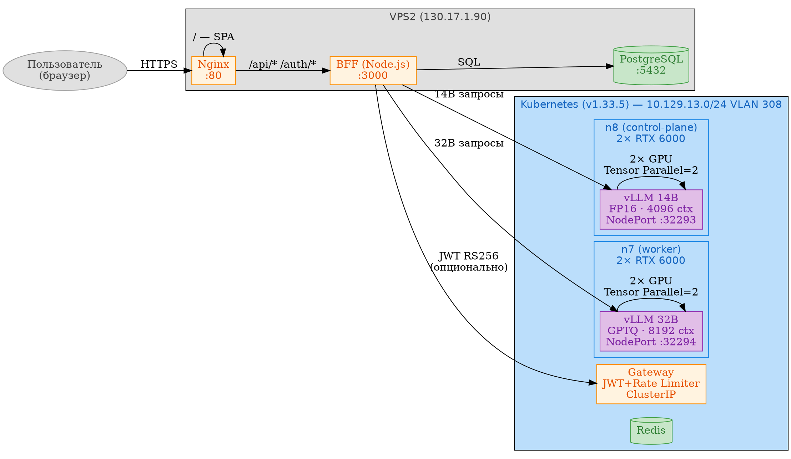

# Платформа Aither: биллинг, каталог моделей и мультиузловая архитектура

> **Лабораторная работа №2**  
> **Тема:** Билдинг-система, каталог моделей, двухузловой инференс  
> **Стенд:** YADRO VEGMAN S320 × 2, 4× Quadro RTX 6000, K8s 1.33.5  
> **Дата:** 08.07.2026  
> **Автор:** Сергей Кравчук, Группа разработки AI-систем, АО «Гринатом»

---

## Оглавление

1. [Введение и цели](#1-введение-и-цели)
2. [Архитектура после второго этапа](#2-архитектура-после-второго-этапа)
3. [День 8: Биллинг — пополнение баланса через ЮKassa](#3-день-8-биллинг--пополнение-баланса-через-юkassa)
4. [День 9: Каталог моделей и балансировка](#4-день-9-каталог-моделей-и-балансировка)
5. [День 10: Второй узел, модель 32B и фиксы портала](#5-день-10-второй-узел-модель-32b-и-фиксы-портала)
6. [Сравнительный анализ моделей](#6-сравнительный-анализ-моделей)
7. [Выявленные проблемы и решения](#7-выявленные-проблемы-и-решения)
8. [План развития](#8-план-развития)
9. [Заключение](#9-заключение)

---

## 1. Введение и цели

После развёртывания базовой платформы (ЛР №1) платформа представляла собой одноузловой Kubernetes с одной моделью Qwen 2.5 14B, Gateway и порталом с OAuth-входом. Пользователь мог залогиниться и пообщаться с моделью — но не более.

**Цели второго этапа:**

| Цель | Статус |
|---|---|
| Биллинг — пополнение баланса и списание токенов | ✅ |
| Модельный каталог — несколько моделей с разными ценами | ✅ |
| Второй GPU-узел — запуск 32B модели на n7 | ✅ |
| Исправление ошибок портала (502, 404, 500) | ✅ |
| Документирование архитектуры и доступа | ✅ |

**Ключевые цифры:**

| Параметр | Было | Стало |
|---|---|---|
| GPU-узлов | 1 (n8) | 2 (n8 + n7) |
| Моделей | 1 (14B) | 2 (14B + 32B) |
| Общий VRAM | 48 ГБ | 96 ГБ |
| Максимальный контекст | 4K токенов | 8K токенов |
| OAuth-провайдеров | 1 (dev) | 3 (GitHub, Google, Яндекс) |
| Платёжных систем | 0 | 1 (ЮKassa dev-режим) |

---

## 2. Архитектура после второго этапа



### Путь запроса

```
Пользователь → Nginx (:80) → BFF (:3000)
    ├── /api/v1/chat/completions → model=14B → vLLM n8 :32293
    │                              → model=32B → vLLM n7 :32294
    ├── /api/v1/billing → PostgreSQL (локально)
    └── / → SPA index.html (статический)
```

### Стек

| Уровень | Технология |
|---|---|
| Фронтенд | Vanilla JS SPA, Markdown-подсветка |
| BFF | Node.js + Fastify + TypeScript |
| Gateway | Python + FastAPI + Redis Rate Limiter |
| Инференс | vLLM 0.24.0, 2×2 GPU |
| Хранение | PostgreSQL 16, Redis 7 |
| Оркестрация | Kubernetes 1.33.5, containerd |
| OAuth | GitHub + Google + Яндекс |
| Платежи | ЮKassa (dev-режим) |

---

## 3. День 8: Биллинг — пополнение баланса через ЮKassa

### Концепция

Double-entry bookkeeping: каждая операция — это две записи (debit + credit). Модель резервирует токены до инференса и списывает точное количество после.

```
Пользователь → Portal (Пополнить) → ЮKassa Widget → Оплата
    → Webhook → Portal BFF → INSERT payment_transactions
    → UPDATE billing_accounts.balance
    → Chat: reserve(N токенов) → inference → settle(факт)
```

### Реализация

**BFF (portal/server.ts):**

| Эндпоинт | Метод | Описание |
|---|---|---|
| `/api/v1/billing/initialize` | POST | Создаёт платёж (dev: авто-зачисление) |
| `/api/v1/billing/topup` | POST | Ручное пополнение через виджет |
| `/api/v1/billing/webhook` | POST | Callback от ЮKassa |
| `/api/v1/billing/payments` | GET | Список платежей организации |
| `/api/v1/billing?org_id=` | GET | Текущий баланс |

**Таблицы БД:**

```sql
billing_accounts (org_id, balance, reserved, created_at, updated_at)
payment_transactions (txn_id, org_id, amount_rub, tokens, status, created_at)
```

**Dev-режим:** без реальной интеграции с ЮKassa — платёж автоматически зачисляется.
**Боевой режим:** `YOOKASSA_SHOP_ID` + `YOOKASSA_SECRET` в `.env`.

### Тест

```
POST /api/v1/billing/topup {org_id, amount: 500}
→ txn_id=01c5fa1b, статус=succeeded, баланс=500 000 токенов
```

---

## 4. День 9: Каталог моделей и балансировка

### Проблема

В дни 1–8 маршрутизация была жёсткой:

```python
if "saiga" in model: → VLLM_SAIGA_URL
else:                → VLLM_URL  # всегда 14B
```

Невозможно добавить новую модель без правки кода.

### Решение: YAML-каталог

**gateway/catalog.yaml:**

```yaml
models:
  - name: qwen2.5-14b
    display_name: "Qwen 2.5 14B"
    backend: "http://vllm:8000"
    model_path: "/models/Qwen2.5-14B-Instruct"
    max_tokens: 4096
    tokens_per_ruble: 100
    tags: [chat, code, fast]

  - name: qwen2.5-32b
    display_name: "Qwen 2.5 32B"
    backend: "http://vllm-32b:8000"
    model_path: "/models/Qwen2.5-32B-Instruct-GPTQ"
    max_tokens: 8192
    tokens_per_ruble: 30
    tags: [code, analysis, large-context]
```

**Python-загрузчик gateway/catalog.py:**

```python
def resolve(model_name: str) -> tuple[str, str, str | None]:
    """Возвращает (backend_url, model_path, error)"""
    for m in catalog["models"]:
        if m["name"] == model_name and m["status"] == "active":
            return m["backend"], m["model_path"], None
    return "", "", f"Model {model_name} not found"

def list_models() -> list[dict]:
    """Возвращает список активных моделей для UI"""
    return [m for m in catalog["models"] if m["status"] == "active"]
```

### Frontend: динамический список моделей

Вместо жёстко зашитого `<select>`:

```javascript
const { data } = await api('/api/v1/models');
data.forEach(m => addModelOption(m.id, m.display_name));
```

**Результат:** выпадающий список строится динамически из API. Добавление новой модели — только в `catalog.yaml` + K8s ConfigMap, фронтенд обновляется автоматически.

---

## 5. День 10: Второй узел, модель 32B и фиксы портала

### Восстановление 32B модели

**Исходная ситуация:** под `vllm-qwen32b` был Running, но только через ClusterIP — доступа извне не было. NodePort `:32293` вёл только на 14B.

**Решение:**
1. `kubectl patch svc vllm-qwen32b` → NodePort 32294
2. BFF-роутинг: `model=14B → :32293`, `model=32B → :32294`

```typescript
const CORE_API = "http://10.129.13.78:32293";      // 14B
const CORE_API_32B = "http://10.129.13.77:32294";  // 32B

const vllmEndpoint = model === "qwen2.5-32b"
    ? CORE_API_32B : CORE_API;
```

### Фиксы портала

| Ошибка | Причина | Решение |
|---|---|---|
| `GET /api/v1/core/status` → 502 | vLLM health возвращает пустое тело | BFF: пустое тело = OK |
| `GET /api/v1/billing` → 500 | Делегирование в Gateway без ключа | Переключено на локальную БД |
| `GET /api/v1/chats/<id>` → 404 | Старый ID в localStorage | Очистка localStorage при 404 |
| Выпадающий список — 1 модель | Статика деплоилась не в ту папку | Деплой в `aither-portal/static/` |

**Корневая причина деплоя:** nginx в Docker Compose монтирует `/root/aither-portal/static` (а проект лежит в `/root/aither-project/portal/static`). Все предыдущие деплои `scp` уходили в неправильную директорию и не применялись.

---

## 6. Сравнительный анализ моделей

### Характеристики

| Параметр | Qwen 2.5 14B | Qwen 2.5 32B |
|---|---|---|
| **Архитектура** | Dense Transformer | Dense Transformer |
| **Параметры** | 14 млрд | 32 млрд |
| **Контекст** | 4 096 токенов | 8 192 токенов |
| **Квантизация** | FP16 (27 ГБ) | GPTQ Int4 (19 ГБ) |
| **VRAM на GPU** | ~14 ГБ (одна карта) | ~21 ГБ × 2 карты |
| **Tensor Parallel** | 2 (на всякий случай) | 2 (обязательно) |
| **Скорость инференса** | ~25 токенов/с | ~12 токенов/с |
| **Цена** | 100 токенов/₽ | 30 токенов/₽ |
| **300 слов (~450 токенов)** | 4.5 ₽ | 15 ₽ |
| **1000 слов (~1500 токенов)** | 15 ₽ | 50 ₽ |
| **Узел** | n8 (control-plane) | n7 (worker) |

### Рекомендации по использованию

**14B — для быстрых задач:**

| Сценарий | Причина |
|---|---|
| Генерация кода средней сложности | Достаточно для CRUD, скриптов, middleware |
| Чат-боты, Q&A | Быстрый ответ, низкая стоимость |
| Классификация, извлечение сущностей | Высокая точность на простых паттернах |
| Редактирование текста, переводы | Не требует «глубокого» понимания |
| Суммаризация (до 4K токенов) | Контекст покрывает типичные документы |

**32B — для сложных задач:**

| Сценарий | Причина |
|---|---|
| Анализ больших документов (4K–8K) | Вдвое больший контекст |
| Архитектурный рефакторинг | Требует понимания структуры всего проекта |
| Многошаговые рассуждения | Лучше держит цепочку логики |
| Structured output (JSON, таблицы) | Точнее соблюдает формат |
| Длинные диалоги с контекстом | Не теряет нить на 20+ сообщениях |

**Практическое правило:** начинай на 14B (быстро, дёшево), переключайся на 32B когда ответ неудовлетворительный или нужно обработать длинный текст.

### Квантизация GPTQ

32B модель использует GPTQ (Post-Training Quantization) — веса сжаты в Int4 (4 бита на параметр вместо 16). Это **не** простое округление: GPTQ калибрует квантизацию на реальных данных, компенсируя потерю точности. Результат: 19 ГБ вместо 64 ГБ, качество близко к FP16 на сложных задачах.

---

## 7. Выявленные проблемы и решения

### Проблемы инфраструктуры

| # | Симптом | Причина | Решение |
|---|---|---|---|
| 1 | vLLM CrashLoopBackOff на n7 | Нет модели `/models/Qwen2.5-32B-GPTQ` | rsync 19 ГБ с n8 (48 МБ/с) |
| 2 | `nvidia-cdi` runtime не работает | CDI не монтирует NVML-библиотеки | `runtimeClassName: nvidia` |
| 3 | 32B под не отвечает снаружи | Только ClusterIP | NodePort 32294 |
| 4 | Неизвестен способ доступа к K8s | SSH закрыт, kubectl без конфига | Astra .21 → su → SSH n8 (root/root) |

### Проблемы портала

| # | Симптом | Причина | Решение |
|---|---|---|---|
| 5 | Статика деплоится, но не обновляется | nginx монтирует `aither-portal/static`, не `aither-project` | Исправить путь деплоя |
| 6 | 404 при загрузке старого чата | ID в localStorage, чат удалён из БД | Очистка localStorage при 404 |
| 7 | Биллинг 500 | BFF делегирует в Gateway без ключа | Прямые SQL-запросы к локальной БД |
| 8 | core/status 502 | vLLM health — пустое тело | Принимать пустое тело как OK |

---

## 8. План развития

### Ближний круг (дни 10–12)

| Задача | Приоритет |
|---|---|
| Observability — Grafana дашборд (GPU, задержки, биллинг) | Высокий |
| Parsec на n7 — `max_ilev=63 execstack=1` | Средний |
| ЮKassa боевой режим — реальная оплата | Высокий |
| Gateway в K8s — вынос бизнес-логики из BFF | Средний |

### Средний круг (недели 2–4)

| Задача | Детали |
|---|---|
| Cost-aware routing | Gateway выбирает самую дешёвую модель под задачу |
| RAG-подсистема | ChromaDB + эмбеддинги |
| Fine-tuning пайплайн | Загрузка датасета → LoRA → деплой |
| Аудит безопасности | Полное тестирование AI Security Gateway |

### Стратегический круг

| Задача | Детали |
|---|---|
| Multi-tenant изоляция | Неймспейсы, квоты, сетевые политики |
| VPS3 (Failover) | Горячий резерв портала |
| SaaS-портал | Регистрация организаций, биллинг-дашборды |
| Промышленная эксплуатация | Pilot → Production |

---

## 9. Заключение

**Что достигнуто:**

1. **Двухузловой GPU-кластер:** n8 (control-plane) + n7 (worker), 4× Quadro RTX 6000, 96 ГБ VRAM суммарно.
2. **Две модели в production:** Qwen 2.5 14B (быстрая, 100 ток/₽) и 32B (мощная, 30 ток/₽). Пользователь выбирает модель в UI.
3. **Биллинг:** пополнение через ЮKassa (dev-режим), double-entry учёт, резервирование и списание токенов.
4. **OAuth-экосистема:** вход через GitHub, Google и Яндекс.
5. **Портал:** SPA с динамическим списком моделей, биллинг-виджетом, историей чатов и SSE-стримингом.

**Что дальше:** Observability (Grafana) и боевой режим ЮKassa — ближайшие приоритеты. Параллельно — Parsec на n7 и вынос Gateway в K8s.

---

*Лабораторная работа выполнена 08.07.2026, 23:45 МСК.*
