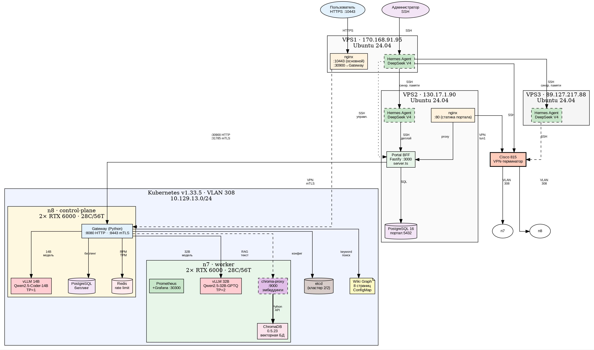
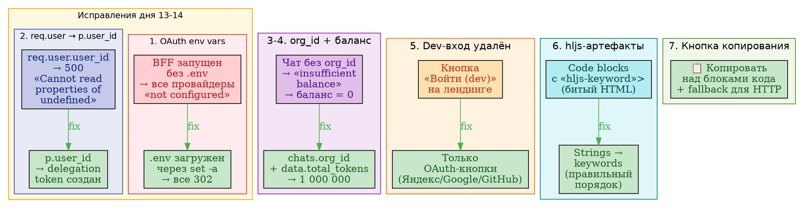

# Aither Platform — Техническое руководство по дорожной карте

**roadmap-manual.md** — детальное описание каждого этапа разработки платформы Aither.

**Дата:** 10.07.2026  
**Версия:** 2.1  
**Назначение:** Ознакомление технических специалистов, команд разработки и проектировщиков с процессом создания платформы.

---

## Оглавление

1. [Этап 1: MVP](#1-этап-1-mvp-дни-17)
2. [Этап 2: Биллинг и каталог](#2-этап-2-биллинг-и-каталог-дни-810)
3. [Этап 2.5: Авто-баланс и публичный доступ](#3-этап-25-авто-баланс-и-публичный-доступ-день-11)
4. [Этап 3: Observability и безопасность](#4-этап-3-observability-и-безопасность-дни-1114)
5. [Этап 4: RAG и кастомизация](#5-этап-4-rag-и-кастомизация-дни-1518)
6. [Этап 4.5: Стабилизация портала](#6-этап-45-стабилизация-портала-день-13)
7. [Этап 5: Продакшен-класс](#7-этап-5-продакшен-класс-недели-36)
8. [Этап 5a: Требования руководства](#8-этап-5a-требования-руководства-недели-711)
9. [Этап 6: Эксплуатация и развитие](#9-этап-6-эксплуатация-и-развитие-месяц-2)
10. [Этап 7: Пакет для закрытого контура](#10-этап-7-пакет-для-закрытого-контура)

---

## 1. Этап 1: MVP (дни 1–7)

### Описание

Создание минимально жизнеспособного продукта: одноузловой Kubernetes-кластер на GPU-сервере n8-gpu (bootsman-k8s-clnt01-n8-gpu, 10.129.13.78) с одной LLM-моделью, API-шлюзом, порталом и OAuth-аутентификацией.

### Функционал

- Запуск LLM-инференса (Qwen 2.5 14B) на GPU через vLLM
- OpenAI-совместимый API через Gateway с rate limiting (Redis)
- Веб-портал (SPA + BFF) с чат-интерфейсом и SSE-стримингом
- OAuth-вход через GitHub, Google, Яндекс
- Мониторинг GPU-метрик (DCGM)

### Состав компонентов

| Компонент | Версия | Назначение |
|---|---|---|
| Kubernetes | 1.29 | Оркестрация контейнеров |
| containerd | 1.7 | Контейнерный runtime |
| NVIDIA GPU Operator | 24.6 | Управление GPU-драйверами |
| vLLM | 0.6.4 | Инференс-сервер |
| Qwen 2.5 14B Instruct | — | LLM-модель (~28 GB), TP=2, 2×RTX6000 |
| Gateway (Python) | custom (mtls_server.py) | API-шлюз, rate limit, reserve/settle |
| Redis | 7-alpine | Sliding window rate limiter |
| Портал (SPA + BFF) | custom | Веб-интерфейс |
| BFF (Node.js/Fastify) | 4.x | Бэкенд портала |

### Принцип действия

```
Клиент → nginx :10443 → BFF :3000 (JWT auth)
  → Gateway :30900 (rate limit, reserve)
  → vLLM :32293 (инференс)
  → Gateway (settle)
  → BFF → Клиент (SSE-стриминг)
```

1. Клиент авторизуется через OAuth (GitHub/Google/Яндекс)
2. BFF выдаёт JWT-токен, проверяет баланс организации
3. Gateway резервирует токены, проверяет rate limit (Redis sliding window)
4. Запрос отправляется в vLLM, ответ стримится обратно
5. Gateway финализирует списание токенов (settle)

### Физическая схема (MVP)


### Конфигурационные файлы

| Файл | Назначение |
|---|---|
| `k8s/vllm-14b/deployment.yaml` | Deployment vLLM 14B (TP=2, 2× GPU) |
| `k8s/gateway/deployment.yaml` | Gateway Deployment + Service NodePort :30900 |
| `k8s/redis/deployment.yaml` | Redis для rate limiting |
| `configs/vps1/aither-failover` | nginx :10443 → BFF |
| `configs/vps2/remote-configs.txt` | nginx, systemd BFF |

### Последовательность конфигурации

1. **GPU-узел:** установка NVIDIA-драйвера 570, containerd, nvidia-container-toolkit
2. **K8s:** `kubeadm init`, Flannel CNI, NVIDIA GPU Operator
3. **Модель:** загрузка Qwen2.5-14B-Instruct в `/mnt/models/`
4. **vLLM:** `kubectl apply -f k8s/vllm-14b/deployment.yaml`
5. **Redis + Gateway:** `kubectl apply -f k8s/redis/`, `kubectl apply -f k8s/gateway/`
6. **Портал:** `npm install && npm start` на VPS2, nginx reverse proxy
7. **Проверка:** `curl https://fb1.spb.ru:10443/v1/chat/completions`

### Взаимодействия

| Компонент A | Компонент B | Протокол | Порт |
|---|---|---|---|
| BFF | Gateway | HTTP + JWT | 30900 |
| Gateway | Redis | Redis protocol | 6379 |
| Gateway | vLLM | HTTP (OpenAI API) | 32293 |
| nginx | BFF | HTTP (reverse proxy) | 3000 |
| BFF | PostgreSQL (VPS2) | SQL | 5432 |

### Потоки данных

```
[OAuth provider] → JWT claims → [BFF] → org_id + balance
[BFF] → POST /v1/chat/completions → [Gateway]
  → rate_limit_check(org_id, rpm=300, tpm=100000)
  → reserve_tokens(model, estimated_tokens)
  → POST /v1/chat/completions → [vLLM]
  ← SSE stream (tokens)
  → settle(reservation_id, actual_tokens)
  ← [BFF] ← SSE stream ← [Клиент]
```

---

## 2. Этап 2: Биллинг и каталог (дни 8–10)

### Описание

Подключение платёжной системы ЮKassa для монетизации, создание каталога моделей с декларативным описанием, добавление второго GPU-узла n7-gpu с 32B-моделью.

### Функционал

- Пополнение баланса через ЮKassa (тестовый режим)
- Каталог моделей: YAML-описание → динамический UI
- Двухузловой K8s-кластер: n8 (control-plane) + n7 (worker)
- Вторая модель: Qwen 2.5 32B GPTQ
- Автоматический выбор модели в UI на основе каталога
- Точный учёт токенов (usage collector, Redis-аккумулятор)

### Состав компонентов

| Компонент | Версия | Назначение |
|---|---|---|
| PostgreSQL 16 (K8s) | 16 | Биллинг: организации, пользователи, транзакции |
| PostgreSQL (VPS2) | 16-alpine | Пользователи портала, чаты |
| ЮKassa API | v3 | Приём платежей |
| Каталог моделей | catalog.yaml | Декларативное описание моделей |
| vLLM 32B | 0.6.4 | Вторая модель (n7, 2× RTX 6000) |
| Qwen 2.5 32B GPTQ | — | ~20 GB, квантованная |

### Физическая схема (этап 2)


### Конфигурационные файлы

| Файл | Назначение |
|---|---|
| `gateway/catalog.yaml` | Список моделей: имя, backend URL, лимиты, стоимость |
| `k8s/vllm-32b/deployment.yaml` | vLLM 32B GPTQ, TP=2, n7-gpu |
| `k8s/postgres/deployment.yaml` | PostgreSQL для биллинга |
| `db/migrations/007_subscription_tiers.sql` | Таблица тарифных планов |
| `portal/.env` | YOOKASSA_SHOP_ID, YOOKASSA_SECRET |

### Принцип действия

1. Пользователь выбирает модель в UI → BFF получает каталог из Gateway
2. Gateway читает `catalog.yaml` → список моделей с backend URL и стоимостью
3. Запрос направляется в соответствующий vLLM-под по имени модели
4. ЮKassa: пользователь → платёжная форма → webhook → BFF → зачисление баланса
5. Usage collector считает фактические токены → Redis-аккумулятор → периодический settle

### Последовательность конфигурации

1. **PostgreSQL (K8s):** `kubectl apply -f k8s/postgres/deployment.yaml`, миграции БД
2. **Каталог:** создать `gateway/catalog.yaml` с описанием моделей (14B + 32B)
3. **ЮKassa:** зарегистрировать магазин, получить ключи → `portal/.env`
4. **Gateway:** обновить ConfigMap с `catalog.yaml`, `routing.py`, `usage_collector.py`
5. **n7-gpu:** `kubectl apply -f k8s/vllm-32b/deployment.yaml` (TP=2, 2×RTX6000)
6. **Проверка:** `curl -X POST /v1/chat/completions -d '{"model":"qwen2.5-32b"}'`

### Взаимодействия

| Компонент A | Компонент B | Протокол | Порт |
|---|---|---|---|
| BFF | Gateway (catalog) | HTTP + JWT | 30900 |
| Gateway | vLLM 14B (n8) | HTTP (OpenAI API) | 32293 |
| Gateway | vLLM 32B (n7) | HTTP (OpenAI API) | 8000 |
| Gateway | Redis (usage accumulator) | Redis | 6379 |
| Gateway | PostgreSQL K8s (billing) | SQL | 5432 |
| BFF | PostgreSQL VPS2 (users, chats) | SQL | 5432 |
| ЮKassa API | BFF (webhook) | HTTPS | 443 |

### Потоки данных

```
[Пользователь] → Пополнение → [ЮKassa] → webhook → [BFF] → [PostgreSQL]
                                                             → balance += amount

[Клиент] → выбор модели → [BFF] → GET /catalog → [Gateway] → [catalog.yaml]
[BFF] → POST /v1/chat/completions {model: "qwen2.5-32b"}
  → [Gateway] → routing.resolve("qwen2.5-32b")
  → backend = "http://vllm-qwen32b:8000"
  → reserve → POST /v1/chat/completions → [vLLM 32B]
  ← SSE stream ← settle ← [BFF]
```

---

## 3. Этап 2.5: Авто-баланс и публичный доступ (день 11)

### Описание

Автоматическое начисление стартовых токенов при регистрации, авто-пополнение при исчерпании, публикация Grafana-дашбордов.

### Функционал

- Стартовый баланс 100 000 токенов при первой OAuth-регистрации
- Авто-пополнение ×10 при падении баланса ниже порога
- Grafana-дашборды доступны через `fb1.spb.ru:10443/grafana/`

### Конфигурационные файлы

| Файл | Назначение |
|---|---|
| `configs/vps1/nginx-aither-failover.conf` | nginx → BFF + Grafana |
| `configs/vps2/aither-bff.service` | systemd unit для BFF |

### Состав компонентов

| Компонент | Версия | Назначение |
|---|---|---|
| Gateway auto-balance | custom | Логика стартового баланса и авто-пополнения |
| Grafana | latest | Дашборды мониторинга (GPU, Inference, Billing) |
| nginx VPS1 | — | Reverse proxy: :10443 → BFF + /grafana/ |
| Redis (K8s) | 7-alpine | Хранение балансов организаций |

### Принцип действия

```
Регистрация (OAuth) → [BFF] → create_org(name)
  → [Gateway] → credit_tokens(org_id, 100_000)
  → [Redis] SET org:{id}:tokens = 100000

Каждый запрос → [Gateway] → check_balance(org_id)
  → if tokens < THRESHOLD (10 000):
      → auto_refill(org_id, ×10)
      → credit_tokens(org_id, current_balance * 10)
      → audit_log("auto-refill", org_id, amount)
  → reserve → inference → settle
```

1. При первой OAuth-регистрации BFF создаёт организацию
2. Gateway начисляет 100 000 стартовых токенов через Redis
3. При каждом запросе проверяется баланс
4. Если баланс < 10 000 — авто-пополнение ×10 (100K → 1M → 10M...)
5. Каждое пополнение логируется в audit_log

### Физическая схема



### Взаимодействия

| Компонент A | Компонент B | Протокол | Порт |
|---|---|---|---|
| BFF | Gateway (credit_tokens) | HTTP + JWT | 30900 |
| Gateway | Redis (balance store) | Redis protocol | 6379 |
| nginx VPS1 | Grafana (K8s) | HTTP reverse proxy | 30300 |
| nginx VPS1 | BFF VPS2 | HTTP | 3000 |

### Потоки данных

```
[OAuth provider] → JWT claims → [BFF]
  → POST /v1/admin/orgs (create org)
  → Gateway: credit_tokens(org_id, 100000)
  → Redis: INCRBY org:{id}:tokens 100000

[Пользователь] → запрос в чат
  → [Gateway] → GET org:{id}:tokens → < 10000?
  → auto_refill: INCRBY org:{id}:tokens {balance * 10}
  → reserve → vLLM → settle
  → Redis: DECRBY org:{id}:tokens {used}
```

### Последовательность конфигурации

1. **Gateway:** обновить ConfigMap с логикой авто-баланса (`credit_tokens`, `check_balance`, `auto_refill`)
2. **BFF:** эндпоинт `POST /api/v1/admin/orgs` → вызывает Gateway для начисления стартовых токенов
3. **Redis:** убедиться, что ключи `org:{id}:tokens` создаются при регистрации
4. **Grafana:** `kubectl apply -f k8s/monitoring/grafana.yaml`, настроить ingress/nginx proxy
5. **nginx VPS1:** добавить location `/grafana/` → Grafana K8s service
6. **Проверка:** зарегистрироваться → проверить баланс → исчерпать до <10K → авто-пополнение

---

## 4. Этап 3: Observability и безопасность (дни 11–14) — 🟡 в работе

### Описание

Создание комплексной системы мониторинга (GPU, инференс, биллинг), расширение AI Security Gateway (DLP + Prompt Injection), вынос Gateway в отдельный K8s-под.

### Функционал

- **Grafana-дашборды:** GPU-метрики (DCGM), vLLM Inference, Aither Billing ✅
- **DLP-фильтр:** детекция номеров карт, паспортов, СНИЛС, телефонов, API-ключей ✅
- **Prompt Injection-детектор:** 23 EN + 6 RU паттернов ✅
- **Gateway:** отдельный Deployment в K8s, двухпортовый (:8080 HTTP + :8443 mTLS) ✅
- **Security Egress:** фильтрация ДСП-маркеров и ПДн в ответах модели ✅
- **TTFT-мониторинг:** Time To First Token в Prometheus ✅
- **ЮKassa боевой режим:** ⬜ (тестовый режим работает, боевой отложен)
- **Parsec на n7:** ⬜ (`max_ilev=63 execstack=1`, отложен)

### Состав компонентов

| Компонент | Версия | Назначение |
|---|---|---|
| Prometheus | latest | Сбор метрик |
| Grafana | latest | Дашборды (3 папки: GPU, Inference, Billing) |
| DCGM Exporter | 3.3 | NVIDIA GPU-метрики |
| Gateway mTLS | custom | Двухпортовый (:8080 HTTP plain + :8443 mTLS) |
| security.py | custom | DLP ingress (карты, паспорта, СНИЛС, API-ключи) |
| security_egress.py | custom | Egress DLP (ДСП, ПДн, classified) |

### Физическая схема (этап 3)


### Конфигурационные файлы

| Файл | Назначение |
|---|---|
| `gateway/security.py` | DLP ingress-фильтр |
| `gateway/security_egress.py` | Egress-фильтр (ДСП, ПДн) |
| `gateway/mtls_server.py` | mTLS-обёртка (:8443) |
| `gateway/metrics.py` | Prometheus-метрики |
| `k8s/monitoring/prometheus.yaml` | Prometheus Deployment + ConfigMap |
| `k8s/monitoring/grafana.yaml` | Grafana Deployment + дашборды |

### Потоки данных (безопасность)

```
[Клиент] → [BFF] → [Gateway]
  → DLP ingress: check for card numbers, SSN, passport, phone
  → Prompt Injection: 29 patterns (EN+RU)
  → if blocked: 403 + audit_log
  → else: → vLLM
  → DLP egress: check response for classified info (ДСП, ПДн)
  → if blocked: strip sensitive data
  → else: → [BFF] → [Клиент]
```

### Принцип действия

1. **Мониторинг:** Prometheus собирает метрики с DCGM Exporter (GPU), vLLM /metrics (инференс), PostgreSQL (биллинг), Gateway (latency, rate limits)
2. **Grafana** визуализирует метрики в трёх дашбордах: GPU Overview, vLLM Inference, Aither Billing
3. **DLP ingress:** каждый входящий запрос проверяется на номера карт, паспортов, СНИЛС, телефонов, API-ключей
4. **Prompt Injection:** 29 паттернов (23 EN + 6 RU) — при совпадении → 403 + audit_log
5. **DLP egress:** ответы модели фильтруются на ДСП-маркеры и ПДн
6. **Gateway** работает в двухпортовом режиме: :8080 (plain HTTP для внутренних сервисов) + :8443 (mTLS для внешних)

### Последовательность конфигурации

1. **Prometheus:** `kubectl apply -f k8s/monitoring/prometheus.yaml` (Deployment + ConfigMap)
2. **Grafana:** `kubectl apply -f k8s/monitoring/grafana.yaml` (Deployment + дашборды)
3. **DCGM Exporter:** `kubectl apply -f k8s/monitoring/dcgm-exporter.yaml`
4. **Gateway:** обновление ConfigMap с модулями `security.py`, `security_egress.py`, `metrics.py`
5. **Проверка:** Grafana → fb1.spb.ru:10443/grafana/, дашборды → метрики в реальном времени

### Взаимодействия

| Компонент A | Компонент B | Протокол | Порт |
|---|---|---|---|
| Prometheus | DCGM Exporter | HTTP scrape | 9400 |
| Prometheus | vLLM /metrics | HTTP scrape | 8000 |
| Prometheus | Gateway /metrics | HTTP scrape | 8080 |
| Grafana | Prometheus | HTTP query | 9090 |
| Gateway | vLLM | HTTP (OpenAI API) | 8000 |
| BFF | Gateway (HTTP plain) | HTTP + JWT | 8080 |
| BFF | Gateway (mTLS) | HTTPS + client cert | 8443 |

Примечание: mTLS (:8443) отключён для отладки RAG — используется plain HTTP (:30900).

---

## 5. Этап 4: RAG и кастомизация (дни 15–18)

### Описание

Создание гибридной RAG-подсистемы (Wiki Graph + ChromaDB через chroma-proxy), fine-tuning пайплайна (QLoRA), cost-aware routing.

### 5.1. Гибридный RAG (Wiki Graph + ChromaDB)

**Архитектура гибридного RAG:**

```
Запрос пользователя
  │
  ▼
Gateway: hybrid_rag.py
  │
  ├─ Wiki Graph (keyword search)
  │     ├─ 8 markdown-страниц базы знаний LLM-Wiki
  │     ├─ wiki_graph.py: граф взаимосвязанных страниц
  │     ├─ BFS-обход: radius=1 (прямые соседи)
  │     └─ Полнотекстовый поиск по заголовкам + content
  │
  └─ ChromaDB (векторный поиск)
        ├─ chroma-proxy :9000 (HTTP API)
        ├─ all-MiniLM-L6-v2 → эмбеддинг запроса (384-мерный)
        ├─ ChromaDB :8000 → поиск ближайших чанков
        └─ Коллекция "textbook": 39 чанков учебника (in-memory режим)
              │
              ▼
        Комбинирование: wiki_results + chroma_results
        → дедупликация → сортировка по relevance → top-K
```

**Wiki Graph (LLM-Wiki):**

LLM-Wiki — это граф знаний в стиле Karpathy: персистентный граф взаимосвязанных Markdown-страниц.

| Страница | Тип | Описание |
|---|---|---|
| `ai-gateway.md` | entity | AI Gateway: архитектура, rate limit, billing |
| `security-egress.md` | entity | Egress DLP: ДСП, ПДн, classified patterns |
| `siem-integration.md` | entity | SIEM: syslog CEF, security events |
| `multi-tenant-arch.md` | concept | Multi-tenant: изоляция org, namespace |
| `vault-integration.md` | entity | Vault PKI: управление ключами, mTLS |
| `chromadb-rag.md` | concept | ChromaDB: векторный поиск, чанковка |
| `llm-wiki.md` | concept | LLM-Wiki: compile-once, query-many |
| `auth-flow.md` | concept | Аутентификация: OAuth, JWT, API-ключи |

**Принцип работы Wiki Graph:**
- `wiki_graph.py` загружает все .md-файлы из ConfigMap `gateway-wiki`
- Парсит frontmatter (title, type, tags) и [[wikilinks]] для построения графа
- При поиске: keyword match по заголовкам, тегам и содержимому
- Graph expansion: BFS от найденных страниц (radius=1) для захвата связанных

**RAG-чат (полный цикл):**

```
[Пользователь] → Включает RAG в UI → вводит вопрос
  → [Frontend] → POST /api/rag/chat {messages, rag_query, org_id}
  → [BFF] → POST /v1/rag/hybrid-query {query, top_k, wiki_radius}
    → [Gateway: hybrid_rag.py]
      ├─ wiki_graph.search(query)[:top_k]
      └─ chroma-proxy :9000 POST /query {query, top_k}
    ← {wiki_results, chroma_results}
  → [BFF] → инжектит контекст в system prompt
  → [BFF] → POST /v1/chat/completions {augmented_messages}
    → [Gateway] → vLLM
    ← ответ с учётом контекста
  → [BFF] → POST /api/v1/chats/:id/rag-messages {content, assistant_content}
    → сохранение в PostgreSQL
  ← [Frontend] → отображение ответа + RAG sources
```

### 5.2. Fine-tuning (QLoRA)

| Параметр | Значение |
|---|---|
| Метод | QLoRA 4-bit (NF4) |
| Базовая модель | Qwen2.5-14B-Instruct |
| Адаптер | `astra-14b` |
| Rank (r) | 8 |
| Размер адаптера | ~65 MB |
| Обучение | RTX 6000, 100 шагов |

### 5.3. Cost-aware routing

Автоматический выбор модели по сложности запроса:

| Сложность | Модель |
|---|---|
| Простые (≤7 chars) | Qwen 2.5 14B |
| Средние (≤50 chars) | Qwen 2.5 14B |
| Сложные (score ≥30) | Qwen 2.5 32B |
| Явное указание | По имени модели |

### Состав компонентов

| Компонент | Версия | Назначение |
|---|---|---|
| ChromaDB | 0.5.23 | Векторная БД (RAG) |
| chroma-proxy | custom | Текстовый прокси → эмбеддинги → ChromaDB |
| all-MiniLM-L6-v2 | — | Эмбеддинг-модель (384-мерные векторы) |
| LLM-Wiki | 8 страниц | Keyword search + graph expansion |
| hybrid_rag.py | ~200 строк | Гибридный поиск: wiki + chroma |
| wiki_graph.py | ~400 строк | Граф знаний (BFS, fulltext search) |
| routing.py | custom | Cost-aware model selection |

### Физическая схема (RAG)


### Конфигурационные файлы

| Файл | Назначение |
|---|---|
| `gateway/hybrid_rag.py` | Гибридный RAG: wiki + chroma-proxy |
| `gateway/wiki_graph.py` | LLM-Wiki: граф знаний |
| `k8s/chromadb/chroma-proxy.yaml` | ConfigMap + Deployment + Service :9000 |
| `k8s/chromadb/deployment.yaml` | ChromaDB 0.5.23 + PVC RWO |
| `wiki/*.md` | 8 страниц базы знаний LLM-Wiki |
| `scripts/ingest_textbook.py` | Чанковка и загрузка учебника в ChromaDB |

### Последовательность конфигурации

1. **PVC:** создание `chromadb-data` (20 GB, RWO)
2. **ChromaDB:** `kubectl apply -f k8s/chromadb/deployment.yaml` (0.5.23, n7-gpu)
3. **chroma-proxy:** `kubectl apply -f k8s/chromadb/chroma-proxy.yaml`
4. **Инжест:** `kubectl exec deploy/chroma-proxy -- python3 /chroma/ingest_textbook.py`
5. **Wiki:** создание ConfigMap `gateway-wiki` из 8 .md-файлов
6. **Gateway:** обновление образа с `hybrid_rag.py`, env `CHROMA_PROXY_URL`
7. **BFF:** эндпоинты `/api/rag/chat`, `/api/rag/query`, `/api/rag/status`

⚠️ **Текущее ограничение:** chroma-proxy использует in-memory ChromaDB — данные теряются при рестарте пода. После перезапуска необходим повторный инжест учебника. Персистентность через PVC запланирована в Этапе 7.

### Взаимодействия

| Компонент A | Компонент B | Протокол | Порт |
|---|---|---|---|
| Gateway (hybrid_rag) | chroma-proxy | HTTP | 9000 |
| chroma-proxy | ChromaDB | HTTP (ChromaDB API) | 8000 |
| chroma-proxy | all-MiniLM-L6-v2 (локально) | Python module | — |
| Gateway (wiki_graph) | ConfigMap gateway-wiki | File I/O | — |
| Gateway (routing) | vLLM 14B | HTTP | 32293 |
| Gateway (routing) | vLLM 32B | HTTP | 8000 |
| BFF | Gateway (hybrid RAG) | HTTP + JWT | 30900 |
| BFF | PostgreSQL VPS2 | SQL | 5432 |

### Потоки данных

```
[Пользователь] → RAG-чат (вопрос + rag_query)
  → [BFF] → POST /v1/rag/hybrid-query
    → [Gateway: hybrid_rag.py]
      ├─ [wiki_graph.py] → ConfigMap gateway-wiki (8 .md-файлов)
      │   → keyword match → BFS (radius=1) → wiki_results[]
      └─ [chroma-proxy :9000] → embed(query) → [ChromaDB :8000]
          → similarity search → chroma_results[]
    ← {wiki_results, chroma_results} → merge → top-K

  → [BFF] → инжект контекста в system prompt:
      "You are an AI assistant. Use the following context:
       {wiki_results} {chroma_results}
       Question: {user_query}"
  → POST /v1/chat/completions (augmented_messages)
    → [Gateway: routing.py]
      → cost-aware routing: simple? → 14B : complex? → 32B
      → reserve → vLLM → settle
    ← ответ с учётом RAG-контекста

  → [BFF] → POST /api/v1/chats/:id/rag-messages
    → сохранение user + assistant + sources в PostgreSQL
  ← [Frontend] → отображение + блок «Источники» (Wiki/ChromaDB)
```

---

## 6. Этап 4.5: Стабилизация портала (день 13)

### Описание

Критическое исправление багов портала после развёртывания: восстановление OAuth, исправление чата (500-ошибки), отображение баланса, org_id в чатах, очистка лендинга от dev-режима.

### Функционал

- **OAuth-восстановление:** Яндекс/Google/GitHub — env vars в systemd unit, redirect URI на fb1.spb.ru
- **Чат 500 fix:** `req.user` → `p.user_id` в обработчике сообщений
- **Баланс в UI:** GET `/api/v1/billing?org_id=...` + отображение в шапке
- **Dev-вход убран:** скрыта кнопка dev-входа с лендинга
- **Подсветка кода:** исправлены hljs-артефакты, кнопка копирования в сообщениях
- **org_id в чатах:** миграция БД (колонка org_id, FK → portal_organizations), BFF (WHERE org_id=$N), фронтенд
- **Модели 14B + 32B:** обе модели работают через чат, переключение в UI

### Состав компонентов

| Компонент | Версия | Назначение |
|---|---|---|
| BFF (Node.js/Fastify) | 4.x | Бэкенд портала с JWT-аутентификацией |
| Portal SPA | custom | Одностраничное приложение (index.html, admin.html) |
| nginx VPS2 | — | Reverse proxy :80 → BFF :3000, отдача статики |
| PostgreSQL VPS2 | 16-alpine | Пользователи портала, чаты, org_id |
| systemd unit | — | `aither-bff.service` для автозапуска BFF |

### Принцип действия (исправленный поток чата)

```
Браузер → VPS2:80 (Nginx) → VPS2:3000 (BFF)
  ├─ OAuth: Яндекс / Google / GitHub → JWT-токен (HS256)
  ├─ Chat API: /api/v1/chats → /api/v1/chats/{id}/messages
  └─ Billing: /api/v1/billing?org_id=...

BFF → Gateway K8s :30900 (JWT HS256 → RS256 fallback)
  ├─ Security check (prompt injection + DLP)
  ├─ Billing (reserve → inference → settle)
  └─ vLLM:
       ├─ 14B → n8:vllm :8000 (Qwen2.5-14B-Instruct)
       └─ 32B → n7:vllm-qwen32b :8000 (Qwen2.5-32B-Instruct)
```

1. Пользователь заходит через OAuth → BFF проверяет/создаёт пользователя в PostgreSQL
2. JWT-токен (HS256) сохраняется в cookie и localStorage
3. Все API-запросы к BFF проходят JWT-верификацию
4. BFF проксирует запросы в Gateway K8s с org_id в JWT
5. Gateway выполняет security check → reserve → vLLM → settle
6. Ответ стримится обратно через SSE

### Физическая схема



### Конфигурационные файлы

| Файл | Назначение |
|---|---|
| `portal/.env` | Переменные окружения: OAuth-ключи, PG, JWT_SECRET, CORE_API |
| `configs/vps2/aither-bff.service` | systemd unit для автозапуска BFF |
| `configs/vps2/nginx.conf` | nginx reverse proxy :80 → BFF :3000 |
| `configs/vps1/nginx-aither-failover.conf` | nginx :10443 → VPS2 |
| `portal/secrets.env` | Полный набор секретов (НЕ коммитить!) |

### Последовательность конфигурации

1. **BFF:** `npm install && npm run build`, создание `.env` с ключами
2. **systemd:** `systemctl enable aither-bff.service && systemctl start aither-bff`
3. **nginx VPS2:** reverse proxy :80 → :3000, статика из `portal/static/`
4. **nginx VPS1:** :10443 → VPS2:80, проброс заголовков
5. **OAuth:** регистрация приложений в GitHub/Google/Яндекс, redirect URI → `fb1.spb.ru:10443`
6. **Проверка:** `curl https://fb1.spb.ru:10443/api/v1/status` → `{"version":"0.5.0","orgs":38}`

### Взаимодействия

| Компонент A | Компонент B | Протокол | Порт |
|---|---|---|---|
| Браузер | nginx VPS1 | HTTPS | 10443 |
| nginx VPS1 | nginx VPS2 | HTTP | 80 |
| nginx VPS2 | BFF | HTTP reverse proxy | 3000 |
| BFF | PostgreSQL VPS2 | SQL | 5432 |
| BFF | Gateway K8s | HTTP + JWT | 30900 |
| Gateway | Redis K8s | Redis | 6379 |
| Gateway | vLLM 14B/32B | HTTP (OpenAI) | 8000 |

### Потоки данных

```
[Браузер] → HTTPS :10443 → [nginx VPS1]
  → HTTP :80 → [nginx VPS2]
  → HTTP :3000 → [BFF]
    ├─ GET /api/v1/status → проверка JWT → org_id
    ├─ POST /api/v1/chats → CREATE chat + org_id
    ├─ POST /api/v1/chats/:id/messages → [Gateway :30900]
    │   → security → reserve → vLLM → settle
    │   ← SSE stream (tokens)
    └─ GET /api/v1/billing → [Gateway] → balance
  ← SSE stream ← [Браузер]
```

---

## 7. Этап 5: Продакшен-класс (недели 3–6) — 🟡 4/7 выполнено

### Описание

Переход к многоарендной архитектуре с изоляцией, тарифными планами, резервированием (VPS3 failover), SaaS-порталом.

### Выполненные задачи

| Задача | Статус | Описание |
|---|---|---|
| **21a. Тарифные планы** | ✅ | Free/Standard/VIP/Enterprise с разными лимитами (RPM, TPM, daily, models, RAG) |
| **22. VPS3 Failover** | ✅ | Горячий резерв портала + Hermes-синхронизация памяти/навыков |
| **23. SaaS-портал** | ✅ | Регистрация, биллинг-дашборды, админ-панель |
| **23a. LDAP-аутентификация** | ✅ | FreeIPA/ALD Pro через `ldap.ts` |
| **Портал: безопасность** | ✅ | Security hardening (CSP, CORS, helmet, rate limit) |

### Оставшиеся задачи

| Задача | Статус | Описание |
|---|---|---|
| **21. Multi-tenant изоляция** | ⬜ | Изоляция по организациям (чат-сессии per-org — частично, выполнено 07.07) |
| **24. HA K8s control plane** | ⬜ | Отказоустойчивый control plane (2–3 мастер-узла) |
| **25. NVLink-мосты** | 🔒 | P2P GPU-коммуникация (нет физических мостов) |
| **26. Модели 70B+** | 🔒 | NVSwitch, 4–8 GPU (заблокировано до NVLink)

### Физическая схема (этап 5)


### Конфигурационные файлы

| Файл | Назначение |
|---|---|
| `portal/ldap.ts` | LDAP/ALD Pro аутентификация |
| `portal/policies.ts` | Политики доступа (org-level) |
| `portal/security.ts` | Security hardening (CSP, CORS, rate limit) |
| `db/migrations/007_subscription_tiers.sql` | Тарифные планы |
| `db/migrations/008_auth_tables_k8s.sql` | OAuth-таблицы |

### Функционал

- **Тарифные планы:** Free/Standard/VIP/Enterprise с разными лимитами (RPM, TPM, daily, models, RAG)
- **VPS3 Failover:** горячий резерв портала (BFF + PostgreSQL + Nginx), синхронизация памяти Hermes
- **SaaS-портал:** регистрация организаций, биллинг-дашборды, админ-панель (11 вкладок)
- **LDAP-аутентификация:** FreeIPA/ALD Pro через `ldap.ts`, привязка к организациям
- **Security hardening:** CSP, CORS, helmet, rate limit на BFF и nginx

### Состав компонентов

| Компонент | Версия | Назначение |
|---|---|---|
| BFF (Node.js) | 4.x | SaaS-портал, JWT, LDAP, биллинг-дашборды |
| PostgreSQL VPS2 | 16-alpine | Организации, пользователи, тарифы, чаты |
| PostgreSQL VPS3 | 16 | Резервная копия БД портала |
| Nginx VPS3 | — | Резервный reverse proxy |
| Hermes Agent VPS3 | — | Синхронизация памяти и навыков |
| Subscription Tiers | SQL migration | 4 тарифа с разными лимитами |

### Принцип действия (тарифные планы)

```
Регистрация → выбор тарифа → [BFF] → subscription_tiers lookup
  → INSERT INTO portal_organizations (tier='free')
  → [Gateway] → set limits:
      RPM: tier.rpm_limit (free=60, standard=300, vip=1000, enterprise=5000)
      TPM: tier.tpm_limit (free=10000, standard=100000, ...)
      Models: tier.allowed_models
      RAG: tier.rag_enabled

API-запрос → [Gateway] → rate_limit_check(org_id)
  → Redis: check RPM/TPM windows for tier
  → if exceeded → 429 Rate Limit Exceeded
  → else → reserve → vLLM → settle
```

### Последовательность конфигурации

1. **Миграция БД:** `db/migrations/007_subscription_tiers.sql` → создание тарифов
2. **BFF:** `ldap.ts` → настройка подключения к FreeIPA/ALD Pro
3. **Security:** `security.ts` → helmet, CSP, CORS, rate limit
4. **VPS3:** `rsync` синхронизация dist + статика, systemd unit для BFF
5. **Nginx VPS3:** reverse proxy на BFF, копия конфига с VPS2
6. **Hermes VPS3:** синхронизация MEMORY.md + USER.md + навыков
7. **Проверка:** VPS1:10443 → VPS2 (primary) → VPS3 (backup) — failover работает

### Взаимодействия

| Компонент A | Компонент B | Протокол | Порт |
|---|---|---|---|
| BFF | PostgreSQL VPS2 | SQL | 5432 |
| BFF | Gateway K8s (rate limit per tier) | HTTP + JWT | 30900 |
| BFF | LDAP (FreeIPA/ALD Pro) | LDAP | 389/636 |
| Gateway | Redis (sliding window per tier) | Redis | 6379 |
| VPS1 Nginx | VPS2 BFF (primary) | HTTP | 80 |
| VPS1 Nginx | VPS3 BFF (backup) | HTTP | 80 |
| Hermes VPS1 | Hermes VPS3 | SSH + Git | 22 |

### Потоки данных

```
[Пользователь] → OAuth → [BFF]
  → GET /api/v1/billing?org_id=X
  → [PostgreSQL] → subscription_tier → limits
  → [Gateway] → Redis: current RPM/TPM for tier

[API-клиент] → POST /v1/chat/completions (org_id + API key)
  → [Gateway] → rate_limit_check(tier, org_id)
  → Redis: INCR org:{id}:rpm:{window}, INCRBY org:{id}:tpm:{window}
  → if within limits → reserve → vLLM → settle
  → Redis: DECRBY org:{id}:tokens {used}
  ← SSE stream → [Клиент]
```

---

## 8. Этап 5a: Требования руководства (недели 7–11)

### Описание

Реализация требований информационной безопасности и корпоративных стандартов.

### Выполненные задачи

| Задача | Статус | Описание |
|---|---|---|
| **34. Security Gateway Egress** | ✅ | ДСП-фильтр на выходе (classified data leak prevention) |
| **35. SIEM-интеграция** | ✅ | Syslog CEF + security_events таблица PostgreSQL |
| **36. Vault-интеграция** | ✅ | Внешняя генерация API-ключей + политики ИБ |
| **37. LLM-Wiki + гибридный RAG** | ✅ | Wiki graph search + ChromaDB (см. Этап 4) |
| **38. Профили организаций** | ✅ | Security policy per org |
| **39. API Gateway mgmt API** | ✅ | Управление очередями, моделями, drain |
| **40. TTFT-мониторинг** | ✅ | Time To First Token в Prometheus |

### Принцип действия (egress DLP)

```
[Модель] → ответ с текстом
  → [Gateway: security_egress.py]
  → проверка на ДСП-маркеры, ПДн, classified patterns
  → если найдено: strip/block + audit_log + SIEM event
  → иначе: пропустить ответ
  → [BFF] → [Клиент]
```

### Vault PKI (mTLS)

```
[Gateway] → запрос сертификата → [Vault PKI]
  ← сертификат (TTL 30 дней)
[BFF] → mTLS handshake → [Gateway :8443]
  → client cert verification → JWT auth → vLLM
```

Примечание: mTLS отключён на период отладки RAG (используется plain HTTP :30900).

### Функционал

- **Security Gateway Egress:** ДСП-фильтр на выходе (11 DSP-паттернов, 10 system-leak паттернов)
- **SIEM-интеграция:** syslog CEF-формат, таблица security_events в PostgreSQL
- **Vault-интеграция:** внешняя генерация API-ключей, PKI для mTLS-сертификатов
- **LLM-Wiki + гибридный RAG:** граф знаний (8 страниц) + ChromaDB (39 чанков)
- **Профили организаций:** security policy per org (DLP level, blocked patterns)
- **API Gateway mgmt API:** управление очередями, моделями, drain, health
- **TTFT-мониторинг:** Time To First Token в Prometheus

### Состав компонентов

| Компонент | Версия | Назначение |
|---|---|---|
| security_egress.py | custom (250 строк) | DLP-фильтр ответов модели |
| siem.py | custom | Syslog CEF + PostgreSQL audit |
| vault_client.py | custom | Vault PKI + API-key generation |
| hybrid_rag.py | ~200 строк | Гибридный поиск: wiki + chroma |
| wiki_graph.py | ~400 строк | Граф знаний (BFS, fulltext) |
| admin.py | custom | Gateway management API |
| metrics.py | custom | Prometheus-метрики (TTFT, latency) |

### Физическая схема


### Конфигурационные файлы

| Файл | Назначение |
|---|---|
| `gateway/security_egress.py` | Egress DLP: ДСП, ПДн, classified (250 строк) |
| `gateway/siem.py` | SIEM: syslog CEF + PostgreSQL-логирование |
| `gateway/vault_client.py` | Vault PKI: client cert, API-key gen |
| `gateway/hybrid_rag.py` | Гибридный RAG: wiki + chroma-proxy |
| `gateway/wiki_graph.py` | LLM-Wiki: BFS-граф (400 строк) |
| `gateway/admin.py` | Management API: очереди, drain, health |
| `gateway/metrics.py` | Prometheus: TTFT, latency, request count |
| `wiki/*.md` | 8 страниц базы знаний LLM-Wiki |

### Последовательность конфигурации

1. **Egress DLP:** добавить `security_egress.py` в Gateway ConfigMap
2. **SIEM:** настроить syslog-сервер, создать таблицу `security_events`
3. **Vault:** развернуть Vault, настроить PKI, сгенерировать сертификаты
4. **LLM-Wiki:** создать ConfigMap `gateway-wiki` из 8 .md-файлов
5. **Gateway:** обновить образ с `hybrid_rag.py`, `wiki_graph.py`, `admin.py`
6. **Профили:** миграция БД — `org_security_policies` (DLP level, blocked patterns)
7. **Метрики:** Prometheus scrape config → Gateway /metrics → TTFT в Grafana

### Взаимодействия

| Компонент A | Компонент B | Протокол | Порт |
|---|---|---|---|
| Gateway (egress) | vLLM (ответ модели) | HTTP response filter | — |
| Gateway (SIEM) | Syslog-сервер | Syslog UDP | 514 |
| Gateway (SIEM) | PostgreSQL | SQL | 5432 |
| Gateway (Vault) | Vault PKI | HTTPS + token | 8200 |
| Gateway (hybrid RAG) | chroma-proxy | HTTP | 9000 |
| Gateway (hybrid RAG) | ConfigMap (wiki) | File I/O | — |
| Prometheus | Gateway /metrics | HTTP scrape | 8080 |

### Потоки данных

```
[Модель] → ответ → [Gateway: security_egress.py]
  ├─ DSP check: "Для служебного пользования", "ДСП", "Секретно" ...
  ├─ System leaks: IP адреса, hostname, JWT eyJ..., API key sk-...
  ├─ если найдено → strip/block + audit_log
  │   → [SIEM] → syslog CEF → PostgreSQL security_events
  └─ иначе → пропустить → [BFF] → [Клиент]

[Администратор] → GET /admin/models → [Gateway: admin.py]
  → список моделей, статусы, очереди, drain

[Gateway] → POST /v1/rag/hybrid-query {query, top_k}
  ├─ [wiki_graph.py] → BFS по графу знаний (radius=1)
  └─ [chroma-proxy :9000] → ChromaDB :8000 → top_k чанков
  ← {wiki_results, chroma_results} → дедупликация → инжект в промпт
```

---

## 9. Этап 6: Эксплуатация и развитие (месяц 2+)

### Описание

Переход от пилотного проекта к промышленной эксплуатации: автомасштабирование (HPA), CI/CD-пайплайн, внешний API Gateway с документацией, полный аудит безопасности, учебное пособие.

### Функционал

| Задача | Статус | Описание |
|---|---|---|
| **27. Промышленная эксплуатация** | ✅ | Pilot → Production: мониторинг, алерты |
| **28. Автомасштабирование** | ✅ | K8s HPA по CPU/Memory, Gateway HPA (min=1, max=3) |
| **29. CI/CD** | ✅ | GitHub Actions → lint + авто-деплой |
| **30. API Gateway + OpenAPI** | ✅ | Внешний доступ, OpenAI API, Swagger (openapi.yaml) |
| **31. Аудит безопасности** | ✅ | Полное тестирование (portal-security-audit) |
| **32. Документация** | ✅ | Учебное пособие (24 главы, ~780 стр., 5 частей) |

### Состав компонентов

| Компонент | Версия | Назначение |
|---|---|---|
| HPA Gateway | autoscaling/v2 | Автомасштабирование (CPU 1%/70%, Mem 26%/80%, min=1, max=3) |
| HPA vLLM | autoscaling/v2 | По CPU/Memory (maxReplicas=1 на узел, ждёт GPU-узлов) |
| GitHub Actions | — | CI/CD: сборка Docker-образа Gateway → push в ghcr.io → deploy → health-check → Telegram |
| Gateway Dockerfile | `gateway/Dockerfile` | python:3.12-slim, 11 модулей, 52 MB |
| OpenAPI (Swagger) | 3.0 | API-документация |
| Учебное пособие | 24 гл., ~780 стр. | Техническая документация |

### #28 HPA — детали реализации (10.07.2026)

| Деплоймент | Было | Стало |
|---|---|---|
| `vllm-qwen` (14B) | requests: GPU only | requests: cpu=4, mem=32Gi; limits: cpu=16, mem=64Gi |
| `vllm-qwen32b` (32B) | requests: GPU only | requests: cpu=4, mem=32Gi; limits: cpu=16, mem=64Gi |

Стратегия деплоя: `Recreate` (иначе новый под не стартует — GPU заняты старым).

### #29 CI/CD — детали реализации (10.07.2026)

```
Push в main (gateway/**) →
  changes (paths-filter) →
  build-gateway (Docker build + push в ghcr.io) →
  deploy (kubectl set image + rollout status) →
  health-check (5 попыток curl /health) →
  rollback (kubectl rollout undo при провале) →
  Telegram-уведомление
```

### Структура учебного пособия

| Часть | Главы | Содержание |
|---|---|---|
| I. Теоретические основы | 1–7 | Архитектура AI-платформ, GPU, Docker, K8s |
| II. Практическое развёртывание | 8–14 | Деплой, настройка, мониторинг |
| III. Разработка и доработка | 15–18 | API, RAG, безопасность, кастомизация |
| IV. Production-эксплуатация | 19–24 | HA, мультиарендность, монетизация, SIEM |
| Приложения и ЛР | ЛР 1–12 | Лабораторный практикум |

### Принцип действия (CI/CD пайплайн)

```
Разработчик → git push в main
  → [GitHub Actions] → paths-filter (gateway/**)
  → build-gateway: docker build -t ghcr.io/.../gateway:latest
  → docker push ghcr.io
  → deploy: kubectl set image deploy/gateway gateway=ghcr.io/.../gateway:latest
  → kubectl rollout status deploy/gateway (timeout 120s)
  → health-check: curl http://gateway:8080/health (5 попыток)
  → if fail → kubectl rollout undo deploy/gateway
  → Telegram-уведомление (успех/провал)
```

### Физическая схема


### Конфигурационные файлы

| Файл | Назначение |
|---|---|
| `gateway/Dockerfile` | Python 3.12-slim, 11 модулей, 52 MB |
| `gateway/requirements.txt` | redis, pyjwt, psycopg2-binary, pyyaml |
| `.github/workflows/deploy.yml` | CI/CD: build → push → deploy → health-check → rollback |
| `k8s/gateway/deployment.yaml` | Образ ghcr.io + resource limits |
| `k8s/vllm-14b/deployment.yaml` | HPA: cpu=4, mem=32Gi, Recreate |
| `k8s/vllm-32b/deployment.yaml` | HPA: cpu=4, mem=32Gi, Recreate |
| `docs/openapi.yaml` | Swagger 3.0 спецификация |

### Последовательность конфигурации

1. **Dockerfile:** `gateway/Dockerfile` + `requirements.txt` → сборка образа
2. **GitHub Actions:** `.github/workflows/deploy.yml` → secrets (VPS2_HOST, KUBECONFIG)
3. **HPA:** `kubectl apply -f k8s/vllm-14b/deployment.yaml` с resource requests
4. **API Gateway:** `kubectl apply -f k8s/gateway/external-svc.yaml` → NodePort
5. **OpenAPI:** сгенерировать `openapi.yaml` из кода, разместить в docs/
6. **Аудит:** запустить `tests/security-audit.sh` → отчёт → исправления
7. **Проверка:** `curl https://fb1.spb.ru:10443/v1/models` → список моделей

### Взаимодействия

| Компонент A | Компонент B | Протокол | Порт |
|---|---|---|---|
| GitHub Actions | ghcr.io | HTTPS (docker push) | 443 |
| GitHub Actions | K8s API (VPS1) | HTTPS + kubeconfig | 6443 |
| K8s | ghcr.io (pull image) | HTTPS | 443 |
| HPA Controller | Metrics Server | HTTPS | 443 |
| Внешний клиент | API Gateway | HTTPS (OpenAI API) | 10443 |
| OpenAPI UI | Swagger UI | HTTP | — |

### Потоки данных

```
[Разработчик] → git push → [GitHub]
  → Actions workflow → docker build → ghcr.io
  → kubectl set image → [K8s API]
  → RollingUpdate (если не Recreate) → новый под
  → health-check → OK → Telegram "✅ deploy succeeded"

[Внешний клиент] → POST /v1/chat/completions (API key)
  → [nginx :10443] → [Gateway :30900]
  → rate limit → reserve → vLLM → settle
  ← SSE stream (OpenAI-совместимый формат)
```

---

## 10. Этап 7: Пакет для закрытого контура

### Описание

Создание самодостаточного офлайн-пакета (`offline-deploy/`) для развёртывания платформы в изолированном контуре без доступа в Интернет.

### Функционал

- Полный цикл развёртывания: `make deploy` (Ansible)
- Автоматическая загрузка офлайн-зависимостей: `make offline-load`
- Приёмо-сдаточные тесты: `make test` (smoke + API + security + load)
- Админ-панель: 11 вкладок с полным CRUD организаций, пользователей, API-ключей, LDAP

### Админ-панель — 11 вкладок (09–10.07.2026)

| Вкладка | Данные от | Функционал |
|---|---|---|
| 🫀 Health | Gateway | Статус компонентов |
| 🧠 Модели | Gateway | Список моделей, статусы |
| 📊 Очереди | Gateway | Очереди запросов |
| 🏢 Организации | Gateway + BFF | CRUD: список, детали, каскадное удаление |
| ⏱️ Reaper | Gateway | Reservation reaper |
| 👥 Пользователи | BFF | CRUD: список, роли, организации, удаление |
| 💰 Токены | Gateway | Балансы, списания |
| ⚙️ Тарифы | BFF | 4 тарифа (Free/Standard/VIP/Enterprise) |
| 🔧 Настройки | BFF | portal_settings (9 ключей) |
| 🗺️ Статус 5а | Статическая | Статус требований руководства |

Итоговое состояние: 5 пользователей, 6 организаций, 11 вкладок админ-панели.

### Состав компонентов

| Компонент | Версия | Назначение |
|---|---|---|
| offline-deploy kit | 1.2.0 | Самодостаточный пакет развёртывания |
| Ansible | 2.16+ | Автоматизация деплоя |
| Docker images | см. images.txt | Все образы платформы |
| Python wheels | см. requirements.txt | Gateway-зависимости |
| NPM package | portal-offline.tgz | Собранный портал |

### Структура пакета (v1.2.0)

```
offline-deploy/
├── docs/           ← 8 документов (архитектура → upgrade)
├── playbooks/      ← 10 Ansible playbooks
├── k8s/            ← Все манифесты:
│   ├── gateway/    ←   Gateway (13 модулей: hybrid_rag, security, routing, ...)
│   ├── vllm-14b/   ←   vLLM 14B (TP=2)
│   ├── vllm-32b/   ←   vLLM 32B (TP=2)
│   ├── chromadb/   ←   ChromaDB 0.5.23 + chroma-proxy
│   ├── postgres/   ←   PostgreSQL 16
│   ├── redis/      ←   Redis 7
│   └── monitoring/ ←   Prometheus + Grafana
├── offline/        ← Офлайн-зависимости:
│   ├── docker/     ←   images.tar.gz
│   ├── pip/        ←   wheels + requirements.txt
│   ├── npm/        ←   portal-offline.tgz
│   └── models/     ←   transfer.sh + model-list.txt
├── scripts/        ← 7 скриптов эксплуатации
├── configs/        ← Эталонные конфигурации
└── tests/          ← 4 приёмо-сдаточных теста
```

### Последовательность развёртывания (закрытый контур)

1. **Подготовка носителя:** `make bundle` на машине с интернетом
2. **Перенос:** флеш-носитель → целевая машина (Astra Linux)
3. **Загрузка:** `make offline-load` (Docker, pip, npm)
4. **Деплой:** `make deploy` (Ansible playbooks, ~1 час)
5. **RAG-инициализация:** инжест учебника в ChromaDB
6. **Проверка:** `make test` (smoke, API, security, load)

### Принцип действия

Офлайн-пакет — самодостаточный каталог, переносимый на флеш-носителе в изолированный контур без доступа в Интернет:

```
[Машина с интернетом] → make bundle
  ├─ docker save все образы → offline/docker/images.tar.gz
  ├─ pip download все wheels → offline/pip/packages/
  ├─ npm pack портал → offline/npm/portal-offline.tgz
  └─ копирование конфигов, скриптов, тестов

[Флеш-носитель] → перенос → [Целевая машина (Astra Linux)]
  → make offline-load:
      docker load < images.tar.gz
      pip install --no-index packages/
      npm install portal-offline.tgz
  → make deploy:
      ansible-playbook site.yml (ОС → GPU → K8s → vLLM → Gateway → Портал)
  → make test:
      smoke → API → security → load
```

### Физическая схема


### Конфигурационные файлы

| Файл | Назначение |
|---|---|
| `offline-deploy/Makefile` | make deploy / make test / make bundle / make offline-load |
| `offline-deploy/VERSION` | Версия пакета (1.2.0) |
| `offline-deploy/configs/bff/.env.template` | Эталонный шаблон переменных BFF |
| `offline-deploy/configs/gateway/config.yaml.template` | Эталонная конфигурация Gateway |
| `offline-deploy/configs/nginx/nginx.conf` | Эталонный nginx config |
| `offline-deploy/playbooks/site.yml` | Главный Ansible playbook |
| `offline-deploy/playbooks/inventory.yml.template` | Шаблон инвентаря |

### Взаимодействия

| Компонент A | Компонент B | Протокол | Порт |
|---|---|---|---|
| Ansible control node | Целевые хосты | SSH | 22 |
| Docker daemon | Реестр образов (локальный tar) | File I/O | — |
| pip | Локальный репозиторий wheels | File I/O | — |
| npm | Локальный пакет portal | File I/O | — |
| vLLM | /mnt/models/ (локальный диск) | File I/O | — |
| ChromaDB | chroma-proxy | HTTP | 9000 |
| BFF | PostgreSQL (локальный) | SQL | 5432 |

### Потоки данных

```
[Интернет-машина] → make bundle
  ├─ docker pull все образы → docker save → .tar.gz
  ├─ pip download -r requirements.txt → wheels/
  ├─ cd portal && npm pack → portal-offline.tgz
  └─ cp -r k8s/ configs/ scripts/ tests/ → offline-deploy/

[Перенос] → флеш-носитель (≥ 50 GB)

[Целевая машина] → make offline-load
  ├─ docker load < images.tar.gz → локальный Docker registry
  ├─ pip install --no-index --find-links=packages/ → виртуальное окружение
  └─ npm install portal-offline.tgz → node_modules/

[Развёртывание] → make deploy
  ├─ ansible-playbook 01-prerequisites.yml → ОС + зависимости
  ├─ ansible-playbook 02-gpu-setup.yml → NVIDIA drivers + toolkit
  ├─ ansible-playbook 03-k8s-deploy.yml → kubeadm init + CNI
  ├─ ansible-playbook 05-vllm-deploy.yml → модели из /mnt/models/
  ├─ ansible-playbook 06-gateway-deploy.yml → Gateway + Redis + PG
  ├─ ansible-playbook 07-portal-deploy.yml → BFF + SPA + ChromaDB
  └─ ansible-playbook 09-post-deploy.yml → seed-данные, health-check

[Приёмка] → make test
  ├─ 01-smoke.sh → все поды Running
  ├─ 02-api.sh → curl /v1/chat/completions → 200
  ├─ 03-security.sh → DLP + prompt injection
  └─ 04-load.sh → 100 RPS, p99 < 5s
```

---

## Сводная таблица этапов

| Этап | Задач | Выполнено | Осталось | Статус |
|---|---|---|---|---|
| 1. MVP | 7 | 7 | 0 | ✅ |
| 2. Биллинг + каталог | 4 | 4 | 0 | ✅ |
| 2.5. Авто-баланс | 2 | 2 | 0 | ✅ |
| 3. Observability + безопасность | 5 | 3 | 2 | 🟡 (ЮKassa, Parsec) |
| 3a. Стабилизация портала | 1 | 1 | 0 | ✅ |
| 4. RAG + кастомизация | 4 | 4 | 0 | ✅ |
| 5. Продакшен-класс | 7 | 4 | 3 | 🟡 (Multi-tenant, HA, NVLink, 70B) |
| 5a. Требования руководства | 9 | 9 | 0 | ✅ |
| 6. Эксплуатация | 6 | 6 | 0 | ✅ |
| 7. Закрытый контур | 7 | 7 | 0 | ✅ |
| **Итого** | **51** | **46** | **5** | **90%** |

### Оставшиеся задачи (5 из 51)

| # | Задача | Этап | Статус |
|---|---|---|---|
| 13 | ЮKassa боевой режим | 3 | ⬜ |
| 15 | Parsec на n7 (`max_ilev=63 execstack=1`) | 3 | ⬜ |
| 21 | Multi-tenant изоляция | 5 | ⬜ |
| 24 | HA K8s control plane | 5 | ⬜ |
| 25/26 | NVLink-мосты + 70B модели | 5 | 🔒 (нет оборудования) |

### Что сделано за последние дни (07–10.07.2026)

| Дата | Задача | Результат |
|---|---|---|
| 07.07 | Инжест ChromaDB | 39 чанков учебника, RAG восстановлен |
| 07.07 | Multi-tenant: чаты per-org | org_id в БД, фильтрация на SQL-уровне |
| 08–09.07 | Stage 5a: Требования руководства | 9/9 задач (#34–#40, LDAP, чат) |
| 09.07 | Admin-панель: CRUD orgs/users/keys | 11 вкладок, каскадное удаление |
| 10.07 | #28 HPA + #29 CI/CD | Автомасштабирование vLLM/Gateway, Docker-образ + GitHub Actions |
| 10.07 | Защита админ-панели | Cookie-аутентификация, кнопка «Админка» для админов |
| 10.07 | Документация v1.1 | Архитектура, admin-guide, user-guide, .env.template |

---

## Схемы

Все диаграммы сгенерированы из DOT-файлов и доступны в векторном (SVG) и растровом (JPG/PNG) форматах:

| Схема | DOT | SVG | JPG |
|---|---|---|---|
| MVP архитектура | `diagrams/architecture.dot` | `diagrams/architecture.svg` | — |
| Биллинг и каталог | `diagrams/billing-flow.dot` | `diagrams/billing-flow.svg` | — |
| Чат-поток (Observability) | `diagrams/chat-flow.dot` | `diagrams/chat-flow.svg` | — |
| День 13: архитектура | `diagrams/day13-architecture.dot` | `diagrams/day13-architecture.svg` | `diagrams/day13-architecture.jpg` |
| День 13: исправления | `diagrams/day13-fixes.dot` | `diagrams/day13-fixes.svg` | `diagrams/day13-fixes.jpg` |
| Физическая архитектура v1 | `diagrams/physical-architecture.dot` | `diagrams/physical-architecture.svg` | — |
| Физическая архитектура v2 | `diagrams/physical-architecture-v2.dot` | `diagrams/physical-architecture-v2.svg` | `diagrams/physical-architecture-v2.jpg` |

*Документ создан на основе ROADMAP.md, lab-journal.md и живой конфигурации платформы Aither.*
