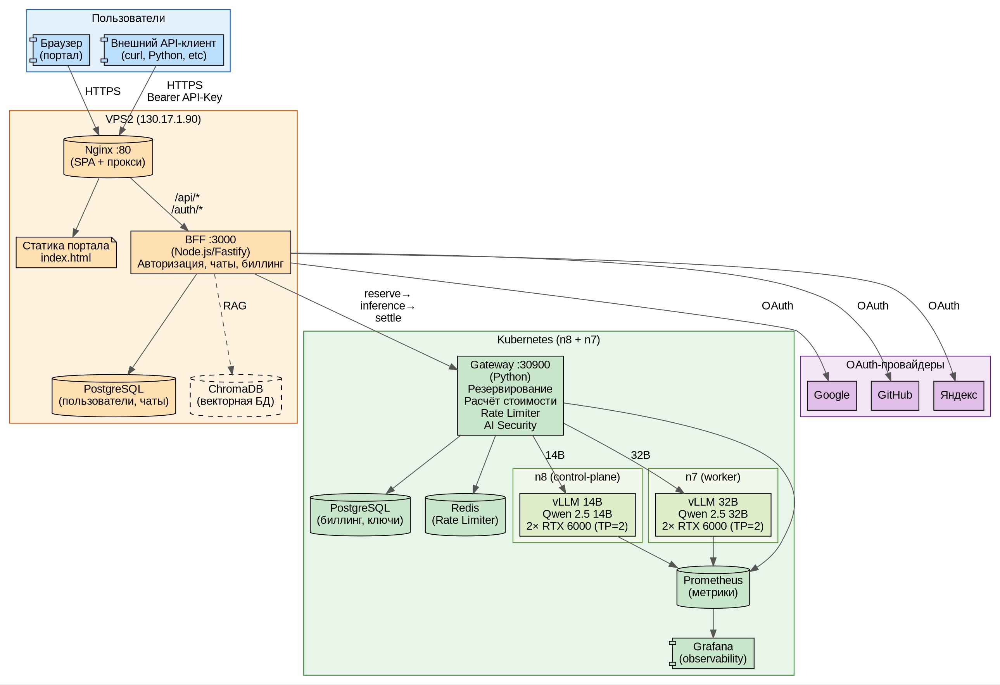
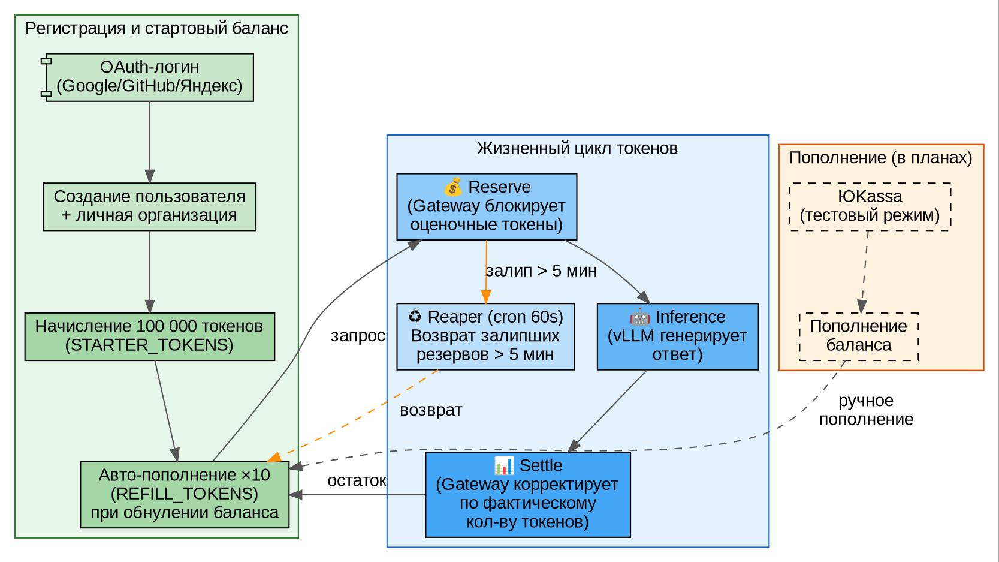
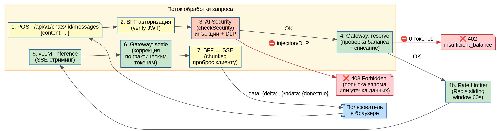
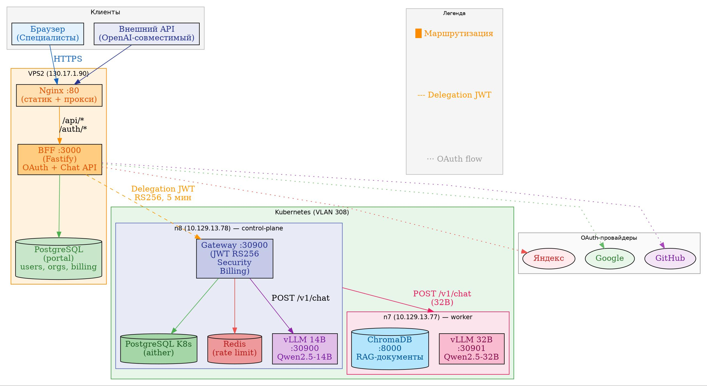
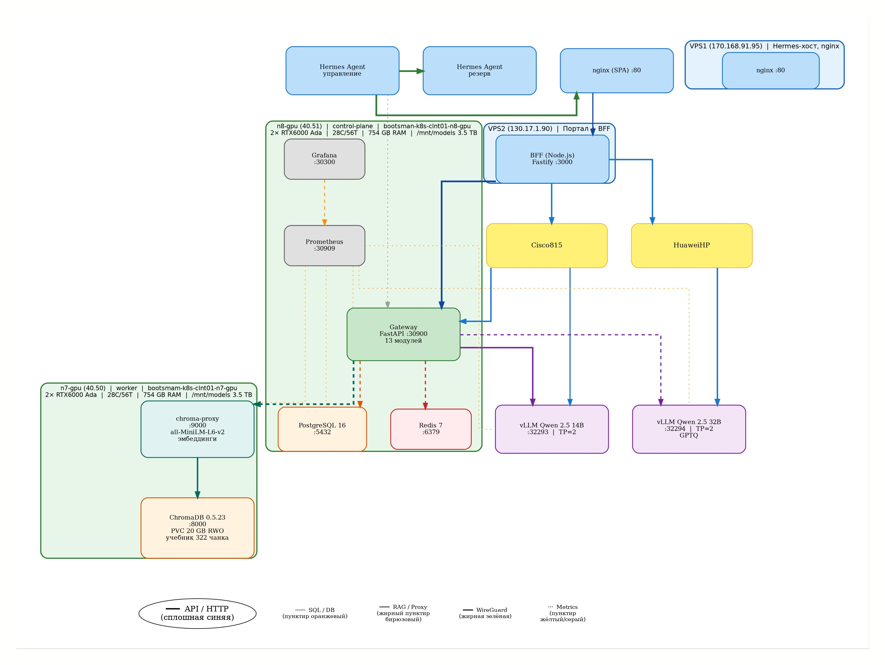

# Aither Platform — Техническое руководство по дорожной карте

**roadmap-manual.md** — детальное описание каждого этапа разработки платформы Aither.

**Дата:** 10.07.2026  
**Версия:** 2.1  
**Назначение:** Ознакомление технических специалистов, команд разработки и проектировщиков с процессом создания платформы.

---

## Оглавление

1. [Этап 1: MVP](#1-этап-1-mvp-дни-17)
2. [Этап 2: Биллинг и каталог](#2-этап-2-биллинг-и-каталог-дни-810)
3. [Этап 2.5: Авто-баланс и публичный доступ](#3-этап-25-авто-баланс-и-публичный-доступ-день-11)
4. [Этап 3: Observability и безопасность](#4-этап-3-observability-и-безопасность-дни-1114)
5. [Этап 4: RAG и кастомизация](#5-этап-4-rag-и-кастомизация-дни-1518)
6. [Этап 4.5: Стабилизация портала](#6-этап-45-стабилизация-портала-день-13)
7. [Этап 5: Продакшен-класс](#7-этап-5-продакшен-класс-недели-36)
8. [Этап 5a: Требования руководства](#8-этап-5a-требования-руководства-недели-711)
9. [Этап 6: Эксплуатация и развитие](#9-этап-6-эксплуатация-и-развитие-месяц-2)
10. [Этап 7: Пакет для закрытого контура](#10-этап-7-пакет-для-закрытого-контура)

---

## 1. Этап 1: MVP (дни 1–7)

### Описание

Создание минимально жизнеспособного продукта: одноузловой Kubernetes-кластер на GPU-сервере n8-gpu (bootsman-k8s-clnt01-n8-gpu, 10.129.13.78) с одной LLM-моделью, API-шлюзом, порталом и OAuth-аутентификацией.

### Функционал

- Запуск LLM-инференса (Qwen 2.5 14B) на GPU через vLLM
- OpenAI-совместимый API через Gateway с rate limiting (Redis)
- Веб-портал (SPA + BFF) с чат-интерфейсом и SSE-стримингом
- OAuth-вход через GitHub, Google, Яндекс
- Мониторинг GPU-метрик (DCGM)

### Состав компонентов

| Компонент | Версия | Назначение |
|---|---|---|
| Kubernetes | 1.29 | Оркестрация контейнеров |
| containerd | 1.7 | Контейнерный runtime |
| NVIDIA GPU Operator | 24.6 | Управление GPU-драйверами |
| vLLM | 0.6.4 | Инференс-сервер |
| Qwen 2.5 14B Instruct | — | LLM-модель (~28 GB), TP=2, 2×RTX6000 |
| Gateway (Python) | custom (mtls_server.py) | API-шлюз, rate limit, reserve/settle |
| Redis | 7-alpine | Sliding window rate limiter |
| Портал (SPA + BFF) | custom | Веб-интерфейс |
| BFF (Node.js/Fastify) | 4.x | Бэкенд портала |

### Принцип действия

```
Клиент → nginx :10443 → BFF :3000 (JWT auth)
  → Gateway :30900 (rate limit, reserve)
  → vLLM :32293 (инференс)
  → Gateway (settle)
  → BFF → Клиент (SSE-стриминг)
```

1. Клиент авторизуется через OAuth (GitHub/Google/Яндекс)
2. BFF выдаёт JWT-токен, проверяет баланс организации
3. Gateway резервирует токены, проверяет rate limit (Redis sliding window)
4. Запрос отправляется в vLLM, ответ стримится обратно
5. Gateway финализирует списание токенов (settle)

### Физическая схема (MVP)



### Конфигурационные файлы

| Файл | Назначение |
|---|---|
| `k8s/vllm-14b/deployment.yaml` | Deployment vLLM 14B (TP=2, 2× GPU) |
| `k8s/gateway/deployment.yaml` | Gateway Deployment + Service NodePort :30900 |
| `k8s/redis/deployment.yaml` | Redis для rate limiting |
| `configs/vps1/aither-failover` | nginx :10443 → BFF |
| `configs/vps2/remote-configs.txt` | nginx, systemd BFF |

### Последовательность конфигурации

1. **GPU-узел:** установка NVIDIA-драйвера 570, containerd, nvidia-container-toolkit
2. **K8s:** `kubeadm init`, Flannel CNI, NVIDIA GPU Operator
3. **Модель:** загрузка Qwen2.5-14B-Instruct в `/mnt/models/`
4. **vLLM:** `kubectl apply -f k8s/vllm-14b/deployment.yaml`
5. **Redis + Gateway:** `kubectl apply -f k8s/redis/`, `kubectl apply -f k8s/gateway/`
6. **Портал:** `npm install && npm start` на VPS2, nginx reverse proxy
7. **Проверка:** `curl https://fb1.spb.ru:10443/v1/chat/completions`

### Взаимодействия

| Компонент A | Компонент B | Протокол | Порт |
|---|---|---|---|
| BFF | Gateway | HTTP + JWT | 30900 |
| Gateway | Redis | Redis protocol | 6379 |
| Gateway | vLLM | HTTP (OpenAI API) | 32293 |
| nginx | BFF | HTTP (reverse proxy) | 3000 |
| BFF | PostgreSQL (VPS2) | SQL | 5432 |

### Потоки данных

```
[OAuth provider] → JWT claims → [BFF] → org_id + balance
[BFF] → POST /v1/chat/completions → [Gateway]
  → rate_limit_check(org_id, rpm=300, tpm=100000)
  → reserve_tokens(model, estimated_tokens)
  → POST /v1/chat/completions → [vLLM]
  ← SSE stream (tokens)
  → settle(reservation_id, actual_tokens)
  ← [BFF] ← SSE stream ← [Клиент]
```

---

## 2. Этап 2: Биллинг и каталог (дни 8–10)

### Описание

Подключение платёжной системы ЮKassa для монетизации, создание каталога моделей с декларативным описанием, добавление второго GPU-узла n7-gpu с 32B-моделью.

### Функционал

- Пополнение баланса через ЮKassa (тестовый режим)
- Каталог моделей: YAML-описание → динамический UI
- Двухузловой K8s-кластер: n8 (control-plane) + n7 (worker)
- Вторая модель: Qwen 2.5 32B GPTQ
- Автоматический выбор модели в UI на основе каталога
- Точный учёт токенов (usage collector, Redis-аккумулятор)

### Состав компонентов

| Компонент | Версия | Назначение |
|---|---|---|
| PostgreSQL 16 (K8s) | 16 | Биллинг: организации, пользователи, транзакции |
| PostgreSQL (VPS2) | 16-alpine | Пользователи портала, чаты |
| ЮKassa API | v3 | Приём платежей |
| Каталог моделей | catalog.yaml | Декларативное описание моделей |
| vLLM 32B | 0.6.4 | Вторая модель (n7, 2× RTX 6000) |
| Qwen 2.5 32B GPTQ | — | ~20 GB, квантованная |

### Физическая схема (этап 2)



### Конфигурационные файлы

| Файл | Назначение |
|---|---|
| `gateway/catalog.yaml` | Список моделей: имя, backend URL, лимиты, стоимость |
| `k8s/vllm-32b/deployment.yaml` | vLLM 32B GPTQ, TP=2, n7-gpu |
| `k8s/postgres/deployment.yaml` | PostgreSQL для биллинга |
| `db/migrations/007_subscription_tiers.sql` | Таблица тарифных планов |
| `portal/.env` | YOOKASSA_SHOP_ID, YOOKASSA_SECRET |

### Потоки данных

```
[Пользователь] → Пополнение → [ЮKassa] → webhook → [BFF] → [PostgreSQL]
                                                             → balance += amount

[Клиент] → выбор модели → [BFF] → GET /catalog → [Gateway] → [catalog.yaml]
[BFF] → POST /v1/chat/completions {model: "qwen2.5-32b"}
  → [Gateway] → routing.resolve("qwen2.5-32b")
  → backend = "http://vllm-qwen32b:8000"
  → reserve → POST /v1/chat/completions → [vLLM 32B]
  ← SSE stream ← settle ← [BFF]
```

---

## 3. Этап 2.5: Авто-баланс и публичный доступ (день 11)

### Описание

Автоматическое начисление стартовых токенов при регистрации, авто-пополнение при исчерпании, публикация Grafana-дашбордов.

### Функционал

- Стартовый баланс 100 000 токенов при первой OAuth-регистрации
- Авто-пополнение ×10 при падении баланса ниже порога
- Grafana-дашборды доступны через `fb1.spb.ru:10443/grafana/`

### Конфигурационные файлы

| Файл | Назначение |
|---|---|
| `configs/vps1/nginx-aither-failover.conf` | nginx → BFF + Grafana |
| `configs/vps2/aither-bff.service` | systemd unit для BFF |

---

## 4. Этап 3: Observability и безопасность (дни 11–14) — 🟡 в работе

### Описание

Создание комплексной системы мониторинга (GPU, инференс, биллинг), расширение AI Security Gateway (DLP + Prompt Injection), вынос Gateway в отдельный K8s-под.

### Функционал

- **Grafana-дашборды:** GPU-метрики (DCGM), vLLM Inference, Aither Billing ✅
- **DLP-фильтр:** детекция номеров карт, паспортов, СНИЛС, телефонов, API-ключей ✅
- **Prompt Injection-детектор:** 23 EN + 6 RU паттернов ✅
- **Gateway:** отдельный Deployment в K8s, двухпортовый (:8080 HTTP + :8443 mTLS) ✅
- **Security Egress:** фильтрация ДСП-маркеров и ПДн в ответах модели ✅
- **TTFT-мониторинг:** Time To First Token в Prometheus ✅
- **ЮKassa боевой режим:** ⬜ (тестовый режим работает, боевой отложен)
- **Parsec на n7:** ⬜ (`max_ilev=63 execstack=1`, отложен)

### Состав компонентов

| Компонент | Версия | Назначение |
|---|---|---|
| Prometheus | latest | Сбор метрик |
| Grafana | latest | Дашборды (3 папки: GPU, Inference, Billing) |
| DCGM Exporter | 3.3 | NVIDIA GPU-метрики |
| Gateway mTLS | custom | Двухпортовый (:8080 HTTP plain + :8443 mTLS) |
| security.py | custom | DLP ingress (карты, паспорта, СНИЛС, API-ключи) |
| security_egress.py | custom | Egress DLP (ДСП, ПДн, classified) |

### Физическая схема (этап 3)



### Конфигурационные файлы

| Файл | Назначение |
|---|---|
| `gateway/security.py` | DLP ingress-фильтр |
| `gateway/security_egress.py` | Egress-фильтр (ДСП, ПДн) |
| `gateway/mtls_server.py` | mTLS-обёртка (:8443) |
| `gateway/metrics.py` | Prometheus-метрики |
| `k8s/monitoring/prometheus.yaml` | Prometheus Deployment + ConfigMap |
| `k8s/monitoring/grafana.yaml` | Grafana Deployment + дашборды |

### Потоки данных (безопасность)

```
[Клиент] → [BFF] → [Gateway]
  → DLP ingress: check for card numbers, SSN, passport, phone
  → Prompt Injection: 29 patterns (EN+RU)
  → if blocked: 403 + audit_log
  → else: → vLLM
  → DLP egress: check response for classified info (ДСП, ПДн)
  → if blocked: strip sensitive data
  → else: → [BFF] → [Клиент]
```

---

## 5. Этап 4: RAG и кастомизация (дни 15–18)

### Описание

Создание гибридной RAG-подсистемы (Wiki Graph + ChromaDB через chroma-proxy), fine-tuning пайплайна (QLoRA), cost-aware routing.

### 5.1. Гибридный RAG (Wiki Graph + ChromaDB)

**Архитектура гибридного RAG:**

```
Запрос пользователя
  │
  ▼
Gateway: hybrid_rag.py
  │
  ├─ Wiki Graph (keyword search)
  │     ├─ 8 markdown-страниц базы знаний LLM-Wiki
  │     ├─ wiki_graph.py: граф взаимосвязанных страниц
  │     ├─ BFS-обход: radius=1 (прямые соседи)
  │     └─ Полнотекстовый поиск по заголовкам + content
  │
  └─ ChromaDB (векторный поиск)
        ├─ chroma-proxy :9000 (HTTP API)
        ├─ all-MiniLM-L6-v2 → эмбеддинг запроса (384-мерный)
        ├─ ChromaDB :8000 → поиск ближайших чанков
        └─ Коллекция "textbook": 39 чанков учебника (in-memory режим)
              │
              ▼
        Комбинирование: wiki_results + chroma_results
        → дедупликация → сортировка по relevance → top-K
```

**Wiki Graph (LLM-Wiki):**

LLM-Wiki — это граф знаний в стиле Karpathy: персистентный граф взаимосвязанных Markdown-страниц.

| Страница | Тип | Описание |
|---|---|---|
| `ai-gateway.md` | entity | AI Gateway: архитектура, rate limit, billing |
| `security-egress.md` | entity | Egress DLP: ДСП, ПДн, classified patterns |
| `siem-integration.md` | entity | SIEM: syslog CEF, security events |
| `multi-tenant-arch.md` | concept | Multi-tenant: изоляция org, namespace |
| `vault-integration.md` | entity | Vault PKI: управление ключами, mTLS |
| `chromadb-rag.md` | concept | ChromaDB: векторный поиск, чанковка |
| `llm-wiki.md` | concept | LLM-Wiki: compile-once, query-many |
| `auth-flow.md` | concept | Аутентификация: OAuth, JWT, API-ключи |

**Принцип работы Wiki Graph:**
- `wiki_graph.py` загружает все .md-файлы из ConfigMap `gateway-wiki`
- Парсит frontmatter (title, type, tags) и [[wikilinks]] для построения графа
- При поиске: keyword match по заголовкам, тегам и содержимому
- Graph expansion: BFS от найденных страниц (radius=1) для захвата связанных

**RAG-чат (полный цикл):**

```
[Пользователь] → Включает RAG в UI → вводит вопрос
  → [Frontend] → POST /api/rag/chat {messages, rag_query, org_id}
  → [BFF] → POST /v1/rag/hybrid-query {query, top_k, wiki_radius}
    → [Gateway: hybrid_rag.py]
      ├─ wiki_graph.search(query)[:top_k]
      └─ chroma-proxy :9000 POST /query {query, top_k}
    ← {wiki_results, chroma_results}
  → [BFF] → инжектит контекст в system prompt
  → [BFF] → POST /v1/chat/completions {augmented_messages}
    → [Gateway] → vLLM
    ← ответ с учётом контекста
  → [BFF] → POST /api/v1/chats/:id/rag-messages {content, assistant_content}
    → сохранение в PostgreSQL
  ← [Frontend] → отображение ответа + RAG sources
```

### 5.2. Fine-tuning (QLoRA)

| Параметр | Значение |
|---|---|
| Метод | QLoRA 4-bit (NF4) |
| Базовая модель | Qwen2.5-14B-Instruct |
| Адаптер | `astra-14b` |
| Rank (r) | 8 |
| Размер адаптера | ~65 MB |
| Обучение | RTX 6000, 100 шагов |

### 5.3. Cost-aware routing

Автоматический выбор модели по сложности запроса:

| Сложность | Модель |
|---|---|
| Простые (≤7 chars) | Qwen 2.5 14B |
| Средние (≤50 chars) | Qwen 2.5 14B |
| Сложные (score ≥30) | Qwen 2.5 32B |
| Явное указание | По имени модели |

### Состав компонентов

| Компонент | Версия | Назначение |
|---|---|---|
| ChromaDB | 0.5.23 | Векторная БД (RAG) |
| chroma-proxy | custom | Текстовый прокси → эмбеддинги → ChromaDB |
| all-MiniLM-L6-v2 | — | Эмбеддинг-модель (384-мерные векторы) |
| LLM-Wiki | 8 страниц | Keyword search + graph expansion |
| hybrid_rag.py | ~200 строк | Гибридный поиск: wiki + chroma |
| wiki_graph.py | ~400 строк | Граф знаний (BFS, fulltext search) |
| routing.py | custom | Cost-aware model selection |

### Физическая схема (RAG)



### Конфигурационные файлы

| Файл | Назначение |
|---|---|
| `gateway/hybrid_rag.py` | Гибридный RAG: wiki + chroma-proxy |
| `gateway/wiki_graph.py` | LLM-Wiki: граф знаний |
| `k8s/chromadb/chroma-proxy.yaml` | ConfigMap + Deployment + Service :9000 |
| `k8s/chromadb/deployment.yaml` | ChromaDB 0.5.23 + PVC RWO |
| `wiki/*.md` | 8 страниц базы знаний LLM-Wiki |
| `scripts/ingest_textbook.py` | Чанковка и загрузка учебника в ChromaDB |

### Последовательность конфигурации

1. **PVC:** создание `chromadb-data` (20 GB, RWO)
2. **ChromaDB:** `kubectl apply -f k8s/chromadb/deployment.yaml` (0.5.23, n7-gpu)
3. **chroma-proxy:** `kubectl apply -f k8s/chromadb/chroma-proxy.yaml`
4. **Инжест:** `kubectl exec deploy/chroma-proxy -- python3 /chroma/ingest_textbook.py`
5. **Wiki:** создание ConfigMap `gateway-wiki` из 8 .md-файлов
6. **Gateway:** обновление образа с `hybrid_rag.py`, env `CHROMA_PROXY_URL`
7. **BFF:** эндпоинты `/api/rag/chat`, `/api/rag/query`, `/api/rag/status`

⚠️ **Текущее ограничение:** chroma-proxy использует in-memory ChromaDB — данные теряются при рестарте пода. После перезапуска необходим повторный инжест учебника. Персистентность через PVC запланирована в Этапе 7.

---

## 6. Этап 4.5: Стабилизация портала (день 13)

### Описание

Критическое исправление багов портала после развёртывания: восстановление OAuth, исправление чата (500-ошибки), отображение баланса, org_id в чатах, очистка лендинга от dev-режима.

### Выполненные задачи

| Задача | Статус | Описание |
|---|---|---|
| OAuth-восстановление | ✅ | Яндекс/Google/GitHub — env vars в systemd unit |
| Чат 500 fix | ✅ | `req.user` → `p.user_id` в обработчике сообщений |
| Баланс в UI | ✅ | GET `/api/v1/billing?org_id=...` + отображение |
| Dev-вход убран | ✅ | Скрыта кнопка dev-входа с лендинга |
| Подсветка кода | ✅ | Исправлены hljs-артефакты, кнопка копирования |
| org_id в чатах | ✅ | Миграция БД + BFF + фронтенд |
| Модели 14B + 32B | ✅ | Обе работают через чат, переключение в UI |

### Принцип действия (исправленный поток чата)

```
Браузер → VPS2:80 (Nginx) → VPS2:3000 (BFF)
  ├─ OAuth: Яндекс / Google / GitHub → JWT-токен
  ├─ Chat API: /api/v1/chats → /api/v1/chats/{id}/messages
  └─ Billing: /api/v1/billing?org_id=...

BFF → Gateway K8s :30900 (JWT HS256 → RS256 fallback)
  ├─ Security check (prompt injection + DLP)
  ├─ Billing (reserve → inference → settle)
  └─ vLLM:
       ├─ 14B → n8:vllm :8000 (Qwen2.5-14B-Instruct)
       └─ 32B → n7:vllm-qwen32b :8000 (Qwen2.5-32B-Instruct)
```

---

## 7. Этап 5: Продакшен-класс (недели 3–6) — 🟡 4/7 выполнено

### Описание

Переход к многоарендной архитектуре с изоляцией, тарифными планами, резервированием (VPS3 failover), SaaS-порталом.

### Выполненные задачи

| Задача | Статус | Описание |
|---|---|---|
| **21a. Тарифные планы** | ✅ | Free/Standard/VIP/Enterprise с разными лимитами (RPM, TPM, daily, models, RAG) |
| **22. VPS3 Failover** | ✅ | Горячий резерв портала + Hermes-синхронизация памяти/навыков |
| **23. SaaS-портал** | ✅ | Регистрация, биллинг-дашборды, админ-панель |
| **23a. LDAP-аутентификация** | ✅ | FreeIPA/ALD Pro через `ldap.ts` |
| **Портал: безопасность** | ✅ | Security hardening (CSP, CORS, helmet, rate limit) |

### Оставшиеся задачи

| Задача | Статус | Описание |
|---|---|---|
| **21. Multi-tenant изоляция** | ⬜ | Изоляция по организациям (чат-сессии per-org — частично, выполнено 07.07) |
| **24. HA K8s control plane** | ⬜ | Отказоустойчивый control plane (2–3 мастер-узла) |
| **25. NVLink-мосты** | 🔒 | P2P GPU-коммуникация (нет физических мостов) |
| **26. Модели 70B+** | 🔒 | NVSwitch, 4–8 GPU (заблокировано до NVLink)

### Физическая схема (этап 5)



### Конфигурационные файлы

| Файл | Назначение |
|---|---|
| `portal/ldap.ts` | LDAP/ALD Pro аутентификация |
| `portal/policies.ts` | Политики доступа (org-level) |
| `portal/security.ts` | Security hardening (CSP, CORS, rate limit) |
| `db/migrations/007_subscription_tiers.sql` | Тарифные планы |
| `db/migrations/008_auth_tables_k8s.sql` | OAuth-таблицы |

---

## 8. Этап 5a: Требования руководства (недели 7–11)

### Описание

Реализация требований информационной безопасности и корпоративных стандартов.

### Выполненные задачи

| Задача | Статус | Описание |
|---|---|---|
| **34. Security Gateway Egress** | ✅ | ДСП-фильтр на выходе (classified data leak prevention) |
| **35. SIEM-интеграция** | ✅ | Syslog CEF + security_events таблица PostgreSQL |
| **36. Vault-интеграция** | ✅ | Внешняя генерация API-ключей + политики ИБ |
| **37. LLM-Wiki + гибридный RAG** | ✅ | Wiki graph search + ChromaDB (см. Этап 4) |
| **38. Профили организаций** | ✅ | Security policy per org |
| **39. API Gateway mgmt API** | ✅ | Управление очередями, моделями, drain |
| **40. TTFT-мониторинг** | ✅ | Time To First Token в Prometheus |

### Принцип действия (egress DLP)

```
[Модель] → ответ с текстом
  → [Gateway: security_egress.py]
  → проверка на ДСП-маркеры, ПДн, classified patterns
  → если найдено: strip/block + audit_log + SIEM event
  → иначе: пропустить ответ
  → [BFF] → [Клиент]
```

### Vault PKI (mTLS)

```
[Gateway] → запрос сертификата → [Vault PKI]
  ← сертификат (TTL 30 дней)
[BFF] → mTLS handshake → [Gateway :8443]
  → client cert verification → JWT auth → vLLM
```

Примечание: mTLS отключён на период отладки RAG (используется plain HTTP :30900).

---

## 9. Этап 6: Эксплуатация и развитие (месяц 2+)

### Описание

Переход от пилотного проекта к промышленной эксплуатации: автомасштабирование (HPA), CI/CD-пайплайн, внешний API Gateway с документацией, полный аудит безопасности, учебное пособие.

### Выполненные задачи

| Задача | Статус | Описание |
|---|---|---|
| **27. Промышленная эксплуатация** | ✅ | Pilot → Production: мониторинг, алерты |
| **28. Автомасштабирование** | ✅ | K8s HPA по CPU/Memory, Gateway HPA (min=1, max=3) |
| **29. CI/CD** | ✅ | GitHub Actions → lint + авто-деплой |
| **30. API Gateway + OpenAPI** | ✅ | Внешний доступ, OpenAI API, Swagger (openapi.yaml) |
| **31. Аудит безопасности** | ✅ | Полное тестирование (portal-security-audit) |
| **32. Документация** | ✅ | Учебное пособие (24 главы, ~780 стр., 5 частей) |

### Состав компонентов

| Компонент | Версия | Назначение |
|---|---|---|
| HPA Gateway | autoscaling/v2 | Автомасштабирование (CPU 1%/70%, Mem 26%/80%, min=1, max=3) |
| HPA vLLM | autoscaling/v2 | По CPU/Memory (maxReplicas=1 на узел, ждёт GPU-узлов) |
| GitHub Actions | — | CI/CD: сборка Docker-образа Gateway → push в ghcr.io → deploy → health-check → Telegram |
| Gateway Dockerfile | `gateway/Dockerfile` | python:3.12-slim, 11 модулей, 52 MB |
| OpenAPI (Swagger) | 3.0 | API-документация |
| Учебное пособие | 24 гл., ~780 стр. | Техническая документация |

### #28 HPA — детали реализации (10.07.2026)

| Деплоймент | Было | Стало |
|---|---|---|
| `vllm-qwen` (14B) | requests: GPU only | requests: cpu=4, mem=32Gi; limits: cpu=16, mem=64Gi |
| `vllm-qwen32b` (32B) | requests: GPU only | requests: cpu=4, mem=32Gi; limits: cpu=16, mem=64Gi |

Стратегия деплоя: `Recreate` (иначе новый под не стартует — GPU заняты старым).

### #29 CI/CD — детали реализации (10.07.2026)

```
Push в main (gateway/**) →
  changes (paths-filter) →
  build-gateway (Docker build + push в ghcr.io) →
  deploy (kubectl set image + rollout status) →
  health-check (5 попыток curl /health) →
  rollback (kubectl rollout undo при провале) →
  Telegram-уведомление
```

### Структура учебного пособия

| Часть | Главы | Содержание |
|---|---|---|
| I. Теоретические основы | 1–7 | Архитектура AI-платформ, GPU, Docker, K8s |
| II. Практическое развёртывание | 8–14 | Деплой, настройка, мониторинг |
| III. Разработка и доработка | 15–18 | API, RAG, безопасность, кастомизация |
| IV. Production-эксплуатация | 19–24 | HA, мультиарендность, монетизация, SIEM |
| Приложения и ЛР | ЛР 1–12 | Лабораторный практикум |

---

## 10. Этап 7: Пакет для закрытого контура

### Описание

Создание самодостаточного офлайн-пакета (`offline-deploy/`) для развёртывания платформы в изолированном контуре без доступа в Интернет.

### Функционал

- Полный цикл развёртывания: `make deploy` (Ansible)
- Автоматическая загрузка офлайн-зависимостей: `make offline-load`
- Приёмо-сдаточные тесты: `make test` (smoke + API + security + load)
- Админ-панель: 11 вкладок с полным CRUD организаций, пользователей, API-ключей, LDAP

### Админ-панель — 11 вкладок (09–10.07.2026)

| Вкладка | Данные от | Функционал |
|---|---|---|
| 🫀 Health | Gateway | Статус компонентов |
| 🧠 Модели | Gateway | Список моделей, статусы |
| 📊 Очереди | Gateway | Очереди запросов |
| 🏢 Организации | Gateway + BFF | CRUD: список, детали, каскадное удаление |
| ⏱️ Reaper | Gateway | Reservation reaper |
| 👥 Пользователи | BFF | CRUD: список, роли, организации, удаление |
| 💰 Токены | Gateway | Балансы, списания |
| ⚙️ Тарифы | BFF | 4 тарифа (Free/Standard/VIP/Enterprise) |
| 🔧 Настройки | BFF | portal_settings (9 ключей) |
| 🗺️ Статус 5а | Статическая | Статус требований руководства |

Итоговое состояние: 5 пользователей, 6 организаций, 11 вкладок админ-панели.

### Состав компонентов

| Компонент | Версия | Назначение |
|---|---|---|
| offline-deploy kit | 1.2.0 | Самодостаточный пакет развёртывания |
| Ansible | 2.16+ | Автоматизация деплоя |
| Docker images | см. images.txt | Все образы платформы |
| Python wheels | см. requirements.txt | Gateway-зависимости |
| NPM package | portal-offline.tgz | Собранный портал |

### Структура пакета (v1.2.0)

```
offline-deploy/
├── docs/           ← 8 документов (архитектура → upgrade)
├── playbooks/      ← 10 Ansible playbooks
├── k8s/            ← Все манифесты:
│   ├── gateway/    ←   Gateway (13 модулей: hybrid_rag, security, routing, ...)
│   ├── vllm-14b/   ←   vLLM 14B (TP=2)
│   ├── vllm-32b/   ←   vLLM 32B (TP=2)
│   ├── chromadb/   ←   ChromaDB 0.5.23 + chroma-proxy
│   ├── postgres/   ←   PostgreSQL 16
│   ├── redis/      ←   Redis 7
│   └── monitoring/ ←   Prometheus + Grafana
├── offline/        ← Офлайн-зависимости:
│   ├── docker/     ←   images.tar.gz
│   ├── pip/        ←   wheels + requirements.txt
│   ├── npm/        ←   portal-offline.tgz
│   └── models/     ←   transfer.sh + model-list.txt
├── scripts/        ← 7 скриптов эксплуатации
├── configs/        ← Эталонные конфигурации
└── tests/          ← 4 приёмо-сдаточных теста
```

### Последовательность развёртывания (закрытый контур)

1. **Подготовка носителя:** `make bundle` на машине с интернетом
2. **Перенос:** флеш-носитель → целевая машина (Astra Linux)
3. **Загрузка:** `make offline-load` (Docker, pip, npm)
4. **Деплой:** `make deploy` (Ansible playbooks, ~1 час)
5. **RAG-инициализация:** инжест учебника в ChromaDB
6. **Проверка:** `make test` (smoke, API, security, load)

---

## Сводная таблица этапов

| Этап | Задач | Выполнено | Осталось | Статус |
|---|---|---|---|---|
| 1. MVP | 7 | 7 | 0 | ✅ |
| 2. Биллинг + каталог | 4 | 4 | 0 | ✅ |
| 2.5. Авто-баланс | 2 | 2 | 0 | ✅ |
| 3. Observability + безопасность | 5 | 3 | 2 | 🟡 (ЮKassa, Parsec) |
| 3a. Стабилизация портала | 1 | 1 | 0 | ✅ |
| 4. RAG + кастомизация | 4 | 4 | 0 | ✅ |
| 5. Продакшен-класс | 7 | 4 | 3 | 🟡 (Multi-tenant, HA, NVLink, 70B) |
| 5a. Требования руководства | 9 | 9 | 0 | ✅ |
| 6. Эксплуатация | 6 | 6 | 0 | ✅ |
| 7. Закрытый контур | 7 | 7 | 0 | ✅ |
| **Итого** | **51** | **46** | **5** | **90%** |

### Оставшиеся задачи (5 из 51)

| # | Задача | Этап | Статус |
|---|---|---|---|
| 13 | ЮKassa боевой режим | 3 | ⬜ |
| 15 | Parsec на n7 (`max_ilev=63 execstack=1`) | 3 | ⬜ |
| 21 | Multi-tenant изоляция | 5 | ⬜ |
| 24 | HA K8s control plane | 5 | ⬜ |
| 25/26 | NVLink-мосты + 70B модели | 5 | 🔒 (нет оборудования) |

### Что сделано за последние дни (07–10.07.2026)

| Дата | Задача | Результат |
|---|---|---|
| 07.07 | Инжест ChromaDB | 39 чанков учебника, RAG восстановлен |
| 07.07 | Multi-tenant: чаты per-org | org_id в БД, фильтрация на SQL-уровне |
| 08–09.07 | Stage 5a: Требования руководства | 9/9 задач (#34–#40, LDAP, чат) |
| 09.07 | Admin-панель: CRUD orgs/users/keys | 11 вкладок, каскадное удаление |
| 10.07 | #28 HPA + #29 CI/CD | Автомасштабирование vLLM/Gateway, Docker-образ + GitHub Actions |
| 10.07 | Защита админ-панели | Cookie-аутентификация, кнопка «Админка» для админов |
| 10.07 | Документация v1.1 | Архитектура, admin-guide, user-guide, .env.template |

---

## Схемы

Все диаграммы сгенерированы из DOT-файлов и доступны в векторном (SVG) и растровом (JPG/PNG) форматах:

| Схема | DOT | SVG | JPG |
|---|---|---|---|
| MVP архитектура | `diagrams/architecture.dot` | `diagrams/architecture.svg` | — |
| Биллинг и каталог | `diagrams/billing-flow.dot` | `diagrams/billing-flow.svg` | — |
| Чат-поток (Observability) | `diagrams/chat-flow.dot` | `diagrams/chat-flow.svg` | — |
| День 13: архитектура | `diagrams/day13-architecture.dot` | `diagrams/day13-architecture.svg` | `diagrams/day13-architecture.jpg` |
| День 13: исправления | `diagrams/day13-fixes.dot` | `diagrams/day13-fixes.svg` | `diagrams/day13-fixes.jpg` |
| Физическая архитектура v1 | `diagrams/physical-architecture.dot` | `diagrams/physical-architecture.svg` | — |
| Физическая архитектура v2 | `diagrams/physical-architecture-v2.dot` | `diagrams/physical-architecture-v2.svg` | `diagrams/physical-architecture-v2.jpg` |

*Документ создан на основе ROADMAP.md, lab-journal.md и живой конфигурации платформы Aither.*
