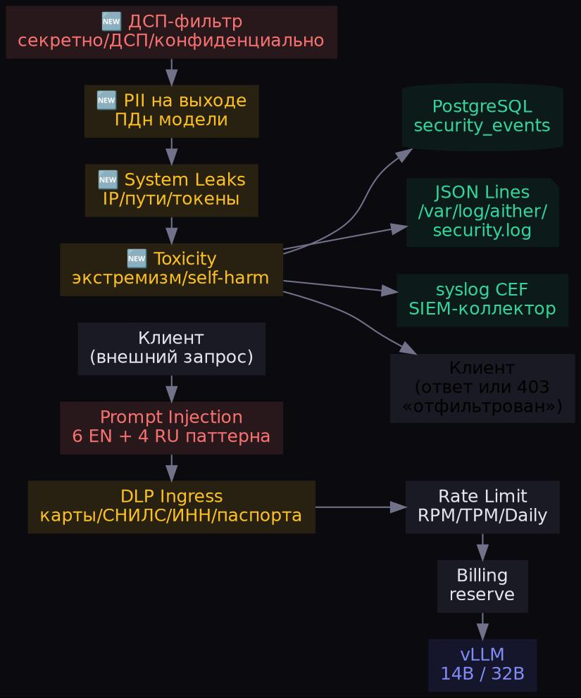
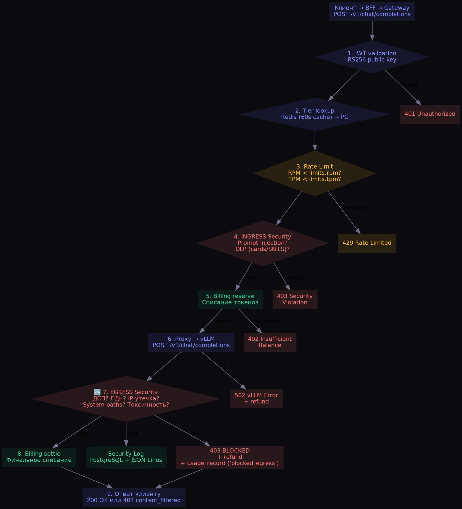
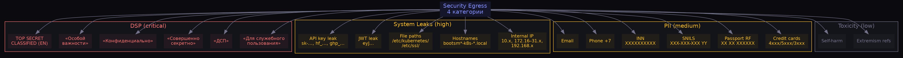
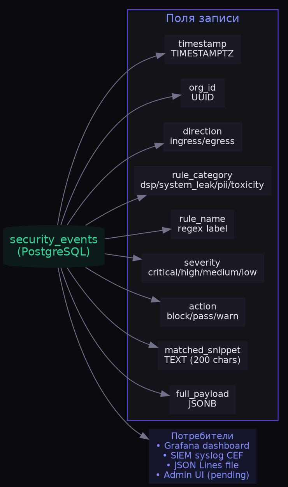
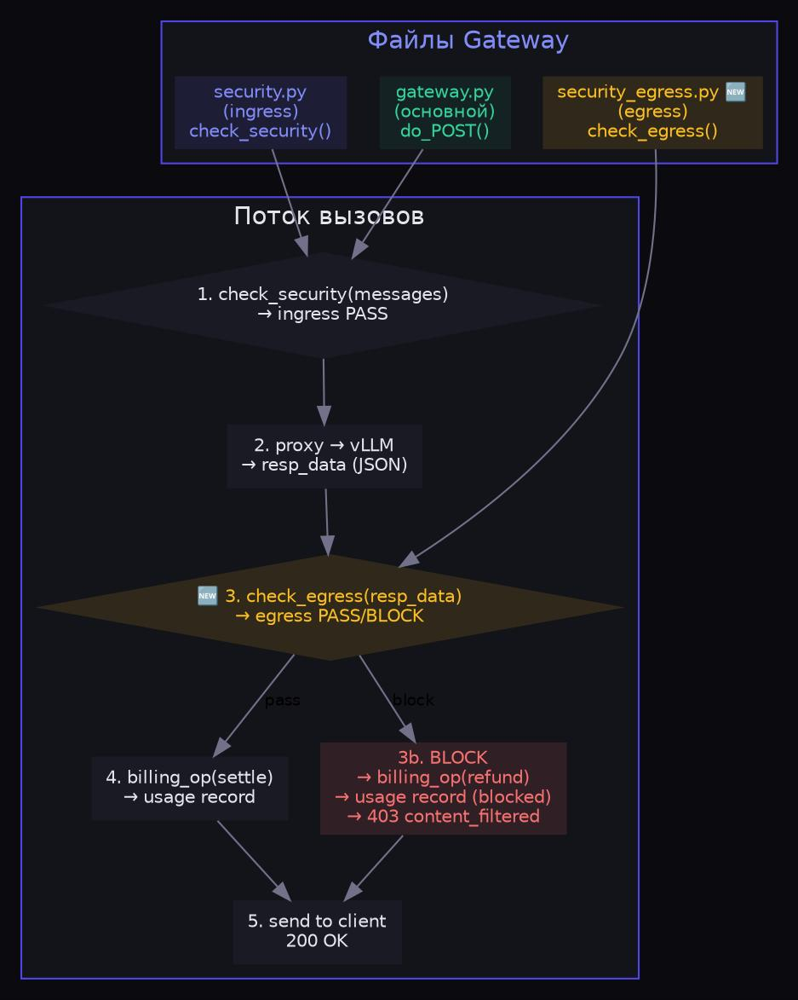

# Security Gateway Egress — ДСП-фильтр на выходе

**Дата:** 09.07.2026  
**Задача:** #34 ROADMAP  
**Компонент:** `gateway/security_egress.py` (новый модуль)  
**Изменения:** `gateway/gateway.py` (интеграция egress)

---

## Архитектура: Ingress + Egress Security Gateway



## Поток обработки запроса (полный)



## Категории правил Egress



## Модель данных security audit



## Интеграция в Gateway



---

## Таблица правил

| Категория | Severity | Паттернов | Пример срабатывания |
|---|---|---|---|
| **DSP** | 🔴 critical | 11 | «Для служебного пользования», «ДСП», «Секретно», «TOP SECRET» |
| **System Leaks** | 🟠 high | 10 | Internal IP, hostname, /etc/ssl/, JWT eyJ..., API key sk-... |
| **PII** | 🟡 medium | 6 | Credit card, паспорт РФ, СНИЛС, ИНН, телефон, email |
| **Toxicity** | ⚪ low | 2 | Экстремизм, self-harm |

## Код: выдержки из `security_egress.py`

### Извлечение текста из ответа

```python
def _extract_text(data: dict) -> str:
    """Extract all text from vLLM response for scanning."""
    parts = []
    for choice in data.get("choices", []):
        msg = choice.get("message", {})
        content = msg.get("content", "")
        reasoning = msg.get("reasoning_content", "") or msg.get("thinking", "")
        parts.extend([content, reasoning])
    if "text" in data: parts.append(data["text"])
    if "response" in data: parts.append(data["response"])
    return "\n".join(parts)
```

### DSP-паттерны

```python
DSP_PATTERNS = [
    (r"(?i)для\s+служебного\s+пользования", "dsp_marker"),
    (r"(?i)\bДСП\b", "dsp_abbreviation"),
    (r"(?i)совершенно\s+секретно", "top_secret"),
    (r"(?i)\bсекретно\b", "classified_secret"),
    (r"(?i)\bконфиденциально\b", "confidential"),
    (r"(?i)\bTOP\s*SECRET\b", "top_secret_en"),
]
```

### Интеграция в gateway.py

```python
# После получения ответа от vLLM
status, resp_body, ct = self._proxy("POST", self.path, body_str)
resp_data = json.loads(resp_body.decode())

# 🆕 EGRESS Security Check
egress_ok, egress_reason, egress_audit = check_egress(
    resp_data,
    org_id=str(org_id),
    request_id=ref,
    model=req_data.get("model", "unknown"),
    request_hash=hashlib.sha256(body_str.encode()).hexdigest()[:16],
    db_pool=db_pool,
)
if not egress_ok:
    billing_op(org_id, "refund", reserve_amount, ref)
    self._json(403, {
        "error": "content_filtered",
        "reason": "Ответ содержит информацию ограниченного распространения",
        "code": egress_reason,
    })
    return  # ← ответ НЕ отправляется клиенту
```

---

## Результаты деплоя

| Компонент | Статус |
|---|---|
| `gateway/security_egress.py` | ✅ Создан (10.6 КБ, 250 строк) |
| `gateway/gateway.py` | ✅ Интегрирован egress-проверка |
| K8s ConfigMap `gateway-code` | ✅ Обновлён (6 файлов) |
| Gateway Deployment | 🔄 Rolling update (новый под стартует) |

## Следующие шаги

- **Тестирование:** отправить запрос с ДСП-контентом через Gateway → ожидать 403
- **#35 SIEM-интеграция:** syslog CEF формат для внешних SIEM-систем
- **#36 Vault-интеграция:** внешняя генерация API-ключей
