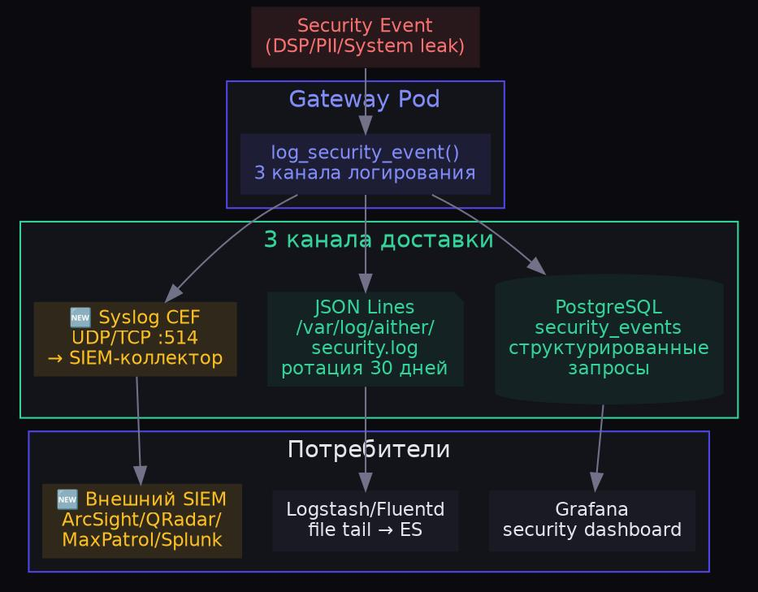
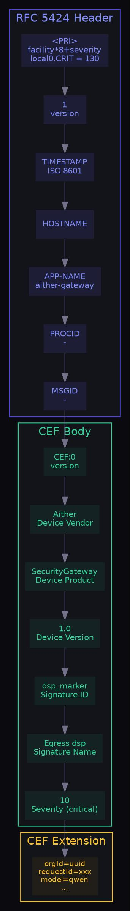
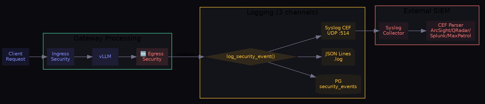

# SIEM-интеграция — syslog CEF + Security Log Storage

**Дата:** 09.07.2026  
**Задача:** #35 ROADMAP  
**Компонент:** `gateway/security_egress.py` (расширен)  
**Основа:** #34 Security Gateway Egress

---

## Архитектура хранения и доставки security-событий



## Формат CEF-сообщения



## Пример CEF-сообщения

```
<130>1 2026-07-09T14:29:48.000Z skravchuk-vps-1 aither-gateway - - - CEF:0|Aither|SecurityGateway|1.0|dsp_marker|Egress dsp|10|orgId=00000000-0000-0000-0000-000000000001 requestId=f58d5826 model=/models/Qwen2.5-14B-Instruct direction=egress ruleCategory=dsp action=block requestHash=70ecdf938851137d snippet=для служебного пользования msg=Security egress: dsp/dsp_marker
```

Разбор по полям:

| Поле | Значение | Описание |
|---|---|---|
| `<130>` | PRI | local0 (16) × 8 + CRIT (2) = 130 |
| `1` | Version | RFC 5424 |
| `2026-07-09T...` | Timestamp | ISO 8601 UTC |
| `aither-gateway` | APP-NAME | Идентификатор приложения |
| `CEF:0` | CEF Version | 0 |
| `Aither` | Vendor | Производитель |
| `SecurityGateway` | Product | Продукт |
| `dsp_marker` | Signature ID | Уникальный ID правила |
| `Egress dsp` | Name | Человекочитаемое имя |
| `10` | Severity | 10 = Critical (CEF scale 0-10) |

## Поток событий безопасности



## Конфигурация SIEM

| Переменная | По умолчанию | Описание |
|---|---|---|
| `SIEM_ENABLED` | `true` | Включить отправку в SIEM |
| `SIEM_HOST` | `127.0.0.1` | Адрес SIEM-коллектора |
| `SIEM_PORT` | `514` | Порт (514 — стандартный syslog) |
| `SIEM_PROTO` | `udp` | Протокол: `udp` или `tcp` |
| `SIEM_FACILITY` | `local0` | Syslog facility: local0-local7 |
| `SIEM_APP_NAME` | `aither-gateway` | Имя приложения в syslog |
| `SECURITY_LOG_DIR` | `/var/log/aither` | Директория логов |
| `SECURITY_LOG_RETENTION` | `30` | Дней хранения JSON-логов |

## Тестирование

| Тест | Результат |
|---|---|
| DSP → 403 + security_event | ✅ `dsp_marker` в PostgreSQL + JSON log |
| Нормальный запрос → 200 | ✅ Без блокировки |
| Security log файл | ✅ `/var/log/aither/security.log` (756 bytes) |
| CEF формат | ✅ RFC 5424 + CEF:0 header, все поля |
| PRI calculation | ✅ local0.CRIT = 130 |
| Vendor/Product | ✅ Aither/SecurityGateway |
