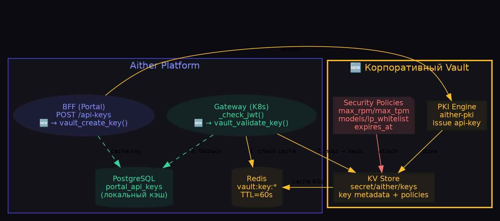
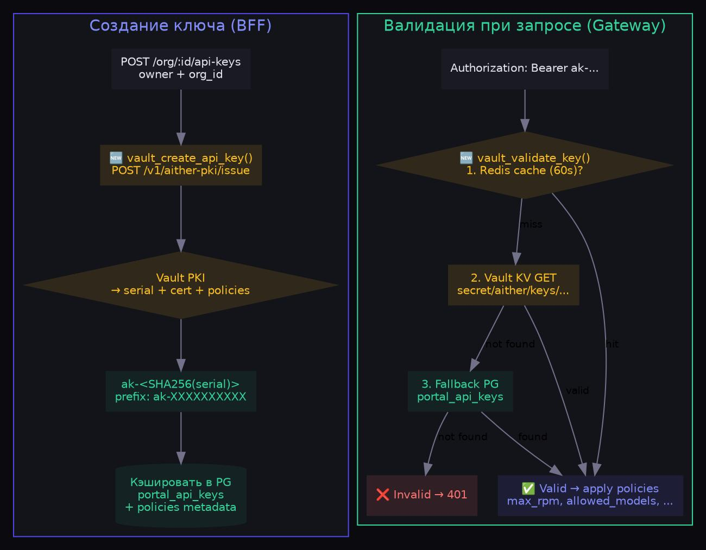
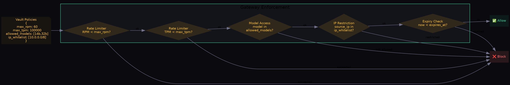

# Vault-интеграция — внешняя генерация API-ключей + политики ИБ

**Дата:** 09.07.2026  
**Задача:** #36 ROADMAP  
**Компонент:** `gateway/vault.py` (новый модуль, 250 строк)  

---

## Архитектура: Vault как внешний источник ключей

## Поток создания и валидации ключа

## Политики ИБ → Rate Limiting

## Ключевые функции vault.py

| Функция | Назначение | Кто вызывает |
|---|---|---|
| `vault_create_api_key()` | Выпуск ключа через Vault PKI | BFF (Portal) |
| `vault_validate_key()` | Проверка ключа + возврат политик | Gateway (_check_jwt) |
| `vault_revoke_key()` | Отзыв ключа в Vault | BFF (Portal) |
| `vault_health()` | Проверка связности с Vault | Health check |

## Режимы работы

| Режим | `VAULT_ENABLED` | Поведение |
|---|---|---|
| **Production** | `true` | Vault → Redis cache (60s) → PostgreSQL fallback |
| **Development** | `false` | Только PostgreSQL (текущее поведение) |

## Конфигурация (env vars)

| Переменная | По умолчанию |
|---|---|
| `VAULT_ENABLED` | true |
| `VAULT_ADDR` | http://vault:8200 |
| `VAULT_TOKEN` | (обязательно) |
| `VAULT_PKI_PATH` | aither-pki |
| `VAULT_PKI_ROLE` | api-key |
| `VAULT_TIMEOUT` | 5 |
