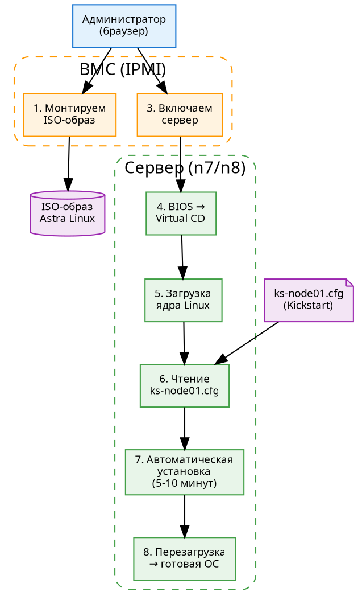
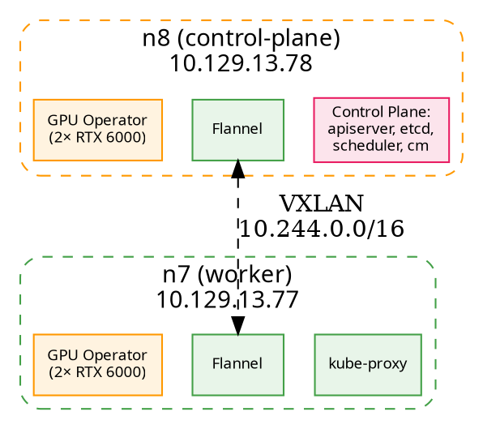

# Часть II. Практическое развёртывание

> **Документ 2 из 5.** Пошаговый деплой всей платформы Aither — от голого железа до production. Каждая команда объяснена. Каждый манифест разобран построчно.

---

# Глава 8. Подготовка серверов и установка ОС

> **Цель главы:** подготовить серверы YADRO VEGMAN S320 к работе: установить Astra Linux SE 1.8 через Kickstart, настроить сеть, SSH, драйверы NVIDIA. После этой главы сервер будет готов к установке Kubernetes.

---

## 8.1. Обзор инфраструктуры: что и где устанавливаем

Прежде чем что-то устанавливать, освежим в памяти карту нашей инфраструктуры:

| Узел | IP | Роль | ОС | GPU | Что будем ставить |
|---|---|---|---|---|---|
| **n8** | 10.129.13.78 | K8s control-plane + worker | Astra Linux SE 1.8 | 2× RTX 6000 | ОС → драйверы → containerd → kubeadm init |
| **n7** | 10.129.13.77 | K8s worker | Astra Linux SE 1.8 | 2× RTX 6000 | ОС → драйверы → containerd → kubeadm join |
| **VPS1** | 170.168.91.95 | Входная точка | Ubuntu 24.04 | — | Уже настроен (nginx, WireGuard) |
| **VPS2** | 130.17.1.90 | Портал | Ubuntu | — | Уже настроен (BFF, nginx, PostgreSQL) |

Сегодня мы работаем с n7 и n8 — серверами YADRO VEGMAN S320. Это мощные машины:
- 2× Xeon 6258R (28C/56T на сокет)
- 754 GB RAM
- 42 TB SAS SSD
- 2× NVIDIA RTX 6000 (24 GB VRAM каждая)
- BMC для удалённого управления

---

## 8.2. Установка Astra Linux SE 1.8 через Kickstart

### Что такое Kickstart

Обычно установка ОС — это диалог: выбрать язык → разметить диск → выбрать пакеты → ... 20 экранов, 20 минут кликов. Для одного сервера — терпимо. Для десяти — ад.

**Kickstart** — это файл с ответами на все вопросы установщика. Вы пишете его один раз, и установка проходит полностью автоматически.

Структура Kickstart-файла:
```
# 1. Команды (что делать)
network --bootproto=static --ip=10.129.13.78 --netmask=255.255.255.0
lang ru_RU.UTF-8
keyboard ru
timezone Europe/Moscow

# 2. Разметка диска
clearpart --all --initlabel
part /boot --fstype=ext4 --size=1024
part / --fstype=ext4 --size=102400
part /data --fstype=ext4 --size=1 --grow

# 3. Пакеты (что установить)
%packages
@^server-product-environment
openssh-server
nano
wget
%end

# 4. Пост-установочный скрипт
%post
# Здесь — команды, которые выполнятся после установки
systemctl enable sshd
useradd -m -s /bin/bash admin
echo "admin:password" | chpasswd
%end
```

### Разбор ks-node01.cfg построчно

Наш Kickstart-файл для n8 (`scripts/ks-node01.cfg`):

```bash
# ===== ЯЗЫК И РАСКЛАДКА =====
lang ru_RU.UTF-8
# ↑ Русский язык интерфейса и консоли. UTF-8 — кодировка.

keyboard ru
# ↑ Русская раскладка клавиатуры (для BMC-консоли).

timezone Europe/Moscow --isUtc
# ↑ Часовой пояс. --isUtc: аппаратные часы в UTC.

# ===== СЕТЬ =====
network --bootproto=static --device=eth0 --ip=10.129.13.78 --netmask=255.255.255.0 --gateway=10.129.13.1 --nameserver=10.129.13.1 --hostname=bootsmam-k8s-clnt01-n8-gpu
# ↑ Статический IP (не DHCP). Все параметры жёстко заданы.
#   device=eth0 — какой интерфейс настраивать.
#   nameserver=10.129.13.1 — DNS-сервер (обычно шлюз).

# ===== ПАРОЛЬ ROOT =====
rootpw --iscrypted $6$rounds=656000$...хэш_пароля...
# ↑ Пароль root в зашифрованном виде (SHA-512).
#   Генерируется командой: python3 -c 'import crypt; print(crypt.crypt("password"))'

# ===== РАЗМЕТКА ДИСКА =====
clearpart --all --initlabel
# ↑ Удалить ВСЕ существующие разделы. --initlabel: создать новую таблицу разделов.

part /boot --fstype=ext4 --size=1024
# ↑ /boot — загрузочный раздел. 1 GB (с запасом под несколько ядер).

part / --fstype=ext4 --size=102400
# ↑ / — корневой раздел. 100 GB. Здесь ОС и все программы.

part /data --fstype=ext4 --size=1 --grow
# ↑ /data — раздел для моделей и данных. --grow: занять всё оставшееся место.
#   При диске 42 TB /data получит примерно 41.9 TB.

# ===== ЗАГРУЗЧИК =====
bootloader --location=mbr --boot-drive=sda
# ↑ Установить загрузчик GRUB в MBR первого диска.

# ===== ПАКЕТЫ =====
%packages
@^server-product-environment
# ↑ Группа пакетов «Сервер» (без графического интерфейса).

openssh-server
# ↑ SSH-сервер для удалённого доступа.

nano
wget
curl
net-tools
# ↑ Базовые утилиты.
%end

# ===== ПОСТ-УСТАНОВКА (%post) =====
%post --log=/root/kickstart-post.log
# ↑ Всё, что между %post и %end, выполнится после установки ОС.
#   --log: сохранить вывод в файл (для отладки).

# 1. Включаем SSH
systemctl enable sshd
# ↑ sshd будет запускаться при старте системы.

# 2. Создаём администратора
useradd -m -s /bin/bash admin
echo "admin:ChangeMe123" | chpasswd
usermod -aG wheel admin
# ↑ Группа wheel = sudo (в Astra Linux).

# 3. Отключаем Parsec (мандатный контроль доступа)
#    Он блокирует работу драйверов NVIDIA и containerd.
sed -i 's/parsec=1/parsec=0/' /etc/default/grub
update-grub
# ↑ Меняем параметр загрузки ядра и обновляем GRUB.

# 4. Настройка /data
mkdir -p /data/models
chown -R admin:admin /data
# ↑ Создаём папку для моделей ИИ.

# 5. Установка Chrony (синхронизация времени)
apt-get install -y chrony
systemctl enable chronyd
# ↑ Точное время критично для Kubernetes (сертификаты, токены).
%end

# ===== ПЕРЕЗАГРУЗКА =====
reboot
```

### Как загрузить ISO через BMC

BMC (Baseboard Management Controller) — это маленький компьютер внутри сервера, который работает даже когда сервер выключен. Через BMC мы можем:

1. **Смонтировать ISO-образ удалённо:**
   - Заходим в веб-интерфейс BMC (через цепочку пробросов: VPS1:443 → VPS2:19443 → n7:9443)
   - Virtual Media → Choose File → выбираем ISO-образ Astra Linux
   - Нажимаем «Mount»

2. **Загрузиться с ISO:**
   - Power → Power On
   - Во время загрузки нажать F11 (Boot Menu)
   - Выбрать «Virtual CD/DVD»

3. **Установка:**
   - В меню загрузки выбрать «Install (Kickstart)»
   - Нажать Tab и дописать: `inst.ks=http://10.129.13.1/ks/ks-node01.cfg`
   - Нажать Enter — дальше всё автоматически



*Схема 8.1. Процесс установки Astra Linux через Kickstart: от монтирования ISO до готовой ОС.*

---

## 8.3. Базовая настройка ОС

После перезагрузки сервер загружается в свежеустановленную Astra Linux. Заходим по SSH и настраиваем.

### Проверка установки

```bash
# Версия ОС
cat /etc/astra_version
# → Astra Linux Special Edition 1.8.1

# Ядро
uname -r
# → 6.1.0-... (версия зависит от сборки)

# Разметка диска
df -h
# Должны увидеть:
# /dev/sda1  /boot  1 GB
# /dev/sda2  /      100 GB
# /dev/sda3  /data  41.9 TB
```

### Настройка сети (проверка)

```bash
# Проверяем IP
ip a show eth0
# → inet 10.129.13.78/24

# Проверяем шлюз
ip route | grep default
# → default via 10.129.13.1 dev eth0

# Проверяем DNS
cat /etc/resolv.conf
# → nameserver 10.129.13.1

# Пинг до соседа (n7, если мы на n8)
ping -c 2 10.129.13.77
```

### Настройка SSH

```bash
# Редактируем /etc/ssh/sshd_config
# Ключевые параметры:
Port 22                         # стандартный порт (можно сменить)
PermitRootLogin prohibit-password  # root только по ключу
PubkeyAuthentication yes        # вход по SSH-ключу
PasswordAuthentication no       # НЕ по паролю (безопаснее)

# После изменений:
systemctl restart sshd
```

⚠️ **Различие `ssh` и `sshd`:**
- `ssh` — клиент (команда для подключения К другому серверу)
- `sshd` — демон (сервер, принимающий подключения)
- `ssh.service` не существует — `systemctl restart sshd`

### Брандмауэр

```bash
# Astra Linux использует iptables
iptables -L -n    # посмотреть правила

# Минимальный набор (разрешаем только нужное):
iptables -A INPUT -p tcp --dport 22 -j ACCEPT      # SSH
iptables -A INPUT -p tcp --dport 6443 -j ACCEPT     # K8s API (только n8!)
iptables -A INPUT -p tcp --dport 30000:32767 -j ACCEPT  # NodePort
iptables -A INPUT -p udp --dport 8472 -j ACCEPT     # Flannel VXLAN
iptables -A INPUT -i lo -j ACCEPT                   # localhost
iptables -A INPUT -m state --state ESTABLISHED,RELATED -j ACCEPT
iptables -P INPUT DROP                               # всё остальное — запретить
```

---

## 8.4. Установка драйверов NVIDIA

### Проверяем, видит ли система GPU

```bash
lspci | grep -i nvidia
# → 01:00.0 3D controller: NVIDIA Corporation AD102 [RTX 6000] (rev a1)
# → 02:00.0 3D controller: NVIDIA Corporation AD102 [RTX 6000] (rev a1)
# Две карты, видны!

# Но драйверов пока нет:
nvidia-smi
# → command not found
```

### Установка драйверов

Astra Linux основан на Debian, поэтому пакеты устанавливаются через `apt`:

```bash
# 1. Добавляем репозиторий NVIDIA (если есть интернет)
#    В закрытом контуре — пакеты должны быть в offline-пакете
apt-get update

# 2. Устанавливаем драйвер и утилиты
apt-get install -y nvidia-driver nvidia-cuda-toolkit nvidia-smi

# 3. Перезагружаемся
reboot
```

После перезагрузки:

```bash
nvidia-smi
```

Вывод:
```
+-----------------------------------------------------------------------------+
| NVIDIA-SMI 550.90.07    Driver Version: 550.90.07    CUDA Version: 12.4     |
|-------------------------------+----------------------+----------------------+
| GPU  Name        Persistence-M| Bus-Id        Disp.A | Volatile Uncorr. ECC |
| Fan  Temp  Perf  Pwr:Usage/Cap|         Memory-Usage | GPU-Util  Compute M. |
|===============================+======================+======================|
|   0  RTX 6000            Off  | 00000000:01:00.0 Off |                  Off |
| 30%   35C    P0    65W / 300W |      0MiB / 24576MiB |      0%      Default |
+-------------------------------+----------------------+----------------------+
|   1  RTX 6000            Off  | 00000000:02:00.0 Off |                  Off |
| 30%   35C    P0    65W / 300W |      0MiB / 24576MiB |      0%      Default |
+-------------------------------+----------------------+----------------------+
```

Ключевые поля:
- **Driver Version: 550.90.07** — версия драйвера
- **CUDA Version: 12.4** — поддерживаемая версия CUDA
- **24576MiB** — 24 GB VRAM на каждой карте
- **GPU-Util: 0%** — карты пока не используются (vLLM ещё не запущен)

### nvidia-persistenced

По умолчанию драйвер NVIDIA выгружается, когда GPU не используется. Это нормально для игр, но плохо для сервера: при запуске vLLM драйвер должен загрузиться заново, что занимает секунды.

```bash
systemctl enable nvidia-persistenced
systemctl start nvidia-persistenced
```

Эта служба держит драйвер загруженным постоянно.

### NVIDIA Container Toolkit

Для работы GPU из контейнеров (Docker, containerd) нужен специальный «переходник» — nvidia-container-toolkit:

```bash
# Установка
apt-get install -y nvidia-container-toolkit

# Настройка containerd (будет в главе 9)
nvidia-ctk runtime configure --runtime=containerd
systemctl restart containerd
```

После этого контейнеры смогут использовать GPU через `--gpus all` (Docker) или `runtimeClassName: nvidia` (Kubernetes).

```dot
digraph NvidiaStack {
    rankdir=TB
    bgcolor="#ffffff"
    node [fontname="system-ui", fontsize=9]

    subgraph cluster_hw {
        label="Физический уровень"
        style="rounded"
        color="#616161"

        gpu0 [label="RTX 6000 #0\n24 GB VRAM", shape=box, style="filled", fillcolor="#fce4ec", color="#e91e63"]
        gpu1 [label="RTX 6000 #1\n24 GB VRAM", shape=box, style="filled", fillcolor="#fce4ec", color="#e91e63"]
    }

    subgraph cluster_driver {
        label="Уровень драйвера"
        style="rounded"
        color="#ff9800"

        driver [label="nvidia-driver 550.90\n+ CUDA 12.4", shape=box, style="filled", fillcolor="#fff3e0", color="#ff9800"]
        persist [label="nvidia-persistenced\n(держит драйвер загруженным)", shape=box, style="filled", fillcolor="#fff3e0", color="#ff9800"]
    }

    subgraph cluster_container {
        label="Уровень контейнеров"
        style="rounded"
        color="#1976d2"

        toolkit [label="nvidia-container-toolkit\n(пробрасывает драйверы\nвнутрь контейнера)", shape=box, style="filled", fillcolor="#e3f2fd", color="#1976d2"]
        containerd [label="containerd\n(nvidia runtime)", shape=box, style="filled", fillcolor="#e3f2fd", color="#1976d2")]
    }

    subgraph cluster_app {
        label="Приложения"
        style="rounded"
        color="#43a047"

        vllm [label="vLLM\n(видит GPU)", shape=box, style="filled", fillcolor="#e8f5e9", color="#43a047"]
    }

    gpu0 -> driver
    gpu1 -> driver
    driver -> persist
    driver -> toolkit
    toolkit -> containerd
    containerd -> vllm
}
```

*Схема 8.2. Стек NVIDIA: от физической карты до vLLM в контейнере.*

---

## 8.5. ✏️ Практикум

### Задание 1. «Kickstart»
Объясните, зачем нужна строка `parsec=0` в Kickstart-файле. Что произойдёт, если её убрать?

### Задание 2. «nvidia-smi»
Подключитесь к серверу (если есть доступ) и выполните `nvidia-smi`. Ответьте:
- Драйвер какой версии?
- Сколько GPU?
- Сколько VRAM на каждой?
- Какая температура?

### Задание 3. «Сеть»
Напишите команду `iptables`, которая разрешит входящие подключения на порт 3000 (BFF).

### Задание 4. «Словарь»
- Kickstart, BMC, ISO, IPMI
- Parsec, GRUB, MBR
- nvidia-smi, CUDA, VRAM
- nvidia-persistenced, nvidia-container-toolkit

---

**Итог главы 8.** Вы узнали:
- Как установить Astra Linux автоматически через Kickstart (построчный разбор ks-node01.cfg)
- Как загрузить ISO через BMC удалённо
- Как настроить сеть, SSH, брандмауэр после установки
- Как установить драйверы NVIDIA и проверить их через nvidia-smi
- Зачем нужны nvidia-persistenced и nvidia-container-toolkit

В следующей главе — установка Kubernetes.


# Глава 9. Развёртывание Kubernetes

> **Цель главы:** установить containerd, настроить его для работы с GPU, поднять кластер Kubernetes из двух узлов (n8 — control-plane, n7 — worker), настроить Flannel и GPU Operator.

---

## 9.1. containerd: установка и настройка

**containerd** (произносится «контэйнэр-ди») — это среда выполнения контейнеров, которую использует Kubernetes. В отличие от Docker, containerd — только runtime, без сборки образов и CLI.

### Установка

```bash
# Установка containerd (Debian-путь, работает в Astra Linux)
apt-get update
apt-get install -y containerd

# Проверка
containerd --version
# → containerd github.com/containerd/containerd v1.7.x
```

### Конфигурация

После установки нужно настроить containerd:

```bash
# 1. Создаём дефолтный конфиг
mkdir -p /etc/containerd
containerd config default > /etc/containerd/config.toml

# 2. ВАЖНО: переключаем cgroup driver на systemd
#    Без этого kubelet не сможет управлять ресурсами!
sed -i 's/SystemdCgroup = false/SystemdCgroup = true/' /etc/containerd/config.toml

# 3. Настройка NVIDIA runtime (если установлен nvidia-container-toolkit)
nvidia-ctk runtime configure --runtime=containerd
# ↑ Добавляет секцию [plugins."io.containerd.grpc.v1.cri".containerd.runtimes.nvidia]

# 4. Перезапускаем
systemctl restart containerd
systemctl enable containerd
```

> ⚠️ **Почему `SystemdCgroup = true`?** Kubelet использует cgroup-драйвер systemd для управления ресурсами подов. Если containerd использует cgroupfs (по умолчанию) — будет конфликт: два драйвера управляют одними и теми же группами процессов. Результат: поды не запускаются или падают OOMKilled без причины.

### Проверка

```bash
# containerd работает?
systemctl status containerd

# Может запускать контейнеры?
crictl pull nginx:alpine   # скачать образ
crictl images               # посмотреть список образов
```

`crictl` — это CLI для containerd (как `docker` для Docker). Основные команды:
- `crictl ps` — список контейнеров (как `docker ps`)
- `crictl images` — список образов (как `docker images`)
- `crictl logs <id>` — логи контейнера

---

## 9.2. kubeadm init: создание control-plane

### Установка kubeadm, kubelet, kubectl

```bash
# Добавляем репозиторий Kubernetes
apt-get install -y apt-transport-https ca-certificates curl gpg
curl -fsSL https://pkgs.k8s.io/core:/stable:/v1.33/deb/Release.key | gpg --dearmor -o /etc/apt/keyrings/kubernetes-apt-keyring.gpg
echo 'deb [signed-by=/etc/apt/keyrings/kubernetes-apt-keyring.gpg] https://pkgs.k8s.io/core:/stable:/v1.33/deb/ /' > /etc/apt/sources.list.d/kubernetes.list

apt-get update
apt-get install -y kubelet kubeadm kubectl
apt-mark hold kubelet kubeadm kubectl  # запретить автообновление
```

> 🔤 **kubeadm, kubelet, kubectl — в чём разница?**
> - **kubeadm** — инструмент для создания кластера (команды `init` и `join`)
> - **kubelet** — агент, работающий на каждом узле, запускает поды
> - **kubectl** — команда администратора для управления кластером

### Инициализация control-plane (на n8)

```bash
kubeadm init \
  --pod-network-cidr=10.244.0.0/16 \
  # ↑ Диапазон IP-адресов для подов. Должен совпадать с Flannel!

  --apiserver-advertise-address=10.129.13.78 \
  # ↑ IP-адрес, на котором apiserver будет слушать.
  #   Это внутренний адрес n8 в VLAN 308.

  --cri-socket=unix:///var/run/containerd/containerd.sock
  # ↑ Путь к сокету containerd (не Docker!)
```

Вывод команды (ключевые строки):

```
Your Kubernetes control-plane has initialized successfully!

To start using your cluster, you need to run the following as a regular user:

  mkdir -p $HOME/.kube
  sudo cp -i /etc/kubernetes/admin.conf $HOME/.kube/config
  sudo chown $(id -u):$(id -g) $HOME/.kube/config

You can now join any number of worker nodes by running the following on each as root:

kubeadm join 10.129.13.78:6443 --token abcdef.0123456789abcdef \
    --discovery-token-ca-cert-hash sha256:1234...abcd
```

**Что произошло:**
1. `kubeadm init` создал сертификаты для apiserver (в `/etc/kubernetes/pki/`)
2. Запустил etcd, apiserver, controller-manager, scheduler как статические поды
3. Сгенерировал токен для присоединения worker-узлов
4. Создал `/etc/kubernetes/admin.conf` — конфиг для kubectl

### Настройка kubectl

```bash
# Копируем конфиг в домашнюю папку
mkdir -p $HOME/.kube
cp /etc/kubernetes/admin.conf $HOME/.kube/config
chown $(id -u):$(id -g) $HOME/.kube/config

# Проверяем
kubectl get nodes
# NAME                                   STATUS     ROLES           AGE   VERSION
# bootsman-k8s-clnt01-n8-gpu            NotReady   control-plane   30s   v1.33.5
```

Узел в статусе **NotReady** — потому что ещё не настроена сеть (Flannel).

### Что делать, если токен потерян

```bash
# Создать новый токен
kubeadm token create --print-join-command
# → kubeadm join 10.129.13.78:6443 --token ... --discovery-token-ca-cert-hash ...
```

---

## 9.3. Flannel: overlay-сеть

Поды на разных узлах должны видеть друг друга. Для этого нужен **CNI-плагин** (Container Network Interface). Мы используем Flannel.

```bash
# Применяем манифест Flannel
kubectl apply -f https://raw.githubusercontent.com/flannel-io/flannel/master/Documentation/kube-flannel.yml
```

Что внутри манифеста (ключевые части):

```yaml
# ConfigMap с настройками Flannel
kind: ConfigMap
data:
  net-conf.json: |
    {
      "Network": "10.244.0.0/16",    # ← должно совпадать с --pod-network-cidr!
      "Backend": {
        "Type": "vxlan"               # VXLAN-инкапсуляция
      }
    }

# DaemonSet: по одному flannel-поду на каждом узле
kind: DaemonSet
spec:
  template:
    spec:
      containers:
      - name: kube-flannel
        image: flannelcni/flannel:v0.23.0
```

После применения:

```bash
kubectl get nodes
# NAME                                   STATUS   ROLES           AGE   VERSION
# bootsman-k8s-clnt01-n8-gpu            Ready    control-plane   2m    v1.33.5

kubectl get pods -n kube-flannel
# NAME                    READY   STATUS    RESTARTS   AGE
# kube-flannel-ds-abc1    1/1     Running   0          30s
```

---

## 9.4. kubeadm join: добавление worker-узла

На **n7** выполняем ту самую команду, которую выдал `kubeadm init`:

```bash
kubeadm join 10.129.13.78:6443 --token abcdef.0123456789abcdef \
    --discovery-token-ca-cert-hash sha256:1234...abcd \
    --cri-socket=unix:///var/run/containerd/containerd.sock
```

Вывод:
```
This node has joined the cluster:
* Certificate signing request was sent to apiserver and a response was received.
* The Kubelet was informed of the new secure connection details.

Run 'kubectl get nodes' on the control-plane to see this node join the cluster.
```

Проверяем на n8:

```bash
kubectl get nodes
# NAME                                   STATUS   ROLES           AGE
# bootsman-k8s-clnt01-n8-gpu            Ready    control-plane   5m
# bootsman-k8s-clnt01-n7-gpu            Ready    <none>          30s
```

Оба узла Ready! Flannel автоматически запустился и на n7 (через DaemonSet).

---

## 9.5. NVIDIA GPU Operator

GPU Operator — это набор компонентов для работы GPU в Kubernetes:

```bash
# Установка через Helm
helm repo add nvidia https://nvidia.github.io/gpu-operator
helm repo update
helm install gpu-operator nvidia/gpu-operator \
  --set driver.enabled=false \     # драйвер уже установлен на хосте
  --set toolkit.enabled=true       # включить nvidia-container-toolkit
```

Что устанавливает GPU Operator:
- **device-plugin** — регистрирует GPU как ресурс (`nvidia.com/gpu`)
- **dcgm-exporter** — метрики GPU для Prometheus
- **container-toolkit** — доступ к GPU из контейнеров

Проверка:

```bash
kubectl describe node bootsman-k8s-clnt01-n8-gpu | grep nvidia
# → nvidia.com/gpu: 2
# → nvidia.com/gpu: 2
# Две карты доступны как ресурс!

kubectl get pods -n gpu-operator
# Все поды должны быть Running
```

---

## 9.6. Системные компоненты

### Metrics Server

```bash
kubectl apply -f https://github.com/kubernetes-sigs/metrics-server/releases/latest/download/components.yaml
```

Проверка:
```bash
kubectl top nodes
# NAME                                   CPU(cores)   CPU%   MEMORY(bytes)   MEMORY%
# bootsman-k8s-clnt01-n8-gpu            1200m        2%     12Gi            1%
```

### cert-manager

```bash
kubectl apply -f https://github.com/cert-manager/cert-manager/releases/latest/download/cert-manager.yaml
```

Автоматически выпускает и обновляет TLS-сертификаты (для внутренних нужд K8s).

### Финальная проверка

```bash
kubectl get pods -A
# NAMESPACE      NAME                                       READY   STATUS
# kube-system    coredns-...                                1/1     Running
# kube-system    etcd-n8                                    1/1     Running
# kube-system    kube-apiserver-n8                          1/1     Running
# kube-system    kube-controller-manager-n8                 1/1     Running
# kube-system    kube-proxy-...                             1/1     Running
# kube-system    kube-scheduler-n8                          1/1     Running
# kube-flannel   kube-flannel-ds-...                        1/1     Running
# gpu-operator   nvidia-device-plugin-...                   1/1     Running
# gpu-operator   nvidia-dcgm-exporter-...                   1/1     Running
```



*Схема 9.1. Готовый кластер Kubernetes: n8 (control-plane), n7 (worker), Flannel overlay, GPU Operator.*

---

## 9.7. ✏️ Практикум

### Задание 1. «Проверь кластер»
Какие команды нужно выполнить, чтобы убедиться, что кластер готов к работе? (Подсказка: 4 команды)

### Задание 2. «SystemdCgroup»
Почему важно установить `SystemdCgroup = true` в containerd? Что случится, если оставить `false`?

### Задание 3. «Токен»
Токен для `kubeadm join` потерян. Как создать новый?

### Задание 4. «Словарь»
- kubeadm, kubelet, kubectl
- CNI, Flannel, VXLAN
- DaemonSet, GPU Operator
- crictl, SystemdCgroup

---

**Итог главы 9.** Кластер Kubernetes готов:
- containerd настроен (SystemdCgroup=true, nvidia runtime)
- n8 — control-plane (kubeadm init)
- n7 — worker (kubeadm join)
- Flannel overlay-сеть (10.244.0.0/16, VXLAN)
- GPU Operator (nvidia.com/gpu: 2 на каждом узле)
- Metrics Server, cert-manager

В следующей главе — деплой vLLM и моделей.