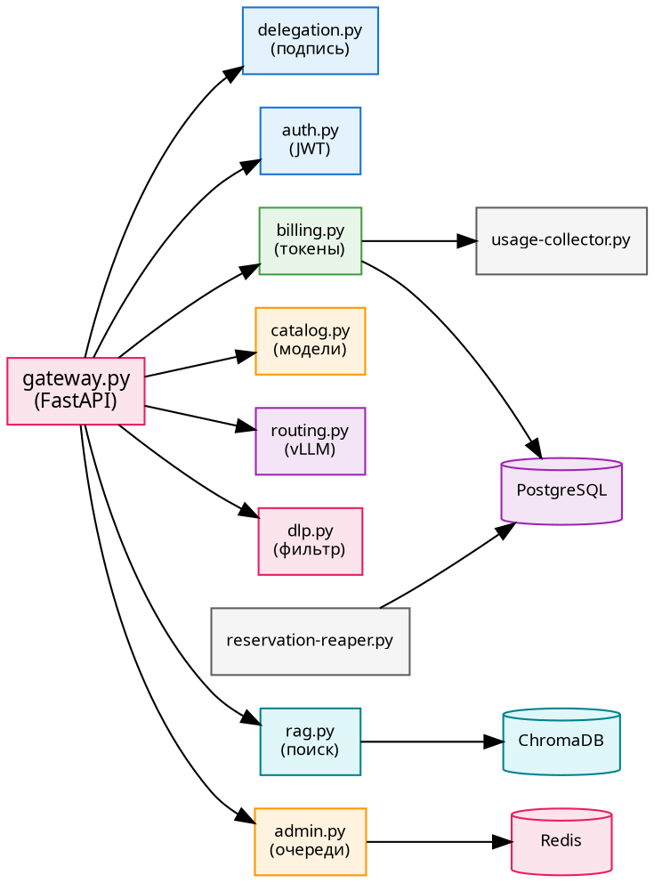
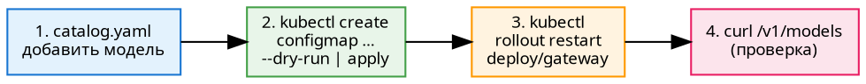
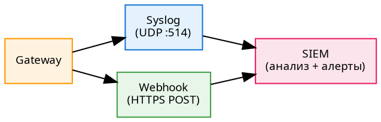
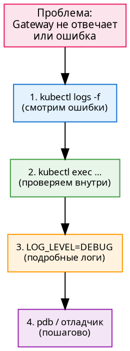
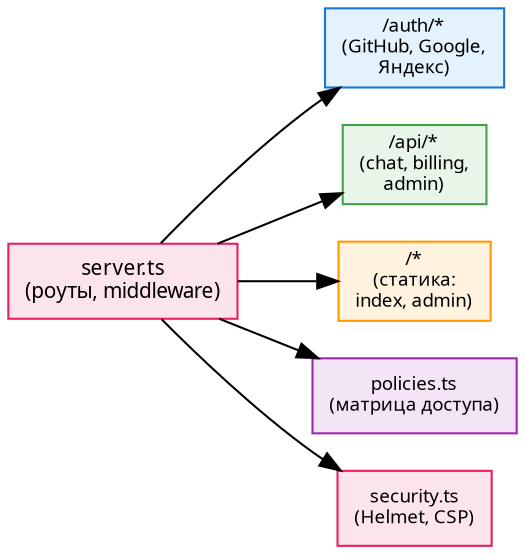
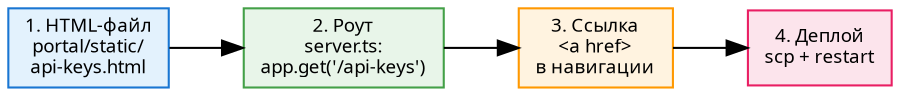
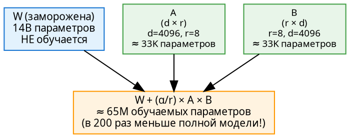
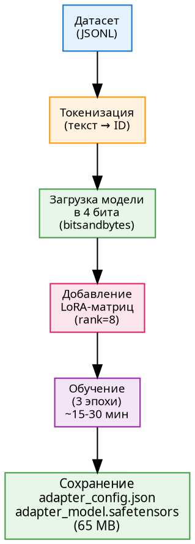

# Часть III. Разработка и доработка

**Документ 3 из 5.** 5 глав · ~95 стр. · 13 схем · 17 таблиц

> Как изменять, расширять и улучшать платформу: код, модели, автоматизация.

---

# Глава 14. Инструменты разработчика

> **Цель:** освоить Git, VS Code, Python и Node.js/TypeScript на уровне, достаточном для доработки платформы.

---

## 14.1. Git — система контроля версий

**Git** — «машина времени» для кода. Каждое изменение сохраняется как **коммит** (снимок состояния всех файлов). Можно откатиться назад, сравнить версии, работать параллельно над разными задачами.

### Основные понятия

| Термин | Что значит | Аналогия |
|---|---|---|
| **Репозиторий** (repo) | Папка с кодом + вся история | Папка проекта с историей |
| **Коммит** (commit) | Снимок всех файлов | «Сохранить» в игре |
| **Ветка** (branch) | Параллельная линия разработки | Отдельная вселенная |
| **Remote** | Копия репозитория на сервере (GitHub) | Облачное хранилище |
| **Pull Request** | Запрос на слияние ветки в main | «Начальник, проверь и прими» |
| **Merge** | Слияние изменений из одной ветки в другую | Объединение вселенных |

### Рабочий цикл

```bash
# 1. Клонируем репозиторий (один раз)
git clone git@github.com:dedvmedved-dot/aither-project.git
cd aither-project

# 2. Создаём ветку под задачу
git checkout -b feat/add-new-model

# 3. Вносим изменения в код...
vim configs/k8s/gateway-catalog.yaml

# 4. Смотрим, что изменилось
git status            # какие файлы изменены
git diff catalog.yaml # что именно изменилось в файле

# 5. Добавляем файлы в коммит
git add configs/k8s/gateway-catalog.yaml

# 6. Создаём коммит с осмысленным сообщением
git commit -m "feat: добавить Qwen 2.5 Coder 14B в каталог"

# 7. Отправляем на GitHub
git push origin feat/add-new-model

# 8. Создаём Pull Request на GitHub → ревью → merge в main

# 9. Подтягиваем актуальный main
git checkout main
git pull
```



```dot
digraph GitWorkflow {
    rankdir=LR
    bgcolor="#ffffff"
    node [fontname="system-ui", fontsize=9]

    clone [label="git clone", shape=box, style="filled", fillcolor="#e3f2fd", color="#1976d2"]
    branch [label="git checkout -b\n(создать ветку)", shape=box, style="filled", fillcolor="#e8f5e9", color="#43a047"]
    edit [label="Редактирование\nкода", shape=box, style="filled", fillcolor="#fff3e0", color="#ff9800"]
    add [label="git add\n(подготовить)", shape=box, style="filled", fillcolor="#fce4ec", color="#e91e63"]
    commit [label="git commit -m\n(сохранить)", shape=box, style="filled", fillcolor="#fce4ec", color="#e91e63"]
    push [label="git push\n(отправить на GitHub)", shape=box, style="filled", fillcolor="#f3e5f5", color="#9c27b0"]
    pr [label="Pull Request\n(ревью → merge)", shape=box, style="filled", fillcolor="#e8f5e9", color="#43a047"]

    clone -> branch -> edit -> add -> commit -> push -> pr
}
```

*Схема 14.1. Рабочий цикл Git: clone → branch → edit → add → commit → push → PR → merge.*

### Основные команды — шпаргалка

| Команда | Назначение |
|---|---|
| `git status` | Какие файлы изменены? |
| `git diff` | Что именно изменилось? |
| `git add <файл>` | Добавить файл в коммит |
| `git commit -m "..."` | Создать коммит |
| `git push` | Отправить на GitHub |
| `git pull` | Забрать изменения с GitHub |
| `git log --oneline` | История коммитов |
| `git checkout <ветка>` | Переключиться на ветку |
| `git branch` | Список веток |
| `git merge <ветка>` | Слить ветку в текущую |
| `git stash` | Временно спрятать изменения |
| `git reset --hard` | Откатить всё (осторожно!) |

### `.gitignore` — что НЕ хранить в Git

```
node_modules/       # зависимости Node.js (восстанавливаются через npm install)
*.env               # секреты и пароли
__pycache__/        # кэш Python
*.pyc               # скомпилированные Python-файлы
dist/               # скомпилированный TypeScript
models/             # модели ИИ (слишком большие)
*.tar.gz            # архивы
```

---

## 14.2. Среда разработки

### VS Code + Remote-SSH

**VS Code** — основной редактор кода. Ключевая функция для нас — **Remote-SSH**: подключение к удалённому серверу по SSH и редактирование файлов как локальных.

```bash
# В VS Code: Ctrl+Shift+P → "Remote-SSH: Connect to Host" → root@10.129.13.78
# Открыть папку /root/aither-project → работать!
```

Преимущества:
- Подсветка синтаксиса, автодополнение, проверка ошибок
- Встроенный терминал (не нужно отдельное SSH-окно)
- Git-интеграция (видно изменённые файлы прямо в редакторе)

### Nano — консольный редактор

Если VS Code недоступен (только SSH-терминал):

```
Ctrl+O — сохранить файл
Ctrl+X — выйти
Ctrl+W — поиск
Ctrl+K — вырезать строку
Ctrl+U — вставить строку
Alt+U — отменить
Alt+E — повторить
```

### SSH-туннели и port-forward

```bash
# Проброс порта Grafana на локальную машину
ssh -L 30300:10.129.13.77:30300 root@VPS1_IP
# → http://localhost:30300 = Grafana!

# kubectl port-forward — то же, но через K8s API
kubectl port-forward svc/gateway 8080:8080
# → http://localhost:8080 = Gateway

# Автообновление вывода команды
watch kubectl get pods
```

| Инструмент | Горячие клавиши / Команда |
|---|---|
| VS Code Remote-SSH | `Ctrl+Shift+P` → Connect to Host |
| VS Code Terminal | `` Ctrl+` `` |
| VS Code Command Palette | `Ctrl+Shift+P` |
| Nano сохранить | `Ctrl+O` |
| Nano выйти | `Ctrl+X` |
| SSH tunnel | `ssh -L local:remote user@host` |
| kubectl port-forward | `kubectl port-forward svc/name local:remote` |

---

## 14.3. Python — ликбез для доработки Gateway

Gateway написан на Python. Минимально необходимые знания.

### Базовый синтаксис

```python
# Переменные — не нужно объявлять тип
name = "Aither"
port = 8080
models = ["14b", "32b", "coder-14b"]
config = {"host": "0.0.0.0", "port": 8080}

# Функции — через def
def check_balance(org_id: str) -> int:
    """Проверить баланс организации. Возвращает количество токенов."""
    result = db.query(f"SELECT balance FROM billing WHERE org_id='{org_id}'")
    return result[0] if result else 0

# Условия
if balance <= 0:
    raise HTTPException(402, "Insufficient tokens")
elif balance < 1000:
    logger.warning(f"Low balance for {org_id}")

# Циклы
for model in models:
    print(f"Model: {model}")

# Импорты
from gateway.billing import deduct_tokens
from gateway.dlp import check_dlp
import re, json, time
```

### Типы данных

| Тип | Пример | Когда используется |
|---|---|---|
| `str` | `"Привет"` | Текст |
| `int` | `42` | Целые числа (токены) |
| `float` | `3.14` | Дробные числа |
| `bool` | `True / False` | Да/нет |
| `list` | `["a", "b"]` | Упорядоченный список |
| `dict` | `{"key": "value"}` | Словарь (ключ → значение) |
| `tuple` | `(1, 2)` | Неизменяемый список |
| `set` | `{1, 2, 3}` | Множество (без повторов) |

### Виртуальное окружение (venv)

```bash
python3 -m venv venv           # создать окружение
source venv/bin/activate       # активировать
pip install -r gateway/requirements.txt
deactivate                     # выйти
```

### Типовые ошибки

| Ошибка | Причина | Как исправить |
|---|---|---|
| `IndentationError` | Кривые отступы (Python использует отступы вместо скобок!) | Выровнять отступы (4 пробела) |
| `NameError: name 'x' is not defined` | Переменная не объявлена | Объявить переменную до использования |
| `TypeError` | Перепутали типы (строка + число) | `str(x) + y` или `x + int(y)` |
| `ModuleNotFoundError` | Не установлен пакет | `pip install <имя>` |
| `KeyError: 'choices'` | Ключ отсутствует в словаре | `d.get('choices', default)` |

### Логирование

```python
import logging
logging.basicConfig(level=logging.INFO)

logging.info(f"Request from org {org_id}")     # обычное событие
logging.warning(f"Rate limit approaching")      # внимание
logging.error(f"Database connection failed")    # ошибка
logging.debug(f"Raw response: {raw}")           # отладка (включить LOG_LEVEL=DEBUG)
```

---

## 14.4. Node.js/TypeScript — ликбез для доработки портала

BFF портала написан на TypeScript. Минимальные знания.

### npm и package.json

```bash
npm install              # установить все зависимости из package.json
npm install express      # установить конкретный пакет
npm run build            # скомпилировать TypeScript
npm run start            # запустить сервер
```

### TypeScript-синтаксис

```typescript
// Переменные с типами
const PORT: number = 3000;
const secret: string = process.env.JWT_SECRET || 'dev-secret';

// Интерфейсы (описание формы данных)
interface User {
  email: string;
  org_id: string;
  role: 'admin' | 'org_admin' | 'user';  // только эти три значения
}

// Асинхронные функции
async function getUser(email: string): Promise<User | null> {
  const result = await db.query('SELECT * FROM users WHERE email = $1', [email]);
  return result.rows[0] || null;
}

// Express-роуты
app.get('/health', (req, res) => {
  res.json({ status: 'ok', uptime: process.uptime() });
});

app.post('/api/chat', async (req, res) => {
  const user = await authenticate(req);
  // ... проксирование в Gateway ...
});
```

### Коды ответа HTTP (для BFF)

| Код | Константа | Когда использовать |
|---|---|---|
| 200 | `res.json({...})` | Успех |
| 400 | `res.status(400)` | Ошибка в запросе (нет model) |
| 401 | `res.status(401)` | Не авторизован (нет JWT) |
| 403 | `res.status(403)` | Нет прав (чужая org) |
| 404 | `res.status(404)` | Не найдено |
| 500 | `res.status(500)` | Ошибка сервера |

---

# Глава 15. Доработка Gateway

> **Цель:** научиться добавлять модели, менять тарифы, писать DLP-правила, интегрироваться с SIEM и отлаживать код.

---

## 15.1. Структура кода Gateway: карта модулей

Gateway состоит из 11 модулей, каждый отвечает за свою область:

| Модуль | Назначение | Ключевые функции |
|---|---|---|
| `gateway.py` | Точка входа, FastAPI app, маршруты | `app = FastAPI()`, lifespan, роуты |
| `auth.py` | JWT-аутентификация | `verify_token()`, `create_token()` |
| `billing.py` | Списание токенов, баланс | `deduct_tokens()`, `check_balance()` |
| `catalog.py` | Каталог моделей | `load_catalog()`, `/v1/models` |
| `routing.py` | Маршрутизация к vLLM | `get_backend(model)` |
| `admin.py` | Админ-API, очереди Redis | `admin_queues()`, rate limit stats |
| `dlp.py` | Фильтрация конфиденциальных данных | `check_dlp(prompt)` |
| `rag.py` | Поиск по базе знаний | `search_wiki()`, ChromaDB |
| `delegation.py` | JWT-подпись для сервисов | `sign_delegation()` |
| `usage-collector.py` | Точный учёт использованных токенов | `collect_usage()` |
| `reservation-reaper.py` | Очистка просроченных резерваций | `reap_reservations()` |



*Схема 15.1. Граф зависимостей модулей Gateway. 11 модулей + 3 внешние БД.*

### Почему FastAPI, а не Flask

**FastAPI** — современный Python-фреймворк, оптимизированный для API:
- Автоматическая валидация запросов (через Pydantic)
- Авто-документация (Swagger UI на `/docs`)
- Асинхронность из коробки (`async def`)
- Производительность на уровне Node.js/Go

**Flask** — более старый и простой. Меньше «магии», но больше ручной работы. Мы используем FastAPI для Gateway из-за производительности и встроенной валидации.

---

## 15.2. Добавление новой модели в каталог

### Шаг 1: catalog.yaml

```yaml
models:
  # ... существующие модели ...

  - name: qwen2.5-coder-14b
    display_name: "Qwen 2.5 Coder 14B"
    backend: "http://vllm-coder:8000"
    model_path: "/models/Qwen2.5-Coder-14B-Instruct"
    max_tokens: 4096
    description: "Специализированная модель для генерации кода"
    tokens_per_ruble: 100
    tags: [code, fast]
    status: active
```

### Шаг 2: routing.py (если нужен особый роутинг)

```python
# Обычно не требуется — catalog.backend уже указывает на vLLM-сервис
# Особый случай: балансировка между несколькими экземплярами одной модели
```

### Шаг 3: применить ConfigMap

```bash
kubectl create configmap gateway-catalog \
  --from-file=catalog.yaml=configs/k8s/gateway-catalog.yaml \
  --dry-run=client -o yaml | kubectl apply -f -
```

### Шаг 4: перезапустить Gateway

```bash
kubectl rollout restart deploy/gateway
kubectl rollout status deploy/gateway
```

### Шаг 5: проверить

```bash
curl http://gateway:8080/v1/models | jq '.data[].id'
# → "qwen2.5-14b"
# → "qwen2.5-32b"
# → "qwen2.5-coder-14b"  ← новая!
```



*Схема 15.2. Процесс добавления модели: 4 шага от YAML до проверки в API.*

---

## 15.3. Изменение тарифов и лимитов

Тарифы и лимиты задаются переменными окружения и меняются **без рестарта**:

```bash
# Изменить стоимость токена
kubectl set env deploy/gateway TOKEN_COST=***    # было 1

# Изменить лимит запросов
kubectl set env deploy/gateway RATE_LIMIT_RPM=500   # было 300

# Изменить лимит токенов
kubectl set env deploy/gateway RATE_LIMIT_TPM=200000 # было 100000
```

Проверка:
```bash
kubectl get deploy gateway -o yaml | grep -A1 TOKEN_COST
# → - name: TOKEN_COST
# →   value: "2"
```

| Переменная | По умолчанию | Что меняет |
|---|---|---|
| `TOKEN_COST` | 1 | Коэффициент: 1 токен = N рублей |
| `RATE_LIMIT_RPM` | 300 | Максимум запросов в минуту |
| `RATE_LIMIT_TPM` | 100000 | Максимум токенов в минуту |

---

## 15.4. Добавление DLP-правила

### Структура dlp.py

```python
import re

DLP_RULES = [
    # (регулярное выражение, название, действие)
    (re.compile(r'\d{4}\s?\d{6}'),              'паспорт РФ',     'BLOCK'),
    (re.compile(r'\b\d{10}\b|\b\d{12}\b'),      'ИНН',            'BLOCK'),
    (re.compile(r'\d{3}-\d{3}-\d{3}\s?\d{2}'), 'СНИЛС',          'BLOCK'),
    (re.compile(r'[a-zA-Z0-9._%+-]+@[a-zA-Z0-9.-]+\.[a-zA-Z]{2,}'), 'email', 'MASK'),
]

def check_dlp(prompt: str) -> tuple[bool, str]:
    for pattern, name, action in DLP_RULES:
        if pattern.search(prompt):
            if action == 'BLOCK':
                return False, f"Обнаружены конфиденциальные данные: {name}"
            elif action == 'MASK':
                prompt = pattern.sub('*** (masked)', prompt)
    return True, prompt
```

### Три действия DLP

| Действие | Что делает | Пример |
|---|---|---|
| **BLOCK** | Запрос отклоняется | «Мой паспорт 1234 567890» → ошибка |
| **MASK** | Данные заменяются на `***` | «Мой email user@org.ru» → «Мой email ***` |
| **LOG** | Запрос пропускается, но пишется в лог | Для аудита |

### Добавление нового правила

```python
# Добавить в DLP_RULES:
(re.compile(r'\b\d{4}[-\s]?\d{4}[-\s]?\d{4}[-\s]?\d{4}\b'), 'банковская карта', 'BLOCK'),
```

Деплой:
```bash
# Изменить dlp.py → docker build → docker push → kubectl rollout restart
```

```dot
digraph DLPFlow {
    rankdir=LR
    bgcolor="#ffffff"
    node [fontname="system-ui", fontsize=9]

    prompt [label="Промпт\nпользователя", shape=box, style="filled", fillcolor="#e3f2fd", color="#1976d2"]
    filter [label="DLP-фильтр\n(регулярные выражения)", shape=box, style="filled", fillcolor="#fff3e0", color="#ff9800"]

    pass [label="✅ PASS\n(чистый текст)", shape=box, style="filled", fillcolor="#e8f5e9", color="#43a047"]
    block [label="❌ BLOCK\n(обнаружен секрет)", shape=box, style="filled", fillcolor="#fce4ec", color="#e91e63"]
    mask [label="⚠️ MASK\n(данные заменены\nна ***)", shape=box, style="filled", fillcolor="#fff3e0", color="#ff9800")]

    prompt -> filter
    filter -> pass
    filter -> block
    filter -> mask
}
```

*Схема 15.3. DLP-фильтр: промпт → проверка → PASS/BLOCK/MASK.*

---

## 15.5. Интеграция с SIEM

**SIEM** (Security Information and Event Management) — система сбора и анализа событий безопасности. DLP-срабатывания, попытки взлома, превышения лимитов должны попадать в SIEM.

### Syslog

```python
import logging
import logging.handlers

# Настройка syslog
syslog_handler = logging.handlers.SysLogHandler(address=('siem.local', 514))
syslog_handler.setFormatter(logging.Formatter('aither-gateway: %(message)s'))

logger = logging.getLogger('security')
logger.addHandler(syslog_handler)

# При DLP-срабатывании:
logger.warning(f"DLP BLOCK: org={org_id}, rule={rule_name}, prompt_truncated={prompt[:50]}")
```

Формат syslog (RFC 5424):
```
<134>1 2026-07-07T12:00:00Z aither-gateway gateway 1234 - DLP BLOCK: org=abc, rule=паспорт РФ
```

### Webhook

```python
import httpx

async def notify_siem(event_type: str, details: dict):
    await httpx.post("https://siem.local/webhook", json={
        "source": "aither-gateway",
        "type": event_type,
        "timestamp": int(time.time()),
        "details": details
    })
```



*Схема 15.4. Два канала SIEM-интеграции: syslog и webhook.*

---

## 15.6. Деплой изменений: от коммита до прода

| Шаг | Команда | Время |
|---|---|---|
| 1. Коммит | `git commit -m "..."` | 1 сек |
| 2. Push | `git push` | 2 сек |
| 3. Сборка | `docker build ...` | 30-60 сек |
| 4. Push образа | `docker push ...` | 10-30 сек |
| 5. Обновление K8s | `kubectl set image ...` | 5 сек |
| 6. Ожидание | `kubectl rollout status ...` | 30-60 сек |
| 7. Проверка | `curl /health` | 1 сек |
| **Итого** | | **~2 минуты** |

### Rollback

```bash
kubectl rollout undo deploy/gateway
# Gateway возвращается к предыдущей версии
```

---

## 15.7. ✏️ Практикум: полный цикл

Задача: добавить модель + изменить тариф + DLP-правило → задеплоить → проверить.

1. `catalog.yaml`: добавить `qwen2.5-coder-14b`
2. `kubectl set env deploy/gateway TOKEN_COST=***3. `dlp.py`: добавить фильтр банковских карт
4. `docker build && docker push`
5. `kubectl set image && rollout status`
6. `curl /v1/models` → три модели
7. `curl` с номером карты → блокировка

---

## 15.8. Отладка Gateway

```bash
# Логи в реальном времени
kubectl logs -f deploy/gateway

# Выполнить Python-код внутри контейнера
kubectl exec -it deploy/gateway -- python3 -c "import redis; r=redis.Redis('redis'); print(r.ping())"

# Включить DEBUG-логи
kubectl set env deploy/gateway LOG_LEVEL=DEBUG
# (автоматический рестарт!)

# Интерактивный отладчик
kubectl exec -it deploy/gateway -- python3 -m pdb gateway.py
```



*Схема 15.5. Алгоритм отладки Gateway: логи → exec → DEBUG → отладчик.*

| Типовая ошибка | Причина | Диагностика |
|---|---|---|
| `redis.exceptions.ConnectionError` | Redis недоступен | `kubectl exec ... -- python3 -c "import redis; redis.Redis('redis').ping()"` |
| `psycopg2.OperationalError` | PostgreSQL недоступен | Проверить `PG_URL`, `kubectl get pods postgres` |
| `KeyError: 'choices'` | vLLM вернул нестандартный JSON | `kubectl logs` → смотреть raw response |
| `ModuleNotFoundError` | Забыли `pip install` | `docker build` заново |

| Команда деплоя | Назначение |
|---|---|
| `kubectl set image deploy/gateway gateway=img:tag` | Обновить образ |
| `kubectl set env deploy/gateway KEY=VALUE` | Изменить переменную |
| `kubectl rollout status deploy/gateway` | Ждать готовности |
| `kubectl rollout undo deploy/gateway` | Откатить |
| `kubectl rollout history deploy/gateway` | История версий |

---

# Глава 16. Доработка портала

> **Цель:** изменять фронтенд, добавлять страницы, подключать OAuth-провайдеров, обеспечивать безопасность.

---

## 16.1. Структура кода портала

```
portal/
├── server.ts          ← BFF-сервер (Express, TypeScript)
├── policies.ts        ← права доступа (admin / org_admin / user)
├── security.ts        ← защита (Helmet, CORS, CSP)
├── package.json       ← зависимости, скрипты сборки
├── tsconfig.json      ← настройки TypeScript
└── static/
    ├── index.html     ← чат-интерфейс
    └── admin.html     ← админ-панель
```



*Схема 16.1. Карта модулей портала: server.ts → роуты + policies + security.*

| Модуль | Строк кода (оценка) | Назначение |
|---|---|---|
| `server.ts` | ~400 | Express-приложение, все роуты |
| `policies.ts` | ~50 | Проверка прав доступа |
| `security.ts` | ~30 | Заголовки безопасности |
| `index.html` | ~350 | Чат-интерфейс (HTML+CSS+JS) |
| `admin.html` | ~250 | Админ-панель |

---

## 16.2. Изменение фронтенда

Вся статика портала в `portal/static/`. Меняется мгновенно (без рестарта BFF).

### CSS: где какие классы

```css
/* Основные классы index.html */
.header        /* шапка: фиксированная, тёмный фон */
.chat-container /* история сообщений: скроллируется */
.message       /* одно сообщение */
.message.user  /* сообщение пользователя: голубой фон */
.message.assistant /* ответ модели: серый фон */
.input-area    /* поле ввода: фиксировано снизу */
.toast         /* всплывающее уведомление */
.toast.info    /* успех: зелёный */
.toast.error   /* ошибка: красный */

/* Пример смены темы на Astra Linux (синий/серый) */
.header { background: linear-gradient(135deg, #0d47a1, #1565c0); }
.message.user { background: #e3f2fd; border-left: 3px solid #1976d2; }
```

### JavaScript: SSE-клиент

```javascript
// Чтение SSE-потока через ReadableStream (POST-запрос)
const res = await fetch('/api/chat', { method: 'POST', ... });
const reader = res.body.getReader();
const decoder = new TextDecoder();

while (true) {
  const { done, value } = await reader.read();
  if (done) break;

  const text = decoder.decode(value, { stream: true });
  // text содержит строки вида "data: {...}"
  // каждая строка = один токен ответа модели
}
```

### ✏️ Практикум: смена темы

1. Открыть `portal/static/index.html`
2. Найти `.header` в `<style>`
3. Заменить `background: #1a1a2e` на `background: linear-gradient(135deg, #0d47a1, #1565c0)`
4. `scp static/index.html root@130.17.1.90:/opt/aither/static/`
5. Обновить страницу в браузере — тема сменилась мгновенно

---

## 16.3. Добавление новой страницы

### Шаг 1: HTML-файл

`portal/static/api-keys.html` — страница «Мои API-ключи»:

```html
<!DOCTYPE html>
<html><head><title>API-ключи — Aither</title></head>
<body>
  <h1>Мои API-ключи</h1>
  <table id="keys-table">
    <tr><th>Название</th><th>Создан</th><th>Действие</th></tr>
  </table>
  <button onclick="createKey()">+ Создать ключ</button>
  <script>
    async function loadKeys() {
      const res = await fetch('/api/keys');
      const keys = await res.json();
      // ... рендеринг таблицы ...
    }
    loadKeys();
  </script>
</body></html>
```

### Шаг 2: Роут в server.ts

```typescript
app.get('/api-keys', (req, res) => {
  res.sendFile(path.join(__dirname, 'static', 'api-keys.html'));
});
```

### Шаг 3: Ссылка в навигации

В `index.html` добавить ссылку: `<a href="/api-keys">🔑 API-ключи</a>`.



*Схема 16.2. Добавление новой страницы: 4 шага.*

---

## 16.4. Подключение OAuth-провайдера

### Шаг 1: Регистрация приложения

На сайте провайдера (например, VK):
1. Создать приложение → получить `client_id` и `client_secret`
2. Указать callback URL: `https://fb1.spb.ru:10443/auth/vk/callback`

### Шаг 2: Роуты в server.ts

```typescript
app.get('/auth/vk', (req, res) => {
  const url = `https://oauth.vk.com/authorize`
    + `?client_id=${process.env.VK_CLIENT_ID}`
    + `&redirect_uri=https://fb1.spb.ru:10443/auth/vk/callback`
    + `&response_type=code`;
  res.redirect(url);
});

app.get('/auth/vk/callback', async (req, res) => {
  const { code } = req.query;
  // Меняем code на access_token
  const tokenRes = await fetch(`https://oauth.vk.com/access_token?...&code=${code}`);
  const { access_token, email } = await tokenRes.json();

  // Создаём/находим пользователя
  const user = await db.findOrCreateUser(email, 'vk');

  // Выпускаем JWT
  const jwt = sign({ sub: email, org_id: user.org_id, role: user.role }, JWT_SECRET);
  res.cookie('auth_token', jwt, { httpOnly: true, secure: true, sameSite: 'strict' });
  res.redirect('/');
});
```

### Шаг 3: Переменные окружения

```bash
echo "VK_CLIENT_ID=123456" >> /opt/aither/.env
echo "VK_CLIENT_SECRET=abcdef" >> /opt/aither/.env
systemctl restart aither-bff
```

### Шаг 4: Роль по умолчанию

В `policies.ts`:
```typescript
function getDefaultRole(provider: string): Role {
  switch (provider) {
    case 'github': return 'user';      // обычный пользователь
    case 'vk': return 'user';          // обычный пользователь
    default: return 'user';
  }
}
```

| Провайдер | Client ID где взять | Callback URL |
|---|---|---|
| GitHub | Settings → Developer settings → OAuth Apps | `/auth/github/callback` |
| Google | Google Cloud Console → APIs → Credentials | `/auth/google/callback` |
| Яндекс | oauth.yandex.ru → Создать приложение | `/auth/yandex/callback` |
| VK | vk.com/dev → Создать приложение | `/auth/vk/callback` |

---

## 16.5. Безопасность фронтенда

### XSS (Cross-Site Scripting)

```javascript
// ❌ ОПАСНО: пользователь может вставить <script>alert('XSS')</script>
element.innerHTML = userInput;

// ✅ БЕЗОПАСНО: браузер экранирует HTML
element.textContent = userInput;
```

Правило: всегда `textContent`, никогда `innerHTML` для пользовательского ввода.

### CSRF (Cross-Site Request Forgery)

Защита через `SameSite` cookies:
```typescript
res.cookie('auth_token', jwt, {
  sameSite: 'strict'  // кука не отправляется с других сайтов
});
```

### CSP (Content-Security-Policy)

Ограничивает, какие скрипты могут выполняться на странице:
```html
<meta http-equiv="Content-Security-Policy"
      content="default-src 'self'; script-src 'self'">
```

### Helmet (автоматические заголовки)

```typescript
app.use(helmet());  // добавляет X-Content-Type-Options, X-Frame-Options, HSTS
```

---

## 16.6. ✏️ Практикум: полный цикл доработки

Задача: новая страница «Мои API-ключи» + OAuth VK + смена темы.

1. `api-keys.html` — страница с таблицей ключей
2. `server.ts` — роут + API `/api/keys`
3. `server.ts` — OAuth VK (роуты + callback)
4. `index.html` — тема Astra Linux (синий градиент)
5. `deploy.sh` → `scp` статику + `systemctl restart aither-bff`
6. Проверка в браузере: тема, страница `/api-keys`, вход через VK

---

# Глава 17. Создание и обучение LoRA-адаптеров

> **Цель:** подготовить датасет, запустить QLoRA-обучение, подключить адаптер к vLLM.

---

## 17.1. Теория LoRA — глубже

**LoRA** (Low-Rank Adaptation) — метод дообучения, при котором 99.99% весов модели **замораживаются**, а обучаются только маленькие добавочные матрицы.

```
Вместо: обновить матрицу W (32 000 000 000 параметров)
Делаем:  W + (alpha/r) × A × B
         где A и B — матрицы ранга r (r=8 → ~65 000 000 параметров)
```

- **rank (r=8):** размерность LoRA-матриц. Чем больше — тем «вместительнее» адаптер, но больше памяти
- **alpha=16:** масштабирующий коэффициент. Обычно alpha = 2× rank
- **target_modules:** `["q_proj", "v_proj"]` — к каким слоям attention применяется LoRA. Только query и value — этого достаточно



*Схема 17.1. Математика LoRA: W заморожена, A и B обучаются. Результат: 65M параметров вместо 14B.*

### «Ручной» расчёт

```
14B модели, rank=8, target: q_proj + v_proj

Для одного слоя (d=4096):
  A: 4096 × 8 = 32 768 параметров
  B: 8 × 4096 = 32 768 параметров
  Итого на слой: 65 536 параметров

Целевых слоёв: 40 (q_proj) + 40 (v_proj) = 80
Всего: 80 × 65 536 ≈ 5.2M параметров × 4 байта (fp32) ≈ 21 MB
Плюс накладные расходы → ~65 MB
```

---

## 17.2. Подготовка датасета

Формат — **JSONL** (JSON Lines): один пример = одна строка.

```json
{"messages": [{"role": "system", "content": "Ты — эксперт по Astra Linux SE 1.8. Отвечай точно, со ссылками на команды."}, {"role": "user", "content": "Как установить пакет в Astra Linux?"}, {"role": "assistant", "content": "В Astra Linux SE 1.8 используется пакетный менеджер APT. Команда: apt-get install <имя_пакета>. Репозитории находятся на сервере обновлений организации. Для установки из локального .deb-файла: dpkg -i <файл.deb>"}]}
```

| Количество примеров | Качество адаптера | Время обучения (14B, 1× RTX 6000) |
|---|---|---|
| 10-20 | Базовое (пробное) | 5-10 мин |
| 50-100 | Хорошее | 15-30 мин |
| 500+ | Отличное | 1-2 часа |
| 1000+ | Профессиональное | 3-5 часов |

### ✏️ Подготовить датасет из 10 примеров

```bash
cat > my-dataset.jsonl << 'EOF'
{"messages": [{"role": "system", "content": "Ты — эксперт по Astra Linux."}, {"role": "user", "content": "Как посмотреть IP-адрес?"}, {"role": "assistant", "content": "Команда: ip a. Покажет все сетевые интерфейсы и их IP-адреса."}]}
{"messages": [{"role": "system", "content": "Ты — эксперт по Astra Linux."}, {"role": "user", "content": "Как перезапустить службу?"}, {"role": "assistant", "content": "systemctl restart <имя_службы>. Например: systemctl restart sshd"}]}
# ... ещё 8 примеров ...
EOF
```

---

## 17.3. train_lora_14b.py — построчный разбор

```python
import torch
from transformers import (
    AutoModelForCausalLM, AutoTokenizer,
    BitsAndBytesConfig, TrainingArguments
)
from peft import LoraConfig, get_peft_model, prepare_model_for_kbit_training
from datasets import Dataset
from trl import SFTTrainer

# 1. Конфигурация 4-битной загрузки (QLoRA)
bnb_config = BitsAndBytesConfig(
    load_in_4bit=True,                          # загружаем в 4 бита
    bnb_4bit_compute_dtype=torch.bfloat16,      # вычисления в bf16
    bnb_4bit_use_double_quant=True,             # двойная квантизация (экономия)
    bnb_4bit_quant_type="nf4"                   # normal float 4
)

# 2. Загрузка модели в 4 битах
model = AutoModelForCausalLM.from_pretrained(
    "/models/Qwen2.5-14B-Instruct",
    quantization_config=bnb_config,
    device_map="auto"                           # автоматически на GPU
)

# 3. Подготовка к QLoRA
model = prepare_model_for_kbit_training(model)

# 4. Конфигурация LoRA
lora_config = LoraConfig(
    r=8,                                        # rank
    lora_alpha=16,                              # масштабирование
    target_modules=["q_proj", "v_proj"],        # целевые слои
    lora_dropout=0.1,                           # регуляризация
    bias="none",
    task_type="CAUSAL_LM"
)
model = get_peft_model(model, lora_config)
# Теперь model имеет ~65M обучаемых параметров

# 5. Загрузка датасета
dataset = Dataset.from_json("my-dataset.jsonl")

# 6. Параметры обучения
training_args = TrainingArguments(
    output_dir="/models/lora-my-adapter",
    per_device_train_batch_size=1,              # один пример за шаг (экономия VRAM)
    gradient_accumulation_steps=4,              # копим градиенты 4 шага → размер батча = 4
    num_train_epochs=3,                         # 3 прохода по датасету
    learning_rate=2e-4,                         # скорость обучения
    fp16=True,                                  # mixed precision
    logging_steps=10,
    save_strategy="epoch"
)

# 7. Запуск обучения
trainer = SFTTrainer(
    model=model,
    args=training_args,
    train_dataset=dataset,
    tokenizer=AutoTokenizer.from_pretrained("/models/Qwen2.5-14B-Instruct")
)
trainer.train()
trainer.save_model()
# → /models/lora-my-adapter/adapter_config.json
# → /models/lora-my-adapter/adapter_model.safetensors
```



*Схема 17.2. Процесс QLoRA-обучения: датасет → токенизация → 4-bit загрузка → LoRA → обучение → сохранение.*

| Параметр | Значение | Зачем |
|---|---|---|
| `r=8` | Размерность LoRA | Больше = умнее, но больше VRAM |
| `lora_alpha=16` | Масштабирование | Обычно 2× r |
| `per_device_train_batch_size=1` | Примеров за шаг | 1 для экономии VRAM |
| `gradient_accumulation_steps=4` | Накопление градиентов | Эффективный batch = 4 |
| `num_train_epochs=3` | Проходов по датасету | 3-5 для маленьких датасетов |
| `learning_rate=2e-4` | Скорость обучения | Стандарт для LoRA |

---

## 17.4. Запуск обучения в K8s

### Job (не Deployment!)

```yaml
apiVersion: batch/v1
kind: Job                              # Job — одноразовая задача
metadata:
  name: lora-train-14b
spec:
  ttlSecondsAfterFinished: 3600        # удалить через час
  template:
    spec:
      runtimeClassName: nvidia
      containers:
      - name: trainer
        image: pytorch/pytorch:2.1.0-cuda12.1-cudnn8-runtime
        command: ["bash", "-c"]
        args:
          - pip install peft datasets bitsandbytes accelerate transformers trl --quiet &&
            python3 /scripts/train_lora_14b.py
        resources:
          limits:
            nvidia.com/gpu: "1"        # только 1 GPU (QLoRA влезает)
            memory: "48Gi"
        volumeMounts:
        - name: models
          mountPath: /models
        - name: scripts
          mountPath: /scripts
      volumes:
      - name: models
        hostPath:
          path: /data/models
      - name: scripts
        configMap:
          name: lora-train-script
      restartPolicy: Never
```

```bash
kubectl apply -f lora-job.yaml
kubectl logs -f job/lora-train-14b
# → Training... epoch 1/3, loss: 2.34
# → Training... epoch 2/3, loss: 1.87
# → Training... epoch 3/3, loss: 1.52
# → Job completed

# Проверка
ls /data/models/lora-my-adapter/
# → adapter_config.json  adapter_model.safetensors
```

---

# Глава 18. CI/CD и автоматизация

> **Цель:** настроить автоматическую сборку и деплой при каждом git push, исключить ручной труд.

---

## 18.1. Что такое CI/CD

**CI (Continuous Integration)** — автоматический запуск тестов при каждом коммите. Если тесты упали — разработчик узнаёт сразу, а не через неделю.

**CD (Continuous Delivery)** — автоматический деплой после успешных тестов. Разработчик делает `git push`, и через 2 минуты новая версия в продакшене.

```dot
digraph CICD {
    rankdir=LR
    bgcolor="#ffffff"
    node [fontname="system-ui", fontsize=10]

    push [label="git push", shape=box, style="filled", fillcolor="#e3f2fd", color="#1976d2"]
    build [label="Сборка\n(docker build)", shape=box, style="filled", fillcolor="#fff3e0", color="#ff9800"]
    test [label="Тесты\n(pytest, curl)", shape=box, style="filled", fillcolor="#e8f5e9", color="#43a047"]
    deploy [label="Деплой\n(kubectl set image)", shape=box, style="filled", fillcolor="#fce4ec", color="#e91e63"]
    health [label="Health-check\n(curl /health ×5)", shape=box, style="filled", fillcolor="#f3e5f5", color="#9c27b0")
    notify [label="Уведомление\n(Telegram)", shape=box, style="filled", fillcolor="#e8f5e9", color="#43a047"]

    push -> build -> test -> deploy -> health -> notify
}
```

*Схема 18.1. CI/CD pipeline: push → build → test → deploy → health-check → уведомление.*

---

## 18.2. CI/CD для Gateway

### .github/workflows/deploy.yml — построчный разбор

```yaml
name: Build and Deploy Gateway

on:
  push:
    branches: [main]
    paths:
      - 'gateway/**'          # только при изменении кода Gateway!

jobs:
  build-and-deploy:
    runs-on: ubuntu-latest

    steps:
      # Шаг 1: клонировать репозиторий
      - uses: actions/checkout@v4

      # Шаг 2: собрать Docker-образ
      - name: Build Docker image
        run: |
          docker build \
            -t ghcr.io/${{ github.repository }}-gateway:${{ github.sha }} \
            -f gateway/Dockerfile .

      # Шаг 3: загрузить в ghcr.io
      - name: Push to ghcr.io
        run: |
          echo "${{ secrets.GHCR_TOKEN }}" | \
            docker login ghcr.io -u ${{ github.actor }} --password-stdin
          docker push ghcr.io/${{ github.repository }}-gateway:${{ github.sha }}

      # Шаг 4: деплой в Kubernetes
      - name: Deploy to K8s
        uses: appleboy/ssh-action@v1
        with:
          host: ${{ secrets.VPS2_HOST }}
          username: root
          key: ${{ secrets.VPS2_SSH_KEY }}
          script: |
            kubectl set image deploy/gateway \
              gateway=ghcr.io/${{ github.repository }}-gateway:${{ github.sha }}
            kubectl rollout status deploy/gateway --timeout=120s

      # Шаг 5: health-check (5 попыток)
      - name: Health check
        run: |
          for i in $(seq 5); do
            curl -sf http://${{ secrets.VPS2_HOST }}:30900/health && break
            sleep 10
          done

      # Шаг 6: rollback при провале
      - name: Rollback on failure
        if: failure()
        uses: appleboy/ssh-action@v1
        with:
          host: ${{ secrets.VPS2_HOST }}
          username: root
          key: ${{ secrets.VPS2_SSH_KEY }}
          script: |
            kubectl rollout undo deploy/gateway
            echo "❌ Deploy failed, rolled back"

      # Шаг 7: Telegram-уведомление
      - name: Notify Telegram
        if: always()
        uses: appleboy/telegram-action@v1
        with:
          to: ${{ secrets.TELEGRAM_CHAT_ID }}
          token: ${{ secrets.TELEGRAM_BOT_TOKEN }}
          message: |
            🚀 Gateway deploy ${{ job.status }}
            Commit: ${{ github.sha }}
            ${{ github.event.head_commit.message }}
```

### GitHub Secrets

| Secret | Значение |
|---|---|
| `GHCR_TOKEN` | GitHub Personal Access Token (write:packages) |
| `VPS2_HOST` | IP-адрес VPS2 |
| `VPS2_SSH_KEY` | Приватный SSH-ключ для доступа |
| `TELEGRAM_BOT_TOKEN` | Токен бота Telegram |
| `TELEGRAM_CHAT_ID` | ID чата для уведомлений |

---

## 18.3. CI/CD для портала

```yaml
name: Deploy Portal

on:
  push:
    branches: [main]
    paths:
      - 'portal/**'

jobs:
  deploy:
    runs-on: ubuntu-latest
    steps:
      - uses: actions/checkout@v4

      - name: Setup Node.js
        uses: actions/setup-node@v4
        with:
          node-version: '20'

      - name: Install dependencies
        run: cd portal && npm ci

      - name: Build TypeScript
        run: cd portal && npx tsc

      - name: Deploy to VPS2
        uses: appleboy/scp-action@v0.1.7
        with:
          host: ${{ secrets.VPS2_HOST }}
          username: root
          key: ${{ secrets.VPS2_SSH_KEY }}
          source: "portal/dist/*,portal/static/*"
          target: "/opt/aither/"

      - name: Restart BFF
        uses: appleboy/ssh-action@v1
        with:
          host: ${{ secrets.VPS2_HOST }}
          username: root
          key: ${{ secrets.VPS2_SSH_KEY }}
          script: systemctl restart aither-bff
```

---

## 18.4. Тестирование

### Unit-тесты (pytest для Gateway)

```python
# tests/test_dlp.py
from gateway.dlp import check_dlp

def test_block_passport():
    ok, msg = check_dlp("Мой паспорт 1234 567890")
    assert ok == False
    assert "паспорт РФ" in msg

def test_allow_clean_text():
    ok, msg = check_dlp("Привет, как дела?")
    assert ok == True
```

```bash
pip install pytest
pytest tests/ -v
```

### Интеграционные тесты

```bash
# Проверка /v1/models
curl -sf http://gateway:8080/v1/models | jq -e '.data | length >= 2'

# Проверка /v1/chat/completions
curl -sf -X POST http://gateway:8080/v1/chat/completions \
  -H "Authorization: Bearer *** \
  -d '{"model":"qwen2.5-14b","messages":[{"role":"user","content":"2+2"}],"max_tokens":1}'
```

### Нагрузочное тестирование

```bash
hey -n 1000 -c 10 -m POST \
  -H "Authorization: Bearer *** \
  -H "Content-Type: application/json" \
  -d '{"model":"qwen2.5-14b","messages":[{"role":"user","content":"test"}],"max_tokens":10}' \
  http://gateway:8080/v1/chat/completions
```

| Инструмент | Назначение |
|---|---|
| **pytest** | Unit-тесты Python |
| **Jest** | Unit-тесты JavaScript/TypeScript |
| **curl** | Ручные интеграционные тесты |
| **hey** | Нагрузочное тестирование |
| **GitHub Actions** | CI/CD пайплайн |

---

## 18.5. ✏️ Практикум: настроить CI/CD

1. Добавить GitHub Secrets (GHCR_TOKEN, VPS2_HOST, ...)
2. Создать `.github/workflows/deploy.yml` (как выше)
3. `git add && git commit && git push`
4. GitHub Actions → вкладка Actions → видеть запуск пайплайна
5. Telegram → уведомление «✅ Gateway deployed»

---

**Часть III завершена: ~95 стр., 13 схем, 17 таблиц.**