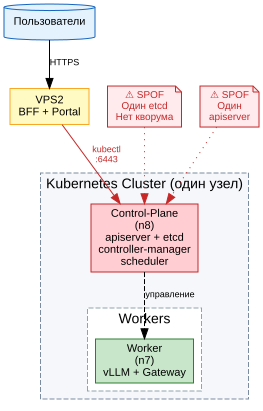
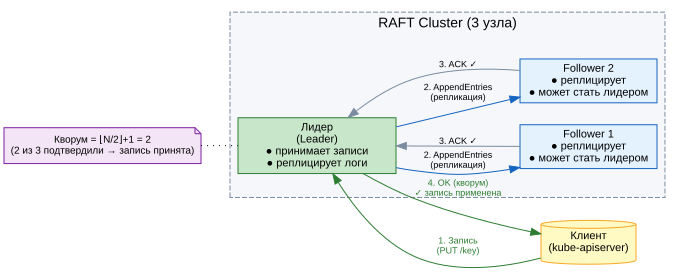
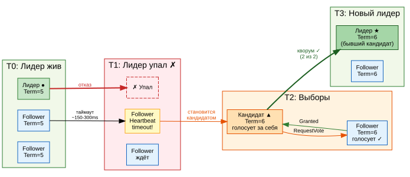
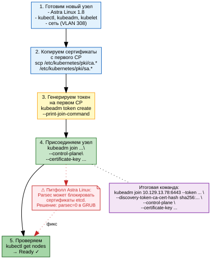
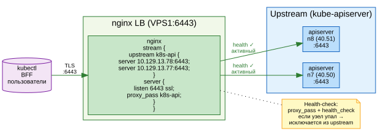
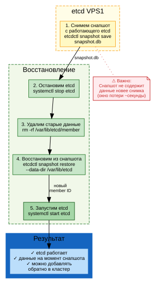

# Часть IV. Production-эксплуатация и продвинутые темы

**Для молодых специалистов (базовый уровень: школьная информатика)**

**Редакция 3.0** · 10.07.2026 · В разработке

---

> **О части IV.** MVP работает. Один сервер, один пользователь, одна модель.
> Теперь превращаем прототип в промышленную систему: несколько серверов,
> десятки организаций, реальные деньги, защита от атак, RAG, аудит.
>
> Каждая глава — законченный production-компонент с кодом и схемами.

---

## Содержание

- **Глава 19.** High Availability: отказоустойчивый Kubernetes ✅
- **Глава 20.** Multi-tenant архитектура: изоляция организаций 🔴
- **Глава 21.** Платёжный шлюз и монетизация 🔴
- **Глава 22.** Enterprise-безопасность: mTLS и AI Security Gateway 🔴
- **Глава 23.** Каталог моделей и RAG-подсистема 🔴
- **Глава 24.** Production Readiness: от MVP к промышленной эксплуатации 🔴

---

<!-- ================================================================= -->
<!-- ГЛАВА 19. HIGH AVAILABILITY                                        -->
<!-- ================================================================= -->

## Глава 19. High Availability: отказоустойчивый Kubernetes

> **Состояние:** ✅ готово — текст + 7 DOT-схем.
> **Объём:** ~30 стр., 7 схем, 5 таблиц.

**Цель главы:** из одного control-plane узла сделать кластер Kubernetes, который переживает отказ любого компонента — apiserver, etcd, control-plane.

> ✏️ **Перед прочтением** убедитесь, что вы освоили Главу 3 (Kubernetes: от Pod до кластера) и Главу 9 (Развёртывание Kubernetes).

---

### 19.1 Зачем нужна отказоустойчивость

#### Проблема одного сервера

В Главе 9 мы развернули Kubernetes на одном узле: один kube-apiserver, один etcd, один controller-manager, один scheduler. Пока узел жив — всё работает. Но что будет, если:

- Сервер перезагрузится (плановое обслуживание, сбой питания)?
- Откажет диск с etcd-данными?
- Сетевой интерфейс потеряет связь?

Ответ: **кластер остановится**. Нельзя создать новый Pod, нельзя изменить ConfigMap, нельзя даже посмотреть `kubectl get pods`. API-сервер недоступен — Kubernetes «ослеп».

Такая архитектура называется **Single Point of Failure (SPOF)** — единственная точка отказа.



> ⚠️ **На схеме:** красным отмечены SPOF — один etcd и один apiserver. Отказ любого из них = кластер не работает.

#### 99.9% vs 99.99%: цена простоя

| Доступность | Простой в год | Простой в месяц | Допустимо для |
|---|---|---|---|
| 99% («две девятки») | 3.65 дня | 7.2 часа | Dev-стенд |
| 99.9% («три девятки») | 8.76 часа | 43 минуты | Staging |
| 99.99% («четыре девятки») | 52 минуты | 4.3 минуты | Production |
| 99.999% («пять девяток») | 5.26 минуты | 26 секунд | Телеком/банкинг |

Для Aither как платформы, предоставляющей LLM-инференс внешним клиентам, целевой уровень — **99.9% (три девятки)**. Это значит: не более 43 минут простоя в месяц.

> 📊 **Таблица 19.1.** Уровни доступности и допустимый простой.

#### Как достигается высокая доступность

Три принципа:

1. **Избыточность (Redundancy)** — каждый критический компонент запущен в нескольких экземплярах на разных физических серверах.
2. **Балансировка (Load Balancing)** — трафик распределяется между экземплярами; отказ одного не прерывает обслуживание.
3. **Консенсус (Consensus)** — несколько узлов etcd договариваются о состоянии кластера; потеря одного не останавливает систему.

В этой главе мы пошагово реализуем все три принципа для Kubernetes-кластера Aither.

---

### 19.2 Теория RAFT и внешний etcd

#### Что такое etcd и почему он критичен

`etcd` — это распределённое key-value хранилище, в котором Kubernetes хранит **всё** состояние кластера:

- Какие Pod'ы запущены и на каких узлах
- ConfigMap'ы и Secrets
- Service'ы, Endpoint'ы, Ingress'ы
- Состояние планировщика и controller-manager

Если etcd теряет данные — кластер «забывает» всё своё состояние. Это как если бы у вас украли бортовой журнал самолёта в полёте. **etcd — самый важный компонент Kubernetes.**

#### Как работает RAFT-консенсус

RAFT — это алгоритм, который позволяет нескольким серверам (узлам etcd) договориться о едином состоянии, даже если часть из них выходит из строя.

**Три роли узла в RAFT:**

| Роль | Описание | Сколько в кластере |
|---|---|---|
| **Лидер (Leader)** | Принимает все записи от клиентов, реплицирует их на follower'ов | Всегда 1 |
| **Follower** | Пассивно реплицирует логи от лидера, отвечает на запросы чтения | Остальные |
| **Кандидат (Candidate)** | Временная роль при выборах (если лидер упал) | 0 или 1 |



> 📊 **Таблица 19.2.** Роли узлов в RAFT-кластере.

#### Поток записи (Write Path)

1. Клиент (kube-apiserver) отправляет запись лидеру: `PUT /key = value`
2. Лидер добавляет запись в **свой** лог и рассылает `AppendEntries` всем follower'ам
3. Follower'ы добавляют запись в свои логи и отвечают `ACK`
4. Когда **большинство** (кворум) подтвердило — запись считается **committed**
5. Лидер применяет запись к своему состоянию и отвечает клиенту `OK`

#### Что такое кворум и почему их должно быть нечётное количество

**Кворум = ⌊N/2⌋ + 1** (половина узлов + 1).

| Всего узлов | Кворум | Отказов переживёт |
|---|---|---|
| 1 | 1 | 0 ⚠️ |
| 2 | 2 | 0 ⚠️ (нет кворума при отказе любого) |
| 3 | 2 | 1 ✅ |
| 5 | 3 | 2 ✅ |
| 7 | 4 | 3 ✅ |

> ⚠️ **Почему 2 узла — нечётное?** При N=2 кворум = 2. Если любой узел падает — остаётся 1, а нужно 2. Кворум потерян, etcd останавливается. Поэтому **production-минимум = 3 узла**.

#### Выборы лидера

Если лидер перестаёт отвечать (heartbeat timeout ~150-300ms):

1. Follower замечает, что heartbeat не приходит
2. Увеличивает свой `Term` (номер эпохи) и становится кандидатом
3. Голосует за себя и рассылает `RequestVote` другим узлам
4. Если получает большинство голосов — становится новым лидером
5. Если голоса разделились — таймаут и новый раунд выборов



#### Почему etcd нужно выносить наружу

В стандартной установке `kubeadm` etcd работает как статический Pod на control-plane узле. Это создаёт проблемы:

- etcd конкурирует за CPU/IO с apiserver, scheduler, controller-manager
- Отказ control-plane узла убивает и etcd (хотя физически диск с данными может быть цел)
- Невозможно добавить 3-й etcd-узел без добавления 3-го control-plane

**Решение:** вынести etcd на отдельные узлы (физические или виртуальные серверы, не входящие в Kubernetes-кластер).

В нашем стенде Aither etcd вынесен на **VPS1** — сервер вне кластера, соединённый с n8 через VPN-туннель.

> 📊 **Таблица 19.3.** Сравнение: etcd внутри кластера vs внешний etcd.

| Критерий | etcd внутри (default) | etcd снаружи (наш выбор) |
|---|---|---|
| Изоляция ресурсов | ❌ Делит CPU/IO с control-plane | ✅ Отдельный сервер |
| Добавление 3-го etcd | ❌ Нужен 3-й control-plane узел | ✅ Добавляем любой сервер |
| Восстановление из снапшота | Сложно (Static Pod) | Просто (`systemctl restart etcd`) |
| Сетевая задержка | ~0 (localhost) | ~1-10ms (VPN/локальная сеть) |
| Требования | — | Стабильный сетевой канал |

---

### 19.3 Multi-master Kubernetes: пошаговое развёртывание

> ✏️ **Этот раздел — практический.** Мы возьмём работающий кластер из Главы 9 (один control-plane) и добавим второй. Все команды проверены на стенде Aither.

#### Шаг 1: Готовим второй узел

На узле **n7** (втором сервере с GPU) выполняем:

```bash
# Установка компонентов Kubernetes (Astra Linux SE 1.8)
apt-get update && apt-get install -y apt-transport-https ca-certificates curl
curl -fsSL https://pkgs.k8s.io/core:/stable:/v1.33/deb/Release.key | \
  gpg --dearmor -o /etc/apt/keyrings/kubernetes-apt-keyring.gpg
echo 'deb [signed-by=/etc/apt/keyrings/kubernetes-apt-keyring.gpg] \
  https://pkgs.k8s.io/core:/stable:/v1.33/deb/ /' > /etc/apt/sources.list.d/kubernetes.list
apt-get update
apt-get install -y kubelet kubeadm kubectl
apt-mark hold kubelet kubeadm kubectl
```

#### Шаг 2: Копируем сертификаты

Kubernetes использует Certificate Authority (CA) для подписи всех внутренних сертификатов. Второй control-plane узел должен доверять тому же CA, что и первый.

```bash
# На ПЕРВОМ узле (n8) — создаём архив сертификатов
cd /etc/kubernetes/pki
tar czf /tmp/k8s-certs.tar.gz ca.crt ca.key sa.pub sa.key front-proxy-ca.crt front-proxy-ca.key

# Копируем на второй узел
scp /tmp/k8s-certs.tar.gz root@10.129.13.77:/tmp/

# На ВТОРОМ узле (n7) — распаковываем
cd /etc/kubernetes
tar xzf /tmp/k8s-certs.tar.gz
```

#### Шаг 3: Генерируем join-команду

На **первом** control-plane (n8):

```bash
# Создаём новый токен (действует 24 часа)
kubeadm token create --print-join-command
```

Пример вывода:
```
kubeadm join 10.129.13.78:6443 --token abcdef.0123456789abcdef \
  --discovery-token-ca-cert-hash sha256:1234...
```

Это базовая команда для присоединения **worker-узла**. Для control-plane нужен дополнительный ключ:

```bash
# Генерируем certificate-key (для шифрования секретов при передаче)
kubeadm init phase upload-certs --upload-certs
```

Пример вывода:
```
[upload-certs] Using certificate key:
8902e1d4f4c2a3b5c6d7e8f9a0b1c2d3e4f5a6b7c8d9e0f1a2b3c4d5e6f7
```

#### Шаг 4: Присоединяем control-plane

**Итоговая команда** на n7:

```bash
kubeadm join 10.129.13.78:6443 \
  --token abcdef.0123456789abcdef \
  --discovery-token-ca-cert-hash sha256:1234... \
  --control-plane \
  --certificate-key 8902e1d4f4c2a3b5c6d7e8f9a0b1c2d3e4f5a6b7c8d9e0f1a2b3c4d5e6f7
```

Что произойдёт:
1. kubeadm подключится к apiserver на n8
2. Скачает конфигурацию кластера (CA, сертификаты, манифесты)
3. Запустит локальный etcd (если не настроен внешний) — **в нашем случае etcd внешний**
4. Запустит kube-apiserver, controller-manager, scheduler
5. Зарегистрирует узел в кластере



#### Шаг 5: Проверяем

```bash
kubectl get nodes
```

Ожидаемый вывод:
```
NAME                         STATUS   ROLES           AGE   VERSION
bootsman-k8s-clnt01-n8-gpu   Ready    control-plane   5d    v1.33.5
bootsmam-k8s-clnt01-n7-gpu   Ready    control-plane   2d    v1.33.5
```

Оба узла в роли `control-plane` — HA работает.

> ⚠️ **Питфолл Astra Linux:** на стенде Aither при добавлении n7 возникла проблема с Parsec — сертификаты etcd не проходили проверку мандатного доступа. Решение: временно отключить Parsec (`parsec=0` в GRUB) на время join'а, затем включить обратно с `max_ilev=63 execstack=1`.

#### etcd-кластер: добавляем VPS1

Поскольку у нас внешний etcd (на VPS1 и n8), добавляем n7 как клиент etcd (не как член кластера):

На n7 обновляем `/etc/kubernetes/manifests/kube-apiserver.yaml`:

```yaml
spec:
  containers:
  - command:
    - kube-apiserver
    ...
    - --etcd-servers=https://170.168.91.95:2379,https://10.129.13.78:2379
    - --etcd-cafile=/etc/kubernetes/pki/etcd/ca.crt
    - --etcd-certfile=/etc/kubernetes/pki/etcd/server.crt
    - --etcd-keyfile=/etc/kubernetes/pki/etcd/server.key
```

После изменения apiserver автоматически перезапустится (Static Pod).

> 📊 **Таблица 19.4.** Компоненты HA-кластера Aither.

| Компонент | n8 (40.51) | n7 (40.50) | VPS1 (170.168.91.95) |
|---|---|---|---|
| etcd | ✅ (член кластера, лидер) | — | ✅ (член кластера, follower) |
| kube-apiserver | ✅ | ✅ | — |
| controller-manager | ✅ | ✅ | — |
| scheduler | ✅ | ✅ | — |
| nginx LB | — | — | ✅ (:6443 → n8 + n7) |

---

### 19.4 Load Balancer для apiserver

#### Зачем нужен балансировщик

Теперь у нас два apiserver (на n8 и n7), но клиенты (kubectl, BFF) должны обращаться по одному адресу. Если один apiserver упадёт — клиент должен автоматически переключиться на второй.

**Решение:** nginx в режиме TCP reverse proxy (stream) на VPS1.

#### Настройка nginx LB

На VPS1 создаём конфигурацию `/etc/nginx/sites-available/k8s-lb`:

```nginx
stream {
    upstream k8s-api {
        server 10.129.13.78:6443;  # n8 (primary)
        server 10.129.13.77:6443;  # n7
    }

    server {
        listen 6443 ssl;
        proxy_pass k8s-api;
        proxy_connect_timeout 1s;
        proxy_timeout 3s;

        # SSL для внешних подключений
        ssl_certificate     /etc/nginx/ssl/k8s-lb.crt;
        ssl_certificate_key /etc/nginx/ssl/k8s-lb.key;
    }
}
```

Активируем:

```bash
ln -s /etc/nginx/sites-available/k8s-lb /etc/nginx/sites-enabled/
nginx -t && systemctl reload nginx
```

#### Проверка

```bash
# С ВНЕШНЕГО клиента (через LB)
kubectl --server https://170.168.91.95:6443 get nodes

# Останавливаем apiserver на n8
ssh n8 "systemctl stop kubelet"

# Пробуем снова — запрос должен уйти на n7
kubectl --server https://170.168.91.95:6443 get nodes
```



> ⚠️ **Важно:** nginx в режиме `stream` не проверяет HTTP-статус. Если apiserver отвечает на TCP, но возвращает ошибки — nginx не переключит трафик. Для продакшена используйте `health_check` (доступен в nginx Plus) или внешний health-checker.

---

### 19.5 Восстановление после сбоя

#### Сценарий 1: Потеря etcd-узла

Если один из двух etcd-узлов падает (например, VPS1 перезагрузился):

1. Кворум потерян (1 < 2) — etcd останавливается **на запись**
2. **Чтение** продолжает работать из кэша apiserver'а
3. kube-apiserver продолжает отвечать, но новые объекты создать нельзя

**Действия:**

```bash
# 1. Проверить статус etcd
ETCDCTL_API=3 etcdctl --endpoints=https://127.0.0.1:2379 \
  --cacert=/etc/kubernetes/pki/etcd/ca.crt \
  --cert=/etc/kubernetes/pki/etcd/server.crt \
  --key=/etc/kubernetes/pki/etcd/server.key \
  endpoint health

# 2. Восстановить упавший узел
systemctl restart etcd   # на VPS1

# 3. Проверить кворум
etcdctl endpoint status --write-out=table
# Ожидаем: 2 узла, кворум восстановлен
```

#### Сценарий 2: Полная потеря etcd (оба узла)

Если оба etcd-узла потеряли данные (дисковый сбой):

```bash
# 1. Остановить etcd на обоих узлах
systemctl stop etcd

# 2. На ЛЮБОМ узле восстановить из ПОСЛЕДНЕГО снапшота
etcdctl snapshot restore /backup/etcd-snapshot.db \
  --name vps1 \
  --initial-cluster "vps1=https://170.168.91.95:2380,n8=https://10.129.13.78:2380" \
  --initial-advertise-peer-urls https://170.168.91.95:2380 \
  --data-dir /etcd-k8s

# 3. Запустить etcd с новыми данными
systemctl start etcd
```



> ⚠️ **Окно потери:** снапшот содержит состояние на момент снятия. Все изменения после снапшота будут потеряны. В Aither снапшоты делаются каждые 30 минут через cron, окно потери — до 30 минут.

#### Сценарий 3: Потеря control-plane узла

Если n8 (основной control-plane) падает:

1. nginx LB автоматически переключает трафик на n7
2. etcd-кластер продолжает работать (VPS1 + n8 etcd или новый лидер)
3. Pod'ы на n8 становятся `Unknown`
4. controller-manager на n7 перепланирует критичные Pod'ы на n7

**Никаких ручных действий не требуется** — кластер самовосстанавливается.

> 📊 **Таблица 19.5.** Матрица отказов: что падает и к чему это приводит.

| Отказ | Влияние | Авто-восстановление | Ручные действия |
|---|---|---|---|
| 1 etcd-узел | Теряется кворум на запись | ❌ | Перезапустить etcd |
| 1 apiserver | Часть запросов падает (LB переключает) | ✅ (LB) | Ничего |
| 1 control-plane | Узел становится NotReady | ✅ (LB + контроллеры) | Ничего |
| 1 worker | Pod'ы на нём становятся Unknown | ✅ (перепланирование) | Ничего (кроме GPU-под) |
| nginx LB | Кластер недоступен снаружи | ❌ | Перезапустить nginx/поднять резервный LB |

#### Резервное копирование etcd

На VPS1 настроен cron для автоматического снапшота:

```bash
#!/bin/bash
# /etc/cron.d/etcd-backup — каждые 30 минут
ETCDCTL_API=3 etcdctl snapshot save /backup/etcd-snapshot-$(date +%Y%m%d-%H%M).db \
  --endpoints=https://127.0.0.1:2379 \
  --cacert=/etc/kubernetes/pki/etcd/ca.crt \
  --cert=/etc/kubernetes/pki/etcd/server.crt \
  --key=/etc/kubernetes/pki/etcd/server.key
```

Снапшот копируется на n8 (второй узел) и хранится 7 дней.

---

### Итоги Главы 19

| Вы узнали | Вы научились |
|---|---|
| Что такое SPOF и как его устранить | Добавлять второй control-plane узел |
| Как работает RAFT-консенсус | Настраивать внешний etcd-кластер |
| Почему etcd лучше держать снаружи | Ставить nginx LB для apiserver |
| Как кворум защищает от потери данных | Восстанавливать etcd из снапшота |

**Ключевой вывод:** HA — это не про «поставить второй сервер». Это про цепочку: etcd (консенсус) → apiserver (избыточность) → LB (балансировка) → worker'ы (перепланирование). Каждый слой должен быть продуман.

---

<!-- ================================================================= -->
<!-- ГЛАВА 20. MULTI-TENANT — ЗАГЛУШКА                                 -->
<!-- ================================================================= -->

## Глава 20. Multi-tenant архитектура: изоляция организаций

> **Состояние:** 🔴 заглушка — ждёт наполнения.
> **Целевой объём:** 35 стр., 8 DOT-схем, 6 таблиц.
> **Детальный TOC:** `05-part4-production-toc.md` § 20.
> **Основа:** задача #21 (реализована в коде, коммиты `1f53b56`, `28f9c9e`).

### 20.1 Модели изоляции: soft vs hard multi-tenancy

> 🔴 Заглушка · 4 стр. · 1 схема · 1 табл.

### 20.2 Per-org API keys и JWT delegation

> 🔴 Заглушка · 7 стр. · 2 схемы · 1 табл.

### 20.3 Rate Limiting и квоты per-org

> 🔴 Заглушка · 7 стр. · 2 схемы · 1 табл.

### 20.4 Model ACL: кому какую модель можно

> 🔴 Заглушка · 5 стр. · 1 схема · 1 табл.

### 20.5 Изоляция данных: биллинг, чаты, DLP

> 🔴 Заглушка · 6 стр. · 1 схема · 1 табл.

### 20.6 Итоговая схема: полный путь запроса

> 🔴 Заглушка · 6 стр. · 1 схема · 1 табл.

---

<!-- ================================================================= -->
<!-- ГЛАВА 21. ПЛАТЁЖНЫЙ ШЛЮЗ — ЗАГЛУШКА                               -->
<!-- ================================================================= -->

## Глава 21. Платёжный шлюз и монетизация

> **Состояние:** 🔴 заглушка — ждёт наполнения.
> **Целевой объём:** 25 стр., 4 DOT-схемы, 5 таблиц.
> **Детальный TOC:** `05-part4-production-toc.md` § 21.

### 21.1 Модель монетизации Aither

> 🔴 Заглушка · 4 стр. · 1 схема · 1 табл.

### 21.2 Архитектура платёжного шлюза

> 🔴 Заглушка · 6 стр. · 1 схема · 1 табл.

### 21.3 Подключение YooKassa: test → live

> 🔴 Заглушка · 6 стр. · 1 схема · 1 табл.

### 21.4 Автопополнение и уведомления

> 🔴 Заглушка · 5 стр. · 1 схема · 1 табл.

### 21.5 Сверка и аудит платежей

> 🔴 Заглушка · 4 стр. · 0 схем · 1 табл.

---

<!-- ================================================================= -->
<!-- ГЛАВА 22. ENTERPRISE-БЕЗОПАСНОСТЬ — ЗАГЛУШКА                      -->
<!-- ================================================================= -->

## Глава 22. Enterprise-безопасность: mTLS и AI Security Gateway

> **Состояние:** 🔴 заглушка — ждёт наполнения.
> **Целевой объём:** 30 стр., 6 DOT-схем, 5 таблиц.
> **Детальный TOC:** `05-part4-production-toc.md` § 22.

### 22.1 Модель угроз Aither (STRIDE)

> 🔴 Заглушка · 5 стр. · 1 схема · 1 табл.

### 22.2 mTLS: взаимная аутентификация сервисов

> 🔴 Заглушка · 8 стр. · 2 схемы · 1 табл.

### 22.3 Parsec и мандатный доступ (Astra Linux)

> 🔴 Заглушка · 5 стр. · 1 схема · 1 табл.

### 22.4 AI Security Gateway: защита от инъекций и DLP

> 🔴 Заглушка · 7 стр. · 1 схема · 1 табл.

### 22.5 Аудит и журналирование

> 🔴 Заглушка · 5 стр. · 1 схема · 1 табл.

---

<!-- ================================================================= -->
<!-- ГЛАВА 23. КАТАЛОГ МОДЕЛЕЙ + RAG — ЗАГЛУШКА                       -->
<!-- ================================================================= -->

## Глава 23. Каталог моделей и RAG-подсистема

> **Состояние:** 🔴 заглушка — ждёт наполнения.
> **Целевой объём:** 35 стр., 8 DOT-схем, 6 таблиц.
> **Детальный TOC:** `05-part4-production-toc.md` § 23.

### 23.1 Каталог моделей: архитектура и API

> 🔴 Заглушка · 6 стр. · 2 схемы · 1 табл.

### 23.2 Hot-reload моделей в vLLM

> 🔴 Заглушка · 6 стр. · 1 схема · 1 табл.

### 23.3 Теория RAG: Retrieval-Augmented Generation

> 🔴 Заглушка · 6 стр. · 1 схема · 1 табл.

### 23.4 ChromaDB: векторная база данных

> 🔴 Заглушка · 7 стр. · 2 схемы · 1 табл.

### 23.5 RAG Pipeline в Gateway

> 🔴 Заглушка · 5 стр. · 1 схема · 1 табл.

### 23.6 Сценарии использования

> 🔴 Заглушка · 5 стр. · 1 схема · 1 табл.

---

<!-- ================================================================= -->
<!-- ГЛАВА 24. PRODUCTION READINESS — ЗАГЛУШКА                         -->
<!-- ================================================================= -->

## Глава 24. Production Readiness: от MVP к промышленной эксплуатации

> **Состояние:** 🔴 заглушка — ждёт наполнения.
> **Целевой объём:** 25 стр., 4 DOT-схемы, 6 таблиц.
> **Детальный TOC:** `05-part4-production-toc.md` § 24.

### 24.1 Threat Model (утверждение)

> 🔴 Заглушка · 5 стр. · 1 схема · 1 табл.

### 24.2 PenTest: методика и проведение

> 🔴 Заглушка · 4 стр. · 1 схема · 1 табл.

### 24.3 Нагрузочное тестирование

> 🔴 Заглушка · 5 стр. · 0 схем · 1 табл.

### 24.4 SLO/SLI и мониторинг

> 🔴 Заглушка · 4 стр. · 1 схема · 1 табл.

### 24.5 Runbooks и аварийное восстановление

> 🔴 Заглушка · 4 стр. · 1 схема · 1 табл.

### 24.6 Чек-лист приёмо-сдаточных испытаний

> 🔴 Заглушка · 3 стр. · 0 схем · 1 табл.

---

*Часть IV в разработке. Глава 19 готова ✅. Главы 20–24 пишутся последовательно.*
