# Платформа Token-as-a-Service «Aither»

## Окончательный самостоятельный архитектурный документ

**Тип документа:** концепция, техническое задание, архитектурное описание, описание алгоритмов, модель данных, описание интерфейсов, план внедрения и эксплуатационная модель.  
**Дата редакции:** 30 июня 2026 г.  
**Статус:** финальная проектная редакция для архитектурного комитета, обсуждения со stakeholders (заинтересованные стороны), постановки задач командам разработки, эксплуатации, машинного обучения, информационной безопасности и финансового контроля.  
**Ключевая позиция документа:** система допускается к реализации только через контрольные точки Gate (контрольная точка допуска) и не должна запускаться в Production (промышленная эксплуатация) без доказательной проверки совместимости, производительности, финансовой целостности, безопасности и отказоустойчивости.

---

## 0. Назначение и принцип чтения документа

Настоящий документ описывает платформу **Aither** как коммерческий сервис класса **Token-as-a-Service (TaaS, токен-как-услуга)**. Платформа предоставляет клиентам единый **API (Application Programming Interface, программный интерфейс приложения)** для доступа к **LLM (Large Language Model, большая языковая модель)** и тарифицирует фактическое потребление токенов. Документ написан так, чтобы его можно было использовать одновременно как:

1. **Концепцию** — зачем нужна система, какую бизнес-проблему она решает и какие решения должен принять архитектурный комитет.
2. **Техническое задание** — какие функциональные и нефункциональные требования должны быть реализованы.
3. **Архитектурное описание** — из каких компонентов состоит система, где проходят границы ответственности, какие интерфейсы используются.
4. **Инженерную спецификацию** — какие классы, объекты, таблицы, алгоритмы, конфигурации, манифесты и playbooks (плейбуки, сценарии автоматизации) должны быть подготовлены разработчиками и DevOps (Development and Operations, разработка и эксплуатация).
5. **План внедрения** — через какие этапы система должна пройти до Pilot (пилотная эксплуатация) и Production (промышленная эксплуатация).

Документ специально не скрывает ограничения. Если система имеет **SPOF (Single Point of Failure, единая точка отказа)** на этапе MVP (Minimum Viable Product, минимально жизнеспособный продукт), это указывается прямо. Если модель может не поместиться в **VRAM (Video Random Access Memory, видеопамять)**, это фиксируется как риск. Если финансовая операция может остаться незакрытой без дополнительного механизма, вводится обязательный механизм закрытия.

---

# Часть 1. Управленческое резюме и решения архитектурного комитета

## 1.1. Суть проекта

Платформа **Aither** должна превратить дорогостоящую **GPU-инфраструктуру (Graphics Processing Unit, графический процессор)** в управляемую коммерческую услугу. Клиент не покупает GPU, не настраивает **CUDA (Compute Unified Device Architecture, вычислительная архитектура NVIDIA)**, не разворачивает **vLLM (Virtual Large Language Model runtime, высокопроизводительная среда инференса LLM)** и не пишет собственный биллинг. Клиент получает ключ, отправляет запрос к endpoint (конечная точка API) `/v1/chat/completions` и получает ответ в формате **SSE (Server-Sent Events, события, отправляемые сервером)**.

Бизнес-ценность Aither состоит в том, что она объединяет четыре слоя, которые обычно существуют разрозненно:

| Слой | Что делает | Почему это важно |
|---|---|---|
| **API Layer (слой API)** | Принимает клиентские запросы, проверяет ключи, валидирует параметры, маршрутизирует на модель | Клиент получает один стабильный интерфейс вместо набора внутренних сервисов |
| **Billing Layer (слой биллинга)** | Резервирует деньги, списывает фактическую стоимость, возвращает остаток, ведёт ledger (бухгалтерский журнал) | Без финансовой целостности TaaS превращается в техническую демонстрацию, а не коммерческий сервис |
| **Inference Layer (слой инференса)** | Запускает LLM на GPU, генерирует токены, стримит ответ | Именно этот слой создаёт пользовательскую ценность, но он дорогой и должен быть защищён от перегрузки |
| **Operations Layer (эксплуатационный слой)** | Собирает metrics (метрики), logs (логи), traces (трассировки), alerts (оповещения), выполняет reconciliation (сверку) | Без наблюдаемости платный сервис невозможно безопасно эксплуатировать |

## 1.2. Решения, которые требуется утвердить

| Код | Решение | Обоснование | Последствия отказа |
|---|---|---|---|
| D1 | Утвердить MVP-scope (границы MVP): API Gateway (шлюз API), Billing Service (сервис биллинга), Inference Tier (уровень инференса), PostgreSQL (реляционная СУБД), Redis (быстрое хранилище), Usage Collector (сборщик потребления), Model Registry (реестр моделей), Observability (наблюдаемость), минимальный Admin API (административный API) | Это минимальный набор, при котором можно проверить коммерческую гипотезу и не потерять финансовую контролируемость | Без D1 команды начнут добавлять личный кабинет, автоплатежи, маркетинг и Enterprise-функции до проверки ядра |
| D2 | Все переходы выполнять через Gates (контрольные точки) 0-5 | Система зависит от RedOS 7.3, NVIDIA driver (драйвер NVIDIA), CUDA, K3s (легковесный Kubernetes), vLLM и GPU-ёмкости. Это нельзя принимать «на веру» | Риск потратить месяцы на разработку, а затем обнаружить, что модель нестабильно работает на целевом стеке |
| D3 | Billing Service + PostgreSQL Ledger признать единственным Source of Truth (источник истины) по деньгам | LiteLLM и vLLM не являются финансовыми системами и не должны принимать решения о деньгах | Невозможность расследовать двойные списания, бесплатные генерации, спорные возвраты |
| D4 | Утвердить правило «1 physical GPU (физический GPU) = 1 production inference slot (промышленный слот инференса)» | Time-slicing (разделение времени GPU) ухудшает latency (задержку) и не должен считаться продажной ёмкостью | Завышенная коммерческая ёмкость приведёт к нарушению SLO (Service Level Objective, целевой уровень сервиса) |
| D5 | RAID0 (массив без отказоустойчивости) разрешить только для восстановимых данных | Model cache (кэш моделей) можно перекачать, но ledger, WAL (Write-Ahead Log, журнал предзаписи) и balances (балансы) нельзя восстановить из воздуха | Потеря одного диска может означать потерю финансовой истории |
| D6 | Запустить параллельный Cloud PoC (Proof of Concept, проверка концепции) в Yandex Cloud | Облако является резервным Production-путём, если on-prem (локальная инфраструктура) не проходит Gate 0 или Gate 2 | Без резервного пути проект может остановиться на несовместимости RedOS/GPU |
| D7 | Ввести обязательную distributed tracing (распределённая трассировка) через `traceparent` по W3C Trace Context (стандарт контекста трассировки W3C) | Финансовые инциденты требуют связи между request_id (идентификатор запроса), reservation_id (идентификатор резерва), ledger entry (запись журнала), inference span (участок трассы инференса) | Расследования будут проводиться вручную и занимать часы или дни |

## 1.3. Итоговая рекомендация

Рекомендуется утвердить статус **Conditional Go (условный допуск)**. Это означает: проект можно запускать как предпроектную инженерную программу и MVP-0, но нельзя обещать внешним клиентам Production (промышленную эксплуатацию), пока не выполнены следующие условия:

1. Подписан **Compatibility Protocol (протокол совместимости)** по RedOS 7.3 + NVIDIA Driver + CUDA + NVIDIA Container Toolkit (набор инструментов для контейнеров NVIDIA) + K3s + vLLM + PyTorch (фреймворк машинного обучения) + целевые модели.
2. Подтверждено, что Qwen3-14B (модель семейства Qwen, 14 млрд параметров) стабильно помещается и работает на RTX 6000 24 GB в выбранной quantization (квантовка) и context length (длина контекста).
3. Подтверждено, что Qwen3-27B не заявляется как on-prem Production-вариант на 24 GB VRAM до успешного benchmark (бенчмарк, измерение производительности); для Ultra-тарифа базовый путь — A100 80GB в облаке или отдельный GPU-класс.
4. Исправлена финансовая state machine (конечный автомат состояний) reserve/settle/refund, добавлены partial settle (частичное списание), reaper (фоновый очиститель зависших резервов), outbox (таблица гарантированной публикации событий) и manual review (ручной разбор).
5. Rate Limiter (ограничитель частоты запросов) и Admission Controller (контроллер допуска к GPU) разделены: первый отвечает за клиентские лимиты, второй — за очереди, приоритеты и backpressure (обратное давление при перегрузке).

---

# Часть 2. Концепция, ограничения и архитектурные принципы

## 2.1. Концепция платформы

Aither строится как **LLM Gateway with trusted billing (шлюз LLM с доверенным биллингом)**. Это означает, что система не просто проксирует запросы к модели, а гарантирует четыре свойства:

1. **Доступ контролируется**: каждый запрос связан с organization (организация), api_key (ключ API), tariff_plan (тарифный план), scopes (области доступа) и model_policy (политика моделей).
2. **Деньги резервируются до инференса**: GPU не должен начинать дорогую генерацию, если у клиента нет баланса или лимита.
3. **Фактическое потребление закрывается после инференса**: система списывает только подтвержденные токены и возвращает остаток резерва.
4. **Каждая операция расследуема**: через request_id, trace_id (идентификатор трассировки), reservation_id и ledger_entry_id можно восстановить полную цепочку.

## 2.2. Исходные ограничения

| Ограничение | Детальное объяснение | Архитектурное следствие |
|---|---|---|
| 2 физических сервера | Два узла не дают полноценного quorum (кворум) для отказоустойчивой БД и control plane (управляющий контур) Kubernetes | Для MVP допустим документированный SPOF. Для Production нужен третий узел, managed DB (управляемая БД) или облачный контур |
| 4×RTX 6000 24 GB | GPU без NVLink (высокоскоростная меж-GPU шина), по 24 GB VRAM | Tensor Parallelism (тензорный параллелизм) не является базовой стратегией. Одна модель должна помещаться на один GPU |
| RedOS 7.3 | Корпоративное требование ИБ, потенциально старое ядро и ограничения драйверов | Gate 0 обязателен до разработки бизнес-логики |
| RAID0 | Возможен как быстрый массив, но без отказоустойчивости | Только model cache, container layers (слои контейнеров), benchmark artifacts (артефакты тестов). Запрещён для PostgreSQL, WAL, backups, ledger |
| Внешние клиенты | Потенциально недоверенный трафик, abuse (злоупотребления), DDoS (распределённый отказ в обслуживании), prompt injection (инъекция в промпт) | Нужны ALB, WAF, rate limiting, quotas, anomaly detection (детектор аномалий), строгая политика логирования |

## 2.3. Архитектурные принципы

| Принцип | Содержание | Почему это убеждает оппонентов |
|---|---|---|
| Fail closed (закрытый отказ) | Если Billing, PostgreSQL или ledger недоступны, платный инференс не запускается | Лучше отказать запросу, чем сгенерировать неоплаченный ответ без финансового следа |
| Ledger first (сначала бухгалтерский журнал) | Любое изменение денег отражается в append-only ledger (журнал только на добавление) | Финансовая история не может быть переписана задним числом без следа |
| Idempotency everywhere (идемпотентность везде) | Повтор одного и того же запроса с тем же idempotency_key не создаёт двойное списание | Сетевые повторы, рестарты и таймауты не превращаются в финансовый хаос |
| Explicit ownership (явная ответственность) | Каждый компонент имеет строго ограниченную роль | Убираются спорные зоны ответственности «кто должен закрывать транзакцию?» |
| Observability by design (наблюдаемость как часть дизайна) | Метрики, логи и трассы проектируются заранее | Эксплуатация не будет вслепую искать причины отказов |
| No hidden production promises (никаких скрытых обещаний Production) | MVP не выдаётся за HA Production | Снижает конфликт с ИБ, эксплуатацией и архитектурным комитетом |

---

# Часть 3. Целевая архитектура и схемы

## 3.1. Контекст системы

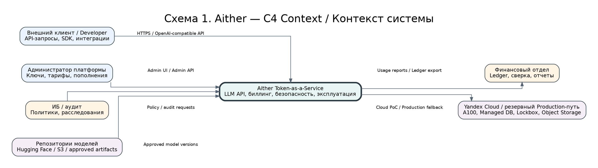

**Пояснение.** Схема показывает, что внешний клиент не имеет прямого доступа ни к GPU, ни к PostgreSQL, ни к Object Storage (объектное хранилище). Вся внешняя коммуникация проходит через публичный API. Это важно для безопасности и для финансового контроля: нельзя позволить клиенту напрямую обращаться к vLLM, потому что тогда Billing Service не сможет гарантировать reserve/settle/refund.

## 3.2. Контейнерная архитектура

```dot
digraph G {
    rankdir=LR;
    label="Схема 2. Aither — Container Architecture / Контейнерная архитектура";

    graph [fontname="DejaVu Sans", bgcolor="white", labelloc="t", fontsize=22, pad="0.35", nodesep="0.55", ranksep="0.85", splines=ortho];
    node  [fontname="DejaVu Sans", shape=box, style="rounded,filled", color="#2B3A42", fillcolor="#F7F9FB", fontsize=11, margin="0.14,0.10"];
    edge  [fontname="DejaVu Sans", color="#566573", fontsize=9, arrowsize=0.8];

    client [label="Client SDK / HTTP Client", fillcolor="#EAF3FF"];
    subgraph cluster_edge { label="Edge Layer / Периметр"; color="#AED6F1"; style="dashed";
      alb [label="Application Load Balancer
TLS termination, WAF, routing", fillcolor="#EAF3FF"];
    }
    subgraph cluster_app { label="Application Zone / Зона приложений"; color="#A9DFBF"; style="dashed";
      gw [label="API Gateway / LiteLLM fork
Auth, validation, routing, SSE proxy", fillcolor="#E8F6F3"];
      rate [label="Rate Limiter
Atomic RPM/TPM limits", fillcolor="#E8F6F3"];
      adm [label="Admission Controller
Priority queues, backpressure", fillcolor="#E8F6F3"];
      bill [label="Billing Service
reserve, settle, refund, ledger", fillcolor="#FFF4E5", penwidth=2];
      uc [label="Usage Collector
Token accounting, finalization", fillcolor="#E8F6F3"];
    }
    subgraph cluster_data { label="Data Zone / Зона данных"; color="#F5B7B1"; style="dashed";
      pg [label="PostgreSQL
accounts, ledger, reservations, outbox", fillcolor="#FDEDEC"];
      redis [label="Redis / Managed Redis
rate buckets, queues, locks", fillcolor="#FDEDEC"];
      lock [label="Lockbox / KMS
pepper, service secrets", fillcolor="#F5EEF8"];
      obj [label="Object Storage
models, backups, exports", fillcolor="#F5EEF8"];
    }
    subgraph cluster_inf { label="Inference Zone / Зона инференса"; color="#D7BDE2"; style="dashed";
      inf [label="vLLM Runtime
GPU nodes, SSE streaming, usage metadata", fillcolor="#EBF5FB", penwidth=2];
      reg [label="Model Registry
versions, checksums, approval", fillcolor="#EBF5FB"];
    }
    subgraph cluster_ops { label="Ops Zone / Эксплуатация"; color="#D5DBDB"; style="dashed";
      mon [label="Observability
metrics, logs, traces, alerts", fillcolor="#F4F6F7"];
      fin [label="FinOps Dashboard
cost tags, billing export", fillcolor="#F4F6F7"];
    }
    client -> alb [label="HTTPS"];
    alb -> gw [label="HTTP/2 + traceparent"];
    gw -> rate [label="check_and_consume"];
    gw -> bill [label="reserve"];
    gw -> adm [label="enqueue / admit"];
    adm -> inf [label="dispatch"];
    inf -> gw [label="SSE chunks"];
    gw -> uc [label="observed chunks"];
    uc -> bill [label="settle / partial_settle / refund"];
    bill -> pg [label="ACID tx"];
    rate -> redis [label="Lua script"];
    adm -> redis [label="priority queue"];
    bill -> lock [label="pepper / secrets"];
    reg -> obj [label="approved artifacts"];
    inf -> reg [label="model metadata"];
    gw -> mon; bill -> mon; inf -> mon; pg -> mon; redis -> mon; fin -> obj;
}
```

**Пояснение.** В отличие от упрощённой архитектуры, здесь явно разделены Rate Limiter и Admission Controller. Rate Limiter отвечает на вопрос «имеет ли клиент право отправить такой объём запросов?». Admission Controller отвечает на другой вопрос: «может ли система прямо сейчас принять этот запрос в GPU-очередь без нарушения SLO?». Это разные задачи, и их нельзя смешивать.

## 3.3. Последовательность платного streaming-запроса

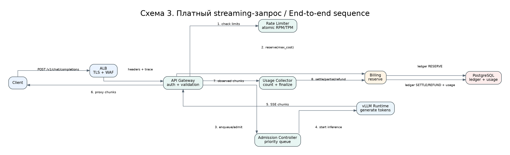

**Ключевой принцип.** GPU-инференс стартует только после успешного reserve (резервирование средств). Если reserve не прошёл, запрос завершается HTTP 402 Payment Required (требуется оплата) или 403/429 в зависимости от причины. Если reserve прошёл, но очередь GPU переполнена, Billing Service обязан получить refund (возврат резерва).

## 3.4. Конечный автомат биллинга

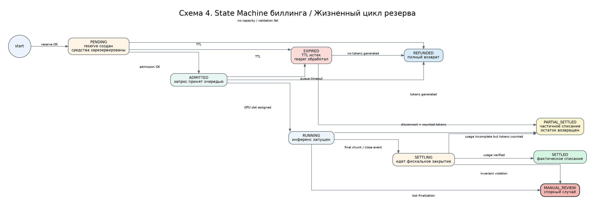

**Почему это критично.** В исходной логике reserve создавал состояние PENDING, а settle ожидал IN_PROGRESS/RUNNING. Это оставляло неописанный переход и создавало риск зависших резервов. Исправленная state machine (конечный автомат) явно описывает все допустимые переходы, включая queue timeout (таймаут очереди), disconnect (обрыв соединения), partial settle (частичное списание), expired (истечение TTL) и manual review (ручной разбор).

## 3.5. Модель данных

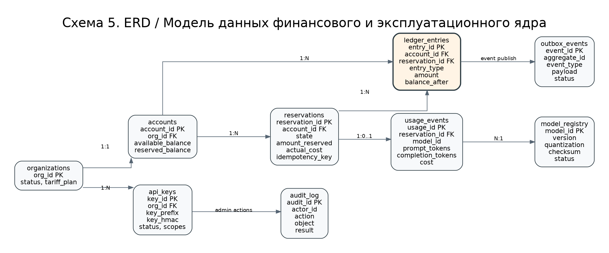

**Пояснение.** Таблица `ledger_entries` является append-only (только добавление). Таблица `accounts` является materialized snapshot (материализованный снимок баланса), который можно обновлять строго внутри ACID-транзакции. Это исправляет важное методологическое противоречие: нельзя говорить, что баланс вообще никогда не обновляется. Правильная формулировка: финансовая история неизменяема в ledger, а текущий баланс является вычисляемым/проверяемым снимком.

## 3.6. Rate Limiter и Admission Controller

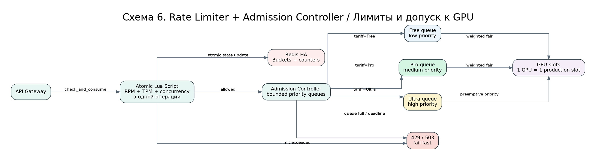

## 3.7. Usage Collector

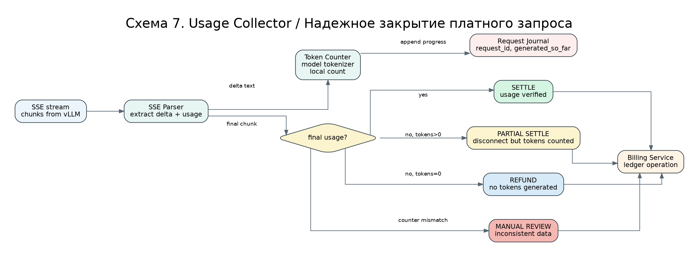

## 3.8. Circuit Breaker

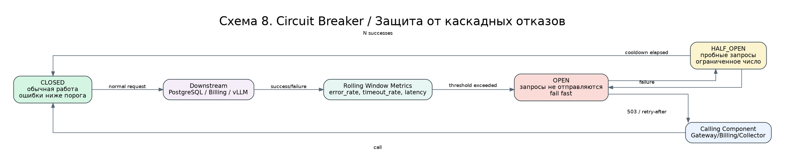

## 3.9. Security Zones

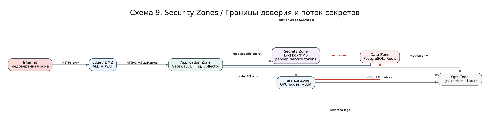

## 3.10. Observability

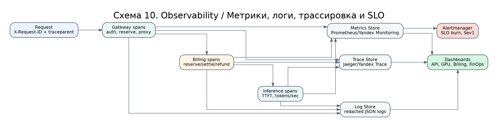

## 3.11. On-Prem MVP

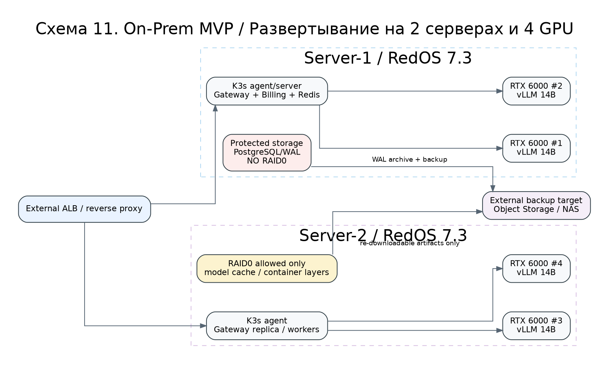

## 3.12. Yandex Cloud Production Path

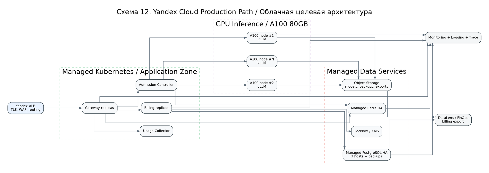

## 3.13. Model Registry rollout

```dot
digraph G {
    rankdir=LR;
    label="Схема 13. Model Registry / Контролируемый выпуск модели";

    graph [fontname="DejaVu Sans", bgcolor="white", labelloc="t", fontsize=22, pad="0.35", nodesep="0.55", ranksep="0.85", splines=ortho];
    node  [fontname="DejaVu Sans", shape=box, style="rounded,filled", color="#2B3A42", fillcolor="#F7F9FB", fontsize=11, margin="0.14,0.10"];
    edge  [fontname="DejaVu Sans", color="#566573", fontsize=9, arrowsize=0.8];

    candidate [label="Candidate model
weights + tokenizer", fillcolor="#EAF3FF"];
    scan [label="Security/license scan
checksum, license, source", fillcolor="#FFF4E5"];
    bench [label="Benchmark Gate
latency, TTFT, tokens/sec, VRAM", fillcolor="#FCF3CF"];
    registry [label="Model Registry
status: candidate/staging/approved/deprecated", fillcolor="#EBF5FB"];
    canary [label="Canary deployment
1-5% traffic", fillcolor="#E8F6F3"];
    prod [label="Production deployment
approved model", fillcolor="#D5F5E3"];
    rollback [label="Rollback target
previous approved version", fillcolor="#FADBD8"];
    candidate -> scan -> bench -> registry -> canary -> prod;
    registry -> rollback [label="required field"];
    prod -> rollback [label="incident / SLO breach"];
}
```

## 3.14. Reconciliation

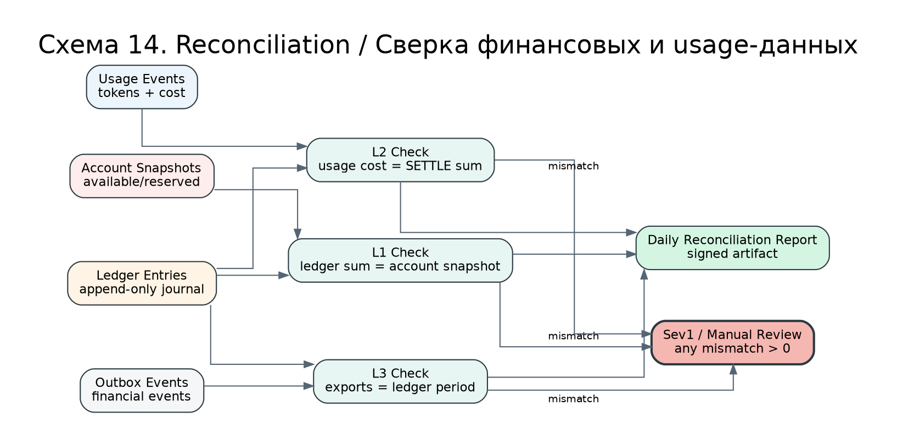

---

# Часть 4. Детальное описание компонентов, классов, интерфейсов и конфигураций

## 4.1. Application Load Balancer (ALB, балансировщик нагрузки прикладного уровня)

### Назначение

**ALB (Application Load Balancer, балансировщик нагрузки прикладного уровня)** — единственная публичная точка входа. Он завершает **TLS (Transport Layer Security, протокол защиты транспортного уровня)**, применяет **WAF (Web Application Firewall, межсетевой экран веб-приложений)**, выполняет health checks (проверки работоспособности) и передаёт запросы во внутренний API Gateway.

### Почему ALB нужен даже в MVP

Оппонент может сказать: «Для MVP можно открыть API Gateway напрямую». Это неверно по трём причинам. Во-первых, внешний TLS и WAF лучше держать отдельно от бизнес-логики. Во-вторых, ALB сразу формирует правильную boundary (границу) между Internet (интернет) и Application Zone. В-третьих, будущий переход от одного Gateway к нескольким будет проще, если точка входа уже вынесена.

### Минимальная конфигурация

```yaml
apiVersion: alb.yandex-cloud.net/v1
kind: ApplicationLoadBalancer
metadata:
  name: aither-edge-alb
  labels:
    project: aither
    component: edge
spec:
  listener:
    protocol: HTTPS
    port: 443
    tls:
      minVersion: TLSv1_2
      preferredVersion: TLSv1_3
  waf:
    profile: owasp-top-10
    mode: block
  routing:
    - match:
        pathPrefix: /v1/
      backendGroup: aither-api-gateway
  headers:
    add:
      - name: X-Request-ID
        value: generate-if-absent
      - name: traceparent
        value: propagate-or-create
  healthChecks:
    path: /ready
    interval: 5s
    timeout: 2s
    healthyThreshold: 2
    unhealthyThreshold: 3
```

### Интерфейс к API Gateway

```http
POST /v1/chat/completions HTTP/2
Host: api.aither.internal
Authorization: Bearer aither-<prefix10>-<secret32>
X-Request-ID: 2f1d4e6a-7c30-4c63-b512-111111111111
traceparent: 00-4bf92f3577b34da6a3ce929d0e0e4736-00f067aa0ba902b7-01
Content-Type: application/json
```

---

## 4.2. API Gateway (шлюз API) / LiteLLM Proxy fork (форк LiteLLM Proxy)

### Назначение

API Gateway принимает OpenAI-compatible API (API, совместимый с OpenAI) и выполняет orchestration (оркестрацию) запроса. Он не является финансовой системой, но инициирует reserve и передаёт Usage Collector данные для settle/refund.

### Объекты и классы

| Класс | Назначение | Ключевые методы |
|---|---|---|
| `GatewayApp` | Главный объект приложения | `handle_chat_completions()`, `handle_models()`, `health()`, `ready()` |
| `AuthService` | Проверка API-ключей | `parse_key()`, `verify_hmac()`, `load_org_context()` |
| `RequestValidator` | Проверка JSON, model, max_tokens, stream | `validate_chat_request()`, `estimate_prompt_tokens()` |
| `BillingClient` | Клиент Billing Service | `reserve()`, `settle()`, `partial_settle()`, `refund()` |
| `RateLimiterClient` | Клиент Rate Limiter | `check_and_consume()` |
| `AdmissionClient` | Клиент Admission Controller | `enqueue()`, `cancel()`, `heartbeat()` |
| `SSEProxy` | Проксирование Server-Sent Events | `stream_to_client()` |
| `UsageObserver` | Наблюдение за токенами и финальным usage | `on_chunk()`, `on_disconnect()`, `finalize()` |

### Формат API key (ключ API)

Формат ключа утверждается как:

```text
aither-<random_prefix_10>-<random_secret_32>
```

Где:

| Часть | Назначение | Хранение |
|---|---|---|
| `aither` | статический идентификатор типа ключа | публично |
| `random_prefix_10` | быстрый поиск записи в БД, примерно 60 бит энтропии | хранится в `api_keys.key_prefix` |
| `random_secret_32` | секретная часть ключа | не хранится никогда |
| `HMAC-SHA256(pepper, secret)` | проверочная хеш-подпись | хранится в `api_keys.key_hmac` |

### Псевдокод обработки запроса

```python
class GatewayApp:
    async def handle_chat_completions(self, http_request):
        request_id = get_or_create_request_id(http_request.headers)
        trace = get_or_create_trace(http_request.headers)

        api_key = AuthService.extract_bearer(http_request.headers)
        key_context = await AuthService.verify_key(api_key)
        org = key_context.organization
        tariff = key_context.tariff_plan

        body = RequestValidator.parse_json(http_request.body)
        RequestValidator.validate_chat_request(body, tariff)
        prompt_tokens_estimate = RequestValidator.estimate_prompt_tokens(body)
        completion_tokens_limit = body.get("max_tokens", tariff.default_max_tokens)

        await RateLimiterClient.check_and_consume(
            org_id=org.id,
            tariff=tariff,
            rpm_cost=1,
            tpm_cost=prompt_tokens_estimate + completion_tokens_limit,
            concurrency_cost=1,
            request_id=request_id,
        )

        max_cost = PricingService.estimate_max_cost(
            model=body["model"],
            prompt_tokens=prompt_tokens_estimate,
            completion_tokens=completion_tokens_limit,
            tariff=tariff,
        )

        reservation = await BillingClient.reserve(
            org_id=org.id,
            amount=max_cost,
            idempotency_key=f"reserve:{request_id}",
            request_id=request_id,
        )

        try:
            admission = await AdmissionClient.enqueue(
                request_id=request_id,
                org_id=org.id,
                tariff=tariff.name,
                model=body["model"],
                deadline_ms=tariff.queue_deadline_ms,
            )
        except QueueRejected:
            await BillingClient.refund(reservation.id, reason="queue_rejected")
            raise HTTPError(503, "Inference capacity unavailable")

        observer = UsageObserver(
            request_id=request_id,
            reservation_id=reservation.id,
            model=body["model"],
            tokenizer=TokenizerRegistry.get(body["model"]),
        )

        async for chunk in SSEProxy.stream(admission.target_url, body):
            observer.on_chunk(chunk)
            yield chunk

        await observer.finalize()
```

### Важная реализационная деталь

Gateway не должен ждать Billing Service бесконечно. Все вызовы Billing должны иметь timeout (таймаут), retry policy (политику повторов) и circuit breaker. Если Billing недоступен до старта инференса, запрос отклоняется. Если Billing временно недоступен после генерации, Usage Collector записывает событие finalization_pending (ожидание закрытия) в outbox и reaper обязан довести транзакцию до финального состояния.

---

## 4.3. Rate Limiter (ограничитель частоты запросов)

### Назначение

Rate Limiter ограничивает RPM (Requests Per Minute, запросы в минуту), TPM (Tokens Per Minute, токены в минуту) и concurrency (одновременные запросы). Он не должен принимать решения о GPU-очередях; это задача Admission Controller.

### Исправление исходной проблемы

Нельзя проверять RPM и TPM двумя независимыми Lua-скриптами, потому что между ними возникает race condition (гонка состояний). Исправленная реализация выполняет проверку RPM, TPM и concurrency атомарно в одном Lua-скрипте Redis.

### Lua-скрипт атомарной проверки

```lua
-- KEYS[1] = rpm bucket key
-- KEYS[2] = tpm bucket key
-- KEYS[3] = concurrency key
-- ARGV[1] = now_ms
-- ARGV[2] = rpm_rate_per_sec
-- ARGV[3] = rpm_burst
-- ARGV[4] = tpm_rate_per_sec
-- ARGV[5] = tpm_burst
-- ARGV[6] = rpm_cost
-- ARGV[7] = tpm_cost
-- ARGV[8] = max_concurrency
-- ARGV[9] = ttl_seconds

local function refill(bucket_key, rate, burst, now_ms)
  local data = redis.call('HMGET', bucket_key, 'tokens', 'last_refill')
  local tokens = tonumber(data[1]) or burst
  local last_refill = tonumber(data[2]) or now_ms
  local delta = math.max(0, now_ms - last_refill)
  tokens = math.min(burst, tokens + (delta / 1000.0) * rate)
  return tokens
end

local now_ms = tonumber(ARGV[1])
local rpm_tokens = refill(KEYS[1], tonumber(ARGV[2]), tonumber(ARGV[3]), now_ms)
local tpm_tokens = refill(KEYS[2], tonumber(ARGV[4]), tonumber(ARGV[5]), now_ms)
local concurrency = tonumber(redis.call('GET', KEYS[3]) or '0')

local rpm_cost = tonumber(ARGV[6])
local tpm_cost = tonumber(ARGV[7])
local max_concurrency = tonumber(ARGV[8])
local ttl = tonumber(ARGV[9])

if rpm_tokens < rpm_cost then
  return {0, 'rpm_exceeded', rpm_tokens, tpm_tokens, concurrency}
end
if tpm_tokens < tpm_cost then
  return {0, 'tpm_exceeded', rpm_tokens, tpm_tokens, concurrency}
end
if concurrency >= max_concurrency then
  return {0, 'concurrency_exceeded', rpm_tokens, tpm_tokens, concurrency}
end

rpm_tokens = rpm_tokens - rpm_cost
tpm_tokens = tpm_tokens - tpm_cost
concurrency = concurrency + 1

redis.call('HMSET', KEYS[1], 'tokens', rpm_tokens, 'last_refill', now_ms)
redis.call('HMSET', KEYS[2], 'tokens', tpm_tokens, 'last_refill', now_ms)
redis.call('SET', KEYS[3], concurrency, 'EX', ttl)
redis.call('EXPIRE', KEYS[1], ttl)
redis.call('EXPIRE', KEYS[2], ttl)

return {1, 'allowed', rpm_tokens, tpm_tokens, concurrency}
```

### Конфигурация тарифов

```yaml
tariffs:
  free:
    rpm_per_minute: 5
    rpm_burst: 10
    tpm_per_minute: 10000
    tpm_burst: 20000
    max_concurrency: 2
    queue_deadline_ms: 5000
    priority_weight: 1
  pro:
    rpm_per_minute: 60
    rpm_burst: 120
    tpm_per_minute: 100000
    tpm_burst: 200000
    max_concurrency: 10
    queue_deadline_ms: 15000
    priority_weight: 5
  ultra:
    rpm_per_minute: 300
    rpm_burst: 600
    tpm_per_minute: 500000
    tpm_burst: 1000000
    max_concurrency: 50
    queue_deadline_ms: 30000
    priority_weight: 20
```

---

## 4.4. Admission Controller (контроллер допуска к GPU)

### Назначение

Admission Controller защищает самый дорогой ресурс — GPU. Он получает уже авторизованный и финансово зарезервированный запрос и решает, можно ли поставить его в очередь. Если очередь переполнена или прогнозируемое ожидание превышает deadline (крайний срок ожидания), запрос отвергается, а Billing Service получает refund.

### Почему он нужен отдельно от Rate Limiter

Rate Limiter отвечает за права клиента в единицу времени. Но даже если клиент не превышает лимиты, GPU может быть занят. Нужен механизм, который не позволит системе накопить бесконечную очередь и нарушить latency для всех клиентов.

### Классы

```python
@dataclass
class AdmissionRequest:
    request_id: str
    org_id: str
    tariff: str
    model_id: str
    priority_weight: int
    deadline_ms: int
    max_tokens: int
    reservation_id: str

@dataclass
class AdmissionDecision:
    accepted: bool
    reason: str
    target_url: str | None
    estimated_wait_ms: int

class AdmissionController:
    async def enqueue(self, req: AdmissionRequest) -> AdmissionDecision: ...
    async def cancel(self, request_id: str, reason: str) -> None: ...
    async def heartbeat_gpu_slot(self, slot_id: str, state: str) -> None: ...
    async def dispatch_loop(self) -> None: ...
```

### Алгоритм weighted fair dispatch

```python
async def dispatch_loop():
    while True:
        available_slot = await slot_registry.get_available_slot()
        if not available_slot:
            await sleep(100_ms)
            continue

        # Очереди проверяются по весам: Ultra чаще, Pro средне, Free реже.
        queue_name = scheduler.pick_queue(weights={"ultra": 20, "pro": 5, "free": 1})
        req = await redis_priority_queue.pop(queue_name)
        if not req:
            continue

        if now_ms() > req.created_at_ms + req.deadline_ms:
            await billing.refund(req.reservation_id, reason="queue_deadline_exceeded")
            continue

        await mark_slot_busy(available_slot.id, req.request_id)
        await gateway_callback.start_stream(req.request_id, available_slot.url)
```

---

## 4.5. Billing Service (сервис биллинга)

### Назначение

Billing Service является финансовым ядром Aither. Он выполняет reserve (резервирование), settle (финальное списание), partial_settle (частичное списание), refund (возврат), topup (пополнение), reconciliation (сверка) и формирует audit trail (аудиторский след).

### Исправленная финансовая модель

Правильная формулировка:

> `ledger_entries` является неизменяемым append-only журналом. `accounts` является материализованным снимком текущего состояния баланса, который обновляется только внутри ACID-транзакции одновременно с записью в ledger. Любой снимок должен быть восстановим из ledger и регулярно сверяться reconciliation job.

### Таблицы PostgreSQL

```sql
CREATE TABLE organizations (
    org_id UUID PRIMARY KEY,
    name TEXT NOT NULL,
    status TEXT NOT NULL CHECK (status IN ('active','blocked','deleted')),
    tariff_plan TEXT NOT NULL,
    created_at TIMESTAMPTZ NOT NULL DEFAULT now()
);

CREATE TABLE accounts (
    account_id UUID PRIMARY KEY,
    org_id UUID NOT NULL REFERENCES organizations(org_id),
    currency CHAR(3) NOT NULL DEFAULT 'RUB',
    available_balance NUMERIC(18,6) NOT NULL DEFAULT 0,
    reserved_balance NUMERIC(18,6) NOT NULL DEFAULT 0,
    version BIGINT NOT NULL DEFAULT 0,
    updated_at TIMESTAMPTZ NOT NULL DEFAULT now(),
    CHECK (available_balance >= 0),
    CHECK (reserved_balance >= 0)
);

CREATE TABLE reservations (
    reservation_id UUID PRIMARY KEY,
    account_id UUID NOT NULL REFERENCES accounts(account_id),
    org_id UUID NOT NULL REFERENCES organizations(org_id),
    request_id UUID NOT NULL,
    state TEXT NOT NULL CHECK (state IN (
        'PENDING','ADMITTED','RUNNING','SETTLING','SETTLED',
        'PARTIAL_SETTLED','REFUNDED','EXPIRED','MANUAL_REVIEW'
    )),
    amount_reserved NUMERIC(18,6) NOT NULL,
    actual_cost NUMERIC(18,6),
    idempotency_key TEXT NOT NULL UNIQUE,
    expires_at TIMESTAMPTZ NOT NULL,
    created_at TIMESTAMPTZ NOT NULL DEFAULT now(),
    updated_at TIMESTAMPTZ NOT NULL DEFAULT now()
);

CREATE TABLE ledger_entries (
    entry_id UUID PRIMARY KEY,
    account_id UUID NOT NULL REFERENCES accounts(account_id),
    reservation_id UUID REFERENCES reservations(reservation_id),
    request_id UUID,
    entry_type TEXT NOT NULL CHECK (entry_type IN (
        'TOPUP','RESERVE','SETTLE','PARTIAL_SETTLE','REFUND','ADJUSTMENT'
    )),
    amount NUMERIC(18,6) NOT NULL,
    available_balance_after NUMERIC(18,6) NOT NULL,
    reserved_balance_after NUMERIC(18,6) NOT NULL,
    idempotency_key TEXT NOT NULL,
    created_at TIMESTAMPTZ NOT NULL DEFAULT now(),
    UNIQUE (idempotency_key, entry_type)
);

CREATE TABLE usage_events (
    usage_id UUID PRIMARY KEY,
    reservation_id UUID NOT NULL REFERENCES reservations(reservation_id),
    request_id UUID NOT NULL,
    org_id UUID NOT NULL,
    model_id TEXT NOT NULL,
    prompt_tokens BIGINT NOT NULL,
    completion_tokens BIGINT NOT NULL,
    total_tokens BIGINT NOT NULL,
    cost NUMERIC(18,6) NOT NULL,
    source TEXT NOT NULL CHECK (source IN ('final_usage','local_counter','manual')),
    created_at TIMESTAMPTZ NOT NULL DEFAULT now()
);

CREATE TABLE outbox_events (
    event_id UUID PRIMARY KEY,
    aggregate_type TEXT NOT NULL,
    aggregate_id UUID NOT NULL,
    event_type TEXT NOT NULL,
    payload JSONB NOT NULL,
    status TEXT NOT NULL CHECK (status IN ('new','published','failed')),
    retry_count INT NOT NULL DEFAULT 0,
    created_at TIMESTAMPTZ NOT NULL DEFAULT now(),
    published_at TIMESTAMPTZ
);
```

### Алгоритм reserve

```python
async def reserve(org_id, request_id, amount, idempotency_key):
    async with db.transaction(isolation='read_committed') as tx:
        existing = await tx.fetch_one(
            'SELECT reservation_id FROM reservations WHERE idempotency_key=$1',
            idempotency_key,
        )
        if existing:
            return existing.reservation_id

        account = await tx.fetch_one(
            'SELECT * FROM accounts WHERE org_id=$1 FOR UPDATE', org_id
        )
        if account.available_balance < amount:
            raise InsufficientFunds()

        new_available = account.available_balance - amount
        new_reserved = account.reserved_balance + amount

        await tx.execute(
            'UPDATE accounts SET available_balance=$1, reserved_balance=$2, version=version+1 WHERE account_id=$3',
            new_available, new_reserved, account.account_id,
        )

        reservation_id = uuid4()
        await tx.execute(
            'INSERT INTO reservations (...) VALUES (...)',
        )
        await tx.execute(
            'INSERT INTO ledger_entries (entry_type, amount, ...) VALUES (RESERVE, -amount, ...)',
        )
        await tx.execute(
            'INSERT INTO outbox_events (...) VALUES (...)',
        )
        return reservation_id
```

### Алгоритм settle / partial settle / refund

```python
async def finalize_reservation(reservation_id, usage, mode, idempotency_key):
    async with db.transaction() as tx:
        reservation = await tx.fetch_one(
            'SELECT * FROM reservations WHERE reservation_id=$1 FOR UPDATE',
            reservation_id,
        )
        if reservation.state in ('SETTLED','PARTIAL_SETTLED','REFUNDED'):
            return IdempotentReplay()

        account = await tx.fetch_one(
            'SELECT * FROM accounts WHERE account_id=$1 FOR UPDATE',
            reservation.account_id,
        )

        if mode == 'refund':
            actual_cost = Decimal('0')
            new_state = 'REFUNDED'
        elif mode == 'settle':
            actual_cost = price(usage)
            new_state = 'SETTLED'
        elif mode == 'partial_settle':
            actual_cost = price(usage)
            new_state = 'PARTIAL_SETTLED'
        else:
            raise InvalidMode()

        if actual_cost > reservation.amount_reserved:
            new_state = 'MANUAL_REVIEW'
            actual_cost = reservation.amount_reserved

        refund_amount = reservation.amount_reserved - actual_cost
        new_available = account.available_balance + refund_amount
        new_reserved = account.reserved_balance - reservation.amount_reserved

        await update_account_snapshot(new_available, new_reserved)
        await insert_usage_event_if_cost_gt_zero(usage, actual_cost)
        await insert_ledger_entry(entry_type_for(new_state), amount=-actual_cost)
        if refund_amount > 0:
            await insert_ledger_entry('REFUND', amount=refund_amount)
        await update_reservation_state(new_state)
        await insert_outbox_event('reservation.finalized')
```

### Reservation Reaper

Reservation Reaper (фоновый очиститель резервов) нужен для обработки зависших резервов. Он запускается каждые 1-5 минут и ищет резервы, у которых `expires_at < now()` и состояние не финальное.

```python
async def reservation_reaper():
    rows = await db.fetch_all('''
        SELECT reservation_id
        FROM reservations
        WHERE expires_at < now()
          AND state IN ('PENDING','ADMITTED','RUNNING','SETTLING')
        LIMIT 100
        FOR UPDATE SKIP LOCKED
    ''')
    for row in rows:
        progress = await request_journal.get_progress(row.reservation_id)
        if progress.generated_tokens > 0:
            await billing.partial_settle(row.reservation_id, progress.usage, reason='expired_with_tokens')
        else:
            await billing.refund(row.reservation_id, reason='expired_without_tokens')
```

---

## 4.6. Usage Collector / Inference Observer (сборщик потребления / наблюдатель инференса)

### Назначение

Usage Collector — критический компонент финансовой безопасности. Он наблюдает за SSE-потоком, считает токены и инициирует фискальное закрытие резерва.

### Почему нельзя полагаться только на финальный usage

В идеальном сценарии vLLM возвращает финальный chunk (фрагмент потока) с usage. Но в реальной сети возможны:

1. Клиент оборвал соединение до финального чанка.
2. Gateway перезапустился во время стрима.
3. vLLM отдал часть токенов и упал.
4. Финальный usage не совпал с локальным счётчиком.
5. Billing Service временно недоступен в момент закрытия.

Если во всех этих случаях делать полный refund, появляется финансовая уязвимость: клиент может намеренно обрывать поток и получать бесплатные ответы. Поэтому вводится partial settle.

### Классы

```python
class UsageObserver:
    def __init__(self, request_id, reservation_id, model_id, tokenizer): ...
    def on_chunk(self, sse_chunk: bytes) -> None: ...
    def count_delta_tokens(self, text_delta: str) -> int: ...
    def extract_final_usage(self, chunk: dict) -> Usage | None: ...
    async def persist_progress(self) -> None: ...
    async def finalize(self) -> None: ...
    async def on_disconnect(self) -> None: ...

@dataclass
class Usage:
    prompt_tokens: int
    completion_tokens: int
    total_tokens: int
    source: Literal['final_usage','local_counter','manual']
```

### Алгоритм finalize

```python
async def finalize(self):
    if self.final_usage:
        if abs(self.final_usage.completion_tokens - self.local_completion_tokens) <= TOKEN_TOLERANCE:
            await billing.settle(self.reservation_id, self.final_usage)
        else:
            await billing.partial_settle(
                self.reservation_id,
                usage=min_safe_usage(self.final_usage, self.local_usage),
                reason='usage_counter_mismatch'
            )
            await manual_review.create_case(...)
    elif self.local_completion_tokens > 0:
        await billing.partial_settle(
            self.reservation_id,
            usage=self.local_usage,
            reason='no_final_usage_but_tokens_generated'
        )
    else:
        await billing.refund(self.reservation_id, reason='no_tokens_generated')
```

---

## 4.7. Inference Tier (уровень инференса) / vLLM Runtime

### Назначение

Inference Tier загружает модель в GPU VRAM, принимает запросы от Gateway/Admission Controller, генерирует токены и возвращает SSE-поток. Он не имеет доступа к деньгам и не выполняет billing decisions (финансовые решения).

### Команда запуска vLLM для on-prem RTX 6000 24 GB

```bash
python -m vllm.entrypoints.openai.api_server   --model /models/Qwen3-14B-AWQ   --tokenizer /models/Qwen3-14B-AWQ   --quantization awq   --dtype auto   --tensor-parallel-size 1   --max-model-len 8192   --gpu-memory-utilization 0.86   --max-num-seqs 4   --host 0.0.0.0   --port 8000
```

### Команда запуска vLLM для облачного A100 80GB

```bash
python -m vllm.entrypoints.openai.api_server   --model /models/Qwen3-27B-AWQ   --tokenizer /models/Qwen3-27B-AWQ   --quantization awq   --dtype auto   --tensor-parallel-size 1   --max-model-len 32768   --gpu-memory-utilization 0.90   --max-num-seqs 16   --host 0.0.0.0   --port 8000
```

### Обязательные benchmark-профили

| Профиль | Модель | Context | Concurrency | Метрики |
|---|---|---:|---:|---|
| P1 | Qwen3-14B-AWQ | 4096 | 1/2/4/8 | TTFT, tokens/sec, p95 latency, VRAM |
| P2 | Qwen3-14B-AWQ | 8192 | 1/2/4 | TTFT, OOM rate, throughput |
| P3 | Qwen3-27B-AWQ | 32768 | 1/2/4/8/16 | только A100 80GB до подтверждения |
| P4 | Soak test | production profile | реальная смесь | 24 часа без OOM и деградации |

### Kubernetes-манифест inference pod

```yaml
apiVersion: apps/v1
kind: Deployment
metadata:
  name: vllm-qwen3-14b-gpu-1
  labels:
    app: vllm
    model: qwen3-14b-awq
spec:
  replicas: 1
  selector:
    matchLabels:
      app: vllm
      model: qwen3-14b-awq
  template:
    metadata:
      labels:
        app: vllm
        model: qwen3-14b-awq
    spec:
      nodeSelector:
        nvidia.com/gpu.present: "true"
      containers:
        - name: vllm
          image: registry.local/aither/vllm:approved
          ports:
            - containerPort: 8000
          resources:
            limits:
              nvidia.com/gpu: 1
          env:
            - name: MODEL_PATH
              value: /models/Qwen3-14B-AWQ
          readinessProbe:
            httpGet:
              path: /health
              port: 8000
            initialDelaySeconds: 120
            periodSeconds: 10
```

---

## 4.8. Model Registry (реестр моделей)

### Назначение

Model Registry запрещает запуск моделей «из папки без контроля». Каждая модель должна иметь version (версия), checksum (контрольная сумма), license (лицензия), quantization (квантовка), context_length (длина контекста), benchmark_result (результат бенчмарка) и status (статус).

### Структура записи

```yaml
model_id: qwen3-14b-awq-2026-06-30
family: qwen3
parameters_billion: 14
quantization: awq
source_uri: s3://aither-models/qwen3-14b-awq/2026-06-30/
checksum_sha256: "<sha256>"
license: "approved-by-legal"
status: approved
max_model_len: 8192
runtime: vllm
min_gpu_vram_gb: 24
rollback_target: qwen3-14b-awq-2026-06-01
benchmark:
  ttft_p95_ms: 1800
  output_tokens_per_second_p50: 42
  oom_rate: 0
```

### Правила lifecycle (жизненный цикл)

```text
candidate -> scanned -> benchmarked -> staging -> canary -> approved -> deprecated -> archived
```

Модель не может перейти в `approved`, если отсутствуют security scan, license approval, checksum, benchmark и rollback target.

---

## 4.9. Circuit Breaker (автоматический выключатель отказов)

### Назначение

Circuit Breaker предотвращает каскадные отказы. Если Billing Service, PostgreSQL, Redis или vLLM начинают отвечать с высокой ошибочностью, вызывающий компонент временно перестаёт отправлять новые запросы и возвращает контролируемую ошибку.

### Конфигурация

```yaml
circuit_breakers:
  billing_service:
    failure_rate_threshold: 0.20
    slow_call_threshold_ms: 1500
    minimum_calls: 50
    open_state_duration_ms: 15000
    half_open_max_calls: 5
  postgresql:
    failure_rate_threshold: 0.10
    slow_call_threshold_ms: 500
    minimum_calls: 30
    open_state_duration_ms: 10000
    half_open_max_calls: 3
  inference_node:
    failure_rate_threshold: 0.25
    slow_call_threshold_ms: 5000
    minimum_calls: 20
    open_state_duration_ms: 30000
    half_open_max_calls: 2
```

---

## 4.10. PostgreSQL (реляционная СУБД)

### Критичные настройки

```conf
fsync = on
synchronous_commit = on
full_page_writes = on
wal_level = replica
archive_mode = on
archive_timeout = 60s
max_connections = 200
shared_buffers = 25%RAM
effective_cache_size = 70%RAM
log_min_duration_statement = 500ms
log_statement = 'ddl'
```

### Почему fsync нельзя отключать

`fsync=off` может ускорить тесты, но при сбое питания или kernel panic (паника ядра) база может потерять подтверждённые транзакции. Для финансового ledger это недопустимо. Любой benchmark с `fsync=off` не считается валидным для архитектурного комитета.

---

## 4.11. Redis (быстрое хранилище)

Redis используется для rate buckets (корзины лимитов), counters (счётчики), short-lived locks (краткоживущие блокировки) и очередей Admission Controller. Для MVP возможен single Redis с документированным SPOF. Для Pilot нужен Redis Sentinel или Managed Redis HA.

### Поведение при отказе Redis

| Сценарий | Поведение |
|---|---|
| Redis недоступен до reserve | Запрос отклоняется 503, reserve не выполняется |
| Redis недоступен после reserve, но до admission | Billing получает refund |
| Redis недоступен во время streaming | Запрос может продолжиться, но новые запросы отклоняются |
| Redis потерял volatile state | Reaper и reconciliation восстанавливают финансовое состояние из PostgreSQL |

---

## 4.12. Admin API и Admin UI

Admin API должен быть минимальным, но безопасным. Все операции администратора логируются в audit_log.

### Методы

```http
POST /admin/orgs
POST /admin/orgs/{org_id}/topup
POST /admin/api-keys
POST /admin/api-keys/{key_id}/rotate
POST /admin/api-keys/{key_id}/block
GET  /admin/ledger?org_id=...
GET  /admin/reconciliation/daily
GET  /admin/usage?org_id=...
```

### RBAC (Role-Based Access Control, управление доступом на основе ролей)

| Роль | Права |
|---|---|
| Support Viewer | просмотр org, usage, статусов |
| Finance Operator | topup, export ledger, reconciliation reports |
| Security Officer | блокировка ключей, просмотр audit, расследования |
| Platform Admin | управление тарифами, моделями, квотами |
| Super Admin | break-glass (аварийный доступ), требует MFA и отдельного аудита |

---

# Часть 5. Нефункциональные требования, SLO и эксплуатация

## 5.1. SLO (Service Level Objective, целевой уровень сервиса)

| Показатель | MVP | Pilot | Production v1 |
|---|---:|---:|---:|
| API availability (доступность API) | best effort | 99.0% в рабочее время | 99.5%+ |
| Billing correctness (финансовая корректность) | 100% по тестам | 100% по reconciliation | 100%, mismatch > 0 = Sev1 |
| p95 TTFT (Time To First Token, время до первого токена) | измеряется | целевой порог утверждается | фиксируется в SLA |
| Refund correctness (корректность возвратов) | тестовая | обязательная | обязательная с аудитом |
| Backup restore test (тест восстановления) | один раз до Pilot | ежемесячно | ежемесячно + DR drill |

## 5.2. Метрики

| Компонент | Метрики |
|---|---|
| Gateway | `http_requests_total`, `http_request_duration_seconds`, `auth_failures_total`, `stream_disconnects_total` |
| Billing | `billing_reserve_total`, `billing_settle_total`, `billing_refund_total`, `billing_invariant_violations_total` |
| Usage Collector | `usage_finalized_total`, `usage_partial_settle_total`, `usage_mismatch_total`, `pending_finalizations` |
| vLLM | `tokens_generated_total`, `ttft_seconds`, `tokens_per_second`, `gpu_memory_used_bytes`, `oom_total` |
| Redis | `rate_limit_denied_total`, `queue_depth`, `queue_wait_seconds` |
| PostgreSQL | `transaction_duration`, `deadlocks_total`, `replication_lag`, `wal_archive_lag` |

## 5.3. Runbooks (плейбуки эксплуатации)

Минимальный набор:

1. Billing Service unavailable (сервис биллинга недоступен).
2. PostgreSQL high latency (высокая задержка PostgreSQL).
3. Redis unavailable (Redis недоступен).
4. GPU node OOM (нехватка VRAM/памяти GPU).
5. Usage finalization backlog (накопление незакрытых запросов).
6. Ledger mismatch (расхождение ledger).
7. API key compromise (компрометация API-ключа).
8. Model rollback (откат версии модели).
9. Yandex Cloud cost spike (скачок расходов облака).
10. Full restore drill (полное восстановление из backup).

---

# Часть 6. Безопасность и модель угроз

## 6.1. Threat Model (модель угроз)

| Угроза | Пример | Защита |
|---|---|---|
| Stolen API key (украденный ключ API) | Ключ попал в GitHub | HMAC-хранение, prefix lookup, rotation, scopes, anomaly detection |
| Prompt leakage (утечка промпта) | Полный prompt попал в логи | Redaction, запрет логирования prompt/response, sampling только после legal approval |
| Free inference abuse (злоупотребление бесплатным инференсом) | Обрыв SSE до финального usage | partial settle, local token counter, refund rate anomaly |
| Billing bypass (обход биллинга) | Прямой доступ к vLLM | Network policy, vLLM доступен только Gateway/Admission |
| Cross-tenant access (доступ к данным другого клиента) | Ошибка org_id в SQL | tenant isolation tests, row-level checks, обязательный org_id во всех запросах |
| Admin abuse (злоупотребление админом) | Ручная корректировка баланса без следа | RBAC, MFA, audit_log, dual control для крупных операций |

## 6.2. Политика хранения данных

| Данные | Хранить? | Срок | Комментарий |
|---|---|---|---|
| API key secret | Нет | Никогда | Хранится только HMAC |
| API key prefix | Да | пока ключ существует | Не является секретом, но не публикуется |
| Prompt | По умолчанию нет | 0 | Можно включить только по договору и с маскированием |
| Response | По умолчанию нет | 0 | Аналогично prompt |
| Token counts | Да | 3-5 лет или по финансовой политике | Нужны для аудита |
| Ledger | Да | по финансовым требованиям | Append-only |
| Traces | Да, без секретов | 7-30 дней | Для расследований |
| Logs | Да, redacted | 30-90 дней | Без Authorization и персональных данных |

---

# Часть 7. План внедрения и Gates

## Gate 0. Compatibility Study

**Цель:** доказать, что RedOS 7.3 + NVIDIA + CUDA + K3s + vLLM работает на реальном железе.

**Артефакты:**

```bash
nvidia-smi
uname -a
cat /etc/redos-release
python -c "import torch; print(torch.__version__, torch.cuda.is_available())"
python -m vllm.entrypoints.openai.api_server --version
kubectl get nodes -o wide
kubectl describe node <gpu-node>
```

**Критерии GO:** модель Qwen3-14B загружается, health check зелёный, тестовая генерация работает, GPU metrics собираются, 24-часовой soak test не выявляет OOM.

## Gate 1. Model Fit

Проверяются размеры моделей, KV-cache, context length, quantization и реальные параметры запуска.

## Gate 2. Performance Benchmark

Измеряются TTFT, p50/p95/p99 latency, tokens/sec, concurrency, throughput, OOM rate.

## Gate 3. Billing Integrity

Проверяются инварианты:

```text
available_balance >= 0
reserved_balance >= 0
sum(ledger) == account snapshot
sum(usage cost) == sum(SETTLE/PARTIAL_SETTLE)
no reservation remains non-final after TTL + grace period
idempotency replay does not duplicate ledger entries
```

## Gate 4. Security Sign-Off

Проверяются secrets, RBAC, network policies, audit_log, redaction, key rotation, incident response.

## Gate 5. Pilot Readiness

Проверяются runbooks, dashboards, alerting, backup restore, reconciliation report, admin workflow, client onboarding.

---

# Часть 8. Yandex Cloud и FinOps-модель

## 8.1. Облачный путь

Yandex Cloud используется как резервный или основной Production-путь. Облачная схема строится на Yandex Application Load Balancer, Managed Kubernetes, GPU A100 80GB, Managed PostgreSQL HA, Managed Redis, Lockbox, Object Storage, Monitoring, Logging, Trace и DataLens.

## 8.2. Методика расчёта стоимости

Официальная документация Yandex Cloud указывает, что стоимость VM (виртуальная машина) зависит от выделенных вычислительных ресурсов, операционной системы и времени использования, а диски и сетевой трафик оплачиваются отдельно. Поэтому расчёт должен строиться по формуле `hours_running × hourly_rate + disks + traffic + managed services`. Для Managed PostgreSQL стоимость включает тип и объём диска, вычислительные ресурсы хостов, настройки и число backups (резервных копий), а также исходящий интернет-трафик. Для Object Storage отдельно учитываются хранение, операции и исходящий трафик. Для DataLens применяется модель seat-based pricing (тарификация по пользователям/местам).  

## 8.3. Базовая расчётная модель

| Статья | Формула | Комментарий |
|---|---|---|
| GPU A100 | `N_GPU × hourly_price_A100 × 720 × utilization_policy` | Основная статья затрат |
| Managed Kubernetes | `control_plane + worker_nodes` | Application Zone |
| Managed PostgreSQL HA | `3 hosts × compute + storage + backups` | Финансовое ядро |
| Managed Redis HA | `2-3 nodes × compute + memory` | Rate Limiter и очереди |
| Object Storage | `models + backups + billing exports + requests` | Модели, backup, FinOps |
| ALB/WAF | `traffic + rules + balancing` | Публичный вход |
| Monitoring/Logging/Trace | `ingested metrics/logs/traces × retention` | Наблюдаемость |
| DataLens | `seats + query limits` | FinOps dashboard |

## 8.4. Сценарии экономической проверки

| Сценарий | Что доказывает |
|---|---|
| 24/7 GPU | Максимальная готовность и максимальная стоимость |
| Рабочие часы | Экономия при predictable workload (предсказуемая нагрузка) |
| 30% utilization | Пессимистичная окупаемость |
| 50% utilization | Нормальный ранний Production |
| 80% utilization | Оптимизированная GPU-экономика |
| Reserved/commitment | Проверка скидки за долгосрочное обязательство |
| Hybrid | Часть чувствительных клиентов on-prem, остальная нагрузка в cloud |

## 8.5. Правила FinOps

1. Каждый ресурс должен иметь tags (теги): `Project=Aither`, `Environment`, `Component`, `Owner`, `CostCenter`.
2. Экспорт billing data (данные биллинга облака) должен идти в Object Storage ежедневно.
3. DataLens dashboard должен показывать cost per 1M tokens (стоимость 1 млн токенов), GPU utilization, idle cost (стоимость простоя), revenue vs cost (выручка против затрат).
4. GPU idle > 30% за неделю должен создавать FinOps alert.
5. Любое увеличение GPU capacity требует расчёта break-even (точка безубыточности).

---

# Часть 9. Backlog задач для команд

## Backend

| Задача | Результат |
|---|---|
| Реализовать AuthService с HMAC API keys | Безопасная проверка ключей |
| Реализовать Billing Service | reserve/settle/partial/refund/topup |
| Реализовать Reservation Reaper | Автоматическое закрытие зависших резервов |
| Реализовать Outbox Publisher | Гарантированная публикация событий |
| Реализовать Usage Collector | Подсчёт токенов и finalization |
| Реализовать Admin API | Управление org, keys, ledger |

## DevOps / Platform

| Задача | Результат |
|---|---|
| Провести Gate 0 | Compatibility Protocol |
| Подготовить K3s GPU manifests | Развёртывание vLLM |
| Настроить PostgreSQL backup/WAL | Защита данных |
| Настроить Redis HA | Надёжные лимиты и очереди |
| Настроить dashboards/alerts | Эксплуатационная готовность |
| Подготовить Ansible playbooks | Повторяемое развёртывание |

## ML

| Задача | Результат |
|---|---|
| Подготовить Model Registry entries | Контроль моделей |
| Провести benchmark Qwen3-14B | Производственные параметры |
| Проверить Qwen3-27B на A100 | Ultra-тариф |
| Определить tokenizer alignment | Корректный Usage Collector |

## Security

| Задача | Результат |
|---|---|
| Проверить threat model | Security sign-off |
| Настроить RBAC/MFA | Безопасный Admin API |
| Проверить redaction logs | Нет секретов в логах |
| Подготовить key rotation | Жизненный цикл ключей |

---

# Часть 10. Пример Ansible playbook и Kubernetes values

## 10.1. Ansible playbook для подготовки GPU-узла

```yaml
- name: Prepare Aither GPU node
  hosts: gpu_nodes
  become: true
  tasks:
    - name: Install base packages
      package:
        name:
          - curl
          - jq
          - python3
          - python3-pip
        state: present

    - name: Verify NVIDIA driver
      command: nvidia-smi
      register: nvidia_smi
      changed_when: false

    - name: Fail if NVIDIA driver unavailable
      fail:
        msg: "NVIDIA driver is not available. Gate 0 failed."
      when: nvidia_smi.rc != 0

    - name: Create model cache directory
      file:
        path: /srv/aither/models
        state: directory
        owner: root
        group: root
        mode: '0755'

    - name: Pull approved vLLM image
      command: ctr images pull registry.local/aither/vllm:approved
```

## 10.2. Helm values для Gateway

```yaml
gateway:
  replicas: 2
  image: registry.local/aither/gateway:1.0.0
  env:
    BILLING_URL: http://billing:8080
    RATE_LIMITER_URL: http://rate-limiter:8080
    ADMISSION_URL: http://admission:8080
    TRACE_EXPORTER: otlp
  resources:
    requests:
      cpu: "500m"
      memory: "512Mi"
    limits:
      cpu: "2"
      memory: "2Gi"
  probes:
    liveness: /health
    readiness: /ready
```

---


---

# Часть 11. Полный комплект артефактов для передачи разработчикам

Данная часть превращает архитектурный документ в рабочий пакет постановки задач. Архитектурное описание само по себе отвечает на вопрос «как должна быть устроена система», но разработчикам, DevOps (Development and Operations, разработка и эксплуатация), ML (Machine Learning, машинное обучение), Security (информационная безопасность), SRE (Site Reliability Engineering, инженерия надёжности) и QA (Quality Assurance, обеспечение качества) необходимы дополнительные исполняемые артефакты: backlog (журнал задач), API contracts (контракты программных интерфейсов), database migrations (миграции базы данных), acceptance criteria (критерии приёмки), test plan (план тестирования), runbooks (эксплуатационные инструкции), CI/CD (Continuous Integration / Continuous Delivery, непрерывная интеграция и поставка) и RACI (Responsible, Accountable, Consulted, Informed, матрица ответственности).

Принципиальная позиция: эти артефакты включаются в документ не как «дополнительные пожелания», а как обязательная часть поставки. Без них архитектура будет понятна архитекторам, но неоднозначна для разработчиков. Цель данного раздела — убрать пространство для неверной трактовки и дать командам основу для немедленной декомпозиции в Jira (система управления задачами), YouTrack (система управления задачами) или GitLab Issues (задачи GitLab).

## 11.1. Work Breakdown Structure (структура декомпозиции работ)

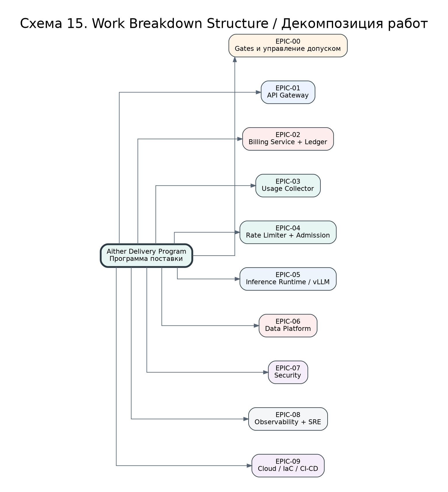

### 11.1.1. Эпики верхнего уровня

| Epic (эпик) | Название | Цель | Основной владелец | Обязательный результат |
|---|---|---|---|---|
| EPIC-00 | Gates and Governance (контрольные точки и управление допуском) | Обеспечить поэтапную реализацию без преждевременного Production (промышленная эксплуатация) | Architect + Project Manager | Gate checklists, протоколы GO/NO-GO, risk register |
| EPIC-01 | API Gateway (шлюз API) | Реализовать публичный OpenAI-compatible API (API, совместимый с OpenAI), аутентификацию, валидацию и streaming proxy (потоковое проксирование) | Backend Lead | Рабочие endpoints `/v1/chat/completions`, `/v1/models`, `/health`, `/ready` |
| EPIC-02 | Billing Service (сервис биллинга) | Реализовать финансовое ядро reserve/settle/refund/partial settle/topup | Backend Lead + Finance | ACID ledger, accounts, reservations, reconciliation |
| EPIC-03 | Usage Collector (сборщик потребления) | Гарантировать подсчёт фактически сгенерированных токенов и корректное закрытие транзакции | Backend Lead | Usage events, local token counter, finalizer, retry policy |
| EPIC-04 | Rate Limiter + Admission Controller (ограничитель частоты + контроллер допуска) | Защитить GPU (Graphics Processing Unit, графический процессор) от перегрузки и обеспечить приоритеты тарифов | Backend + Platform | Token Bucket, bounded queues, priority dispatch, cancellation |
| EPIC-05 | Inference Runtime (среда инференса) | Развернуть vLLM (среда выполнения LLM-инференса) и модели Qwen | ML + DevOps | Model startup, benchmark, warm-up, GPU metrics |
| EPIC-06 | Data Platform (платформа данных) | Подготовить PostgreSQL (реляционная СУБД), Redis (in-memory key-value storage, быстрое хранилище), backup и migration lifecycle | DBA + DevOps | SQL migrations, PITR, Redis HA, restore drills |
| EPIC-07 | Security (информационная безопасность) | Закрыть threats (угрозы), secrets (секреты), RBAC (Role-Based Access Control, доступ на основе ролей), audit log (журнал аудита) | Security Lead | Threat model, RBAC matrix, key rotation, log redaction |
| EPIC-08 | Observability + SRE (наблюдаемость и надёжность) | Сделать систему измеримой и обслуживаемой | SRE Lead | Dashboards, alerts, traces, runbooks, SLO |
| EPIC-09 | Cloud / IaC / CI-CD (облако, инфраструктура как код, поставка) | Подготовить on-prem (локальный контур) и Yandex Cloud (облачный контур) к воспроизводимому развёртыванию | DevOps Lead | Terraform, Helm, GitLab CI, deployment strategy |

### 11.1.2. Декомпозиция EPIC-01 API Gateway

| ID | Задача | Детали реализации | Acceptance Criteria (критерии приёмки) |
|---|---|---|---|
| GW-01 | Реализовать AuthMiddleware (middleware аутентификации) | Извлечь `Authorization: Bearer`, разобрать формат `aither-<prefix>-<secret>`, получить pepper (секретная соль) из Lockbox (хранилище секретов), вычислить HMAC (Hash-based Message Authentication Code, код аутентификации сообщения на основе хеша), сравнить через constant-time compare (сравнение с постоянным временем). | Валидный ключ проходит; неверный secret отклоняется; timing attack (атака по времени ответа) не даёт различимого результата; полный ключ не появляется в логах. |
| GW-02 | Реализовать RequestValidator (валидатор запроса) | Проверять JSON (JavaScript Object Notation, формат данных), model, messages, stream, max_tokens, context length, temperature, stop, user metadata. | Некорректные запросы получают 400; запрещённые модели получают 403; превышение context length получает 422; ошибки имеют единый формат. |
| GW-03 | Реализовать BillingGuard (биллинговый охранник) | Перед инференсом вызывать Billing `reserve`; при отказе Billing возвращать 402/503; при невозможности reserve не запускать GPU-инференс. | При недоступном Billing платный запрос не попадает в vLLM; idempotency key повторного запроса не создаёт двойной reserve. |
| GW-04 | Реализовать SSEProxy (SSE-прокси) | Проксировать Server-Sent Events (SSE, события, отправляемые сервером), сохранять backpressure (обратное давление), поддерживать cancellation (отмена запроса). | Клиент получает поток без буферизации всего ответа; при disconnect вызывается finalization; trace_id проходит через поток. |
| GW-05 | Реализовать TraceContext (контекст трассировки) | Поддержать `traceparent` W3C Trace Context (стандарт контекста трассировки W3C), `X-Request-ID`, correlation_id. | В Jaeger/Trace видна цепочка Client → ALB → Gateway → Billing → Inference → Billing finalization. |

### 11.1.3. Декомпозиция EPIC-02 Billing Service

| ID | Задача | Детали реализации | Acceptance Criteria |
|---|---|---|---|
| BILL-01 | Создать схему accounts/reservations/ledger_entries | Использовать DECIMAL/Numeric для денег, UUID (Universally Unique Identifier, универсальный уникальный идентификатор), CHECK constraints (ограничения), индексы. | Миграция применима на чистую БД и staging DB; rollback plan описан; constraints запрещают отрицательные балансы. |
| BILL-02 | Реализовать reserve | SELECT FOR UPDATE (блокировка строки), проверка available_balance, перевод в reserved_balance, append-only ledger (журнал только на добавление). | Повторный reserve с тем же idempotency_key возвращает прежний результат; гонки не создают отрицательный баланс. |
| BILL-03 | Реализовать settle | Перевод reservation в SETTLED, списание actual_cost, возврат остатка, запись usage_event. | `sum(usage cost) == sum(SETTLE)`; actual_cost не превышает amount_reserved; операция идемпотентна. |
| BILL-04 | Реализовать partial_settle | Использовать локально подтверждённый token_count при обрыве SSE после генерации части ответа. | Клиент не получает бесплатную генерацию при disconnect после токенов; спорные случаи попадают в MANUAL_REVIEW. |
| BILL-05 | Реализовать Reaper | Фоновый процесс закрывает зависшие reservations после TTL (Time To Live, время жизни). | Нет PENDING/IN_PROGRESS старше TTL+grace; все действия reaper пишутся в audit_log. |
| BILL-06 | Реализовать Reconciliation | L1 ledger vs account snapshot, L2 usage vs settle, L3 export vs finance report. | Любое расхождение > 0 создаёт SEV1 incident (инцидент критичности 1) и блокирует финансовый отчёт. |

### 11.1.4. Декомпозиция EPIC-04 Rate Limiter + Admission Controller

| ID | Задача | Детали реализации | Acceptance Criteria |
|---|---|---|---|
| RL-01 | Реализовать атомарный Lua script для RPM/TPM/concurrency | Один Redis Lua-вызов должен проверять Requests Per Minute (RPM, запросы в минуту), Tokens Per Minute (TPM, токены в минуту) и concurrency (одновременность). | Нет двухфазного окна рассогласования; при TPM отказе RPM не нужно отдельно откатывать. |
| RL-02 | Реализовать degraded mode | Если Redis недоступен, paid traffic (платный трафик) fail-closed (безопасный отказ), admin health показывает degraded. | При падении Redis платный инференс не стартует; есть alert и runbook. |
| ADM-01 | Реализовать bounded queue | Очередь имеет максимальный размер, timeout и priority. | При заполнении очереди возвращается 429/503 до reserve либо reserve отменяется безопасно. |
| ADM-02 | Реализовать weighted fair dispatch | Ultra/Pro/Free получают разные веса, но без полной starvation (голодание очереди), если это требуется продуктом. | Нагрузочный тест показывает соблюдение приоритетов и отсутствие бесконечного ожидания. |

## 11.2. API Contracts (контракты программных интерфейсов)

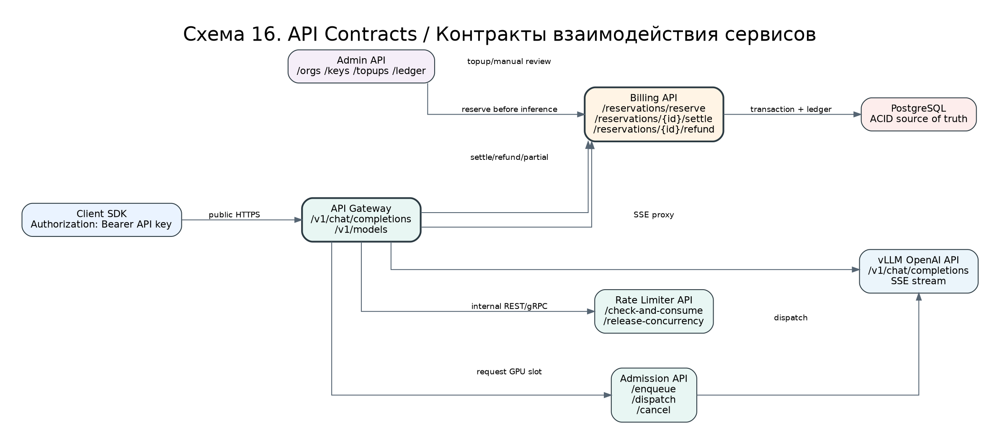

Контракты API (Application Programming Interface, программный интерфейс приложения) являются обязательными, потому что именно они превращают архитектурную идею в проверяемое соглашение между командами. Без контракта Backend может трактовать reserve иначе, чем Gateway; Billing может считать idempotency_key необязательным; Usage Collector может передавать usage в произвольном формате. Контракт фиксирует структуру запроса, структуру ответа, коды ошибок, требования идемпотентности и поля трассировки.

### 11.2.1. Public API (публичный API клиента)

```yaml
openapi: 3.0.3
info:
  title: Aither Public API
  version: 1.0.0
  description: OpenAI-compatible API subset for paid LLM inference.
servers:
  - url: https://api.aither.example.com
security:
  - bearerAuth: []
paths:
  /v1/models:
    get:
      summary: List available models
      responses:
        '200':
          description: Available model list for the authenticated organization
        '401':
          description: Missing or invalid API key
  /v1/chat/completions:
    post:
      summary: Create chat completion
      parameters:
        - in: header
          name: X-Request-ID
          required: false
          schema:
            type: string
          description: Client supplied idempotency/correlation identifier.
        - in: header
          name: traceparent
          required: false
          schema:
            type: string
          description: W3C Trace Context header.
      requestBody:
        required: true
        content:
          application/json:
            schema:
              type: object
              required: [model, messages]
              properties:
                model:
                  type: string
                  example: qwen3-14b
                messages:
                  type: array
                  items:
                    type: object
                    required: [role, content]
                    properties:
                      role:
                        type: string
                        enum: [system, user, assistant, tool]
                      content:
                        type: string
                stream:
                  type: boolean
                  default: true
                max_tokens:
                  type: integer
                  minimum: 1
                  maximum: 32768
                temperature:
                  type: number
                  minimum: 0
                  maximum: 2
      responses:
        '200':
          description: Completion or SSE stream
        '400':
          description: Invalid request format
        '401':
          description: Invalid API key
        '402':
          description: Insufficient balance
        '403':
          description: Model or tariff not allowed
        '429':
          description: Rate limit exceeded
        '503':
          description: Billing, queue or inference unavailable
components:
  securitySchemes:
    bearerAuth:
      type: http
      scheme: bearer
```

### 11.2.2. Internal Billing API (внутренний API биллинга)

```yaml
openapi: 3.0.3
info:
  title: Aither Billing Internal API
  version: 1.0.0
paths:
  /internal/v1/reservations/reserve:
    post:
      summary: Reserve funds before inference
      parameters:
        - in: header
          name: Idempotency-Key
          required: true
          schema: { type: string }
        - in: header
          name: traceparent
          required: true
          schema: { type: string }
      requestBody:
        required: true
        content:
          application/json:
            schema:
              type: object
              required: [org_id, account_id, estimated_cost, currency, request_id]
              properties:
                org_id: { type: string, format: uuid }
                account_id: { type: string, format: uuid }
                estimated_cost: { type: string, example: "0.123456" }
                currency: { type: string, example: RUB }
                request_id: { type: string }
                model: { type: string }
      responses:
        '200':
          description: Reservation created or idempotently replayed
        '402':
          description: Insufficient balance
  /internal/v1/reservations/{reservation_id}/settle:
    post:
      summary: Settle reservation after successful inference
      parameters:
        - in: path
          name: reservation_id
          required: true
          schema: { type: string, format: uuid }
        - in: header
          name: Idempotency-Key
          required: true
          schema: { type: string }
      requestBody:
        required: true
        content:
          application/json:
            schema:
              type: object
              required: [actual_cost, usage]
              properties:
                actual_cost: { type: string }
                usage:
                  type: object
                  required: [prompt_tokens, completion_tokens, total_tokens, tokenizer_version]
                  properties:
                    prompt_tokens: { type: integer }
                    completion_tokens: { type: integer }
                    total_tokens: { type: integer }
                    tokenizer_version: { type: string }
                    model: { type: string }
  /internal/v1/reservations/{reservation_id}/partial-settle:
    post:
      summary: Partially settle when stream was interrupted after token generation
      parameters:
        - in: path
          name: reservation_id
          required: true
          schema: { type: string, format: uuid }
        - in: header
          name: Idempotency-Key
          required: true
          schema: { type: string }
      requestBody:
        required: true
        content:
          application/json:
            schema:
              type: object
              required: [confirmed_completion_tokens, reason]
              properties:
                confirmed_completion_tokens: { type: integer }
                reason: { type: string, enum: [client_disconnect, upstream_timeout, gateway_restart] }
  /internal/v1/reservations/{reservation_id}/refund:
    post:
      summary: Refund reservation if inference did not generate billable tokens
```

### 11.2.3. Единый формат ошибки

```json
{
  "error": {
    "code": "insufficient_balance",
    "message": "Insufficient balance for requested max_tokens",
    "request_id": "req_01H...",
    "trace_id": "4bf92f3577b34da6a3ce929d0e0e4736",
    "retryable": false,
    "details": {
      "required_amount": "0.120000",
      "currency": "RUB"
    }
  }
}
```

## 11.3. Database Migration Pack (пакет миграций базы данных)

```dot
digraph G {
    rankdir=LR;
    label="Схема 17. Database Migration Lifecycle / Жизненный цикл миграций БД";

    graph [fontname="DejaVu Sans", bgcolor="white", labelloc="t", fontsize=22, pad="0.35", nodesep="0.55", ranksep="0.85", splines=ortho];
    node  [fontname="DejaVu Sans", shape=box, style="rounded,filled", color="#2B3A42", fillcolor="#F7F9FB", fontsize=11, margin="0.14,0.10"];
    edge  [fontname="DejaVu Sans", color="#566573", fontsize=9, arrowsize=0.8];

    dev [label="Developer change
SQLAlchemy/Alembic migration", fillcolor="#EAF3FF"];
    review [label="Code Review
DBA + Backend", fillcolor="#FFF4E5"];
    ci [label="CI pipeline
lint + dry-run", fillcolor="#E8F6F3"];
    staging [label="Staging DB
apply migration", fillcolor="#FDEDEC"];
    tests [label="Integration tests
billing invariants", fillcolor="#F4F6F7"];
    backup [label="Production backup
PITR restore point", fillcolor="#FDEDEC"];
    prod [label="Production DB
expand → migrate → contract", fillcolor="#FDEDEC", penwidth=2];
    monitor [label="Post-migration validation
row counts, constraints, latency", fillcolor="#F4F6F7"];
    rollback [label="Rollback plan
reversible change or restore", fillcolor="#FADBD8"];
    dev -> review -> ci -> staging -> tests -> backup -> prod -> monitor;
    prod -> rollback [label="only with approved plan"];
}
```

Database migration (миграция базы данных) должна рассматриваться как production-код. Ошибка в миграции ledger_entries (журнал финансовых проводок) может привести к финансовой несогласованности, которую невозможно «просто поправить» без аудита. Поэтому каждая миграция проходит review (проверка), dry-run (пробный запуск), staging apply (применение на тестовом контуре), backup checkpoint (точка восстановления) и post-migration validation (послемиграционная проверка).

### 11.3.1. Базовая DDL-миграция

```sql
CREATE EXTENSION IF NOT EXISTS "uuid-ossp";
CREATE EXTENSION IF NOT EXISTS pgcrypto;

CREATE TABLE organizations (
    id UUID PRIMARY KEY DEFAULT gen_random_uuid(),
    name TEXT NOT NULL,
    status TEXT NOT NULL CHECK (status IN ('active', 'blocked', 'closed')),
    tariff_plan TEXT NOT NULL CHECK (tariff_plan IN ('free', 'pro', 'ultra', 'enterprise')),
    created_at TIMESTAMPTZ NOT NULL DEFAULT now(),
    updated_at TIMESTAMPTZ NOT NULL DEFAULT now()
);

CREATE TABLE accounts (
    id UUID PRIMARY KEY DEFAULT gen_random_uuid(),
    org_id UUID NOT NULL REFERENCES organizations(id),
    currency CHAR(3) NOT NULL DEFAULT 'RUB',
    available_balance NUMERIC(18,6) NOT NULL DEFAULT 0 CHECK (available_balance >= 0),
    reserved_balance NUMERIC(18,6) NOT NULL DEFAULT 0 CHECK (reserved_balance >= 0),
    version BIGINT NOT NULL DEFAULT 0,
    created_at TIMESTAMPTZ NOT NULL DEFAULT now(),
    updated_at TIMESTAMPTZ NOT NULL DEFAULT now(),
    UNIQUE(org_id, currency)
);

CREATE TABLE api_keys (
    id UUID PRIMARY KEY DEFAULT gen_random_uuid(),
    org_id UUID NOT NULL REFERENCES organizations(id),
    key_prefix TEXT NOT NULL UNIQUE,
    key_hmac TEXT NOT NULL,
    status TEXT NOT NULL CHECK (status IN ('active', 'blocked', 'expired', 'rotating')),
    scopes TEXT[] NOT NULL DEFAULT ARRAY['chat:completion'],
    allowed_models TEXT[] NOT NULL DEFAULT ARRAY[]::TEXT[],
    expires_at TIMESTAMPTZ,
    last_used_at TIMESTAMPTZ,
    created_at TIMESTAMPTZ NOT NULL DEFAULT now()
);

CREATE TABLE reservations (
    id UUID PRIMARY KEY DEFAULT gen_random_uuid(),
    org_id UUID NOT NULL REFERENCES organizations(id),
    account_id UUID NOT NULL REFERENCES accounts(id),
    request_id TEXT NOT NULL,
    state TEXT NOT NULL CHECK (state IN ('PENDING','IN_PROGRESS','SETTLED','PARTIAL_SETTLED','REFUNDED','EXPIRED','FAILED','MANUAL_REVIEW')),
    amount_reserved NUMERIC(18,6) NOT NULL CHECK (amount_reserved >= 0),
    actual_cost NUMERIC(18,6),
    idempotency_key TEXT NOT NULL UNIQUE,
    model TEXT NOT NULL,
    expires_at TIMESTAMPTZ NOT NULL,
    created_at TIMESTAMPTZ NOT NULL DEFAULT now(),
    updated_at TIMESTAMPTZ NOT NULL DEFAULT now()
);

CREATE TABLE usage_events (
    id UUID PRIMARY KEY DEFAULT gen_random_uuid(),
    org_id UUID NOT NULL REFERENCES organizations(id),
    reservation_id UUID NOT NULL REFERENCES reservations(id),
    request_id TEXT NOT NULL,
    model TEXT NOT NULL,
    tokenizer_version TEXT NOT NULL,
    prompt_tokens INTEGER NOT NULL CHECK (prompt_tokens >= 0),
    completion_tokens INTEGER NOT NULL CHECK (completion_tokens >= 0),
    total_tokens INTEGER NOT NULL CHECK (total_tokens = prompt_tokens + completion_tokens),
    cost NUMERIC(18,6) NOT NULL CHECK (cost >= 0),
    finalization_reason TEXT NOT NULL,
    created_at TIMESTAMPTZ NOT NULL DEFAULT now(),
    UNIQUE(reservation_id)
);

CREATE TABLE ledger_entries (
    id UUID PRIMARY KEY DEFAULT gen_random_uuid(),
    account_id UUID NOT NULL REFERENCES accounts(id),
    reservation_id UUID REFERENCES reservations(id),
    entry_type TEXT NOT NULL CHECK (entry_type IN ('TOPUP','RESERVE','SETTLE','PARTIAL_SETTLE','REFUND','EXPIRE','MANUAL_ADJUSTMENT')),
    amount NUMERIC(18,6) NOT NULL,
    available_balance_after NUMERIC(18,6) NOT NULL CHECK (available_balance_after >= 0),
    reserved_balance_after NUMERIC(18,6) NOT NULL CHECK (reserved_balance_after >= 0),
    idempotency_key TEXT NOT NULL,
    actor_type TEXT NOT NULL CHECK (actor_type IN ('system','admin','gateway','reaper')),
    actor_id TEXT,
    created_at TIMESTAMPTZ NOT NULL DEFAULT now(),
    UNIQUE(idempotency_key, entry_type)
);

CREATE TABLE outbox_events (
    id UUID PRIMARY KEY DEFAULT gen_random_uuid(),
    aggregate_type TEXT NOT NULL,
    aggregate_id UUID NOT NULL,
    event_type TEXT NOT NULL,
    payload JSONB NOT NULL,
    status TEXT NOT NULL CHECK (status IN ('new','processing','published','failed')) DEFAULT 'new',
    attempts INTEGER NOT NULL DEFAULT 0,
    next_attempt_at TIMESTAMPTZ NOT NULL DEFAULT now(),
    created_at TIMESTAMPTZ NOT NULL DEFAULT now(),
    published_at TIMESTAMPTZ
);

CREATE TABLE audit_log (
    id UUID PRIMARY KEY DEFAULT gen_random_uuid(),
    org_id UUID,
    actor_type TEXT NOT NULL,
    actor_id TEXT,
    action TEXT NOT NULL,
    resource_type TEXT NOT NULL,
    resource_id TEXT,
    ip_hash TEXT,
    user_agent_hash TEXT,
    details JSONB NOT NULL DEFAULT '{}'::jsonb,
    created_at TIMESTAMPTZ NOT NULL DEFAULT now()
);

CREATE INDEX idx_reservations_state_expires ON reservations(state, expires_at);
CREATE INDEX idx_ledger_account_created ON ledger_entries(account_id, created_at);
CREATE INDEX idx_usage_org_created ON usage_events(org_id, created_at);
CREATE INDEX idx_outbox_status_next ON outbox_events(status, next_attempt_at);
CREATE INDEX idx_audit_org_created ON audit_log(org_id, created_at);
```

### 11.3.2. Правило expand → migrate → contract

Для production (промышленная эксплуатация) запрещены разрушительные миграции в один шаг. Нужно использовать паттерн expand → migrate → contract (расширить → перенести → сузить): сначала добавляется новое поле, затем код начинает писать в старое и новое поле, затем выполняется backfill (заполнение исторических данных), затем код читает новое поле, и только после отдельного release (релиз) старое поле удаляется. Это снижает риск отказа при rolling deployment (постепенное развёртывание).

## 11.4. Acceptance Criteria Pack (пакет критериев приёмки)

Критерии приёмки должны быть проверяемыми, а не декларативными. Формулировка «биллинг работает» не является критерием. Корректная формулировка: «при 1000 повторных вызовах settle с одним idempotency_key в ledger появляется ровно одна запись SETTLE, balances не меняются повторно, API возвращает одинаковый reservation_id».

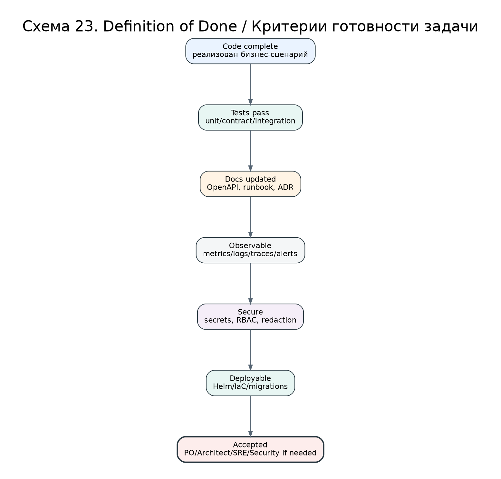

### 11.4.1. Общие Definition of Done (DoD, определение готовности)

| Категория | Обязательное условие |
|---|---|
| Код | Реализован основной сценарий и негативные сценарии; нет TODO (to do, незавершённая работа) в критичных местах |
| Тесты | Unit tests (модульные тесты), contract tests (контрактные тесты), integration tests (интеграционные тесты) зелёные |
| Безопасность | Секреты не логируются, права минимальны, RBAC проверен, dependency scan (проверка зависимостей) чистый или исключения согласованы |
| Наблюдаемость | Есть metrics (метрики), logs (логи), traces (трассировки), alerts (алерты) и dashboard panel (панель дашборда) |
| Документация | Обновлены OpenAPI, runbook, ADR при изменении решения, конфигурационные примеры |
| Эксплуатация | Есть readiness/liveness probes (проверки готовности и живости), rollback plan (план отката), migration plan |
| Приёмка | Product/Architect/SRE/Security приняли задачу, если она касается их зоны ответственности |

### 11.4.2. Критерии для Gateway

1. При невалидном API key (ключ API) Gateway возвращает 401 и не обращается к Billing и vLLM.
2. При заблокированной organization (организация) Gateway возвращает 403 и пишет audit_log.
3. При недостаточном балансе Gateway возвращает 402 и не запускает GPU-инференс.
4. При недоступном Billing Gateway возвращает 503, а не генерирует бесплатный ответ.
5. При disconnect клиента после генерации N токенов Gateway запускает Usage Collector finalization.
6. Во всех логах API key маскируется до `aither-<prefix>-***`.
7. Заголовок `traceparent` передаётся во все внутренние вызовы.

### 11.4.3. Критерии для Billing

1. `available_balance` и `reserved_balance` никогда не становятся отрицательными.
2. `reserve` идемпотентен по `idempotency_key`.
3. `settle`, `partial_settle` и `refund` переводят reservation только в финальное состояние.
4. Нельзя выполнить `refund` после `settle` без manual adjustment (ручная корректировка).
5. Reaper закрывает зависшие резервы и пишет audit_log.
6. Reconciliation ежедневно проверяет L1/L2/L3-инварианты.
7. Любое расхождение > 0 блокирует публикацию финансового отчёта.

### 11.4.4. Критерии для Inference Tier

1. vLLM запускается с заданной моделью и проходит `/health`.
2. На benchmark-профиле concurrency=1/2/4/8 собираются TTFT (Time To First Token, время до первого токена), p50/p95/p99 latency (задержка), tokens/sec (токенов в секунду), VRAM (Video RAM, видеопамять), OOM (Out Of Memory, нехватка памяти).
3. Model warm-up (прогрев модели) выполняется до допуска трафика.
4. При OOM запрос получает корректную ошибку, reservation не зависает.
5. Для каждой модели зафиксированы tokenizer_version и quantization (квантовка).

## 11.5. Test Strategy (стратегия тестирования)

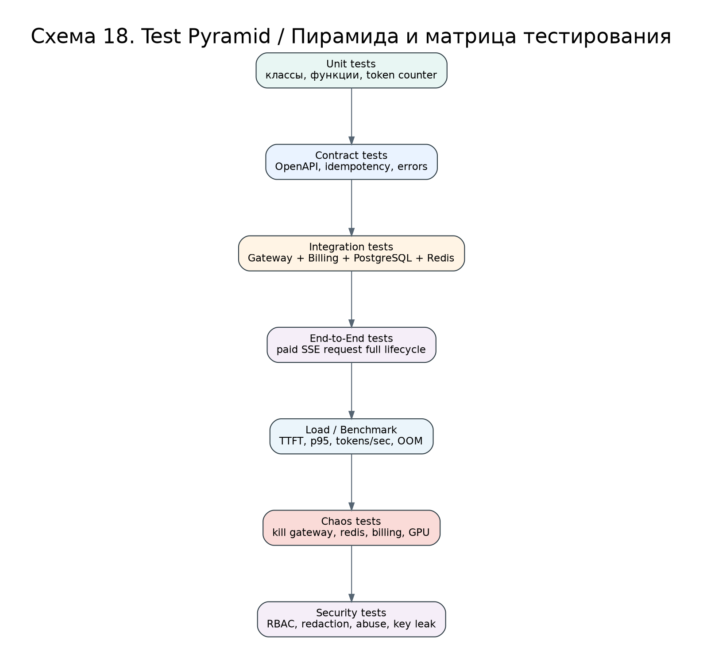

### 11.5.1. Матрица тестов

| Тип теста | Что проверяет | Инструменты | Блокирующий для Gate |
|---|---|---|---|
| Unit tests (модульные тесты) | Классы, функции, расчёт стоимости, token counter | pytest, unittest | Да, для всех merge |
| Contract tests (контрактные тесты) | OpenAPI, схемы ошибок, idempotency | Schemathesis, Dredd, pytest | Да, Gate 3/Gate 5 |
| Integration tests (интеграционные тесты) | Gateway + Billing + PostgreSQL + Redis | docker compose, testcontainers | Да |
| E2E tests (сквозные тесты) | Полный платный SSE-запрос | pytest + real vLLM/stub | Да |
| Load tests (нагрузочные тесты) | TTFT, p95, throughput, queue saturation | k6, Locust, custom tokenizer probe | Gate 2 |
| Chaos tests (тесты отказов) | Падение Gateway/Billing/Redis/PostgreSQL/vLLM | chaos-mesh, scripts | Gate 5 |
| Security tests (тесты безопасности) | RBAC, key leak, redaction, abuse | OWASP ZAP, Semgrep, Trivy | Gate 4 |

### 11.5.2. Обязательный E2E-сценарий paid streaming request

```gherkin
Feature: Paid streaming inference
  Scenario: Successful paid request
    Given organization has available balance 100.000000 RUB
    And API key is active and allowed to use model qwen3-14b
    When client sends /v1/chat/completions with stream=true and max_tokens=100
    Then Gateway authenticates the key
    And Rate Limiter allows the request
    And Billing creates reservation with state PENDING
    And Admission Controller dispatches the request to inference node
    And Gateway streams SSE chunks to client
    And Usage Collector counts generated tokens
    And Billing settles actual cost
    And reservation state becomes SETTLED
    And ledger contains RESERVE and SETTLE entries
    And reconciliation invariants are true
```

## 11.6. CI/CD Pipeline (конвейер непрерывной поставки)

```dot
digraph G {
    rankdir=LR;
    label="Схема 19. CI/CD Pipeline / Конвейер сборки и поставки";

    graph [fontname="DejaVu Sans", bgcolor="white", labelloc="t", fontsize=22, pad="0.35", nodesep="0.55", ranksep="0.85", splines=ortho];
    node  [fontname="DejaVu Sans", shape=box, style="rounded,filled", color="#2B3A42", fillcolor="#F7F9FB", fontsize=11, margin="0.14,0.10"];
    edge  [fontname="DejaVu Sans", color="#566573", fontsize=9, arrowsize=0.8];

    commit [label="Git commit
feature branch", fillcolor="#EAF3FF"];
    lint [label="Lint + SAST
format, security scan", fillcolor="#F4F6F7"];
    build [label="Build containers
Gateway/Billing/Collector", fillcolor="#E8F6F3"];
    test [label="Unit + contract + integration", fillcolor="#FFF4E5"];
    image [label="Image registry
signed SBOM", fillcolor="#F5EEF8"];
    staging [label="Deploy to staging
Helm/Terraform", fillcolor="#E8F6F3"];
    gate [label="Quality Gate
benchmarks, migrations, smoke", fillcolor="#FFF4E5", penwidth=2];
    prod [label="Production deploy
blue/green or canary", fillcolor="#E8F6F3"];
    rollback [label="Rollback
previous image + DB policy", fillcolor="#FADBD8"];
    commit -> lint -> build -> test -> image -> staging -> gate -> prod;
    prod -> rollback [label="on SLO regression"];
}
```

### 11.6.1. GitLab CI пример

```yaml
stages:
  - lint
  - test
  - build
  - security
  - package
  - deploy_staging
  - verify_staging
  - deploy_production

variables:
  IMAGE_TAG: "$CI_COMMIT_SHA"

lint:
  stage: lint
  script:
    - ruff check services/
    - mypy services/

test_unit:
  stage: test
  script:
    - pytest tests/unit --cov=services

test_contract:
  stage: test
  script:
    - schemathesis run openapi/public.yaml --base-url http://gateway:8080
    - pytest tests/contract

test_integration:
  stage: test
  services:
    - postgres:16
    - redis:7
  script:
    - alembic upgrade head
    - pytest tests/integration

build_images:
  stage: build
  script:
    - docker build -t registry/aither/gateway:$IMAGE_TAG services/gateway
    - docker build -t registry/aither/billing:$IMAGE_TAG services/billing
    - docker build -t registry/aither/collector:$IMAGE_TAG services/collector
    - docker push registry/aither/gateway:$IMAGE_TAG
    - docker push registry/aither/billing:$IMAGE_TAG
    - docker push registry/aither/collector:$IMAGE_TAG

security_scan:
  stage: security
  script:
    - trivy image registry/aither/gateway:$IMAGE_TAG
    - trivy image registry/aither/billing:$IMAGE_TAG
    - semgrep scan --config auto services/

deploy_staging:
  stage: deploy_staging
  script:
    - helm upgrade --install aither charts/aither --namespace aither-staging --set image.tag=$IMAGE_TAG

verify_staging:
  stage: verify_staging
  script:
    - pytest tests/e2e --base-url https://staging-api.aither.example.com
    - python scripts/check_billing_invariants.py --env staging

deploy_production:
  stage: deploy_production
  when: manual
  rules:
    - if: '$CI_COMMIT_BRANCH == "main"'
  script:
    - helm upgrade --install aither charts/aither --namespace aither-prod --set image.tag=$IMAGE_TAG
```

## 11.7. Environment Strategy (стратегия контуров)

```dot
digraph G {
    rankdir=LR;
    label="Схема 21. Environments / Контуры разработки и эксплуатации";

    graph [fontname="DejaVu Sans", bgcolor="white", labelloc="t", fontsize=22, pad="0.35", nodesep="0.55", ranksep="0.85", splines=ortho];
    node  [fontname="DejaVu Sans", shape=box, style="rounded,filled", color="#2B3A42", fillcolor="#F7F9FB", fontsize=11, margin="0.14,0.10"];
    edge  [fontname="DejaVu Sans", color="#566573", fontsize=9, arrowsize=0.8];

    dev [label="DEV
локальные mock-сервисы
без реальных денег", fillcolor="#EAF3FF"];
    test [label="TEST
PostgreSQL/Redis sandbox
контрактные тесты", fillcolor="#E8F6F3"];
    stage [label="STAGE
production-like
модель small/quantized", fillcolor="#FFF4E5"];
    bench [label="BENCH
GPU benchmark
реальные модели", fillcolor="#EBF5FB"];
    prod [label="PROD
платные клиенты
ledger immutable", fillcolor="#FDEDEC", penwidth=2];
    dr [label="DR
backup restore
runbook drills", fillcolor="#F4F6F7"];
    dev -> test -> stage -> bench -> prod;
    prod -> dr [label="backup/PITR"];
}
```

| Контур | Назначение | Данные | Разрешённые операции |
|---|---|---|---|
| DEV | Разработка локально и в feature branches | Синтетические данные | Mock Billing, mock vLLM, unit tests |
| TEST | Контрактные и интеграционные тесты | Синтетические данные | Полный Gateway/Billing/PostgreSQL/Redis без реальных клиентов |
| STAGE | Production-like проверка релиза | Обезличенные/синтетические данные | E2E, migrations dry-run, security scan |
| BENCH | Измерение GPU-производительности | Тестовые prompts без персональных данных | vLLM, реальные модели, нагрузка |
| PROD | Реальные клиенты и деньги | Production data | Только утверждённые релизы, immutable ledger |
| DR | Проверка восстановления | Backup copy | Restore drills, PITR, disaster recovery |

## 11.8. RACI (матрица ответственности)

```dot
digraph G {
    rankdir=LR;
    label="Схема 20. RACI / Ответственность команд";

    graph [fontname="DejaVu Sans", bgcolor="white", labelloc="t", fontsize=22, pad="0.35", nodesep="0.55", ranksep="0.85", splines=ortho];
    node  [fontname="DejaVu Sans", shape=box, style="rounded,filled", color="#2B3A42", fillcolor="#F7F9FB", fontsize=11, margin="0.14,0.10"];
    edge  [fontname="DejaVu Sans", color="#566573", fontsize=9, arrowsize=0.8];

    board [label="Architecture Board
A: утверждение архитектуры", fillcolor="#FFF4E5"];
    backend [label="Backend
R: Gateway, Billing, Collector", fillcolor="#EAF3FF"];
    devops [label="DevOps / Platform
R: Kubernetes, IaC, CI/CD", fillcolor="#E8F6F3"];
    ml [label="ML / Inference
R: vLLM, models, benchmark", fillcolor="#EBF5FB"];
    sec [label="Security
A/C: threat model, RBAC, secrets", fillcolor="#F5EEF8"];
    finance [label="Finance
A/C: ledger, reports, tariffs", fillcolor="#FFF4E5"];
    sre [label="SRE
R: SLO, alerts, runbooks", fillcolor="#F4F6F7"];
    product [label="Product
A: tariffs, client scope", fillcolor="#FDEDEC"];
    board -> backend; board -> devops; board -> ml; board -> sec; board -> finance; board -> sre; board -> product;
}
```

| Артефакт / решение | Responsible (исполняет) | Accountable (отвечает) | Consulted (консультирует) | Informed (информируется) |
|---|---|---|---|---|
| Целевая архитектура | Architect | Architecture Board | Backend, DevOps, Security, Finance | Sponsor, Product |
| Billing model | Backend + Finance | Finance Owner | Architect, Security | Product, Support |
| API contracts | Backend | Backend Lead | Architect, QA | Product |
| GPU benchmark | ML + DevOps | ML Lead | Architect, SRE | Product, Finance |
| Security sign-off | Security | Security Lead | Backend, DevOps | Architecture Board |
| FinOps model | FinOps + DevOps | Finance Owner | Architect, Product | Sponsor |
| Production release | DevOps + SRE | Release Manager | Security, Backend, ML | Sponsor, Support |
| Incident response | SRE | Incident Commander | Backend, Security, Finance | Sponsor, Product |

## 11.9. Client Onboarding Pack (пакет подключения клиента)

```dot
digraph G {
    rankdir=LR;
    label="Схема 24. Client Onboarding / Подключение клиента";

    graph [fontname="DejaVu Sans", bgcolor="white", labelloc="t", fontsize=22, pad="0.35", nodesep="0.55", ranksep="0.85", splines=ortho];
    node  [fontname="DejaVu Sans", shape=box, style="rounded,filled", color="#2B3A42", fillcolor="#F7F9FB", fontsize=11, margin="0.14,0.10"];
    edge  [fontname="DejaVu Sans", color="#566573", fontsize=9, arrowsize=0.8];

    contract [label="Commercial approval
тариф, лимиты, договор", fillcolor="#FFF4E5"];
    org [label="Create organization
tenant_id, billing account", fillcolor="#E8F6F3"];
    key [label="Create API key
prefix + HMAC secret", fillcolor="#F5EEF8"];
    limits [label="Assign limits
RPM/TPM/concurrency/model access", fillcolor="#EAF3FF"];
    sandbox [label="Sandbox test
smoke request + usage", fillcolor="#F4F6F7"];
    topup [label="Top up balance
ledger TOPUP", fillcolor="#FFF4E5"];
    prod [label="Production access
monitoring + support channel", fillcolor="#E8F6F3", penwidth=2];
    contract -> org -> key -> limits -> sandbox -> topup -> prod;
}
```

### 11.9.1. Минимальный порядок подключения клиента

1. Product (продуктовая команда) согласует тариф, лимиты и модель доступа.
2. Finance (финансы) создаёт billing account (биллинговый счёт) и определяет начальное пополнение.
3. Admin (администратор) создаёт organization (организацию) и API key (ключ API).
4. Security (информационная безопасность) проверяет ограничения: scopes (области доступа), allowed_models (разрешённые модели), expiration (срок действия).
5. Клиент выполняет sandbox smoke test (тестовый запрос).
6. Usage Collector создаёт usage_event (событие потребления), Billing создаёт ledger entries (проводки).
7. Support (поддержка) фиксирует канал поддержки и SLA/SLO (Service Level Agreement / Service Level Objective, соглашение и целевой уровень сервиса).

### 11.9.2. Шаблон инструкции клиенту

```markdown
# Подключение к Aither API

1. Используйте endpoint: https://api.aither.example.com/v1/chat/completions
2. Передавайте ключ в заголовке: Authorization: Bearer <ваш API key>
3. Для потокового ответа укажите: "stream": true
4. Для трассировки можно передать X-Request-ID.
5. При ошибке 402 пополните баланс или уменьшите max_tokens.
6. При ошибке 429 снизьте частоту запросов.
7. При ошибке 503 повторите запрос позже с тем же X-Request-ID, чтобы избежать двойного reserve.
```

---

# Часть 12. Реестр рисков, ADR и управленческие решения

## 12.1. Risk Register (реестр рисков)

| ID | Риск | Вероятность | Влияние | Уровень | Митигирующее действие | Владелец |
|---|---|---:|---:|---|---|---|
| R-01 | RedOS 7.3 несовместим с актуальным NVIDIA/CUDA/vLLM стеком | Высокая | Высокое | P0 | Gate 0 Compatibility Protocol; резервный путь Ubuntu VM passthrough или Yandex Cloud | DevOps Lead |
| R-02 | Qwen3-27B не помещается в 24 GB VRAM с нужным context length | Высокая | Среднее | P0 | Ultra только после benchmark; A100 80GB как целевой путь | ML Lead |
| R-03 | Обрыв SSE до финального usage даёт бесплатные токены | Средняя | Высокое | P0 | Local token counter, partial settle, finalization job | Backend Lead |
| R-04 | Ошибка ledger приводит к финансовому спору | Низкая/средняя | Очень высокое | P0 | ACID, idempotency, append-only ledger, reconciliation L1-L3 | Finance Owner |
| R-05 | Redis single point of failure ломает лимиты и очереди | Средняя | Среднее | P1 | Redis HA/Managed Redis, degraded mode fail-closed | DevOps Lead |
| R-06 | 2 on-prem сервера не дают HA | Высокая | Среднее | P1 | MVP с documented SPOF; Production через 3-й узел или cloud managed services | Architect |
| R-07 | Prompt/response попадают в логи | Средняя | Высокое | P0 | Redaction middleware, log policy, security tests | Security Lead |
| R-08 | Cloud GPU costs делают тарифы нерентабельными | Средняя | Высокое | P1 | FinOps dashboard, break-even, idle alert, utilization policy | Finance/FinOps |
| R-09 | Admin misuse (ошибка администратора) меняет баланс клиента | Низкая/средняя | Высокое | P1 | RBAC, MFA, four-eyes approval for manual adjustment | Security + Finance |
| R-10 | Tokenizer mismatch искажает стоимость | Средняя | Высокое | P0 | Зафиксировать tokenizer_version, тесты alignment, model registry | ML Lead |

## 12.2. ADR (Architecture Decision Record, запись архитектурного решения)

### ADR-001. Billing Service является единственным Source of Truth (источник истины)

**Статус:** Accepted (принято).  
**Контекст:** LiteLLM (прокси/библиотека для LLM API) и vLLM умеют отдавать usage, но не являются финансовыми системами.  
**Решение:** все финансовые операции выполняет только Billing Service, а PostgreSQL ledger является авторитетной историей.  
**Последствия:** сложность системы выше, но финансовый риск ниже. Это обязательное решение для коммерческого сервиса.

### ADR-002. Платный инференс запускается только после reserve

**Статус:** Accepted.  
**Контекст:** если сначала генерировать ответ, а потом пытаться списать деньги, платформа неизбежно столкнётся с бесплатной генерацией при сбоях.  
**Решение:** API Gateway обязан выполнить reserve до Admission Controller и vLLM.  
**Последствия:** при недоступности Billing сервис fail-closed (закрытый отказ) и возвращает 503.

### ADR-003. Partial settle обязателен для streaming-disconnect сценариев

**Статус:** Accepted.  
**Контекст:** SSE (Server-Sent Events, события, отправляемые сервером) может оборваться после того, как клиент уже получил часть ответа. Полный refund в этом случае создаёт финансовую дыру.  
**Решение:** Usage Collector считает локально подтверждённые completion_tokens и выполняет partial_settle.  
**Последствия:** требуется tokenizer alignment и manual review для спорных случаев.

### ADR-004. 1 GPU = 1 production inference slot для RTX 6000

**Статус:** Accepted для on-prem MVP.  
**Контекст:** RTX 6000 24 GB без NVLink (шина NVIDIA между GPU) не подходит для надёжного tensor parallelism (тензорный параллелизм).  
**Решение:** одна модель обслуживается одним GPU, time-slicing не считается продажной ёмкостью.  
**Последствия:** ёмкость on-prem ограничена, но latency и предсказуемость выше.

### ADR-005. RAID0 запрещён для финансовых данных

**Статус:** Accepted.  
**Контекст:** RAID0 повышает скорость, но потеря одного диска уничтожает массив.  
**Решение:** RAID0 разрешён только для восстановимых данных: model cache, Docker layers, temporary benchmark artifacts. PostgreSQL data, WAL (Write-Ahead Log, журнал предзаписи), ledger и backups должны храниться на отказоустойчивом хранилище.  
**Последствия:** часть производительности приносится в жертву финансовой целостности.

---

# Часть 13. Эксплуатация, инциденты и Production Readiness

## 13.1. Incident Response (реакция на инцидент)

```dot
digraph G {
    rankdir=LR;
    label="Схема 22. Incident Response / Реакция на инцидент";

    graph [fontname="DejaVu Sans", bgcolor="white", labelloc="t", fontsize=22, pad="0.35", nodesep="0.55", ranksep="0.85", splines=ortho];
    node  [fontname="DejaVu Sans", shape=box, style="rounded,filled", color="#2B3A42", fillcolor="#F7F9FB", fontsize=11, margin="0.14,0.10"];
    edge  [fontname="DejaVu Sans", color="#566573", fontsize=9, arrowsize=0.8];

    detect [label="Detect
alert / anomaly / client ticket", fillcolor="#FADBD8"];
    triage [label="Triage
severity + owner", fillcolor="#FFF4E5"];
    contain [label="Contain
block key / circuit open / disable model", fillcolor="#F5EEF8"];
    diagnose [label="Diagnose
logs + traces + ledger", fillcolor="#F4F6F7"];
    recover [label="Recover
rollback / replay / refund correction", fillcolor="#E8F6F3"];
    post [label="Postmortem
RCA + action items", fillcolor="#EAF3FF"];
    improve [label="Prevent
test/runbook/alert update", fillcolor="#E8F6F3"];
    detect -> triage -> contain -> diagnose -> recover -> post -> improve;
}
```

### 13.1.1. Классификация инцидентов

| Severity (критичность) | Пример | Время реакции | Обязательные действия |
|---|---|---|---|
| SEV1 | Расхождение ledger, утечка API keys, массовое бесплатное использование | Немедленно | Incident commander, блокировка риска, уведомление руководства, postmortem |
| SEV2 | Недоступен Billing или PostgreSQL, платный API возвращает 503 | До 30 минут | Fail-closed подтверждён, восстановление, проверка reservations |
| SEV3 | Повышенная latency, частичный отказ одной модели | Рабочее время | Переключение модели/узла, анализ метрик |
| SEV4 | Ошибка dashboard, некритичный alert | Планово | Исправление по backlog |

### 13.1.2. Runbook: Billing недоступен

```markdown
# Runbook: Billing Service unavailable

1. Проверить dashboard Billing: error rate, latency, pod restarts.
2. Проверить PostgreSQL connectivity: pg_isready, connection pool, locks.
3. Проверить последние deploy events.
4. Убедиться, что Gateway fail-closed: новые платные запросы получают 503, vLLM не получает трафик.
5. Проверить reservations в PENDING/IN_PROGRESS старше TTL.
6. Если причина deploy — выполнить rollback.
7. Если причина PostgreSQL — переключиться по DB runbook.
8. После восстановления запустить reconciliation L1/L2.
9. Создать incident report.
```

### 13.1.3. Runbook: высокий refund/partial_settle rate

```markdown
# Runbook: Abnormal refund / partial_settle rate

1. Проверить график disconnect_rate по organization и API key prefix.
2. Сравнить с network errors и upstream timeout.
3. Если один клиент создаёт аномалию — временно снизить лимиты или заблокировать key.
4. Проверить Usage Collector logs по request_id.
5. Проверить tokenizer alignment на модели.
6. Если partial_settle не выполняется — открыть SEV1.
7. Подготовить отчёт Finance: affected reservations, cost exposure, corrections.
```

## 13.2. Production Readiness Checklist (чеклист готовности к промышленной эксплуатации)

| Область | Проверка | Обязательность |
|---|---|---|
| Compatibility | Gate 0 подписан, стек RedOS/NVIDIA/CUDA/K3s/vLLM стабилен | Блокер |
| Performance | Gate 2 benchmark подтверждён, latency/throughput соответствуют SLO | Блокер |
| Billing | Reconciliation L1/L2/L3 зелёный, no orphan reservations | Блокер |
| Security | Threat model, RBAC, MFA, key rotation, log redaction проверены | Блокер |
| Observability | Dashboards/alerts/traces работают, on-call знает runbooks | Блокер |
| Backup/DR | PostgreSQL restore drill выполнен, RPO/RTO измерены | Блокер |
| FinOps | Cost dashboard и break-even модель утверждены | Блокер |
| Support | Канал поддержки, escalation policy, client communication templates готовы | Обязательно |

## 13.3. FinOps источники для финальной проверки

Для расчётов Yandex Cloud перед бюджетным утверждением должны использоваться только официальные источники: Compute Cloud pricing policy, Managed Service for PostgreSQL pricing policy, Object Storage pricing policy, DataLens pricing policy и общий Yandex Cloud pricing calculator. В документе фиксируется методика, а не неизменная цена: тарифы и квоты GPU необходимо проверить в день бюджетного решения.

| Сервис | Что проверять перед утверждением бюджета |
|---|---|
| Compute Cloud | GPU, vCPU, RAM, OS, время RUNNING, диски, snapshots, исходящий трафик, публичный IP |
| Managed PostgreSQL | host class, число хостов, диск, backups, исходящий трафик |
| Object Storage | класс хранения, объём, операции, исходящий трафик |
| DataLens | количество рабочих мест, тарифный план, ограничения запросов |
| Billing | экспорт облачного биллинга, tags, cost allocation, forecast |


# Часть 14. Итоговая позиция

Aither можно и нужно реализовывать, но только как инженерно управляемую платформу, а не как простой proxy (прокси) к vLLM. Главный источник коммерческой ценности — не только LLM, а доверенное соединение между API, GPU, биллингом, эксплуатацией и безопасностью. Если убрать Billing Service, Usage Collector, Reaper, Reconciliation и Observability, останется демонстрационный inference API, который нельзя безопасно продавать внешним клиентам.

Главные условия успеха:

1. Не начинать Production без Gate 0 и Gate 2.
2. Не обещать Qwen3-27B на RTX 6000 24GB до доказательного benchmark.
3. Не запускать платный поток без reserve.
4. Не делать refund автоматически при любом disconnect, если токены уже сгенерированы.
5. Не хранить prompt/response в логах по умолчанию.
6. Не использовать RAID0 для финансовых данных.
7. Не считать Redis, PostgreSQL, Billing и Usage Collector второстепенными компонентами — это ядро платного сервиса.

---

# Приложение A. Глоссарий терминов и сокращений

| Термин / сокращение | Перевод | Определение |
|---|---|---|
| ACID | атомарность, согласованность, изоляция, долговечность | Свойства транзакционной СУБД, необходимые для финансовых операций |
| ADR | запись архитектурного решения | Документ, фиксирующий принятое архитектурное решение и его обоснование |
| Admission Controller | контроллер допуска | Компонент, управляющий очередями и допуском запросов к GPU |
| AI | искусственный интеллект | Область разработки систем, выполняющих интеллектуальные задачи |
| ALB | балансировщик нагрузки прикладного уровня | Компонент L7, принимающий HTTPS-запросы и направляющий их в backend |
| API | программный интерфейс приложения | Формальный интерфейс взаимодействия программ |
| API Gateway | шлюз API | Центральная точка входа для клиентских API-запросов |
| API Key | ключ API | Секрет клиента для аутентификации запросов |
| Audit Log | журнал аудита | Запись действий пользователей и администраторов |
| AWQ | активационно-осознанная квантовка | Метод 4-битной квантовки LLM |
| Backpressure | обратное давление | Механизм отказа/замедления при перегрузке системы |
| Benchmark | измерение производительности | Проверка latency, throughput, tokens/sec и устойчивости |
| Billing Service | сервис биллинга | Финансовое ядро, выполняющее reserve/settle/refund |
| C4 | модель архитектурного описания Context/Container/Component/Code | Подход к декомпозиции архитектуры |
| Circuit Breaker | автоматический выключатель отказов | Паттерн защиты от каскадных отказов |
| Cloud PoC | облачная проверка концепции | Параллельная проверка реализации в облаке |
| Concurrency | одновременность | Число одновременно выполняющихся запросов |
| CUDA | вычислительная архитектура NVIDIA | Платформа GPU-вычислений NVIDIA |
| DataLens | сервис визуализации данных | BI-инструмент Yandex Cloud |
| DDoS | распределённый отказ в обслуживании | Атака перегрузкой сервиса множеством запросов |
| DevOps | разработка и эксплуатация | Практика совместной разработки и сопровождения систем |
| DMZ | демилитаризованная зона | Периметровая сеть между интернетом и внутренними сервисами |
| DPA | соглашение об обработке данных | Юридический документ по обработке персональных/клиентских данных |
| Edge Layer | пограничный слой | Слой, принимающий внешний трафик |
| Endpoint | конечная точка API | URL и метод API для конкретной операции |
| Enterprise | корпоративный сегмент | Крупные клиенты с расширенными требованиями |
| Fail closed | закрытый отказ | Отказ в безопасную сторону при недоступности критичных компонентов |
| FinOps | финансовое управление облаком | Практика контроля и оптимизации облачных расходов |
| Gate | контрольная точка допуска | Формальная проверка перед переходом к следующему этапу |
| GPU | графический процессор | Ускоритель, используемый для инференса LLM |
| HA | высокая доступность | Способность системы продолжать работу при отказах |
| HMAC | код аутентификации сообщения на основе хеша | Механизм безопасной проверки секрета без хранения секрета |
| HTTP | протокол передачи гипертекста | Базовый протокол API-запросов |
| HTTPS | защищённый HTTP | HTTP поверх TLS |
| Idempotency | идемпотентность | Свойство операции давать один результат при повторном выполнении |
| Inference | инференс | Выполнение модели для получения ответа |
| K3s | лёгкий Kubernetes | Упрощённый дистрибутив Kubernetes |
| Kubernetes | система оркестрации контейнеров | Платформа управления контейнерными приложениями |
| KV-cache | кэш ключей и значений трансформера | Память, ускоряющая генерацию LLM и потребляющая VRAM |
| Ledger | бухгалтерский журнал | Неизменяемая история финансовых операций |
| LiteLLM | прокси/библиотека для LLM API | Инструмент унификации LLM API |
| LLM | большая языковая модель | Модель генерации и обработки текста |
| Lockbox | хранилище секретов | Сервис Yandex Cloud для секретов |
| MFA | многофакторная аутентификация | Защита входа несколькими факторами |
| MVP | минимально жизнеспособный продукт | Минимальная версия для проверки гипотезы |
| NVLink | высокоскоростная шина NVIDIA между GPU | Используется для эффективного multi-GPU inference/training |
| Object Storage | объектное хранилище | S3-совместимое хранилище файлов и артефактов |
| OOM | нехватка памяти | Ошибка при недостатке RAM/VRAM |
| OpenAI-compatible API | API, совместимый с OpenAI | Интерфейс, похожий на API OpenAI |
| Outbox | таблица гарантированной публикации событий | Паттерн доставки событий после транзакции |
| Partial settle | частичное списание | Списание стоимости фактически сгенерированных токенов |
| PostgreSQL | реляционная СУБД | Основная база данных финансового ядра |
| Production | промышленная эксплуатация | Режим работы для реальных клиентов с SLO/SLA |
| Prompt | пользовательский запрос к LLM | Текст, передаваемый модели |
| QoS | качество обслуживания | Механизмы приоритетов и гарантий сервиса |
| RAID0 | дисковый массив без отказоустойчивости | Даёт скорость, но теряет данные при отказе диска |
| Rate Limiter | ограничитель частоты запросов | Сервис контроля RPM/TPM/concurrency |
| RBAC | управление доступом на основе ролей | Модель прав пользователей |
| Reaper | фоновый очиститель | Процесс, закрывающий зависшие резервы |
| Reconciliation | сверка | Сравнение ledger, balances, usage и export данных |
| Redis | in-memory key-value storage | Быстрое хранилище для лимитов и очередей |
| Refund | возврат | Возврат зарезервированных средств |
| Reserve | резервирование | Предварительное удержание средств перед инференсом |
| RPO | целевая точка восстановления | Максимально допустимая потеря данных по времени |
| RTO | целевое время восстановления | Максимально допустимое время восстановления сервиса |
| S3 | интерфейс объектного хранилища | Де-факто стандарт object storage API |
| SLA | соглашение об уровне сервиса | Договорные обязательства перед клиентом |
| SLO | целевой уровень сервиса | Внутренняя измеримая цель качества |
| Soak test | длительный нагрузочный тест | Проверка устойчивости на длинном интервале |
| Source of Truth | источник истины | Система, считающаяся авторитетной для данных |
| SPOF | единая точка отказа | Компонент, отказ которого ломает сервис |
| SSE | события, отправляемые сервером | Формат потоковой передачи ответа по HTTP |
| TaaS | токен-как-услуга | Коммерческая модель продажи доступа к токенам LLM |
| Tensor Parallelism | тензорный параллелизм | Распределение модели между несколькими GPU |
| Token Bucket | ведро токенов | Алгоритм ограничения частоты запросов |
| Tokenizer | токенизатор | Компонент преобразования текста в токены |
| TPM | токены в минуту | Лимит потребления токенов |
| TTFT | время до первого токена | Важная latency-метрика streaming-инференса |
| Usage Collector | сборщик потребления | Компонент подсчёта токенов и закрытия биллинга |
| vLLM | среда выполнения LLM-инференса | Высокопроизводительный runtime для LLM |
| VRAM | видеопамять | Память GPU, где размещаются веса модели и KV-cache |
| WAF | межсетевой экран веб-приложений | Защита от типовых веб-атак |
| WAL | журнал предзаписи | Механизм PostgreSQL для надёжности транзакций |
| W3C Trace Context | стандарт контекста трассировки W3C | Формат передачи traceparent между сервисами |
| Yandex Cloud | облачная платформа Яндекса | Резервный/целевой облачный контур |
| Backlog | журнал задач | Упорядоченный перечень задач, эпиков и историй разработки |
| CI/CD | непрерывная интеграция и непрерывная поставка | Автоматизированный конвейер проверки, сборки и развёртывания |
| Contract tests | контрактные тесты | Тесты, проверяющие соответствие API согласованной спецификации |
| DDL | язык определения данных | SQL-команды создания и изменения структуры БД |
| Definition of Done | определение готовности | Набор условий, при которых задача считается завершённой |
| E2E | сквозной тест | Тест полного бизнес-сценария через несколько компонентов |
| GitLab CI | CI/CD-система GitLab | Инструмент автоматизации сборки, тестирования и поставки |
| IaC | инфраструктура как код | Управление инфраструктурой через декларативные файлы |
| Incident Commander | руководитель инцидента | Роль, управляющая восстановлением при аварии |
| OpenAPI | спецификация API | Машиночитаемое описание REST API |
| PITR | восстановление на точку времени | Способ восстановить БД на конкретный момент |
| RACI | матрица ответственности | Модель Responsible/Accountable/Consulted/Informed |
| SBOM | ведомость состава ПО | Список компонентов и зависимостей программного продукта |
| SAST | статический анализ безопасности | Проверка исходного кода на уязвимости без запуска |
| Schemathesis | инструмент contract testing | Генератор тестов по OpenAPI-спецификации |
| Terraform | инструмент IaC | Декларативное управление облачной инфраструктурой |
| Testcontainers | библиотека тестовых контейнеров | Запуск PostgreSQL/Redis и других сервисов в интеграционных тестах |


---

# Приложение B. Источники и проверяемость расчёта

В документе используется проектная архитектура, основанная на исходном документе Aither и доработанная по результатам архитектурного анализа. Для cloud cost model (облачная модель затрат) перед утверждением бюджета требуется финальная проверка в официальном калькуляторе Yandex Cloud. Расчёт должен учитывать, что стоимость Compute Cloud VM зависит от ресурсов и времени работы, stopped VM не тарифицируется как работающая, Managed PostgreSQL тарифицируется по ресурсам хостов, дискам, backups и трафику, Object Storage учитывает хранение, операции и исходящий трафик, а DataLens использует seat-based pricing.
